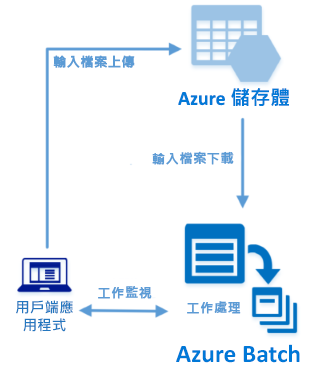

# <a name="quickstart-run-your-first-azure-batch-job-with-the-net-api"></a>快速入門：使用 .NET API 執行您的第一個 Azure Batch 作業

本快速入門會從在 Azure Batch .NET API 上建置的 C# 應用程式執行 Azure Batch 作業。 此應用程式會將數個輸入資料檔案上傳至 Azure 儲存體，然後建立 Batch 計算節點 (虛擬機器) 的「集區」。 然後，它會建立可執行「工作」的「作業」範例，以使用基本命令處理集區上的每個輸入檔案。 完成本快速入門之後，您將了解 Batch 服務的重要概念，並可準備使用更多真實的工作負載來大規模試用 Batch。



[!INCLUDE [quickstarts-free-trial-note.md](../../includes/quickstarts-free-trial-note.md)]

## <a name="prerequisites"></a>必要條件

* 適用於 Linux、macOS 或 Windows 的 [Visual Studio 2017](https://www.visualstudio.com/vs) 或 [.NET Core 2.1](https://www.microsoft.com/net/download/dotnet-core/2.1)。 

* Batch 帳戶和連結的 Azure 儲存體帳戶。 若要建立這些帳戶，請參閱使用 [Azure 入口網站](quick-create-portal.md)或 [Azure CLI](quick-create-cli.md) 的 Batch 快速入門。 

## <a name="sign-in-to-azure"></a>登入 Azure

在 [https://portal.azure.com](https://portal.azure.com) 登入 Azure 入口網站。

[!INCLUDE [batch-common-credentials](../../includes/batch-common-credentials.md)]

## <a name="download-the-sample"></a>下載範例

從 GitHub [下載或複製範例應用程式](https://github.com/Azure-Samples/batch-dotnet-quickstart)。 若要使用 Git 用戶端複製範例應用程式存放庫，請使用下列命令：

```
git clone https://github.com/Azure-Samples/batch-dotnet-quickstart.git
```

瀏覽至包含 Visual Studio 方案檔 `BatchDotNetQuickstart.sln` 的目錄。

在 Visual Studio 中開啟方案檔，然後使用您為帳戶取得的值來更新 `program.cs` 中的認證字串。 例如︰

```csharp
// Batch account credentials
private const string BatchAccountName = "mybatchaccount";
private const string BatchAccountKey  = "xxxxxxxxxxxxxxxxE+yXrRvJAqT9BlXwwo1CwF+SwAYOxxxxxxxxxxxxxxxx43pXi/gdiATkvbpLRl3x14pcEQ==";
private const string BatchAccountUrl  = "https://mybatchaccount.mybatchregion.batch.azure.com";

// Storage account credentials
private const string StorageAccountName = "mystorageaccount";
private const string StorageAccountKey  = "xxxxxxxxxxxxxxxxy4/xxxxxxxxxxxxxxxxfwpbIC5aAWA8wDu+AFXZB827Mt9lybZB1nUcQbQiUrkPtilK5BQ==";
```

[!INCLUDE [batch-credentials-include](../../includes/batch-credentials-include.md)]

## <a name="build-and-run-the-app"></a>建置並執行應用程式

若要查看執行中的 Batch 工作流程，請在 Visual Studio 中建置及執行應用程式，或是在命令列使用 `dotnet build` 和 `dotnet run` 命令。 執行此應用程式之後，檢閱程式碼以了解應用程式的每部分用途。 例如，在 Visual Studio 中：

* 在 [方案總管] 中以滑鼠右鍵按一下方案，然後按一下 [建置方案]。 

* 出現提示時，請確認任何 NuGet 封裝的還原。 如果您需要下載遺漏的套件，請確保已安裝 [NuGet 套件管理員](https://docs.nuget.org/consume/installing-nuget)。

然後加以執行。 當您執行範例應用程式時，主控台輸出大致如下。 在執行期間，集區的計算節點啟動後，您會在 `Monitoring all tasks for 'Completed' state, timeout in 00:30:00...` 遇到暫停。 工作會排入佇列中，以便在第一個計算節點執行時執行。 移至 [Azure 入口網站](https://portal.azure.com)中您的 Batch 帳戶，以監視集區、計算節點、作業和工作。

```
Sample start: 12/4/2017 4:02:54 PM

Container [input] created.
Uploading file taskdata0.txt to container [input]...
Uploading file taskdata1.txt to container [input]...
Uploading file taskdata2.txt to container [input]...
Creating pool [DotNetQuickstartPool]...
Creating job [DotNetQuickstartJob]...
Adding 3 tasks to job [DotNetQuickstartJob]...
Monitoring all tasks for 'Completed' state, timeout in 00:30:00...
```

工作完成之後，您會看到每項工作有類似以下的輸出：

```
Printing task output.
Task: Task0
Node: tvm-2850684224_3-20171205t000401z
Standard out:
Batch processing began with mainframe computers and punch cards. Today it still plays a central role in business, engineering, science, and other pursuits that require running lots of automated tasks....
stderr:
...
```

以預設設定執行應用程式時，一般的執行時間大約 5 分鐘。 初始集區設定佔用大部分的時間。 若要再次執行作業，請刪除上一次執行中的作業，而不要刪除集區。 在預先設定的集區上，此作業會在幾秒內完成。


## <a name="review-the-code"></a>檢閱程式碼

本快速入門中的 .NET 應用程式會執行下列作業：

* 將三個小型文字檔上傳至 Azure 儲存體帳戶中的 Blob 容器。 這些檔案是 Batch 所處理的輸入。
* 建立一個集區，其中包含執行 Windows Server 的計算節點。
* 建立一個作業和三項工作以在節點上執行。 每項工作會使用 Windows 命令列處理其中一個輸入檔案。 
* 顯示工作所傳回的檔案。

如需詳細資訊，請參閱 `Program.cs` 檔案和後面幾節。 

### <a name="preliminaries"></a>準備工作

為了與儲存體帳戶進行互動，應用程式會使用適用於 .NET 的 Azure 儲存體用戶端程式庫。 其使用 [CloudStorageAccount](/dotnet/api/microsoft.windowsazure.storage.cloudstorageaccount) 建立帳戶的參考，並從中建立 [CloudBlobClient](/dotnet/api/microsoft.windowsazure.storage.blob.cloudblobclient)。

```csharp
CloudBlobClient blobClient = storageAccount.CreateCloudBlobClient();
```

應用程式會使用 `blobClient` 參考在儲存體帳戶中建立容器，並將資料檔案上傳至該容器。 儲存體中的檔案會定義為 Batch [ResourceFile](/dotnet/api/microsoft.azure.batch.resourcefile) 物件，Batch 之後可將這類物件下載到計算節點。

```csharp
List<string> inputFilePaths = new List<string>
{
    "taskdata0.txt",
    "taskdata1.txt",
    "taskdata2.txt"
};

List<ResourceFile> inputFiles = new List<ResourceFile>();

foreach (string filePath in inputFilePaths)
{
    inputFiles.Add(UploadFileToContainer(blobClient, inputContainerName, filePath));
}
```

應用程式會建立 [BatchClient](/dotnet/api/microsoft.azure.batch.batchclient) 物件，以在 Batch 服務中建立和管理集區、作業和工作。 範例中的 Batch 用戶端會使用共用金鑰驗證。 (Batch 也支援 Azure Active Directory 驗證。)

```csharp
BatchSharedKeyCredentials cred = new BatchSharedKeyCredentials(BatchAccountUrl, BatchAccountName, BatchAccountKey);

using (BatchClient batchClient = BatchClient.Open(cred))
...    
```

### <a name="create-a-pool-of-compute-nodes"></a>建立計算節點的集區

為了建立 Batch 集區，應用程式會使用 [BatchClient.PoolOperations.CreatePool](/dotnet/api/microsoft.azure.batch.pooloperations.createpool) 方法來設定節點數目、VM 大小和集區設定。 在此，[VirtualMachineConfiguration](/dotnet/api/microsoft.azure.batch.virtualmachineconfiguration) 物件會將 [ImageReference](/dotnet/api/microsoft.azure.batch.imagereference) 指定至 Azure Marketplace 中發佈的 Windows Server 映像。 Batch 支援 Azure Marketplace 中各式各樣的 Linux 和 Windows Server 映像，以及自訂 VM 映像。

節點數目 (`PoolNodeCount`) 和 VM 大小 (`PoolVMSize`) 都是已定義的常數。 此範例預設建立的集區包含 2 個大小為 Standard_A1_v2 的節點。 建議的大小可為此快速範例提供良好的效能與成本平衡。 

[Commit](/dotnet/api/microsoft.azure.batch.cloudpool.commit) 方法會將集區提交至 Batch 服務。

```csharp
ImageReference imageReference = new ImageReference(
    publisher: "MicrosoftWindowsServer",
    offer: "WindowsServer",
    sku: "2012-R2-Datacenter-smalldisk",
    version: "latest");

VirtualMachineConfiguration virtualMachineConfiguration =
new VirtualMachineConfiguration(
   imageReference: imageReference,
   nodeAgentSkuId: "batch.node.windows amd64");

try
{
    CloudPool pool = batchClient.PoolOperations.CreatePool(
    poolId: PoolId,
    targetDedicatedComputeNodes: PoolNodeCount,
    virtualMachineSize: PoolVMSize,
    virtualMachineConfiguration: virtualMachineConfiguration);

    pool.Commit();
}
...

```
### <a name="create-a-batch-job"></a>建立 Batch 作業

Batch 作業是一或多項工作的邏輯群組。 作業包含工作通用的設定，例如優先順序以及要執行工作的集區。 應用程式會使用 [BatchClient.JobOperations.CreateJob](/dotnet/api/microsoft.azure.batch.joboperations.createjob) 方法在您的集區上建立作業。 

[Commit](/dotnet/api/microsoft.azure.batch.cloudjob.commit) 方法會將作業提交至 Batch 服務。 一開始作業沒有任何工作。

```csharp
try
{
    CloudJob job = batchClient.JobOperations.CreateJob();
    job.Id = JobId;
    job.PoolInformation = new PoolInformation { PoolId = PoolId };

    job.Commit(); 
}
...
```

### <a name="create-tasks"></a>建立工作
應用程式會建立一份 [CloudTask](/dotnet/api/microsoft.azure.batch.cloudtask) 物件清單。 每項工作都會使用 [CommandLine](/dotnet/api/microsoft.azure.batch.cloudtask.commandline) 屬性來處理輸入 `ResourceFile` 物件。 在此範例中，命令列會執行 Windows `type` 命令以顯示輸入檔案。 這個命令是用於示範的簡單範例。 當您使用 Batch 時，您會在此命令列中指定您的應用程式或指令碼。 Batch 提供數種方法來將應用程式和指令碼部署至計算節點。

然後，應用程式會使用 [AddTask](/dotnet/api/microsoft.azure.batch.joboperations.addtask) 方法將工作新增至作業，該方法會將工作排入佇列以在計算節點上執行。 

```csharp
for (int i = 0; i < inputFiles.Count; i++)
{
    string taskId = String.Format("Task{0}", i);
    string inputFilename = inputFiles[i].FilePath;
    string taskCommandLine = String.Format("cmd /c type {0}", inputFilename);

    CloudTask task = new CloudTask(taskId, taskCommandLine);
    task.ResourceFiles = new List<ResourceFile> { inputFiles[i] };
    tasks.Add(task);
}

batchClient.JobOperations.AddTask(JobId, tasks);
```
 
### <a name="view-task-output"></a>檢視工作輸出

應用程式會建立 [TaskStateMonitor](/dotnet/api/microsoft.azure.batch.taskstatemonitor) 來監視工作，確保工作都已完成。 然後，應用程式會使用 [CloudTask.ComputeNodeInformation](/dotnet/api/microsoft.azure.batch.cloudtask.computenodeinformation) 屬性來顯示每項已完成工作所產生的 `stdout.txt` 檔案。 當工作執行成功時，工作命令的輸出會寫入至 `stdout.txt`：

```csharp
foreach (CloudTask task in completedtasks)
{
    string nodeId = String.Format(task.ComputeNodeInformation.ComputeNodeId);
    Console.WriteLine("Task: {0}", task.Id);
    Console.WriteLine("Node: {0}", nodeId);
    Console.WriteLine("Standard out:");
    Console.WriteLine(task.GetNodeFile(Constants.StandardOutFileName).ReadAsString());
}
```

## <a name="clean-up-resources"></a>清除資源

應用程式會自動刪除它所建立的儲存體容器，並且為您提供用於刪除 Batch 集區和工作的選項。 即使沒有排定的作業，您仍需支付節點執行時的集區費用。 當您不再需要集區時，請將它刪除。 當您刪除集區時，節點上的所有工作輸出也會跟著刪除。

若不再需要，可刪除資源群組、Batch 帳戶和儲存體帳戶。 若要在 Azure 入口網站中這麼做，請選取 Batch 帳戶的資源群組，然後按一下 [刪除資源群組]。

## <a name="next-steps"></a>後續步驟

在本快速入門中，您執行了使用 Batch .NET API 建置的小型應用程式，以建立 Batch 集區和 Batch 作業。 此作業已執行範例工作，以及下載在節點上建立的輸出。 您既然了解 Batch 服務的重要概念，即可準備使用更多真實的工作負載來大規模試用 Batch。 若要深入了解 Azure Batch，並使用真實的應用程式來逐步進行平行工作負載，請繼續進行 Batch .NET 教學課程。


> [!div class="nextstepaction"]
> [使用 .NET 處理平行工作負載](tutorial-parallel-dotnet.md)
