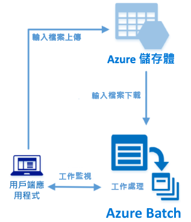

# <a name="quickstart-run-your-first-batch-job-with-the-python-api"></a>快速入門：使用 Python API 執行您的第一個 Batch 作業

本快速入門會從在 Azure Batch Python API 上建置的應用程式執行 Azure Batch 作業。 此應用程式會將數個輸入資料檔案上傳至 Azure 儲存體，然後建立 Batch 計算節點 (虛擬機器) 的「集區」。 然後，它會建立可執行「工作」的「作業」範例，以使用基本命令處理集區上的每個輸入檔案。 完成本快速入門之後，您將了解 Batch 服務的重要概念，並可準備使用更多真實的工作負載來大規模試用 Batch。
 


[!INCLUDE [quickstarts-free-trial-note.md](../../includes/quickstarts-free-trial-note.md)]

## <a name="prerequisites"></a>先決條件

* [Python 2.7 或 3.3 版或更新版本](https://www.python.org/downloads/)

* [pip](https://pip.pypa.io/en/stable/installing/) 套件管理員

* Azure Batch 帳戶和連結的 Azure 儲存體帳戶。 若要建立這些帳戶，請參閱使用 [Azure 入口網站](quick-create-portal.md)或 [Azure CLI](quick-create-cli.md) 的 Batch 快速入門。 

## <a name="sign-in-to-azure"></a>登入 Azure

在 [https://portal.azure.com](https://portal.azure.com) 登入 Azure 入口網站。

[!INCLUDE [batch-common-credentials](../../includes/batch-common-credentials.md)]

## <a name="download-the-sample"></a>下載範例

從 GitHub [下載或複製範例應用程式](https://github.com/Azure-Samples/batch-python-quickstart)。 若要使用 Git 用戶端複製範例應用程式存放庫，請使用下列命令：

```
git clone https://github.com/Azure-Samples/batch-python-quickstart.git
```

瀏覽至包含 Python 指令碼 `python_quickstart_client.py` 的目錄。

在 Python 開發環境中，使用 `pip` 安裝必要的套件。

```bash
pip install -r requirements.txt
```

開啟檔案 `python_quickstart_client.py`。 使用您為帳戶取得的值來更新 Batch 和儲存體帳戶認證字串。 例如︰


```Python
_BATCH_ACCOUNT_NAME = 'mybatchaccount'
_BATCH_ACCOUNT_KEY = 'xxxxxxxxxxxxxxxxE+yXrRvJAqT9BlXwwo1CwF+SwAYOxxxxxxxxxxxxxxxx43pXi/gdiATkvbpLRl3x14pcEQ=='
_BATCH_ACCOUNT_URL = 'https://mybatchaccount.mybatchregion.batch.azure.com'
_STORAGE_ACCOUNT_NAME = 'mystorageaccount'
_STORAGE_ACCOUNT_KEY = 'xxxxxxxxxxxxxxxxy4/xxxxxxxxxxxxxxxxfwpbIC5aAWA8wDu+AFXZB827Mt9lybZB1nUcQbQiUrkPtilK5BQ=='
```

## <a name="run-the-app"></a>執行應用程式

若要查看作用中的 Batch 工作流程，請執行以下指令碼：

```
python python_quickstart_client.py
```

執行此指令碼之後，檢閱程式碼以了解應用程式的每部分用途。 

當您執行範例應用程式時，主控台輸出大致如下。 在執行期間，集區的計算節點啟動後，您會在 `Monitoring all tasks for 'Completed' state, timeout in 00:30:00...` 遇到暫停。 工作會排入佇列中，以便在第一個計算節點執行時執行。 移至 [Azure 入口網站](https://portal.azure.com)中您的 Batch 帳戶，以監視 Batch 帳戶中的集區、計算節點、作業和工作。

```
Sample start: 12/4/2017 4:02:54 PM

Container [input] created.
Uploading file taskdata0.txt to container [input]...
Uploading file taskdata1.txt to container [input]...
Uploading file taskdata2.txt to container [input]...
Creating pool [PythonQuickstartPool]...
Creating job [PythonQuickstartJob]...
Adding 3 tasks to job [PythonQuickstartJob]...
Monitoring all tasks for 'Completed' state, timeout in 00:30:00...
```

工作完成之後，您會看到每項工作有類似以下的輸出：

```
Printing task output...
Task: Task0
Node: tvm-2850684224_3-20171205t000401z
Standard out:
Batch processing began with mainframe computers and punch cards. Today it still plays a central role in business, engineering, science, and other pursuits that require running lots of automated tasks....
...
```

以預設設定執行應用程式時，一般的執行時間大約 3 分鐘。 初始集區設定佔用大部分的時間。

## <a name="review-the-code"></a>檢閱程式碼

本快速入門中的 Python 應用程式會執行下列作業：

* 將三個小型文字檔上傳至 Azure 儲存體帳戶中的 Blob 容器。 這些檔案是 Batch 工作所處理的輸入。
* 建立一個集區，其中包含兩個執行 Ubuntu 16.04 LTS 的計算節點。
* 建立一個作業和三項工作以在節點上執行。 每項工作會使用 Bash Shell 命令列處理其中一個輸入檔案。
* 顯示工作所傳回的檔案。

如需詳細資訊，請參閱 `python_quickstart_client.py` 檔案和後面幾節。 

### <a name="preliminaries"></a>準備工作

為了與儲存體帳戶進行互動，應用程式會使用 [azure-storage-blob](https://pypi.python.org/pypi/azure-storage-blob) 套件來建立 [BlockBlobService](/python/api/azure.storage.blob.blockblobservice.blockblobservice) 物件。

```python
blob_client = azureblob.BlockBlobService(
    account_name=_STORAGE_ACCOUNT_NAME,
    account_key=_STORAGE_ACCOUNT_KEY)
```

應用程式會使用 `blob_client` 參考在儲存體帳戶中建立容器，並將資料檔案上傳至該容器。 儲存體中的檔案會定義為 Batch [ResourceFile](/python/api/azure.batch.models.resourcefile) 物件，Batch 之後可將這類物件下載到計算節點。

```python
input_file_paths = [os.path.realpath('./data/taskdata0.txt'),
                    os.path.realpath('./data/taskdata1.txt'),
                    os.path.realpath('./data/taskdata2.txt')]
input_files = [
    upload_file_to_container(blob_client, input_container_name, file_path)
    for file_path in input_file_paths]
```

應用程式會建立 [BatchServiceClient](/python/api/azure.batch.batchserviceclient) 物件，以在 Batch 服務中建立和管理集區、作業和工作。 範例中的 Batch 用戶端會使用共用金鑰驗證。 Batch 也支援 Azure Active Directory 驗證。

```python
credentials = batchauth.SharedKeyCredentials(_BATCH_ACCOUNT_NAME,
    BATCH_ACCOUNT_KEY)

batch_client = batch.BatchServiceClient(
    credentials,
    base_url=_BATCH_ACCOUNT_URL)
```


### <a name="create-a-pool-of-compute-nodes"></a>建立計算節點的集區

為了建立 Batch 集區，應用程式會使用 [PoolAddParameter](/python/api/azure.batch.models.pooladdparameter) 類別來設定節點數目、VM 大小和集區設定。 在此，[VirtualMachineConfiguration](/python/api/azure.batch.models.virtualmachineconfiguration) 物件會將 [ImageReference](/python/api/azure.batch.models.imagereference) 指定至 Azure Marketplace 中發佈的 Ubuntu Server 16.04 LTS 映像。 Batch 支援 Azure Marketplace 中各式各樣的 Linux 和 Windows Server 映像，以及自訂 VM 映像。

節點數目 (`_POOL_NODE_COUNT`) 和 VM 大小 (`_POOL_VM_SIZE`) 都是已定義的常數。 此範例預設建立的集區包含 2 個大小為 Standard_A1_v2 的節點。 建議的大小可為此快速範例提供良好的效能與成本平衡。

[pool.add](/python/api/azure.batch.operations.pooloperations#azure_batch_operations_PoolOperations_add) 方法會將此集區提交至 Batch 服務。

```python
new_pool = batch.models.PoolAddParameter(
    id=pool_id,
    virtual_machine_configuration=batchmodels.VirtualMachineConfiguration(
        image_reference=batchmodels.ImageReference(
            publisher="Canonical",
            offer="UbuntuServer",
            sku="16.04-LTS",
            version="latest"
            ),
        node_agent_sku_id="batch.node.ubuntu 16.04"),
    vm_size=_POOL_VM_SIZE,
    target_dedicated_nodes=_POOL_NODE_COUNT
)
batch_service_client.pool.add(new_pool)
```

### <a name="create-a-batch-job"></a>建立 Batch 作業

Batch 作業是一或多項工作的邏輯群組。 作業包含工作通用的設定，例如優先順序以及要執行工作的集區。 應用程式會使用 [JobAddParameter](/python/api/azure.batch.models.jobaddparameter) 類別在您的集區上建立作業。 [job.add](/python/api/azure.batch.operations.joboperations#azure_batch_operations_JobOperations_add) 方法會將集區提交至 Batch 服務。 一開始作業沒有任何工作。

```python
job = batch.models.JobAddParameter(
    job_id,
    batch.models.PoolInformation(pool_id=pool_id))
batch_service_client.job.add(job)
```

### <a name="create-tasks"></a>建立工作

應用程式會使用 [TaskAddParameter](/python/api/azure.batch.models.taskaddparameter) 類別建立工作物件清單。 每項工作都會使用 `command_line` 參數來處理輸入 `resource_files` 物件。 在此範例中，命令列會執行 Bash Shell `cat` 命令以顯示文字檔。 這個命令是用於示範的簡單範例。 當您使用 Batch 時，您會在此命令列中指定您的應用程式或指令碼。 Batch 提供數種方法來將應用程式和指令碼部署至計算節點。

然後，應用程式會使用 [task.add_collection](/python/api/azure.batch.operations.taskoperations#azure_batch_operations_TaskOperations_add_collection) 方法將工作新增至作業，該方法會將工作排入佇列以在計算節點上執行。 

```python
tasks = list()

for idx, input_file in enumerate(input_files): 
    command = "/bin/bash -c \"cat {}\"".format(input_file.file_path)
    tasks.append(batch.models.TaskAddParameter(
        id='Task{}'.format(idx),
        command_line=command,
        resource_files=[input_file]
    )
)
batch_service_client.task.add_collection(job_id, tasks)
```

### <a name="view-task-output"></a>檢視工作輸出

應用程式會監視工作狀態以確保完成工作。 然後，應用程式會顯示每項已完成工作所產生的 `stdout.txt` 檔案。 當工作執行成功時，工作命令的輸出會寫入至 `stdout.txt`：

```python
tasks = batch_service_client.task.list(job_id)

for task in tasks:
    
    node_id = batch_service_client.task.get(job_id, task.id).node_info.node_id
    print("Task: {}".format(task.id))
    print("Node: {}".format(node_id))

    stream = batch_service_client.file.get_from_task(job_id, task.id, _STANDARD_OUT_FILE_NAME)

    file_text = _read_stream_as_string(
        stream,
        encoding)
    print("Standard output:")
    print(file_text)
```

## <a name="clean-up-resources"></a>清除資源

應用程式會自動刪除它所建立的儲存體容器，並且為您提供用於刪除 Batch 集區和工作的選項。 即使沒有排定的作業，您仍需支付節點執行時的集區費用。 當您不再需要集區時，請將它刪除。 當您刪除集區時，節點上的所有工作輸出也會跟著刪除。 

若不再需要，可刪除資源群組、Batch 帳戶和儲存體帳戶。 若要在 Azure 入口網站中這麼做，請選取 Batch 帳戶的資源群組，然後按一下 [刪除資源群組]。

## <a name="next-steps"></a>後續步驟

在本快速入門中，您執行了使用 Batch Python API 建置的小型應用程式，以建立 Batch 集區和 Batch 作業。 此作業已執行範例工作，以及下載在節點上建立的輸出。 您既然了解 Batch 服務的重要概念，即可準備使用更多真實的工作負載來大規模試用 Batch。 若要深入了解 Azure Batch，並使用真實的應用程式來逐步進行平行工作負載，請繼續進行 Batch Python 教學課程。

> [!div class="nextstepaction"]
> [使用 Python 處理平行工作負載](tutorial-parallel-python.md)
