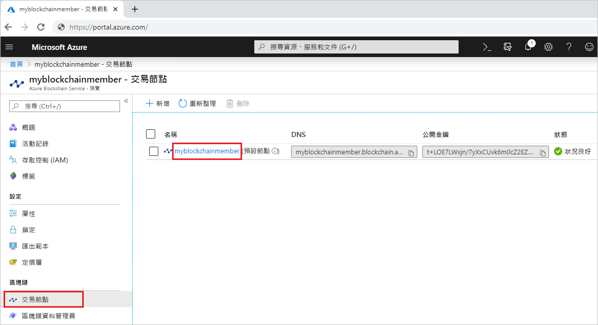

# <a name="quickstart-use-geth-to-connect-to-a-transaction-node"></a>快速入門：使用 Geth 連線至交易節點

Geth 是一個 Go Ethereum 用戶端，可用來連結至 Azure 區塊鏈服務交易節點上的 Geth 執行個體。

[!INCLUDE [quickstarts-free-trial-note](../../../includes/quickstarts-free-trial-note.md)]

## <a name="prerequisites"></a>必要條件

* 安裝 [Geth](https://github.com/ethereum/go-ethereum/wiki/geth)
* 完成[快速入門：使用 Azure 入口網站建立區塊鏈成員](create-member.md)或[快速入門：使用 Azure CLI 建立 Azure 區塊鏈服務的區塊鏈成員](create-member-cli.md)

## <a name="get-the-geth-connection-string"></a>取得 Geth 連接字串

您可以使用 Azure 入口網站尋找 Geth 連接字串。

1. 登入 [Azure 入口網站](https://portal.azure.com)。
1. 瀏覽至您的 Azure 區塊鏈服務成員。 選取 [交易節點]  和預設交易節點連結。

    

1. 選取 [連接字串]  。
1. 從 [HTTPS (存取金鑰 1)]  複製連接字串。 您在下一節將需要此命令。

    

## <a name="connect-to-geth"></a>連線至 Geth

1. 開啟命令提示字元或殼層。
1. 使用 Geth attach 子命令，連結至您交易節點上執行中的 Geth 執行個體。 貼上連接字串，作為 attach 子命令的引數。 例如，

    ```
    geth attach <connection string>
    ```

1. 連線至交易節點的 Ethereum 主控台後，您可以呼叫 web3 JavaScript Dapp API 或管理員 API。

    例如，使用下列 API 找出鏈結識別碼。

    ```bash
    admin.nodeInfo.protocols.istanbul.config.chainId
    ```

    在此範例中，鏈結識別碼為 297。

    

1. 若要從主控台中斷連線，請輸入 `exit`。

## <a name="next-steps"></a>後續步驟

在本快速入門中，您已使用 Geth 用戶端連結至 Azure 區塊鏈服務交易節點上的 Geth 執行個體。 請嘗試進行下一個教學課程，使用適用於 Ethereum 和 Truffle 的 Azure 區塊鏈開發套件，透過交易建立、建置、部署及執行智慧型合約函式。

> [!div class="nextstepaction"]
> [使用  Visual Studio Code 建立、建置和部署智慧型合約](send-transaction.md)