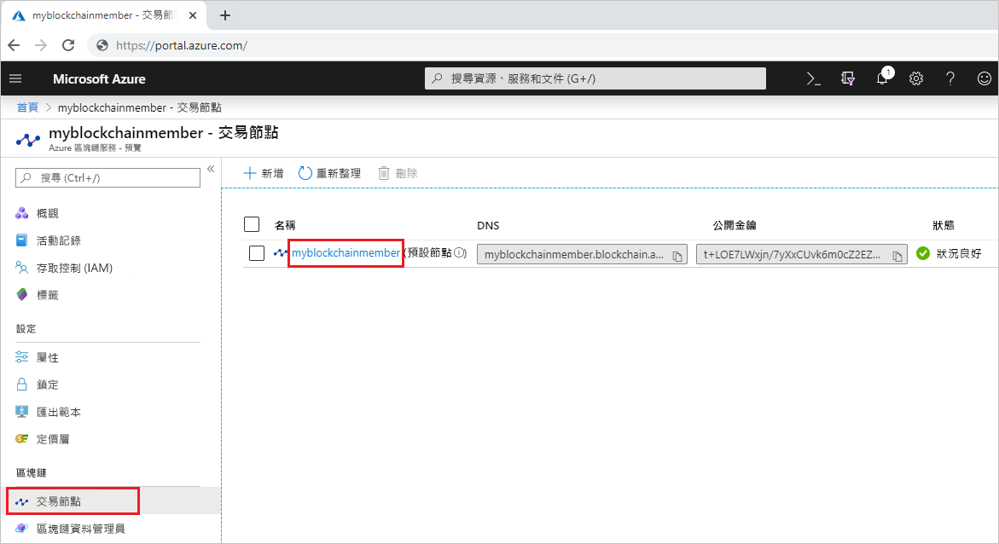
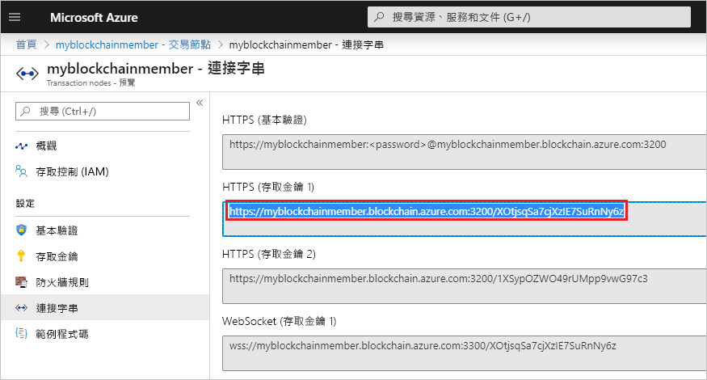
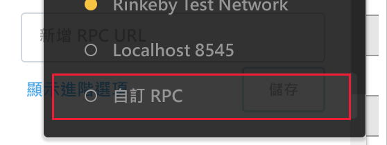
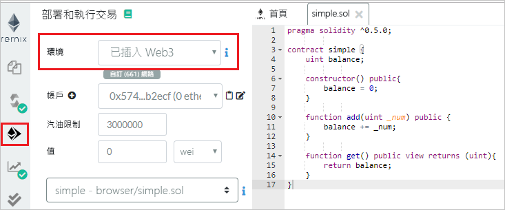
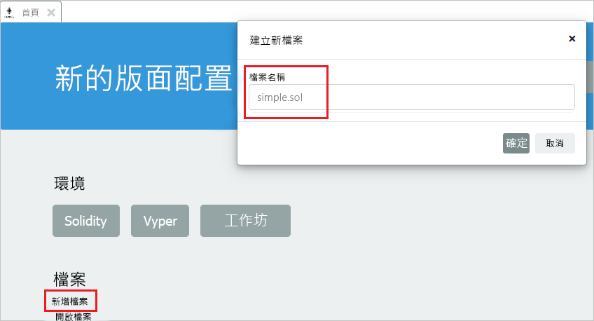
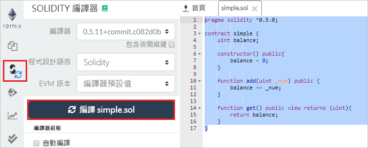
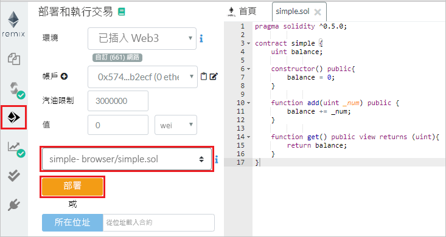
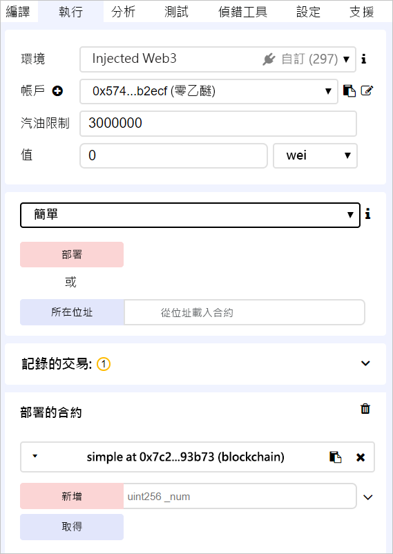
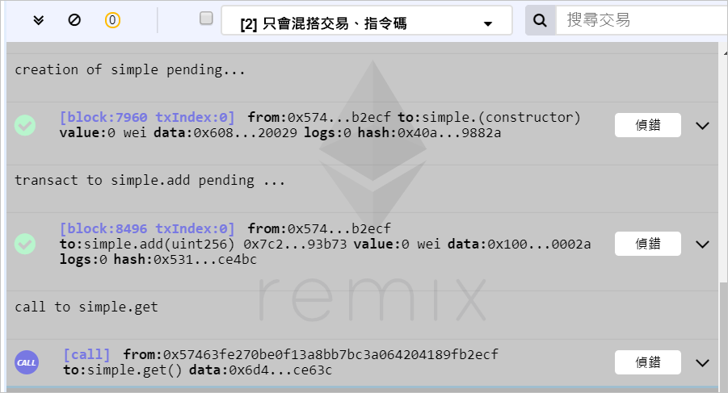

# <a name="quickstart-use-metamask-to-connect-and-deploy-a-smart-contract"></a>快速入門：使用 MetaMask 連線並部署智慧型合約

在本快速入門中，您將使用 MetaMask 連線至 Azure 區塊鏈服務網路，並使用 Remix 部署智慧型合約。 Metamask 是用來管理以太幣電子錢包以及執行智慧型合約動作的瀏覽器擴充功能。

[!INCLUDE [quickstarts-free-trial-note](../../../includes/quickstarts-free-trial-note.md)]

## <a name="prerequisites"></a>必要條件

* [建立 Azure 區塊鏈成員](create-member.md)
* 安裝 [MetaMask 瀏覽器擴充功能](https://metamask.io)
* 產生 MetaMask [電子錢包](https://metamask.zendesk.com/hc/en-us/articles/360015488971-New-to-MetaMask-Learn-How-to-Setup-MetaMask-the-First-Time)

## <a name="get-endpoint-address"></a>取得端點位址

您需要 Azure 區塊鏈服務端點位址才能連線至區塊鏈網路。 您可以在 Azure 入口網站中找到端點位址和存取金鑰。

1. 登入 [Azure 入口網站](https://portal.azure.com)。
1. 瀏覽至您的 Azure 區塊鏈服務成員。 選取 [交易節點] 和預設交易節點連結。

    

1. 選取 [連接字串] > [存取金鑰]。
1. 從 [HTTPS (存取金鑰 1)] 複製端點位址。 您在下一節將需要此位址。

    

## <a name="connect-metamask"></a>連接 MetaMask

1. 開啟 MetaMask 瀏覽器擴充功能並登入。
1. 在 [網路] 下拉式清單中，選取 [自訂 RPC]。

    

1. 在 [新增網路] > [新增 RPC URL] 中，輸入您在上一節複製的端點位址。
1. 選取 [ **儲存**]。

    如果連線成功，私人網路會顯示在 [網路] 下拉式清單中。

    

## <a name="deploy-smart-contract"></a>部署智慧型合約

Remix 是以瀏覽器為基礎的 Solidity 開發環境。 搭配使用 MetaMask 和 Remix，可以部署智慧型合約並對其執行動作。

1. 在瀏覽器中，瀏覽至 `https://remix.ethereum.org`。
1. 選取 [執行]。 

    MetaMask 會將您的 [環境] 設為 [插入的 Web3]，並將 [帳戶] 設為您的網路。

    

1. 選取 [建立新的檔案]。

    將新檔案命名為 `simple.sol`。

    

    選取 [確定] 。

1. 在 Remix 編輯器中，貼上下列**簡單的智慧型合約**程式碼。

    ```solidity
    pragma solidity ^0.5.0;
             
    contract simple {
        uint balance;
                 
        constructor() public{
            balance = 0;
        }
                 
        function add(uint _num) public {
            balance += _num;
        }
                 
        function get() public view returns (uint){
            return balance;
        }
    }
    ```

    **簡單合約**會宣告名為**餘額**的狀態變數。 有兩個已定義的函式。 **新增**函式會將數字新增至**餘額**。 **取得**函式會傳回**餘額**的值。

1. 若要編譯合約，請選取 [編譯] > [開始編譯]。 如果成功，會顯示具有合約名稱的綠色方塊。

    

1. 若要執行合約，請選取 [執行] 索引標籤。選取 [簡單] 合約，然後選取 [部署]。

    

1. 此時會顯示 MetaMask 通知，警示您沒有足夠的資金可執行交易。

    針對公用區塊鏈網路，您必須使用以太幣來支付交易成本。 由於這是聯盟中的私人網路，因此您可以將燃料價格設為零。

1.  選取 [燃料費用] > [編輯] > [進階]，並將 [燃料價格] 設為 0。

    

    選取 [ **儲存**]。

1. 選取 [確認]，將智慧型合約部署到區塊鏈。
1. 在 [部署合約] 區段中，展開 [簡單] 合約。

    

    **新增**和**取得**這兩個動作會對應至合約中定義的函式。

1. 若要對區塊鏈執行**新增**交易，請輸入要新增的數字，然後選取 [新增]。
1. 與部署合約時相同，此時會顯示 MetaMask 通知，警示您沒有足夠的資金可執行交易。

    由於這是聯盟中的私人網路，因此我們可以將燃料價格設為零。

1.  選取 [燃料費用] > [編輯] > [進階]、將 [燃料價格] 設為 0，然後選取 [儲存]。
1. 選取 [確認] 以在區塊鏈上執行交易。
1. 選取**取得**動作。 這是查詢節點資料的呼叫。 此時不需要交易。
1. 在 Remix 的偵錯窗格中，您可以查看與區塊鏈的交易有關的詳細資料。

    

    您可以查看**簡單**合約的建立情形、**simple.add** 的交易，以及呼叫 **simple.get**。

1. 您也可以在 MetaMask 中查看交易歷程記錄。 開啟 MetaMask 瀏覽器擴充功能。
1. 在 [歷程記錄] 區段中，您可以查看已部署的合約和交易的記錄。

## <a name="next-steps"></a>後續步驟

在本快速入門中，您已使用 MetaMask 瀏覽器擴充功能連線至 Azure 區塊鏈服務交易節點、部署智慧型合約，並將交易傳送到區塊鏈。 請嘗試下一個教學課程，以使用 Truffle 部署和傳送交易。

> [!div class="nextstepaction"]
> [傳送交易](send-transaction.md)