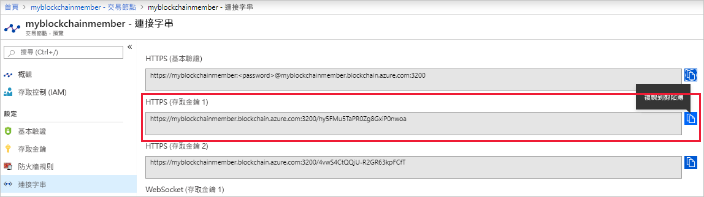

# <a name="quickstart-use-truffle-to-connect-to-a-transaction-node"></a>快速入門：使用 Truffle 連線到交易節點

Truffle 是可用來連線至 Azure 區塊鏈服務交易節點的區塊鏈開發環境。

[!INCLUDE [quickstarts-free-trial-note](../../../includes/quickstarts-free-trial-note.md)]

## <a name="prerequisites"></a>必要條件

* 完成[快速入門：使用 Azure 入口網站建立區塊鏈成員](create-member.md)或[快速入門：使用 Azure CLI 建立 Azure 區塊鏈服務的區塊鏈成員](create-member-cli.md)
* 安裝 [Truffle](https://github.com/trufflesuite/truffle)。 Truffle 需要安裝數個工具，包括 [Node.js](https://nodejs.org) 和 [Git](https://git-scm.com/book/en/v2/Getting-Started-Installing-Git)。
* 安裝 [Python 2.7.15](https://www.python.org/downloads/release/python-2715/)。 Web3 需要 Python。

## <a name="create-truffle-project"></a>建立 Truffle 專案

1. 開啟 Node.js 命令提示字元或殼層。
1. 將目錄切換至要建立 Truffle 專案目錄的位置。
1. 建立專案的目錄，並將您的路徑變更為新目錄。 例如，

    ``` bash
    mkdir truffledemo
    cd truffledemo
    ```

1. 初始化 Truffle 專案。

    ``` bash
    truffle init
    ```

1. 在專案資料夾中安裝 Ethereum JavaScript API web3。 目前的必要版本為 web3 1.0.0-beta.37 版。

    ``` bash
    npm install web3@1.0.0-beta.37
    ```

    在安裝期間您可能會收到 npm 警告。
    
## <a name="configure-truffle-project"></a>設定 Truffle 專案

若要設定 Truffle 專案，您需要 Azure 入口網站中的某些交易節點資訊。

### <a name="transaction-node-endpoint-addresses"></a>交易節點端點位址

1. 在 Azure 入口網站中，瀏覽至預設交易節點，然後選取 [交易節點] > [連接字串]  。
1. 從 **HTTPS (存取金鑰 1)** 複製並儲存端點 URL。 稍後在本教學課程中，智慧型合約組態檔會需要用到端點位址。

    

### <a name="edit-configuration-file"></a>編輯組態檔

接下來，您必須使用交易節點端點來更新 Truffle 設定檔。

1. 在 **truffledemo** 專案資料夾中，於編輯器開啟 Truffle 設定檔 `truffle-config.js`。
1. 使用下列組態資訊取代檔案的內容。 新增包含端點位址的變數。 將角括號取代為您在上一節中收集的值。

    ``` javascript
    var defaultnode = "<default transaction node connection string>";   
    var Web3 = require("web3");
    
    module.exports = {
      networks: {
        defaultnode: {
          provider: new Web3.providers.HttpProvider(defaultnode),
          network_id: "*"
        }
      }
    }
    ```

1. 將變更儲存至 `truffle-config.js`。

## <a name="connect-to-transaction-node"></a>連線至交易節點

使用 *Web3* 連線至交易節點。

1. 使用 Truffle 主控台連線到預設交易節點。 在命令提示字元或殼層中，執行下列命令：

    ``` bash
    truffle console --network defaultnode
    ```

    Truffle 會連線到預設交易節點並提供互動式主控台。

    您可以在 **web3** 物件上呼叫方法，來與交易節點互動。

1. 呼叫 **getBlockNumber** 方法以傳回目前的區塊數目。

    ```bash
    web3.eth.getBlockNumber();
    ```

    範例輸出︰

    ```bash
    truffle(defaultnode)> web3.eth.getBlockNumber();
    18567
    ```
1. 結束 Truffle 主控台。

    ```bash
    .exit
    ```

## <a name="next-steps"></a>後續步驟

在本快速入門中，您已建立連線至 Azure 區塊鏈服務預設交易節點的 Truffle 專案。

請嘗試進行下一個教學課程，使用適用於 Ethereum 和 Truffle 的 Azure 區塊鏈開發套件，透過交易建立、建置、部署及執行智慧型合約函式。

> [!div class="nextstepaction"]
> [使用  Visual Studio Code 建立、建置和部署智慧型合約](send-transaction.md)
