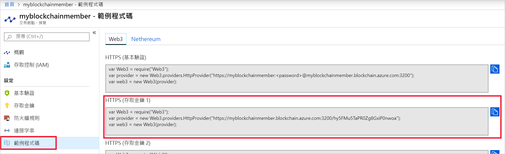

# <a name="quickstart-use-truffle-to-connect-to-an-azure-blockchain-service-network"></a>快速入門：使用 Truffle 連線至 Azure 區塊鏈服務網路

Truffle 是可用來連線至 Azure 區塊鏈服務節點的區塊鏈開發環境。

[!INCLUDE [quickstarts-free-trial-note](../../../includes/quickstarts-free-trial-note.md)]

## <a name="prerequisites"></a>必要條件

* [建立 Azure 區塊鏈成員](create-member.md)
* 安裝 [Truffle](https://github.com/trufflesuite/truffle)。 Truffle 需要安裝數個工具，包括 [Node.js](https://nodejs.org) 和 [Git](https://git-scm.com/book/en/v2/Getting-Started-Installing-Git)。
* 安裝 [Python 2.7.15](https://www.python.org/downloads/release/python-2715/)。 Web3 需要 Python。

## <a name="create-truffle-project"></a>建立 Truffle 專案

1. 開啟 Node.js 命令提示字元或殼層。
1. 將目錄切換至要建立 Truffle 專案目錄的位置。
1. 建立專案的目錄，並將您的路徑變更為新目錄。 例如，

    ``` bash
    mkdir truffledemo
    cd truffledemo
    ```

1. 初始化 Truffle 專案。

    ``` bash
    truffle init
    ```

1. 在專案資料夾中安裝 Ethereum JavaScript API web3。 目前的必要版本為 web3 1.0.0-beta.37 版。

    ``` bash
    npm install web3@1.0.0-beta.37
    ```

    在安裝期間您可能會收到 npm 警告。

1. 啟動 Truffle 的互動式開發主控台。

    ``` bash
    truffle develop
    ```

    Truffle 會建立本機開發區塊鏈，並提供互動式主控台。

## <a name="connect-to-transaction-node"></a>連線至交易節點

使用 *Web3* 連線至交易節點。 您可以從 Azure 入口網站取得 *Web3* 連接字串。

1. 登入 [Azure 入口網站](https://portal.azure.com)。
1. 瀏覽至您的 Azure 區塊鏈服務成員。 選取 [交易節點]  和預設交易節點連結。

    

1. 選取 [範例程式碼] > [Web3]  。
1. 從 [HTTPS (存取金鑰 1)]  複製 JavaScript。 您在 Truffle 的互動式開發主控台中將需要此程式碼。

    

1. 將取自上一個步驟中的 JavaScript 程式碼貼到 Truffle 互動式開發主控台中。 該程式碼會建立連線至您 Azure 區塊鏈服務交易節點的 Web3 物件。

    範例輸出︰

    ```bash
    truffle(develop)> var Web3 = require("Web3");
    truffle(develop)> var provider = new Web3.providers.HttpProvider("https://myblockchainmember.blockchain.azure.com:3200/hy5FMu5TaPR0Zg8GxiPwned");
    truffle(develop)> var web3 = new Web3(provider);
    ```

    您可以在 **web3** 物件上呼叫方法，來與交易節點互動。

1. 呼叫 **getBlockNumber** 方法以傳回目前的區塊數目。

    ```bash
    web3.eth.getBlockNumber();
    ```

    範例輸出︰

    ```bash
    truffle(develop)> web3.eth.getBlockNumber();
    18567
    ```
1. 結束 Truffle 開發主控台。

    ```bash
    .exit
    ```

## <a name="next-steps"></a>後續步驟

在本快速入門中，您已建立連線至 Azure 區塊鏈服務預設交易節點的 Truffle 專案。

請嘗試進行下一個教學課程，以使用 Truffle 將交易傳送至您的聯盟區塊鏈網路。

> [!div class="nextstepaction"]
> [傳送交易](send-transaction.md)