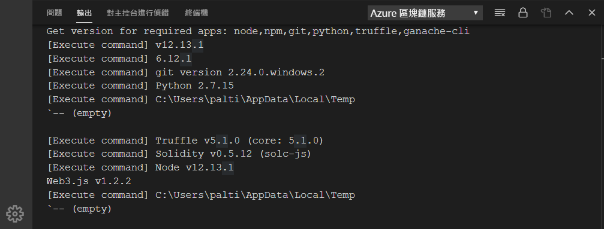
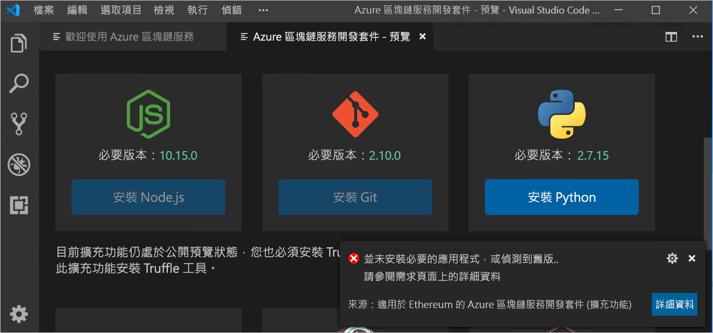
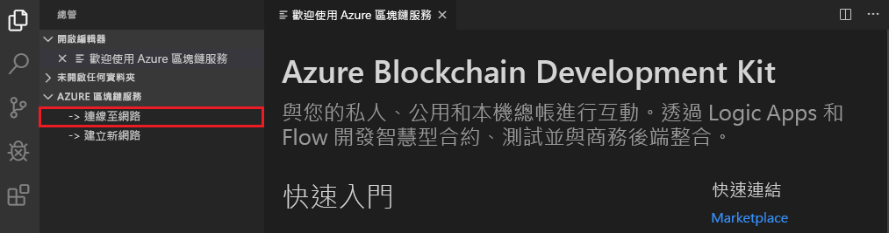

# 快速入門：使用 Visual Studio Code 連線至 Azure 區塊鏈服務聯盟網路

在本快速入門中，您會安裝及使用適用於 Ethereum 的 Azure 區塊鏈開發套件 Visual Studio Code (VS Code) 擴充功能連結至 Azure 區塊鏈服務上的聯盟。 Azure 區塊鏈開發套件簡化了您在 Ethereum 區塊鏈總帳上建立、連線、建置及部署智慧型合約的方式。

[!INCLUDE [quickstarts-free-trial-note](../../../includes/quickstarts-free-trial-note.md)]

## 必要條件

* 完成[快速入門：使用 Azure 入口網站建立區塊鏈成員](create-member.md)或[快速入門：使用 Azure CLI 建立 Azure 區塊鏈服務的區塊鏈成員](create-member-cli.md)
* [Visual Studio Code](https://code.visualstudio.com/Download)
* [適用於 Ethereum 的 Azure 區塊鏈服務開發套件擴充功能](https://marketplace.visualstudio.com/items?itemName=AzBlockchain.azure-blockchain)
* [Node.js 10.15.x 或更高版本](https://nodejs.org/download)
* [Git 2.10.x 或更高版本](https://git-scm.com)
* [Python 2.7.15](https://www.python.org/downloads/release/python-2715/) 將 python.exe 新增至您的路徑。 Azure 區塊鏈服務開發套件需要您的路徑中有 Python 2.7.15 版。
* [Truffle 5.0.0](https://www.trufflesuite.com/docs/truffle/getting-started/installation)
* [Ganache CLI 6.0.0](https://github.com/trufflesuite/ganache-cli)

在 Windows 上，node-gyp 模組需要已安裝的 C++ 編譯器。 您可以使用 MSBuild 工具：

* 如果已安裝 Visual Studio 2017，請將 npm 設定為使用 MSBuild 工具搭配 `npm config set msvs_version 2017 -g` 命令
* 如果已安裝 Visual Studio 2019，請設定 npm 的 MSBuild 工具路徑。 例如， `npm config set msbuild_path "C:\Program Files (x86)\Microsoft Visual Studio\2019\Community\MSBuild\Current\Bin\MSBuild.exe"`
* 否則，請在提升權限的「以系統管理員身分執行」  命令殼層中，使用 `npm install --global windows-build-tools` 來安裝獨立的 VS Build 工具。

如需 node-gyp 的詳細資訊，請參閱 [GitHub 上的 node-gyp 存放庫](https://github.com/node-gyp)。

### 確認 Azure 區塊鏈服務開發套件環境

Azure 區塊鏈服務開發套件會確認您是否已符合開發環境的必要條件。 若要確認開發環境：

從 VS Code 命令選擇區選擇 [Azure 區塊鏈服務:  顯示歡迎頁面]。

Azure 區塊鏈服務開發套件會執行驗證指令碼，其大約需要一分鐘的時間才能完成。 您可以藉由選取 [終端機] > [新增終端機]  來檢視輸出。 在終端機的功能表列中，於下拉式清單內選取 [輸出]  索引標籤和 [Azure 區塊鏈服務]  。 驗證成功時會如下圖所示：

 如果您缺少必要工具，名為 [Azure 區塊鏈服務開發套件 - 預覽]  的新索引標籤會列出必要工具與下載連結。

繼續進行本快速入門之前，請先安裝任何缺少的必要條件。

## 連線至聯盟成員

您可以使用 Azure 區塊鏈服務開發套件 VS Code 擴充功能來連線至聯盟成員。 在連線至聯盟後，您就可以對 Azure 區塊鏈服務聯盟成員編譯、建置和部署智慧型合約。

如果您無法存取 Azure 區塊鏈服務聯盟成員，請完成必要的[快速入門：使用 Azure 入口網站建立區塊鏈成員](create-member.md)或[快速入門：使用 Azure CLI 建立 Azure 區塊鏈服務的區塊鏈成員](create-member-cli.md)。

1. 在 VS Code 總管窗格中，展開 [Azure 區塊鏈服務]  擴充功能。
1. 選取 [連線至聯盟]  。

   

    如果系統提示您進行 Azure 驗證，請遵循提示以使用瀏覽器進行驗證。
1. 在命令選擇區的下拉式清單中，選擇 [連線至 Azure 區塊鏈服務聯盟]  。
1. 選擇與 Azure 區塊鏈服務聯盟成員相關聯的訂用帳戶和資源群組。
1. 從清單中選擇聯盟。

VS Code 總管的提要欄位中會列出聯盟和區塊鏈成員。

## 後續步驟

在本快速入門中，您已使用適用於 Ethereum 的 Azure 區塊鏈開發套件 VS Code 擴充功能連結至 Azure 區塊鏈服務上的聯盟。 請嘗試進行下一個教學課程，使用適用於 Ethereum 的 Azure 區塊鏈開發套件，透過交易建立、建置、部署及執行智慧型合約函式。

> [!div class="nextstepaction"]
> [在 Azure 區塊鏈服務上建立、建立和部署智慧型合約](send-transaction.md)