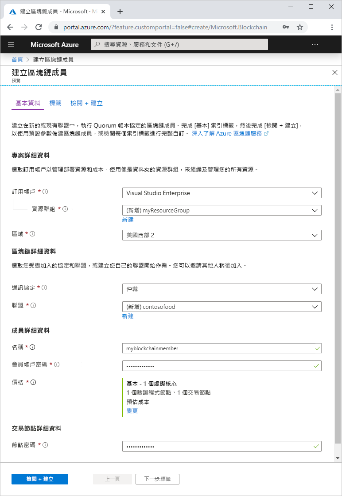
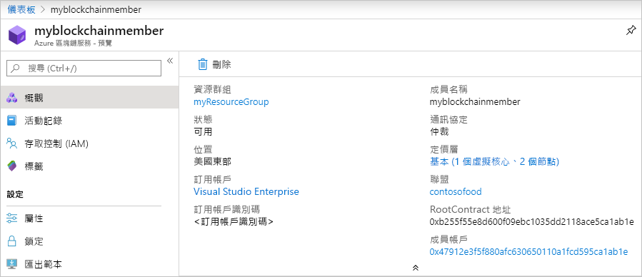

# 快速入門：使用 Azure 入口網站建立 Azure 區塊鏈服務

Azure 區塊鏈服務是可以在智慧型合約內執行商務邏輯的區塊鏈平台。 此快速入門說明如何使用 Azure 入口網站建立受控總帳以開始使用產品。

[!INCLUDE [quickstarts-free-trial-note](../../../includes/quickstarts-free-trial-note.md)]

## 建立受控總帳

Azure 區塊鏈會使用一組定義的計算和儲存體資源來建立。

1. 登入 [Azure 入口網站](https://portal.azure.com)。
1. 選取 Azure 入口網站左上角的 [建立資源]  。
1. 選取 [區塊鏈]   > [Azure 區塊鏈服務]  。
1. 完成範本。

    

    設定 | 說明
    --------|------------
    區塊鏈成員 | 選擇可識別 Azure 區塊鏈服務成員的唯一名稱。 區塊鏈成員的名稱只能包含小寫字母和數字。 第一個字元必須是字母。 此值長度必須介於 2 至 20 個字元之間。
    訂用帳戶 | 選取您要用於服務的 Azure 訂用帳戶。 如果您有多個訂用帳戶，請選擇資源計費的訂用帳戶。
    資源群組 | 新的資源群組名稱，或您訂用帳戶中現有的資源群組名稱。
    區域 | 所有聯盟成員的位置必須相同。
    成員帳戶密碼 | 成員帳戶密碼可用來對為您的成員建立的 Ethereum 帳戶進行私密金鑰加密。 您可以使用帳戶成員和成員帳戶密碼進行聯盟管理。
    聯盟名稱 | 針對新的聯盟，請輸入唯一名稱。 如果是透過邀請來加入聯盟，該值會是您加入的聯盟。
    說明 | 聯盟描述。
    通訊協定 |  預覽版支援仲裁通訊協定。
    價格 | 新服務的節點組態。 選取 [標準]  。 預設值是 2 個驗證程式節點及 1 個交易節點。
    交易節點密碼 | 成員預設交易節點的密碼。 連線至區塊鏈成員的預設交易節點公用端點時，請使用此密碼進行基本驗證。

1. 選取 [建立]  以佈建服務。 佈建需要大約 10 分鐘的時間。
1. 若要監視部署程序，請在工具列上選取 [通知]  。
1. 部署之後，瀏覽至您的區塊鏈成員。

選取 [概觀]  ，即可檢視您服務的基本資訊，包括 RootContract 位址和成員帳戶。

## 清除資源

您可以使用您建立的成員來進行下一個快速入門或教學課程。 當不再需要資源時，您可以藉由刪除 Azure 區塊鏈服務建立的 `myResourceGroup` 資源群組來刪除資源。

若要刪除資源群組：

1. 在 Azure 入口網站中，瀏覽至左側瀏覽窗格中的 [資源群組]  ，然後選取您想要刪除的資源群組。
2. 選取 [刪除資源群組]  。 輸入資源群組名稱並選取 [刪除]  ，以確定進行刪除。

## 後續步驟

> [!div class="nextstepaction"]
> [使用 MetaMask 連結並部署智慧型合約](connect-metamask.md)