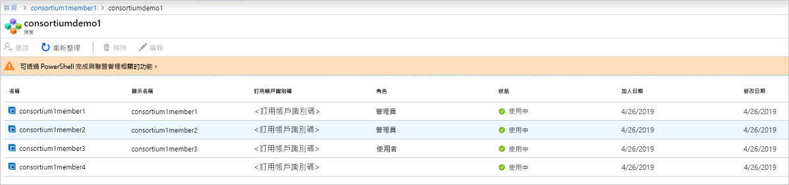

# 什麼是 Azure 區塊鏈服務？

Azure 區塊鏈 Service 是受到完整管理的交易記錄資料庫服務，可讓使用者能夠成長和操作在 Azure 中大規模的區塊鏈網路。 藉由提供統一的控制基礎結構管理以及區塊鏈網路控管，Azure 區塊鏈服務提供：

* 簡易網路部署和操作
* 內建的聯盟管理
* 開發智能合約使用熟悉的開發工具

Azure 區塊鏈服務被設計來支援多個交易記錄資料庫的通訊協定。 目前，它可讓您以太坊[仲裁](https://www.jpmorgan.com/Quorum)分類帳使用[IBFT](https://github.com/jpmorganchase/quorum/wiki/Quorum-Consensus)共識的機制。

這些功能幾乎不需要管理，而且免費提供。 您可以專注於應用程式開發和商務邏輯，而非將時間和管理虛擬機器和基礎結構的資源。 此外，您可以繼續開發您的應用程式的開放原始碼工具與平台，您的解決方案而不需要學習新技能。

## 網路部署和操作

部署 Azure Blockchain 服務可透過 Azure 入口網站、 Azure CLI，以及透過使用 Azure Blockchain 擴充功能的 Visual Studio 程式碼。  簡化部署，包括佈建交易和驗證程式 節點，安全性隔離，以及服務管理的儲存體的 Azure 虛擬網路。  此外，在部署新的區塊鏈成員時，使用者也建立，或加入，協會。  協會啟用多個合作對象中不同的 Azure 訂用帳戶要能夠彼此共用的區塊鏈上安全地進行通訊。  這個簡化的部署可減少從天為分鐘的區塊鏈網路部署。

### 效能及服務層

Azure 區塊鏈 Service 提供兩個服務層：*基本*並*標準*。 每個層提供不同的效能和功能，以支援輕量級開發和測試工作負載最多可大幅調整生產環境的區塊鏈部署。 這兩層包含至少一個交易節點，以及一個驗證程式節點 （基本） 或兩個驗證程式節點 （標準）。

除了提供兩個驗證程式節點，*標準*層提供 2 *Vcore*針對每個交易和驗證程式的節點而 「 基本 」 層提供 1 個虛擬核心設定。  藉由提供的交易 和 驗證 節點的 2 個虛擬核心，1 個 vCore 可以專屬於仲裁分類帳而其餘的 1 個 vCore 可以用於其他基礎結構相關的服務，確保生產環境的最佳效能的區塊鏈工作負載。 如需有關定價詳細資料的詳細資訊，請參閱 < [Azure 區塊鏈 Service 定價](https://azure.microsoft.com/pricing/details/blockchain-service)。

### 安全性與維護

佈建之後您的第一個區塊鏈成員，您可以將其他交易節點新增至您的成員。  根據預設，交易節點受到透過防火牆規則，而且必須設定為存取。  此外，交易的所有節點會都加密透過 TLS 中的資料。  保護交易節點存取，包括防火牆、 基本驗證、 存取金鑰，以及 Azure Active Directory 整合，有多個選項。 如需詳細資訊，請參閱 <<c0> [ 設定交易節點](configure-transaction-nodes.md)並[設定 Azure Active Directory 存取](configure-aad.md)。

做為受管理的服務，Azure 區塊鏈服務可確保您的區塊鏈成員節點套用最新的主機操作系統和交易記錄資料庫的軟體堆疊更新、 設定高可用性 （僅限標準層），消除大部分的 DevOps所需的傳統 IaaS 區塊鏈節點。  如需有關修補和更新的詳細資訊，請參閱[支援 Azure 區塊鏈 Service 分類帳版本](ledger-versions.md)。

### 監視和記錄

此外，Azure 區塊鏈 Service 會提供豐富的計量，透過 Azure 監視器服務提供深入了解節點的 CPU、 記憶體和儲存體使用量以及實用的深入了解區塊鏈網路活動，例如交易，以及進行資料採礦，區塊交易的佇列深度，以及使用中的連接。  可以自訂計量，以對您的區塊鏈應用程式很重要的深入解析成提供的檢視。  此外，可以透過讓使用者動作，例如傳送電子郵件或文字訊息、 執行邏輯應用程式，Azure 函式，或將傳送至自訂的 webhook 觸發程序的警示定義臨界值。

透過 Azure Log Analytics，使用者可以檢視相關的仲裁交易紀錄資料庫或其他重要資訊，例如嘗試節點的連線，交易記錄。

## 內建的聯盟管理

在部署您的第一個區塊鏈成員時，您加入或建立新的協會。  一個是用來管理控管和 transact 多方的程序中的區塊鏈成員之間的連線的邏輯群組。  Azure 的區塊鏈 Service 提供內建的管理控制，透過預先定義智能合約，以決定可以採取的動作成員協會。  這些管理控制，可以視需要自訂協會的系統管理員。 當您建立新的協會時，區塊鏈成員時，可讓您以邀請其他人加入您協會協會的預設系統管理員。  您可以在只有當您在先前有已受邀加入協會。  聯結時協會，區塊鏈成員受限於適當加諸的協會的系統管理員的管理控制。

協會管理動作，例如新增和移除協會的成員可以透過 PowerShell 和 REST API 來存取。 您可以透過程式設計方式管理協會使用通用介面，而非修改及提交在 solidity 型智能合約。 如需詳細資訊，請參閱 <<c0> [ 協會管理](consortium.md)。

## 使用熟悉的開發工具進行開發

根據開放原始碼仲裁以太坊交易記錄資料庫，您可以開發 Azure 區塊鏈服務的應用程式相同的方式就像是為現有的以太坊應用程式。 使用領先業界的合作夥伴，Azure 區塊鏈開發套件 Visual Studio Code 擴充功能可讓開發人員運用熟悉的工具，例如 Truffle 套件，以建立智能合約。 使用 Azure 區塊鏈開發套件延伸模組，開發人員可以建立或連接到與現有協會，讓您可以建置和部署您的智慧合約所有從一個 IDE。 使用 Azure 區塊鏈 Visual Studio Code 延伸模組，您可以建立或連接到現有的協會，可讓您可以建置並部署您從一個 IDE 智能合約。 如需詳細資訊，請參閱 < [VS Code marketplace 中的 Azure 區塊鏈開發套件](https://aka.ms/vscodebcextension)並[Azure 區塊鏈開發套件使用者手冊](https://aka.ms/vscodebcextensionwiki )。

## 支援與意見反應

需要協助或有任何意見嗎？

* 請瀏覽[Azure 區塊鏈部落格](https://azure.microsoft.com/blog/topics/blockchain/)， [Microsoft 技術社群](https://techcommunity.microsoft.com/t5/Blockchain/bd-p/AzureBlockchain)，並[Azure 區塊鏈論壇](https://social.msdn.microsoft.com/Forums/home?forum=azureblockchain)。
* 若要提供意見反應或要求新功能，請透過 [UserVoice](https://feedback.azure.com/forums/921130-azure-blockchain-service) 建立項目。

## 後續步驟

若要開始，請嘗試快速入門或了解從這些資源的更多詳細資料。
* [建立使用 Azure 入口網站的區塊鏈成員](create-member.md)或[建立區塊鏈成員，使用 Azure CLI](create-member-cli.md)
* 如需成本和計算機，請參閱[定價頁面](https://azure.microsoft.com/pricing/details/blockchain-service)。
* 建置第一個應用程式使用[Azure 區塊鏈開發套件](https://github.com/Azure-Samples/blockchain-devkit)
* Azure 區塊鏈 VSCode 擴充功能[使用者指南](https://github.com/Microsoft/vscode-azure-blockchain-ethereum/wiki)
