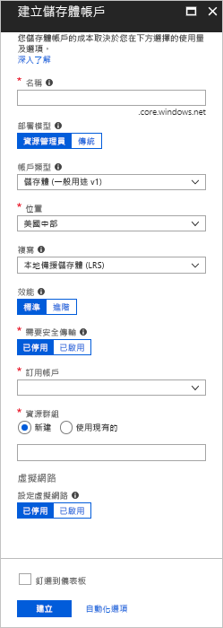
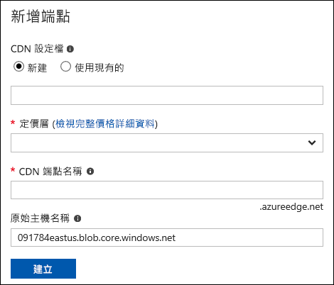
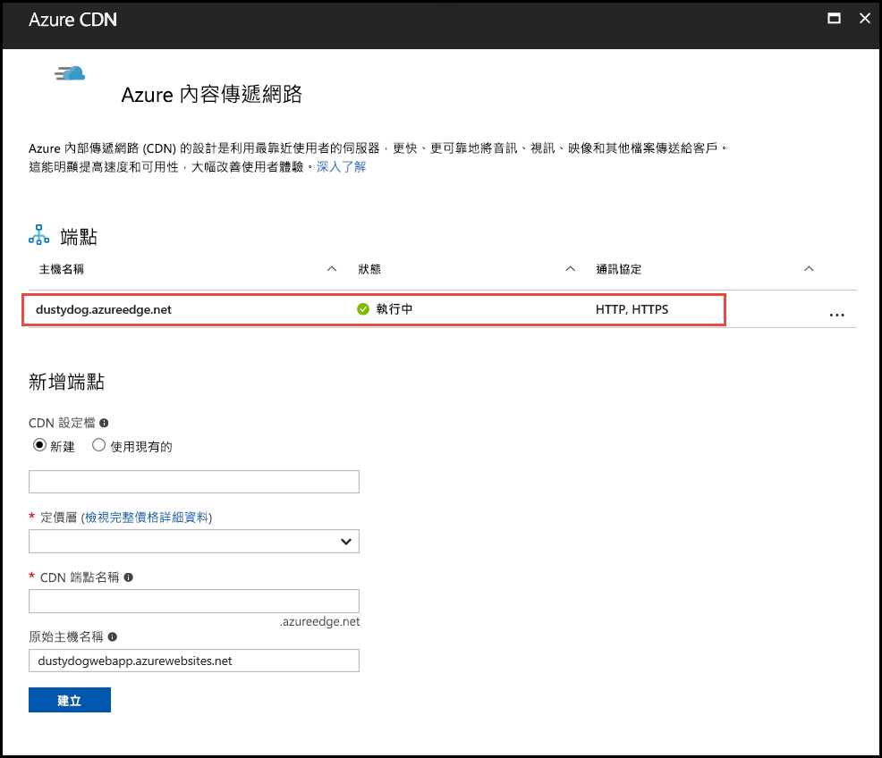
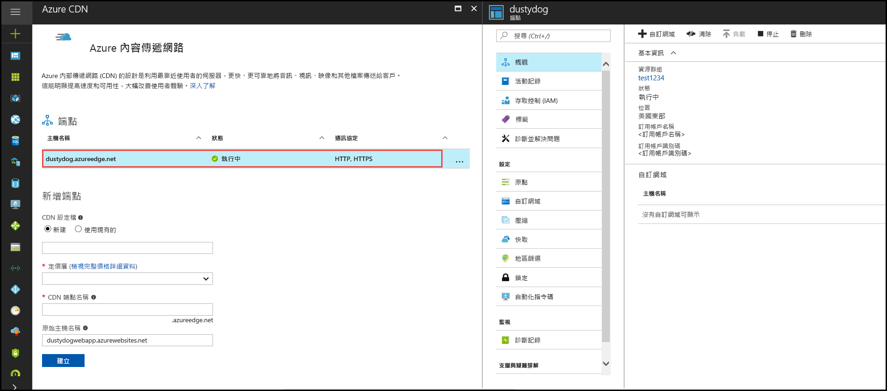

# 快速入門：整合 Azure 儲存體帳戶與 Azure CDN
在本快速入門中，您可以啟用 [Azure 內容傳遞網路 (CDN)](cdn-overview.md)，從 Azure 儲存體快取內容。 Azure CDN 提供開發人員一套傳遞高頻寬內容的全域解決方案。 在北美洲、歐洲、亞洲、澳洲及南美洲的實體節點上，皆可快取 blob 和計算執行個體的靜態內容。

[!INCLUDE [quickstarts-free-trial-note](../../includes/quickstarts-free-trial-note.md)]

## 登入 Azure 入口網站
使用您的 Azure 帳戶登入 [Azure 入口網站](https://portal.azure.com)。

## 建立儲存體帳戶
使用下列程序，為 Azure 訂用帳戶建立新的儲存體帳戶。 有了儲存體帳戶，才能存取 Azure 儲存體服務。 儲存體帳戶代表最高層級的命名空間，用於存取每個 Azure 儲存體服務元件：Azure Blob、佇列和資料表儲存。 如需詳細資訊，請參閱 [Microsoft Azure 儲存體簡介](../storage/common/storage-introduction.md)。

若要建立儲存體帳戶，您必須是服務管理員或是相關訂用帳戶的共同管理員。

您可使用數種方法來建立儲存體帳戶，包括 Azure 入口網站和 PowerShell。 本快速入門會示範如何使用 Azure 入口網站。   

**為 Azure 訂用帳戶建立儲存體帳戶**

1. 在 Azure 入口網站的左上方，選取 [建立資源]。 

    [新增] 窗格隨即出現。

2. 選取 [儲存體]，然後選取 [儲存體帳戶 - Blob、檔案、資料表、佇列]。
    
    

    [建立儲存體帳戶] 窗格隨即出現。   

    

3. 在 [名稱] 方塊中，輸入子網域名稱。 此項目可以包含 3 至 24 個小寫字母與數字。
   
    此值會成為 URI 內用來將訂用帳戶的 blob、佇列或資料表資源定址的主機名稱。 若要在 Blob 儲存體中將容器資源定址，請使用下列格式的 URI：
   
    http://&lt;StorageAcountLabel&gt;.blob.core.windows.net/&lt;mycontainer&gt;

    其中 *&lt;StorageAccountLabel&gt;* 指的是您在 [名稱] 方塊中輸入的值。
   
    > [!IMPORTANT]    
    > URL 標籤會形成儲存體帳戶 URI 的子網域，而且必須在 Azure 中的所有代管服務間是唯一的。
   
    此值也用作該儲存體帳戶在入口網站中的名稱，或用於透過程式設計方式存取此帳戶時。
    
4. 針對其餘設定，請使用下表中所指定的值：

    | 設定  | 值 |
    | -------- | ----- |
    | **部署模型** | 使用預設值。 |
    | **帳戶類型** | 使用預設值。 |
    | **位置**    | 從下拉式清單中選取 [美國中部]。 |
    | **複寫** | 使用預設值。 |
    | **效能** | 使用預設值。 |
    | **需要安全傳輸** | 使用預設值。 |
    | **訂用帳戶** | 從下拉式清單中，選取 Azure 訂用帳戶。 |
    | **資源群組** | 選取 [新建]，並輸入 *my-resource-group-123* 作為資源群組名稱。 此名稱必須是全域唯一的。 如果此名稱已在使用中，您可以輸入不同名稱或是選取 [使用現有項目]，並從下拉式清單中選取 [my-resource-group-123]。  如需資源群組的資訊，請參閱 [Azure Resource Manager 概觀](../azure-resource-manager/resource-group-overview.md#resource-groups)。| 
    | **設定虛擬網路** | 使用預設值。 |  
    
5. 選取 [釘選至儀表板]，以在儲存體帳戶建立後將其儲存至儀表板。
    
6. 選取 [建立] 。 建立儲存體帳戶可能需要幾分鐘才能完成。

## 啟用儲存體帳戶的 Azure CDN

您可以直接從儲存體帳戶啟用儲存體帳戶的 Azure CDN。 如果想要指定 CDN 端點的進階組態設定 (例如[大型檔案下載最佳化](cdn-optimization-overview.md#large-file-download))，您可以改用 [Azure CDN 擴充功能](cdn-create-new-endpoint.md)建立 CDN 設定檔或端點。

1. 從儀表板選取儲存體帳戶，然後在左窗格中選取 [Azure CDN]。 如果 [Azure CDN] 按鈕沒有立即顯示，您可以在左窗格的 [搜尋] 方塊中輸入 CDN 來尋找。
    
    [Azure CDN] 頁面隨即顯示。

    
    
2. 輸入下列表格中指定的所需資訊，以建立新端點：

    | 設定  | 值 |
    | -------- | ----- |
    | **CDN 設定檔** | 選取 [新建]，然後輸入 my-cdn-profile-123 作為設定檔名稱。 此名稱必須是全域唯一的；如果已在使用中，您可以輸入不同名稱。  |
    | **定價層** | 從下拉式清單中選取 [標準 Verizon]。 |
    | **CDN 端點名稱** | 輸入 *my-endpoint-123* 作為您的端點主機名稱。 此名稱必須是全域唯一的；如果已在使用中，您可以輸入不同名稱。 此名稱可用來存取位於網域 _&lt;endpoint name&gt;_.azureedge.net 的快取資源。 根據預設，新的 CDN 端點會使用儲存體帳戶的主機名稱作為原始伺服器。|

3. 選取 [建立] 。 端點建立之後，即會出現在端點清單中。

    

## 啟用其他 CDN 功能
在儲存體帳戶 [Azure CDN] 頁面中，選取清單內的 CDN 端點，以開啟 CDN 端點組態頁面。 從此頁面中，您可以為傳遞啟用其他的 CDN 功能，例如[壓縮](cdn-improve-performance.md)、[查詢字串快取](cdn-query-string.md)和[地區篩選](cdn-restrict-access-by-country.md)。 
    

## 啟用 SAS
如果您想要授與有限的私人儲存體容器存取權，便可以使用 Azure 儲存體帳戶的「共用存取簽章」(SAS) 功能。 SAS 是一個 URI，可在不公開您帳戶金鑰的情況下，授與對「Azure 儲存體」資源的有限存取權限。 如需詳細資訊，請參閱[搭配使用 Azure CDN 與 SAS](cdn-sas-storage-support.md)。

## 存取 CDN 內容
若要存取 CDN 上快取的內容，請使用入口網站中提供的 CDN URL。 快取 blob 的位址格式如下：

http://<*EndpointName*\>.azureedge.net/<*myPublicContainer*\>/<*BlobName*\>

> [!NOTE]
> 啟用 Azure CDN 存取儲存體帳戶後，所有公開可用的物件皆適用於 CDN POP 快取。 如果您修改的物件目前是 CDN 中的快取物件，在快取內容的有效存留期已滿之後，除非 Azure CDN 重新整理內容，否則無法透過 Azure CDN 取得新的內容。

## 從 Azure CDN 移除內容
如果不想繼續在 Azure CDN 中快取物件，您可以採取下列其中一個步驟：

* 將容器設為私人而非公用。 如需詳細資訊，請參閱 [管理對容器與 Blob 的匿名讀取權限](../storage/blobs/storage-manage-access-to-resources.md)。
* 使用 Azure 入口網站來停用或刪除 CDN 端點。
* 修改託管服務，使其不再回應物件的要求。

已在 Azure CDN 中快取的物件會保持快取狀態，直到物件的有效存留期已滿或端點已[清除](cdn-purge-endpoint.md)為止。 有效存留期已滿時，Azure CDN 會判斷 CDN 端點是否仍然有效，以及物件是否仍可匿名存取。 如果不是的話，將不再快取物件。

## 清除資源
在前述步驟中，您在資源群組中建立了 CDN 設定檔和端點。 如果您想移至[後續步驟](#next-steps)並了解如何將自訂網域新增至您的端點，請儲存這些資源。 不過，如果您認為未來不需要使用這些資源，可以藉由刪除資源群組的方式將其刪除，以避免額外的費用：

1. 從 Azure 入口網站的左側功能表中，依序選取 [資源群組] 和 [my-resource-group-123]。

2. 在 [資源群組] 頁面上選取 [刪除資源群組]，在文字方塊中輸入 *my-resource-group-123*，然後選取 [刪除]。

    此動作將會刪除資源群組、設定檔，以及您在此快速入門中建立的端點。

3. 若要刪除儲存體帳戶，請從儀表板中選取該帳戶，然後從頂端功能表中選取 [刪除]。

## 後續步驟
若要了解如何在 CDN 端點上新增自訂網域並啟用 HTTPS，請參閱下列教學課程：

> [!div class="nextstepaction"]
> [教學課程：使用 Azure CDN 自訂網域透過 HTTPS 存取儲存體 Blob](cdn-storage-custom-domain-https.md)

