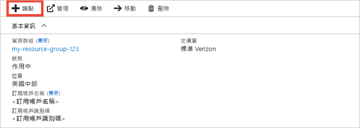
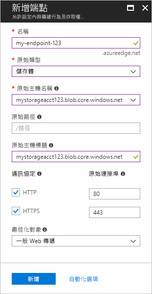
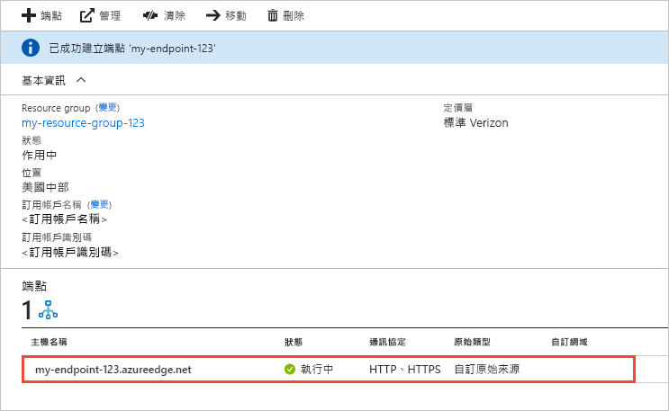

# 快速入門：建立 Azure CDN 設定檔和端點
在此快速入門中，您會藉由建立新的 CDN 設定檔和端點來啟用 Azure 內容傳遞網路 (CDN)。 在建立設定檔和端點後，您即可開始將內容傳遞給您的客戶。

[!INCLUDE [quickstarts-free-trial-note](../../includes/quickstarts-free-trial-note.md)]

## 必要條件
基於此快速入門的用途，您必須建立名為 *mystorageacct123* (作為原始主機名稱) 的儲存體帳戶。 如需詳細資訊，請參閱[整合 Azure 儲存體帳戶與 Azure CDN](cdn-create-a-storage-account-with-cdn.md)。

## 登入 Azure 入口網站
使用您的 Azure 帳戶登入 [Azure 入口網站](https://portal.azure.com)。

[!INCLUDE [cdn-create-profile](../../includes/cdn-create-profile.md)]

## 建立新的 CDN 端點

在您建立 CDN 設定檔後，可以使用它來建立端點。

1. 在 Azure 入口網站中，從儀表板中選取您所建立的 CDN 設定檔。 如果找不到該檔案，請選取 [所有服務]，然後選取 [CDN 設定檔]。 在 [CDN 設定檔] 頁面中，選取您要使用的設定檔。 
   
    此時會出現 [CDN 設定檔] 頁面。

2. 選取 [端點]。
   
    
   
    此時會顯示 [新增端點] 窗格。

3. 對於端點設定，使用下表中所指定的值：

    | 設定 | 值 |
    | ------- | ----- |
    | **名稱** | 輸入 *my-endpoint-123* 作為您的端點主機名稱。 此名稱必須是全域唯一的；如果已在使用中，您可以輸入不同名稱。 此名稱可用來存取位於網域 _&lt;endpoint name&gt;_.azureedge.net 的快取資源。|
    | **原始類型** | 選取 [儲存體] 。 | 
    | **原始主機名稱** | 輸入 *mystorageacct123.blob.core.windows.net* 作為您的主機名稱。 此名稱必須是全域唯一的；如果已在使用中，您可以輸入不同名稱。 |
    | **原始路徑** | 保留空白。 |
    | **原始主機標頭** | 保留產生的預設值。 |  
    | **通訊協定** | 保留已選取的預設值 **HTTP** 和 **HTTPS** 選項。 |
    | **原始連接埠** | 保留預設的連接埠值。 | 
    | **最佳化對象** | 保留預設選項 [一般 Web 傳遞]。 |

    

3. 選取 [新增] 來建立新的端點。
   
   端點建立之後，即會出現在設定檔的端點清單中。
    
   
    
   因為需要一段時間才能傳播註冊，所以端點不會立即可供使用： 
   - 若為**來自 Microsoft 的標準 Azure CDN** 設定檔，通常會在 10 分鐘內完成傳播。 
   - 若為**來自 Akamai 的標準 Azure CDN** 設定檔，通常會在一分鐘內完成傳播。 
   - 若為**來自 Verizon 的標準 Azure CDN** 和**來自 Verizon 的進階 Azure CDN** 設定檔，通常會在 90 分鐘內完成傳播。 

## 清除資源
在前述步驟中，您在資源群組中建立了 CDN 設定檔和端點。 如果您想移至[後續步驟](#next-steps)並了解如何將自訂網域新增至您的端點，請儲存這些資源。 不過，如果您認為未來不需要使用這些資源，可以藉由刪除資源群組的方式將其刪除，以避免額外的費用：

1. 從 Azure 入口網站的左側功能表中，依序選取 [資源群組] 和 [my-resource-group-123]。

2. 在 [資源群組] 頁面上選取 [刪除資源群組]，在文字方塊中輸入 *my-resource-group-123*，然後選取 [刪除]。

    此動作將會刪除資源群組、設定檔，以及您在此快速入門中建立的端點。

## 後續步驟
若要了解如何將自訂網域新增至您的 CDN 端點，請參閱下列教學課程：

> [!div class="nextstepaction"]
> [教學課程：將自訂網域新增至 Azure CDN 端點](cdn-map-content-to-custom-domain.md)

