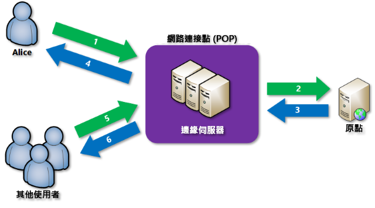

# 什麼是 Azure 上的內容傳遞網路？
內容傳遞網路 (CDN) 是可以有效率地將 Web 內容傳遞給使用者的分散式伺服器網路。 CDN 會將快取的內容儲存在使用者附近的邊緣伺服器上的存在點 (POP) 位置中，以將延遲降至最低。 

Azure 內容傳遞網路 (CDN) 為開發人員提供一套全域解決方案，讓他們可藉由在策略性分布於全球的實體節點上快取內容，將高頻寬內容迅速傳遞給使用者。 Azure CDN 也可運用各種採用 CDN POP 的網路最佳化，來加速提供無法快取的動態內容。 例如，利用路由最佳化來略過邊界閘道協定 (BGP)。

使用 Azure CDN 來傳遞網站資產的優點包括：

* 讓使用者享有更好的效能和改善的使用者經驗，尤其是當使用的應用程式需要反覆存取多次才能載入內容時。
* 進行大幅調整可以更妥善地處理瞬間大量負載 (例如產品上市事件的開始)。
* 分散使用者要求，並從邊緣伺服器直接提供內容，以減少傳送至原始伺服器的流量。

如需目前的 CDN 節點位置清單，請參閱 [Azure CDN POP 位置](cdn-pop-locations.md)。

## 運作方式

1. 使用者 (Alice) 使用具有特殊網域名稱的 URL (例如 _&lt;端點名稱&gt;_.azureedge.net) 要求檔案 (也稱為資產)。 此名稱可以是端點主機名稱或自訂網域。 DNS 會將要求路由至效能最佳的 POP 位置，這通常是地理位置最接近使用者的 POP。
    
2. 如果 POP 中的邊緣伺服器在其快取中都沒有該檔案，則 POP 會從原始伺服器要求檔案。 原始伺服器可以是 Azure Web 應用程式、Azure 雲端服務、Azure 儲存體帳戶，或任何可公開存取的 Web 伺服器。
   
3. 原始伺服器會將檔案傳回至 POP 中的邊緣伺服器。
    
4. POP 中的邊緣伺服器會快取檔案，並將檔案傳回給原始要求者 (Alice)。 在 HTTP 標頭指定的存留時間 (TTL) 到期之前，POP 中的邊緣伺服器都可快取該檔案。 如果原始伺服器未指定 TTL，預設 TTL 將是 7 天。
    
5. 其他使用者後續可使用 Alice 所使用的相同 URL 要求相同的檔案，而且也可導向至相同的 POP。
    
6. 如果檔案的 TTL 尚未過期，邊緣伺服器便會直接從快取傳回檔案。 此程序會產生更快、更靈敏回應的使用者經驗。

## 需求
若要使用 Azure CDN，您至少必須有一個 Azure 訂用帳戶。 您也必須建立至少一個 CDN 設定檔，作為 CDN 端點的集合。 每個 CDN 端點分別代表內容傳遞行為和存取一個的特定組態。 若要依網際網路網域、Web 應用程式或其他準則來組織您的 CDN 端點，您可以使用多個設定檔。 由於 [Azure CDN 定價](https://azure.microsoft.com/pricing/details/cdn/)會套用於 CDN 設定檔層級，因此如果您想要使用混合的定價層，則必須建立多個 CDN 設定檔。 如需 Azure CDN 計費結構的相關資訊，請參閱[了解 Azure CDN 計費](cdn-billing.md)。

### 限制
每個 Azure 訂用帳戶都具有下列資源的預設限制：
 - 可建立的 CDN 設定檔數目。
 - 可在 CDN 設定檔中建立的端點數目。 
 - 可對應至端點的自訂網域數目。

如需關於 CDN 訂用帳戶限制的詳細資訊，請參閱 [CDN 限制](https://docs.microsoft.com/azure/azure-subscription-service-limits#cdn-limits)。
    
## Azure CDN 功能
Azure CDN 提供下列主要功能︰

- [動態網站加速](cdn-dynamic-site-acceleration.md)
- [CDN 快取規則](cdn-caching-rules.md)
- [HTTPS 自訂網域支援](cdn-custom-ssl.md)
- [Azure 診斷記錄](cdn-azure-diagnostic-logs.md)
- [檔案壓縮](cdn-improve-performance.md)
- [地理位置篩選](cdn-restrict-access-by-country.md)

如需每個 Azure CDN 產品所支援之功能的完整清單，請參閱[比較 Azure CDN 產品功能](cdn-features.md)。

## 後續步驟
- 若要開始使用 CDN，請參閱[建立 Azure CDN 設定檔和端點](cdn-create-new-endpoint.md)。
- 透過 [Microsoft Azure 入口網站](https://portal.azure.com)或 [PowerShell](cdn-manage-powershell.md) 管理您的 CDN 端點。
- 了解如何透過 [.NET](cdn-app-dev-net.md) 或 [Node.js](cdn-app-dev-node.md) 自動化 Azure CDN。
- 若要查看作用中的 Azure CDN，請觀看 [Azure CDN 視訊](https://azure.microsoft.com/resources/videos/index/?services=cdn&sort=newest)。
- 如需最新 Azure CDN 功能的相關資訊，請參閱 [Azure CDN 部落格](https://azure.microsoft.com/blog/tag/azure-cdn/)。

