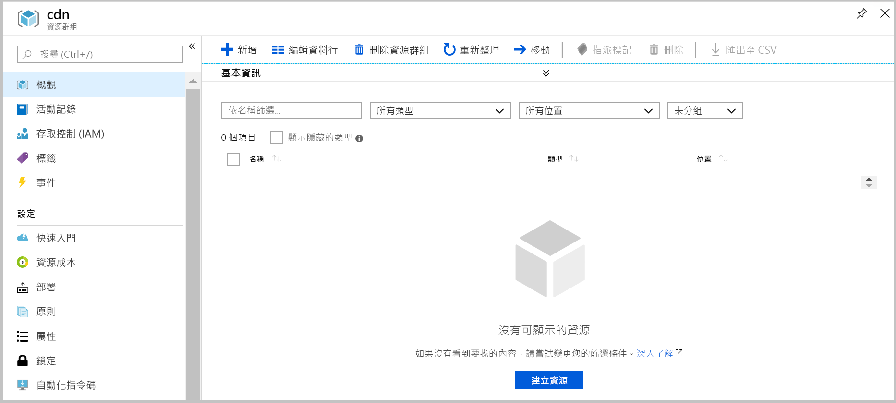

# <a name="quickstart-create-an-azure-cdn-profile-and-endpoint-using-resource-manager-template"></a>快速入門：使用 Resource Manager 範本，建立 Azure CDN 設定檔和端點

在此快速入門中，您會使用 CLI 來部署 Azure Resource Manager 範本。 您所建立的範本會將 CDN 設定檔和 CDN 端點部署至前端 Web 應用程式。
完成這些步驟大約需要約十分鐘。

[!INCLUDE [quickstarts-free-trial-note](../../includes/quickstarts-free-trial-note.md)]

## <a name="prequisites"></a>必要條件

基於本快速入門的目的，您必須要有 Web 應用程式作為原點。 Web 應用程式在本快速入門使用的範例已部署至 https://cdndemo.azurewebsites.net

如需詳細資訊，請參閱[在 Azure 中建立靜態 HTML Web 應用程式](https://docs.microsoft.com/azure/app-service/app-service-web-get-started-html)。

## <a name="create-a-resource-group"></a>建立資源群組

所有資源都必須部署在相同的資源群組中。

在您選取的位置中建立資源群組。 此範例示範如何在 [美國東部] 位置中建立名為 cdn 的資源群組。

```bash
az group create --name cdn --location eastus
```



## <a name="create-the-resource-manager-template"></a>建立 Resource Manager 範本

在此步驟中，您可以建立部署資源的範本檔案。

雖然此範例會逐步解說「一般網站加速」情節，但還可以設定許多其他設定。 這些設定可在 Azure Resource Manager 範本參考中取得。 請參閱 [CDN 設定檔](https://docs.microsoft.com/azure/templates/microsoft.cdn/2017-10-12/profiles) /(英文/)與 [CDN 設定檔端點](https://docs.microsoft.com/azure/templates/microsoft.cdn/2017-10-12/profiles/endpoints) /(英文/) 參考。

請注意，Microsoft CDN 並不支援修改內容類型清單。

請將範本儲存為 **resource-manager-cdn.json**。

```json
{
    "$schema": "https://schema.management.azure.com/schemas/2015-01-01/deploymentTemplate.json#",
    "contentVersion": "1.0.0.0",
    "parameters": {
        "cdnProfileSku": {
            "type": "string",
            "allowedValues": [
                "Standard_Microsoft",
                "Standard_Akamai",
                "Standard_Verizon",
                "Premium_Verizon"
            ]
        },
        "endpointOriginHostName": {
            "type": "string"
        }
    },
    "variables": {
        "profile": {
            "name": "[replace(toLower(parameters('cdnProfileSku')), '_', '-')]"
        },
        "endpoint": {
            "name": "[replace(toLower(parameters('endpointOriginHostName')), '.', '-')]",
            "originHostName": "[parameters('endpointOriginHostName')]"
        }
    },
    "resources": [
        {
            "type": "Microsoft.Cdn/profiles",
            "apiVersion": "2017-10-12",
            "location": "[resourceGroup().location]",
            "name": "[variables('profile').name]",
            "sku": {
                "name": "[parameters('cdnProfileSku')]"
            }
        },
        {
            "dependsOn": [
                "[resourceId('Microsoft.Cdn/profiles', variables('profile').name)]"
            ],
            "type": "Microsoft.Cdn/profiles/endpoints",
            "apiVersion": "2017-10-12",
            "location": "[resourceGroup().location]",
            "name": "[concat(variables('profile').name, '/', variables('endpoint').name)]",
            "properties": {
                "hostName": "[concat(variables('endpoint').name, '.azureedge.net')]",
                "originHostHeader": "[variables('endpoint').originHostName]",
                "isHttpAllowed": true,
                "isHttpsAllowed": true,
                "queryStringCachingBehavior": "IgnoreQueryString",
                "origins": [
                    {
                        "name": "[replace(variables('endpoint').originHostName, '.', '-')]",
                        "properties": {
                            "hostName": "[variables('endpoint').originHostName]",
                            "httpPort": 80,
                            "httpsPort": 443
                        }
                    }
                ],
                "contentTypesToCompress": [
                    "application/eot",
                    "application/font",
                    "application/font-sfnt",
                    "application/javascript",
                    "application/json",
                    "application/opentype",
                    "application/otf",
                    "application/pkcs7-mime",
                    "application/truetype",
                    "application/ttf",
                    "application/vnd.ms-fontobject",
                    "application/xhtml+xml",
                    "application/xml",
                    "application/xml+rss",
                    "application/x-font-opentype",
                    "application/x-font-truetype",
                    "application/x-font-ttf",
                    "application/x-httpd-cgi",
                    "application/x-javascript",
                    "application/x-mpegurl",
                    "application/x-opentype",
                    "application/x-otf",
                    "application/x-perl",
                    "application/x-ttf",
                    "font/eot",
                    "font/ttf",
                    "font/otf",
                    "font/opentype",
                    "image/svg+xml",
                    "text/css",
                    "text/csv",
                    "text/html",
                    "text/javascript",
                    "text/js",
                    "text/plain",
                    "text/richtext",
                    "text/tab-separated-values",
                    "text/xml",
                    "text/x-script",
                    "text/x-component",
                    "text/x-java-source"
                ],
                "isCompressionEnabled": true,
                "optimizationType": "GeneralWebDelivery"
            }
        }
    ],
    "outputs": {
        "cdnUrl": {
            "type": "string",
            "value": "[concat('https://', variables('endpoint').name, '.azureedge.net')]"
        }
    }
}
```

## <a name="create-the-resources"></a>建立資源

使用 Azure CLI 來部署範本。 系統會提示您輸入 2 項資訊：

**cdnProfileSku** - 您想要使用的 CDN 提供者。 可用選項包括：

* Standard_Microsoft
* Standard_Akamai
* Standard_Verizon
* Premium_Verizon。

**endpointOriginHostName** - 系統會透過 CDN 處理的端點，例如 cdndemo.azurewebsites.net。

```bash
az group deployment create --resource-group cdn --template-file arm-cdn.json
```


## <a name="view-the-cdn-profile"></a>檢視 CDN 設定檔

```bash
az cdn profile list --resource-group cdn -o table
```


## <a name="view-the-cdn-endpoint-for-the-profile-standard-microsoft"></a>檢視 standard-microsoft 設定檔的 CDN 端點

```bash
az cdn endpoint list --profile-name standard-microsoft --resource-group cdn -o table
```


使用主機名稱來檢視內容。 例如，使用您的瀏覽器存取 https://cdndemo-azurewebsites-net.azureedge.net。

## <a name="clean-up"></a>清除

刪除資源群組會自動移除部署其中的所有資源。

```bash
az group delete --name cdn
```


## <a name="references"></a>參考

* CDN 設定檔 - [Azure Resource Manager 範本參考](https://docs.microsoft.com/azure/templates/microsoft.cdn/2017-10-12/profiles)
* CDN 端點 - [Azure Resource Manager 範本參考文件](https://docs.microsoft.com/azure/templates/microsoft.cdn/2017-10-12/profiles/endpoints)

## <a name="next-steps"></a>後續步驟

若要了解如何將自訂網域新增至您的 CDN 端點，請參閱下列教學課程：

> [!div class="nextstepaction"]
> [教學課程：將自訂網域新增至 Azure CDN 端點](cdn-map-content-to-custom-domain.md)
