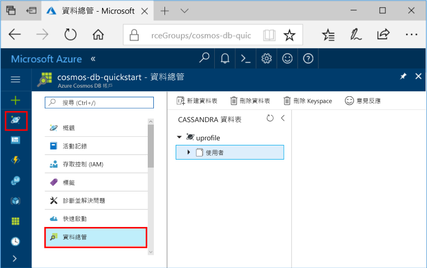

# <a name="quickstart-build-a-cassandra-app-with-nodejs-and-azure-cosmos-db"></a>快速入門：使用 Node.js 和 Azure Cosmos DB 建置 Cassandra 應用程式

> [!div class="op_single_selector"]
> * [.NET](create-cassandra-dotnet.md)
> * [Java](create-cassandra-java.md)
> * [Node.js](create-cassandra-nodejs.md)
> * [Python](create-cassandra-python.md)
>  

本快速入門示範如何使用 Node.js 與 Azure Cosmos DB [Cassandra API](cassandra-introduction.md)，以藉由從 GitHub 複製範例來建置設定檔應用程式。 此快速入門也會示範如何使用 Web 型 Azure 入口網站來建立 Azure Cosmos DB 帳戶。

Azure Cosmos DB 是 Microsoft 的全域分散式多模型資料庫服務。 您可以快速建立及查詢文件、資料表、索引鍵/值及圖形資料庫，所有這些都受惠於位於 Azure Cosmos DB 核心的全域散發和水平調整功能。 

## <a name="prerequisites"></a>必要條件

[!INCLUDE [quickstarts-free-trial-note](../../includes/quickstarts-free-trial-note.md)]或者，您可以[免費試用 Azure Cosmos DB](https://azure.microsoft.com/try/cosmosdb/)，無須 Azure 訂用帳戶，也無須任何費用和約定付款。

此外，您需要：
* [Node.js](https://nodejs.org/en/) v0.10.29 版或更高版本
* [Git](http://git-scm.com/)

## <a name="create-a-database-account"></a>建立資料庫帳戶

您必須先使用 Azure Cosmos DB 建立 Cassandra 帳戶，才可以建立文件資料庫。

[!INCLUDE [cosmos-db-create-dbaccount-cassandra](../../includes/cosmos-db-create-dbaccount-cassandra.md)]

## <a name="clone-the-sample-application"></a>複製範例應用程式

現在，我們將從 Github 複製 Cassandra API 應用程式、設定連接字串，然後加以執行。 您會看到，以程式設計方式來處理資料有多麼的容易。 

1. 開啟命令提示字元。 建立名為 `git-samples` 的新資料夾。 接著，關閉命令提示字元。

    ```bash
    md "C:\git-samples"
    ```

2. 開啟 Git 終端機視窗，例如 Git Bash。 使用 `cd` 命令變更至新資料夾，以安裝範例應用程式。

    ```bash
    cd "C:\git-samples"
    ```

3. 執行下列命令來複製範例存放庫。 此命令會在您的電腦上建立範例應用程式副本。

    ```bash
    git clone https://github.com/Azure-Samples/azure-cosmos-db-cassandra-nodejs-getting-started.git
    ```

## <a name="review-the-code"></a>檢閱程式碼

此為選用步驟。 如果您有興趣了解程式碼如何建立資料庫資源，您可以檢閱下列程式碼片段。 此程式碼片段全都取自 `C:\git-samples\azure-cosmos-db-cassandra-nodejs-getting-started` 資料夾中的 `uprofile.js` 檔案。 或者也可以直接跳至[更新您的連接字串](#update-your-connection-string)。 

* 使用者名稱與密碼值是使用 Azure 入口網站中的連接字串頁面所設定。 `path\to\cert` 提供 X509 憑證的路徑。 

   ```nodejs
   var ssl_option = {
        cert : fs.readFileSync("path\to\cert"),
        rejectUnauthorized : true,
        secureProtocol: 'TLSv1_2_method'
        };
   const authProviderLocalCassandra = new cassandra.auth.PlainTextAuthProvider(config.username, config.password);
   ```

* 使用 contactPoint 資訊來初始化 `client`。 contactPoint 是從 Azure 入口網站來加以擷取。

    ```nodejs
    const client = new cassandra.Client({contactPoints: [config.contactPoint], authProvider: authProviderLocalCassandra, sslOptions:ssl_option});
    ```

* `client` 會連線至 Azure Cosmos DB Cassandra API。

    ```nodejs
    client.connect(next);
    ```

* 建立新的 keyspace。

    ```nodejs
    function createKeyspace(next) {
        var query = "CREATE KEYSPACE IF NOT EXISTS uprofile WITH replication = {\'class\': \'NetworkTopologyStrategy\', \'datacenter1\' : \'1\' }";
        client.execute(query, next);
        console.log("created keyspace");    
  }
    ```

* 建立新的資料表。

   ```nodejs
   function createTable(next) {
    var query = "CREATE TABLE IF NOT EXISTS uprofile.user (user_id int PRIMARY KEY, user_name text, user_bcity text)";
        client.execute(query, next);
        console.log("created table");
   },
   ```

* 插入索引鍵/值實體。

    ```nodejs
    ...
       {
          query: 'INSERT INTO  uprofile.user  (user_id, user_name , user_bcity) VALUES (?,?,?)',
          params: [5, 'IvanaV', 'Belgaum', '2017-10-3136']
        }
    ];
    client.batch(queries, { prepare: true}, next);
    ```

* 用來取得所有索引鍵值的查詢。

    ```nodejs
   var query = 'SELECT * FROM uprofile.user';
    client.execute(query, { prepare: true}, function (err, result) {
      if (err) return next(err);
      result.rows.forEach(function(row) {
        console.log('Obtained row: %d | %s | %s ',row.user_id, row.user_name, row.user_bcity);
      }, this);
      next();
    });
    ```  
    
* 用來取得索引鍵/值的查詢。

    ```nodejs
    function selectById(next) {
        console.log("\Getting by id");
        var query = 'SELECT * FROM uprofile.user where user_id=1';
        client.execute(query, { prepare: true}, function (err, result) {
        if (err) return next(err);
            result.rows.forEach(function(row) {
            console.log('Obtained row: %d | %s | %s ',row.user_id, row.user_name, row.user_bcity);
        }, this);
        next();
        });
    }
    ```  

## <a name="update-your-connection-string"></a>更新您的連接字串

現在，返回 Azure 入口網站以取得連接字串資訊，並將它複製到應用程式中。 連接字串可讓您的應用程式與託管資料庫進行通訊。

1. 在 [Azure 入口網站](http://portal.azure.com/)中，選取 [連接字串]。 

    使用  按鈕 (畫面右方) 來複製最高值 ([連絡點])。

    ![從 Azure 入口網站的連接字串頁面檢視及複製 [連絡點]、[使用者名稱] 和 [密碼]](./media/create-cassandra-nodejs/keys.png)

2. 開啟 `config.js` 檔案。 

3. 從入口網站將 [連絡點] 值貼到 `<FillMEIN>` 的行 4。

    行 4 現在看起來應該會類似 

    `config.contactPoint = "cosmos-db-quickstarts.cassandra.cosmosdb.azure.com:10350"`

4. 從入口網站複製 [使用者名稱] 值，並將它貼到 `<FillMEIN>` 的行 2。

    行 2 現在看起來應該會類似 

    `config.username = 'cosmos-db-quickstart';`
    
5. 從入口網站複製 [密碼] 值，並將它貼到 `<FillMEIN>` 的行 3。

    行 3 現在看起來應該會類似

    `config.password = '2Ggkr662ifxz2Mg==';`

6. 儲存 `config.js` 檔案。
    
## <a name="use-the-x509-certificate"></a>使用 X509 憑證

1. 從 [https://cacert.omniroot.com/bc2025.crt](https://cacert.omniroot.com/bc2025.crt) 下載 Baltimore CyberTrust Root 憑證到本機。 將檔案重新命名為使用副檔名 `.cer`。

   憑證有序號 `02:00:00:b9` 和 SHA1 指紋 `d4🇩🇪20:d0:5e:66:fc:53:fe:1a:50:88:2c:78:db:28:52:ca:e4:74`。

2. 開啟 `uprofile.js` 並變更 `path\to\cert` 以指向您的新憑證。

3. 儲存 `uprofile.js`。

## <a name="run-the-nodejs-app"></a>執行 Node.js 應用程式

1. 在 git 終端機視窗中，執行 `npm install` 以安裝必要的 npm 模組。

2. 執行 `node uprofile.js` 來啟動您的節點應用程式。

3. 從命令列確認結果符合預期。

    

    按 CTRL + C 來停止執行程式，並關閉主控台視窗。 

4. 在 Azure 入口網站中，開啟 [資料總管] 以查詢、修改及使用這個新資料。 

     

## <a name="review-slas-in-the-azure-portal"></a>在 Azure 入口網站中檢閱 SLA

[!INCLUDE [cosmosdb-tutorial-review-slas](../../includes/cosmos-db-tutorial-review-slas.md)]

## <a name="clean-up-resources"></a>清除資源

[!INCLUDE [cosmosdb-delete-resource-group](../../includes/cosmos-db-delete-resource-group.md)]

## <a name="next-steps"></a>後續步驟

在本快速入門中，您已了解如何建立 Azure Cosmos DB 帳戶、如何使用 [資料總管] 建立容器，以及如何執行應用程式。 您現在可以將其他資料匯入到 Cosmos DB 帳戶。 

> [!div class="nextstepaction"]
> [將 Cassandra 資料匯入到 Azure Cosmos DB](cassandra-import-data.md)


