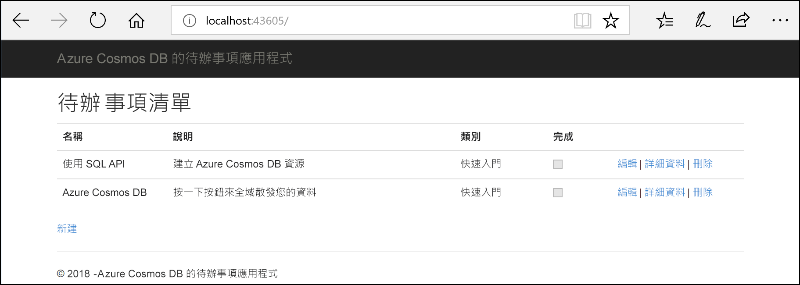
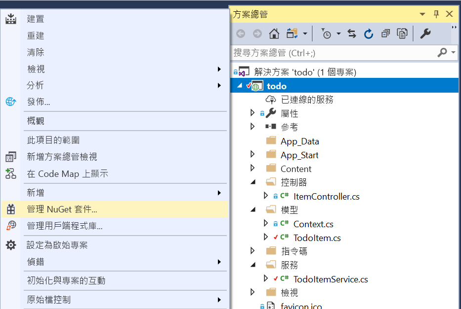

# <a name="quickstart-build-an-aspnet-web-app-using-azure-cosmos-db-sql-api-account"></a>快速入門：使用 Azure Cosmos DB SQL API 帳戶建置 ASP.NET Web 應用程式

> [!div class="op_single_selector"]
> * [.NET (預覽)](create-sql-api-dotnet-preview.md)
> * [.NET](create-sql-api-dotnet.md)
> * [Java](create-sql-api-java.md)
> * [Node.js](create-sql-api-nodejs.md)
> * [Python](create-sql-api-python.md)
> * [Xamarin](create-sql-api-xamarin-dotnet.md)
>  
> 

Azure Cosmos DB 是 Microsoft 的全域分散式、具有高可用性的多模型資料庫服務。 您可以快速建立及查詢文件、索引鍵/值及圖形資料庫，所有這些都受惠於位於 Azure Cosmos DB 核心的全域散發和水平調整功能。 

此快速入門示範如何使用 Azure 入口網站建立 Azure Cosmos DB [SQL API](sql-api-introduction.md) 帳戶、資料庫和容器。 接著，您會建置和部署以 [SQL .NET API](sql-api-sdk-dotnet.md) 為基礎的 ASP.NET 待辦事項清單 Web 應用程式，如下列螢幕擷取畫面所示。 

本快速入門會使用 3.0+ 版的 Azure Cosmos DB .NET SDK。 



## <a name="prerequisites"></a>必要條件

如果尚未安裝 Visual Studio 2017，您可以下載並使用**免費的** [Visual Studio 2017 Community 版本](https://www.visualstudio.com/downloads/)。 請確定您在 Visual Studio 設定期間啟用了 **Azure 開發**工作負載。

[!INCLUDE [quickstarts-free-trial-note](../../includes/quickstarts-free-trial-note.md)] 
[!INCLUDE [cosmos-db-emulator-docdb-api](../../includes/cosmos-db-emulator-docdb-api.md)]  

<a id="create-account"></a>
## <a name="create-a-database-account"></a>建立資料庫帳戶

[!INCLUDE [cosmos-db-create-dbaccount-preview](../../includes/cosmos-db-create-dbaccount-preview.md)]

<a id="create-collection"></a>
## <a name="add-a-collection"></a>新增集合

[!INCLUDE [cosmos-db-create-collection-preview](../../includes/cosmos-db-create-collection-preview.md)]

<a id="add-sample-data"></a>
## <a name="add-sample-data"></a>新增範例資料

[!INCLUDE [cosmos-db-create-sql-api-add-sample-data](../../includes/cosmos-db-create-sql-api-add-sample-data.md)]

## <a name="query-your-data"></a>查詢資料

[!INCLUDE [cosmos-db-create-sql-api-query-data](../../includes/cosmos-db-create-sql-api-query-data.md)]

## <a name="clone-the-sample-application"></a>複製範例應用程式

現在讓我們切換為使用程式碼。 我們將[從 GitHub 複製 SQL API 應用程式](https://github.com/Azure-Samples/cosmos-dotnet-todo-app)、設定連接字串，然後加以執行。 

1. 開啟命令提示字元，建立名為 git-samples 的新資料夾，然後關閉命令提示字元。

    ```bash
    md "C:\git-samples"
    ```

2. 開啟 git 終端機視窗 (例如 git bash)，並使用 `cd` 命令變更至要安裝範例應用程式的新資料夾。

    ```bash
    cd "C:\git-samples"
    ```

3. 執行下列命令來複製範例存放庫。 此命令會在您的電腦上建立範例應用程式副本。

    ```bash
    git clone https://github.com/Azure-Samples/cosmos-dotnet-todo-app.git
    ```

4. 在 Visual Studio 中開啟 **todo.sln** 方案檔案。 

## <a name="review-the-code"></a>檢閱程式碼

此為選用步驟。 若您想要瞭解如何在程式碼中建立資料庫資源，則可檢閱下列程式碼片段。 或者也可以直接跳至[更新您的連接字串](#update-your-connection-string)。 

請注意，如果您熟悉舊版 .NET SDK，則可能已習慣看到「集合」和「文件」等詞彙。 Azure Cosmos DB 支援多個 API 模型，因此 3.0+ 版的 .NET SDK 會使用「容器」和「項目」這些泛用詞彙。 容器可以是集合、圖形或資料表。 項目可以是文件、邊緣/頂點或資料列，並且是容器內的內容。 [深入了解資料庫、容器和項目。](databases-containers-items.md)

下列程式碼片段全部取自 ToDoItemService.cs 檔案。

* 第 68 - 69 行會初始化 CosmosClient。

    ```csharp
    CosmosConfiguration config = new CosmosConfiguration(Endpoint, PrimaryKey);
    client = new CosmosClient(config);
    ```

* 第 71 行會建立新的資料庫。

    ```csharp
    CosmosDatabase database = await client.Databases.CreateDatabaseIfNotExistsAsync(DatabaseId);
    ```

* 第 72 行會建立新的容器，所使用的資料分割索引鍵為 "/category"。

    ```csharp
    CosmosContainer container = await database.Containers.CreateContainerIfNotExistsAsync(ContainerId, "/category");
    ```

## <a name="update-your-connection-string"></a>更新您的連接字串

現在，返回 Azure 入口網站以取得連接字串資訊，並將它複製到應用程式中。

1. 在 [Azure 入口網站](https://portal.azure.com/)中，於您 Azure Cosmos DB 帳戶的左側瀏覽區中，選取 [金鑰]，然後選取 [讀寫金鑰]。 在下一個步驟中，您將使用畫面右側的複製按鈕，將 URI 和主要金鑰複製到 web.config 檔案。

    ![在 Azure 入口網站的 [金鑰] 刀鋒視窗中檢視並複製存取金鑰](./media/create-sql-api-dotnet/keys.png)

2. 在 Visual Studio 2017 中，開啟 **web.config** 檔案。 

3. 從入口網站複製您的 URI 值 (使用 [複製] 按鈕)，並使它成為 web.config 中的 ``endpoint`` 金鑰值。 

    `<add key="endpoint" value="FILLME" />`

4. 然後，從入口網站複製您的主要金鑰值，並使它成為 web.config 中的 ``primarykey`` 值。 

    `<add key="primaryKey" value="FILLME" />`
    
5. 然後更新資料庫和容器值，以符合您稍早建立的資料庫和容器名稱。 您現已更新應用程式，使其具有與 Azure Cosmos DB 通訊所需的所有資訊。 

    `<add key="database" value="Tasks" />`

    `<add key="container" value="Items" />`
    
## <a name="run-the-web-app"></a>執行 Web 應用程式

1. 在 [方案總管] 中，以滑鼠右鍵按一下 Visual Studio 方案底下的新主控台應用程式專案，然後按一下 [管理 NuGet 套件...]
    
    
1. 在 [NuGet] 索引標籤中按一下 [瀏覽]，然後在搜尋方塊中輸入 **Microsoft.Azure.Cosmos**。
1. 在結果中尋找 **Microsoft.Azure.Cosmos**，然後按一下 [安裝]。
   「Azure Cosmos DB SQL API 用戶端程式庫」的套件識別碼是 [Microsoft Azure Cosmos DB 用戶端程式庫](https://www.nuget.org/packages/Microsoft.Azure.Cosmos/) \(英文\)。

   

    如果您收到關於檢閱方案變更的訊息，請按一下 [確定]。 如果您收到關於接受授權的訊息，請按一下 [我接受]。

1. 選取 CTRL + F5 以執行應用程式。 您的應用程式會顯示在瀏覽器中。 

1. 選取瀏覽器中的 [新建]，然後在您的待辦事項應用程式中建立一些新工作。 您也應該會看到您在[新增範例資料](#add-sample-data)中建立的工作

   

您現在可以返回 [資料總管]，以查看、查詢、修改及使用這項新資料。 

## <a name="review-slas-in-the-azure-portal"></a>在 Azure 入口網站中檢閱 SLA

[!INCLUDE [cosmosdb-tutorial-review-slas](../../includes/cosmos-db-tutorial-review-slas.md)]

## <a name="clean-up-resources"></a>清除資源

[!INCLUDE [cosmosdb-delete-resource-group](../../includes/cosmos-db-delete-resource-group.md)]

## <a name="next-steps"></a>後續步驟

在本快速入門中，您已了解如何建立 Azure Cosmos DB 帳戶、如何使用 [資料總管] 建立容器並在容器中新增項目，以及如何執行 Web 應用程式。 您現在可以將其他資料匯入到 Cosmos DB 帳戶。 

> [!div class="nextstepaction"]
> [將資料匯入到 Azure Cosmos DB](import-data.md)


