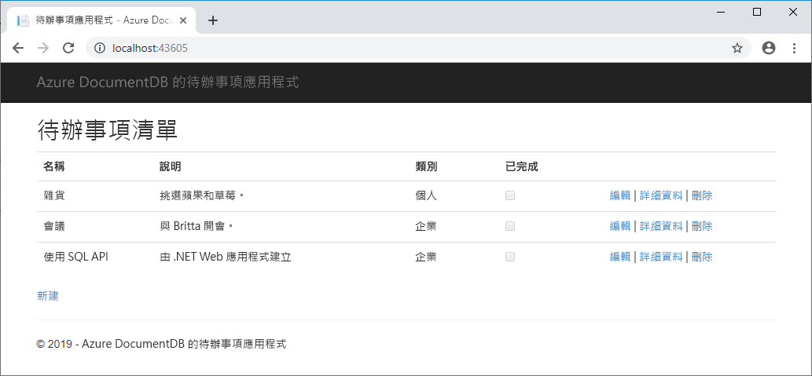

# <a name="quickstart-build-a-net-web-app-with-azure-cosmos-db-using-the-sql-api-and-the-azure-portal"></a>教學課程：使用 SQL API 和 Azure 入口網站建置採用 Azure Cosmos DB 的 .NET 應用程式

> [!div class="op_single_selector"]
> * [.NET](create-sql-api-dotnet.md)
> * [Java](create-sql-api-java.md)
> * [Node.js](create-sql-api-nodejs.md)
> * [Python](create-sql-api-python.md)
> * [Xamarin](create-sql-api-xamarin-dotnet.md)
>  
> 

Azure Cosmos DB 是 Microsoft 的全域分散式多模型資料庫服務。 您可以快速建立及查詢文件、索引鍵/值及圖形資料庫，所有這些都受惠於位於 Azure Cosmos DB 核心的全域散發和水平調整功能。 

本快速入門會示範如何使用 Azure 入口網站建立 Azure Cosmos DB [SQL API](sql-api-introduction.md) 帳戶、文件資料庫和集合。 接著，您會建置和部署以 [SQL .NET API](sql-api-sdk-dotnet.md) 為基礎的待辦事項清單 Web 應用程式，如下列螢幕擷取畫面所示。 



## <a name="prerequisites"></a>必要條件

如果尚未安裝 Visual Studio 2017，您可以下載並使用**免費的** [Visual Studio 2017 Community 版本](https://www.visualstudio.com/downloads/)。 務必在 Visual Studio 設定期間啟用 **Azure 開發**。

[!INCLUDE [quickstarts-free-trial-note](../../includes/quickstarts-free-trial-note.md)] 
[!INCLUDE [cosmos-db-emulator-docdb-api](../../includes/cosmos-db-emulator-docdb-api.md)]  

<a id="create-account"></a>
## <a name="create-a-database-account"></a>建立資料庫帳戶

[!INCLUDE [cosmos-db-create-dbaccount](../../includes/cosmos-db-create-dbaccount.md)]

<a id="create-collection"></a>
## <a name="add-a-collection"></a>新增集合

[!INCLUDE [cosmos-db-create-collection](../../includes/cosmos-db-create-collection.md)]

<a id="add-sample-data"></a>
## <a name="add-sample-data"></a>新增範例資料

[!INCLUDE [cosmos-db-create-sql-api-add-sample-data](../../includes/cosmos-db-create-sql-api-add-sample-data.md)]

## <a name="query-your-data"></a>查詢資料

[!INCLUDE [cosmos-db-create-sql-api-query-data](../../includes/cosmos-db-create-sql-api-query-data.md)]

## <a name="clone-the-sample-application"></a>複製範例應用程式

現在讓我們切換為使用程式碼。 我們將[從 GitHub 複製 SQL API 應用程式](https://github.com/Azure-Samples/documentdb-dotnet-todo-app)、設定連接字串，然後加以執行。 您會看到，以程式設計方式來處理資料有多麼的容易。 

1. 開啟命令提示字元，建立名為 git-samples 的新資料夾，然後關閉命令提示字元。

    ```bash
    md "C:\git-samples"
    ```

2. 開啟 git 終端機視窗 (例如 git bash)，並使用 `cd` 命令變更至要安裝範例應用程式的新資料夾。

    ```bash
    cd "C:\git-samples"
    ```

3. 執行下列命令來複製範例存放庫。 此命令會在您的電腦上建立範例應用程式副本。

    ```bash
    git clone https://github.com/Azure-Samples/documentdb-dotnet-todo-app.git
    ```

4. 然後在 Visual Studio 中開啟待辦事項方案檔案。 

## <a name="review-the-code"></a>檢閱程式碼

此為選用步驟。 若您想要瞭解如何在程式碼中建立資料庫資源，則可檢閱下列程式碼片段。 或者也可以直接跳至[更新您的連接字串](#update-your-connection-string)。 

下列程式碼片段全部取自 DocumentDBRepository.cs 檔案。

* 在第 76 行初始化 DocumentClient。

    ```csharp
    client = new DocumentClient(new Uri(ConfigurationManager.AppSettings["endpoint"]), ConfigurationManager.AppSettings["authKey"]);
    ```

* 在第 91 行建立新資料庫。

    ```csharp
    await client.CreateDatabaseAsync(new Database { Id = DatabaseId });
    ```

* 在第 110 行建立新集合。

    ```csharp
    await client.CreateDocumentCollectionAsync(
        UriFactory.CreateDatabaseUri(DatabaseId),
        new DocumentCollection
            {
               Id = CollectionId
            },
        new RequestOptions { OfferThroughput = 400 });
    ```

## <a name="update-your-connection-string"></a>更新您的連接字串

現在，返回 Azure 入口網站以取得連接字串資訊，並將它複製到應用程式中。

1. 在 [Azure 入口網站](http://portal.azure.com/)中，於您 Azure Cosmos DB 帳戶的左側瀏覽區中，按一下 [金鑰]，然後按一下 [讀寫金鑰]。 在下一個步驟中，您將使用畫面右側的複製按鈕，將 URI 和主要金鑰複製到 web.config 檔案。

    ![在 Azure 入口網站的 [金鑰] 刀鋒視窗中檢視並複製存取金鑰](./media/create-sql-api-dotnet/keys.png)

2. 在 Visual Studio 2017 中，開啟 web.config 檔案。 

3. 從入口網站複製您的 URI 值 (使用 [複製] 按鈕)，並使它成為 web.config 中的端點金鑰值。 

    `<add key="endpoint" value="FILLME" />`

4. 然後，從入口網站複製您的主要金鑰值，並使它成為 web.config 中的 authKey 值。 

    `<add key="authKey" value="FILLME" />`
    
5. 然後更新資料庫值，以符合您稍早建立的資料庫名稱。 您現已更新應用程式，使其具有與 Azure Cosmos DB 通訊所需的所有資訊。 

    `<add key="database" value="Tasks" />`    
    
## <a name="run-the-web-app"></a>執行 Web 應用程式
1. 在 Visual Studio 中，於 [方案總管] 中的專案上按一下滑鼠右鍵，然後按一下 [管理 NuGet 套件]。 

2. 在 NuGet [瀏覽] 方塊中，輸入 *DocumentDB*。

3. 從結果中，安裝 **Microsoft.Azure.DocumentDB** 程式庫。 這會安裝 Microsoft.Azure.DocumentDB 套件以及所有相依性。

4. 按 CTRL + F5 來執行應用程式。 您的應用程式會顯示在瀏覽器中。 

5. 按一下瀏覽器中的 [新建]，然後在您的待辦事項應用程式中建立一些新工作。

   

您現在可以返回 [資料總管]，以查看、查詢、修改及使用這項新資料。 

## <a name="review-slas-in-the-azure-portal"></a>在 Azure 入口網站中檢閱 SLA

[!INCLUDE [cosmosdb-tutorial-review-slas](../../includes/cosmos-db-tutorial-review-slas.md)]

## <a name="clean-up-resources"></a>清除資源

[!INCLUDE [cosmosdb-delete-resource-group](../../includes/cosmos-db-delete-resource-group.md)]

## <a name="next-steps"></a>後續步驟

在本快速入門中，您已了解如何建立 Azure Cosmos DB 帳戶、如何使用 [資料總管] 建立集合，以及如何執行 Web 應用程式。 您現在可以將其他資料匯入到 Cosmos DB 帳戶。 

> [!div class="nextstepaction"]
> [將資料匯入到 Azure Cosmos DB](import-data.md)


