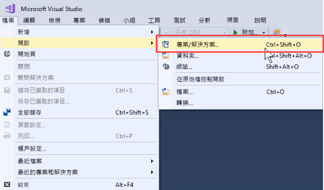
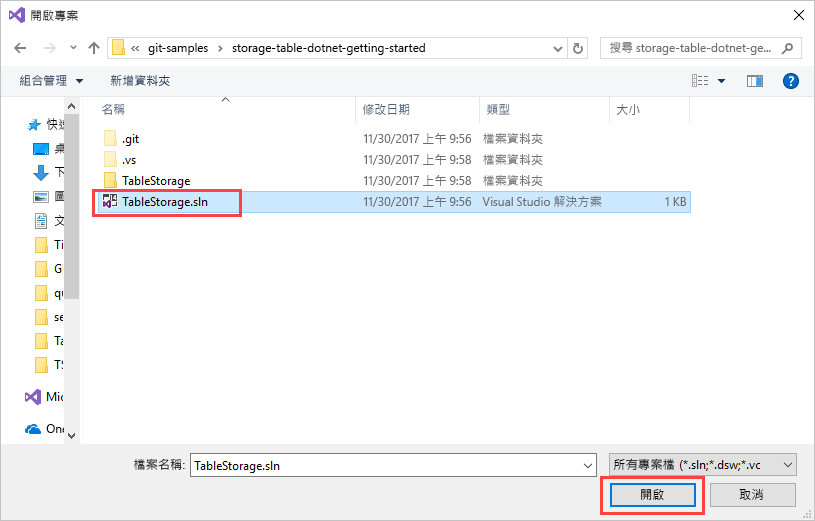
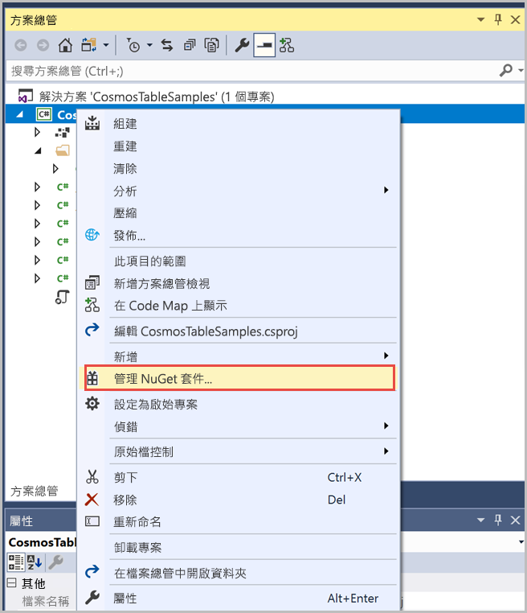
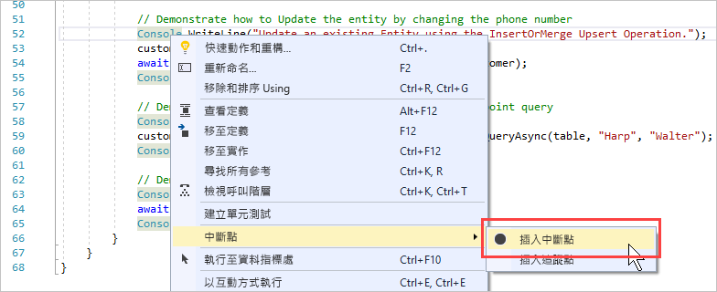
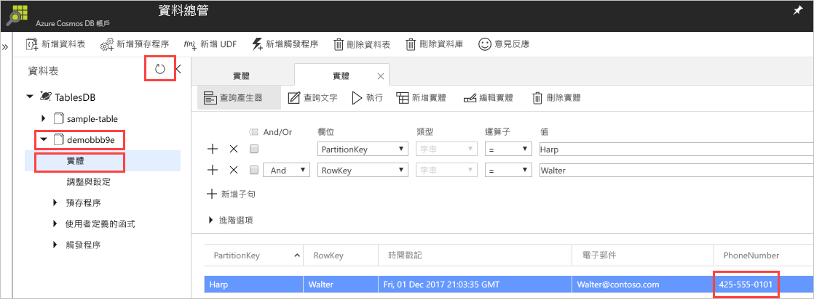

# <a name="quickstart-build-a-table-api-app-with-net-and-azure-cosmos-db"></a>快速入門：使用 .NET 與 Azure Cosmos DB 建置資料表 API 應用程式 

> [!div class="op_single_selector"]
> * [.NET](create-table-dotnet.md)
> * [Java](create-table-java.md)
> * [Node.js](create-table-nodejs.md)
> * [Python](create-table-python.md)
>  

本快速入門示範如何使用 .NET 與 Azure Cosmos DB [資料表 API](table-introduction.md)，透過從 GitHub 複製範例來建置應用程式。 本快速入門也會示範如何建立 Azure Cosmos DB 帳戶，以及如何使用資料總管在以 Web 為基礎的 Azure 入口網站中建立資料表和實體。

Azure Cosmos DB 是 Microsoft 的全域分散式多模型資料庫服務。 您可以快速建立及查詢文件、索引鍵/值及圖形資料庫，所有這些都受惠於位於 Azure Cosmos DB 核心的全域散發和水平調整功能。 

## <a name="prerequisites"></a>必要條件

如果尚未安裝 Visual Studio 2017，您可以下載並使用**免費的** [Visual Studio 2017 Community 版本](https://www.visualstudio.com/downloads/)。 務必在 Visual Studio 設定期間啟用 **Azure 開發**。

[!INCLUDE [quickstarts-free-trial-note](../../includes/quickstarts-free-trial-note.md)]

## <a name="create-a-database-account"></a>建立資料庫帳戶

> [!IMPORTANT] 
> 您必須建立新的資料表 API 帳戶，才能與正式推出的資料表 API SDK 搭配使用。 正式推出的 SDK 不支援在預覽期間建立的資料表 API 帳戶。
>

[!INCLUDE [cosmos-db-create-dbaccount-table](../../includes/cosmos-db-create-dbaccount-table.md)]

## <a name="add-a-table"></a>新增資料表

[!INCLUDE [cosmos-db-create-table](../../includes/cosmos-db-create-table.md)]

## <a name="add-sample-data"></a>新增範例資料

[!INCLUDE [cosmos-db-create-table-add-sample-data](../../includes/cosmos-db-create-table-add-sample-data.md)]

## <a name="clone-the-sample-application"></a>複製範例應用程式

現在，我們將從 GitHub 複製「資料表」應用程式、設定連接字串，然後加以執行。 您會看到，以程式設計方式來處理資料有多麼的容易。 

1. 開啟命令提示字元，建立名為 git-samples 的新資料夾，然後關閉命令提示字元。

    ```bash
    md "C:\git-samples"
    ```

2. 開啟 git 終端機視窗 (例如 git bash)，並使用 `cd` 命令變更至要安裝範例應用程式的新資料夾。

    ```bash
    cd "C:\git-samples"
    ```

3. 執行下列命令來複製範例存放庫。 此命令會在您的電腦上建立範例應用程式副本。

    ```bash
    git clone https://github.com/Azure-Samples/storage-table-dotnet-getting-started.git
    ```
## <a name="open-the-sample-application-in-visual-studio"></a>在 Visual Studio 中開啟範例應用程式

1. 在 Visual Studio 中，從 [檔案] 功能表上，選擇 [開啟]，然後選擇 [專案/解決方案]。 

    

2. 瀏覽至您複製範例應用程式的資料夾，然後開啟 TableStorage.sln 檔案。

    

## <a name="update-your-connection-string"></a>更新您的連接字串

現在，返回 Azure 入口網站以取得連接字串資訊，並將它複製到應用程式中。 這可讓您的應用程式與託管資料庫進行通訊。 

1. 在 [Azure 入口網站](http://portal.azure.com/)中，按一下 [連接字串]。 

    使用視窗右方的複製按鈕來複製**主要連接字串**。

    ![在 [連接字串] 窗格中檢視及複製主要連接字串](./media/create-table-dotnet/connection-string.png)

2. 在 Visual Studio 中，開啟 App.config 檔案。 

3. 本教學課程不會使用 Azure SDK 儲存體模擬器，因此請取消註解第 8 行的 StorageConnectionString，並將第 7 行的 StorageConnectionString 註解化。 第 7 行和第 8 行現在看起來應該像這樣：

    ```
    <!--key="StorageConnectionString" value="UseDevelopmentStorage=true;" />-->
    <add key="StorageConnectionString" value="DefaultEndpointsProtocol=https;AccountName=[AccountName];AccountKey=[AccountKey]" />
    ```

4. 將來自入口網站的**主要連接字串**貼到第 8 行上的 StorageConnectionString 值中。 在引號內貼上字串。 

    > [!IMPORTANT]
    > 如果端點使用 documents.azure.com，這表示您擁有預覽帳戶，因此您必須建立一個[新的資料表 API 帳戶](#create-a-database-account)，才能與正式推出的資料表 API SDK 搭配使用。 
    > 

    第 8 行現在看起來應該類似：

    ```
    <add key="StorageConnectionString" value="DefaultEndpointsProtocol=https;AccountName=<account name>;AccountKey=<account-key>;TableEndpoint=https://<account name>.table.cosmosdb.azure.com;" />
    ```

5. 按 CTRL+S 可儲存 App.config 檔案。

您現已更新應用程式，使其具有與 Azure Cosmos DB 通訊所需的所有資訊。 

## <a name="build-and-deploy-the-app"></a>建置並部署應用程式

1. 在 Visual Studio 中，於 [方案總管] 中的 **TableStorage** 專案上按一下滑鼠右鍵，然後按一下 [管理 NuGet 套件]。 

   
2. 在 NuGet [瀏覽] 方塊中，輸入「Microsoft.Azure.CosmosDB.Table」。 這會尋找 Cosmos DB 資料表 API 用戶端程式庫。 請注意，此文件庫目前僅適用於 .NET Standard，尚不適用於 .NET Core。
   
   ![[NuGet 瀏覽] 索引標籤](media/create-table-dotnet/azure-cosmosdb-nuget-browse.png)

3. 按一下 [安裝] 可安裝 **Microsoft.Azure.CosmosDB.Table** 程式庫。 這會安裝 Azure Cosmos DB 資料表 API 套件以及所有相依性。

    ![按一下 [安裝]](media/create-table-dotnet/azure-cosmosdb-nuget-install.png)

4. 開啟 BasicSamples.cs。 以滑鼠右鍵按一下第 52 行，選取 [中斷點]，然後選取 [插入中斷點]。 在第 55 行上插入另一個中斷點。

    

5. 按 F5 執行應用程式。

    主控台視窗會顯示 Azure Cosmos DB 中新資料表資料庫的名稱 (在此情況下為 demo91ab4)。 
    
    

    如果發生和相依性有關的錯誤，請參閱[疑難排解](table-sdk-dotnet.md#troubleshooting)。

    到達第一個中斷點時，請回到 Azure 入口網站中的 [資料總管]。 按一下 [重新整理] 按鈕、展開示範 * 資料表，然後按一下 [實體]。 右側的 [實體] 索引標籤會顯示針對 Walter Harp 新增的新實體。 請注意，新實體的電話號碼為 425-555-0101。

    
    
6. 關閉 [資料總管] 中的 [實體] 索引標籤。
    
7. 按 F5 執行應用程式到下一個中斷點。 

    到達中斷點時，請切換回 Azure 入口網站，再按一下 [實體] 可開啟 [實體] 索引標籤，並請注意，電話號碼已經更新為 425-555-0105。

8. 按 F5 以執行應用程式。 
 
   應用程式會新增實體，以在資料表 API 目前不支援的進階範例應用程式中使用。 然後，應用程式會刪除範例應用程式所建立的資料表。

9. 在主控台視窗中，按下 Enter 可結束執行應用程式。 
  

## <a name="review-slas-in-the-azure-portal"></a>在 Azure 入口網站中檢閱 SLA

[!INCLUDE [cosmosdb-tutorial-review-slas](../../includes/cosmos-db-tutorial-review-slas.md)]

## <a name="clean-up-resources"></a>清除資源

[!INCLUDE [cosmosdb-delete-resource-group](../../includes/cosmos-db-delete-resource-group.md)]

## <a name="next-steps"></a>後續步驟

在本快速入門中，您已了解如何建立 Azure Cosmos DB 帳戶、如何使用資料總管來建立資料表，以及如何執行應用程式。  現在，您可以使用資料表 API 來查詢您的資料。  

> [!div class="nextstepaction"]
> [將資料表資料匯入至資料表 API](table-import.md)

