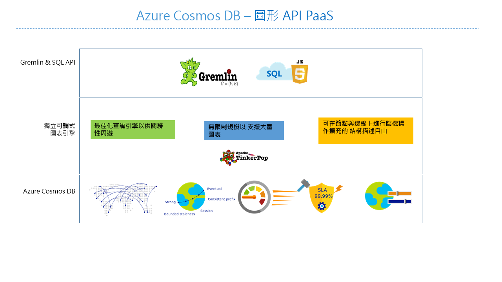

# Azure Cosmos DB：Gremlin API 簡介

[Azure Cosmos DB](introduction.md) 是 Microsoft 推出的全域散發多模型資料庫服務，適用於任務關鍵性應用程式。 它是多重模型資料庫，可支援文件、索引鍵/值、圖表和單欄式資料模型。 Azure Cosmos DB Gremlin API 可用來儲存及操作圖表資料。 Gremlin API 支援將圖表資料模型化，並提供 API 來周遊圖表資料。

本文提供 Azure Cosmos DB Gremlin API 的概觀，並說明如何使用它來儲存包含數十億個頂點和邊緣的巨大圖表。 您可以在幾毫秒延遲的情況下查詢圖形，並輕鬆地發展圖形結構和結構描述。 若要查詢 Azure Cosmos DB，您可以使用 [Apache TinkerPop](http://tinkerpop.apache.org) 圖形周遊語言，或 [Gremlin](http://tinkerpop.apache.org/docs/current/reference/#graph-traversal-steps)。

## 什麼是圖表資料庫
實務上的資料會自然連線。 傳統的資料模型化著重於實體。 但對於許多應用程式來說，建立模型，或以自然方式建立實體和關聯性之模型的需求必不可少。

[圖形](http://mathworld.wolfram.com/Graph.html)是由[頂點](http://mathworld.wolfram.com/GraphVertex.html)和[邊緣](http://mathworld.wolfram.com/GraphEdge.html)組成的結構。 頂點和邊緣的屬性數量不限。 

* **頂點** - 頂點代表特定的物件，例如人員、地點或事件。 

* **邊緣** - 邊緣代表頂點之間的關聯性。 比方說，某個人可能會知道其他人、參與某個事件，以及在最近前往某個位置。 

* **屬性** - 屬性表達頂點和邊緣的相關資訊。 屬性範例包括具有名稱和年齡的頂點。 邊緣，具有時間戳記和/或加權。 更正式的說，這種模型稱為[屬性圖表](http://tinkerpop.apache.org/docs/current/reference/#intro)。 Azure Cosmos DB 支援屬性圖表模型。

例如，下圖中的範例圖表顯示人員、行動裝置、興趣和作業系統之間的關聯性：

圖表資料庫可讓您自然又有效率地模型化和儲存圖表，很適合在許多案例中使用。 圖表資料庫通常是 NoSQL 資料庫，因為這些使用案例通常也需要結構描述彈性及快速的反覆運算。

您可以結合圖表資料庫所提供的快速周遊和圖表演算法，例如深度優先搜尋、廣度優先搜尋、Dijkstra 的演算法等等，解決各種領域的問題，例如社交網路、內容管理、地理空間和推薦。

## Azure Cosmos DB 圖表資料庫的功能
 
Azure Cosmos DB 是一種完全受控的圖表資料庫，提供全域散發、彈性調整的儲存體和輸送量、自動編製索引和查詢、可調整的一致性等級，而且支援 TinkerPop 標準。

Azure Cosmos DB 提供以下有別於市場上其他圖表資料庫的功能：

* 可彈性調整的輸送量和儲存體

 實務上的圖表需要調整超過單一伺服器的產能。 Azure Cosmos DB 可讓您順暢地在多部伺服器之間調整圖表。 您也可以單獨根據存取模式來自行調整圖表的輸送量。 Azure Cosmos DB 支援的圖表資料庫可調整為幾乎不受限制的儲存體大小和佈建輸送量。

* 多重區域複寫

 Azure Cosmos DB 能以透明方式將圖表資料複寫到與帳戶相關聯的所有區域。 複寫可讓您開發需要全域資料存取權的應用程式。 您需要在一致性、可用性、效能等領域和對應擔保之間做出取捨。 Azure Cosmos DB 能透過多路連接 API 提供透明的區域性容錯移轉。 您可以全球性地彈性調整輸送量和儲存體。

* 以熟悉的 Gremlin 語法快速查詢和周遊

 儲存異質頂點和邊緣，並透過熟悉的 Gremlin 語法查詢這些文件。 Azure Cosmos DB 採用高度並行、無鎖定、記錄結構化索引技術，自動編製所有內容的索引。 此功能讓您不需要指定結構描述提示、次要索引或檢視，就能進行大量且即時的查詢和周遊。 深入了解[使用 Gremlin 查詢圖形](gremlin-support.md)。

* 完全受控

 Azure Cosmos DB 能消除資料庫和電腦資源的管理需求。 做為完全受控的 Microsoft Azure 服務，您不需要管理虛擬機器、部署和設定軟體、管理調整，或處理複雜的資料層升級。 每個圖表都會自動備份，以防區域性失敗。 您可以輕鬆地新增 Azure Cosmos DB 帳戶，並在需要時佈建容量，將精力投注在應用程式，不用浪費時間來操作和管理資料庫。

* 自動編製索引

 根據預設，Azure Cosmos DB 會自動為圖表中節點和邊緣內的屬性編製索引，而不要求或需要任何結構描述或建立次要索引。

* Apache TinkerPop 相容性

 Azure Cosmos DB 原生支援開放原始碼 Apache TinkerPop 標準，並可與其他支援 TinkerPop 的圖表系統整合。 因此，您可以輕鬆地從另一個圖表資料庫移轉，例如 Titan 或 Neo4j；或搭配圖表分析架構一起使用 Azure Cosmos DB，例如 Apache Spark GraphX。

* 可調式一致性層級

 提供五個定義完善的一致性層級可選擇，讓您能在一致性與效能之間做出最好的取捨。 針對查詢和讀取作業，Azure Cosmos DB 提供五個不同的一致性等級：強式、限定過期、工作階段、一致的前置和最終。 這些細微且定義完善的一致性等級，可讓您在一致性、可用性與延遲三者間做出合理取捨。 深入了解 [Azure Cosmos DB 中的 Tunable 資料一致性層級](consistency-levels.md)。

Azure Cosmos DB 也能在相同的容器/資料庫內使用多個模型，例如文件和圖表。 您可以使用文件容器來同時儲存圖表資料與文件。 您可以使用 JSON 的 SQL 查詢和 Gremlin 查詢，查詢與圖表相同的資料。

## 開始使用

您可以透過 Azure 命令列介面 (CLI)、Azure PowerShell 或 Azure 入口網站來建立和存取 Azure Cosmos DB Gremlin API 帳戶。 建立帳戶後，您可以使用 Gremlin API 服務端點 `https://<youraccount>.gremlin.cosmosdb.azure.com` (會提供 Gremlin 的 WebSocket 前端)，來存取該帳戶內的圖形資料庫。 您可以設定 TinkerPop 相容性工具 (例如 [Gremlin 主控台](http://tinkerpop.apache.org/docs/current/reference/#gremlin-console)) 連線至此端點，然後在 Java、Node.js 或任何 Gremlin 用戶端驅動程式中建置應用程式。

下表顯示您可以運用在 Azure Cosmos DB 上的常用 Gremlin 驅動程式︰

| 下載 | 文件 | 開始使用 | 支援的連接器版本 |
| --- | --- | --- | --- |
| [.NET](http://tinkerpop.apache.org/docs/3.3.1/reference/#gremlin-DotNet) | [GitHub 上的 Gremlin.NET](https://github.com/apache/tinkerpop/tree/master/gremlin-dotnet) | [使用 .NET 建立圖表](create-graph-dotnet.md) | 3.4.0-RC2 |
| [Java](https://mvnrepository.com/artifact/com.tinkerpop.gremlin/gremlin-java) | [Gremlin JavaDoc](http://tinkerpop.apache.org/javadocs/current/full/) | [使用 JAVA 建立圖表](create-graph-java.md) | 3.2.0+ |
| [Node.js](https://www.npmjs.com/package/gremlin) | [GitHub 上的 Gremlin-JavaScript](https://github.com/jbmusso/gremlin-javascript) | [使用 Node.js 建立圖表](create-graph-nodejs.md) | 2.6.0|
| [Python](http://tinkerpop.apache.org/docs/3.3.1/reference/#gremlin-python) | [GitHub 上的 Gremlin-Python](https://github.com/apache/tinkerpop/tree/master/gremlin-python) | [使用 Python 建立圖表](create-graph-python.md) | 3.2.7 |
| [PHP](https://packagist.org/packages/brightzone/gremlin-php) | [GitHub 上的 Gremlin-PHP](https://github.com/PommeVerte/gremlin-php) | [使用 PHP 建立圖表](create-graph-php.md) | 3.1.0 |
| [Gremlin 主控台](https://tinkerpop.apache.org/downloads.html) | [TinkerPop 文件](http://tinkerpop.apache.org/docs/current/reference/#gremlin-console) |  [使用 Gremlin 主控台建立圖表](create-graph-gremlin-console.md) | 3.2.0 + |

## 圖表資料庫設計考量

在圖形設計期間，若決定建立頂點本身的實體模型，而不是其他頂點實體的屬性，將帶來效能和成本的影響。 這項決策的主要動因將取決於查詢資料的方式，以及模型本身的延展性。

在規劃如何建立實體模型之前，請考慮下列問題：

* 需要針對大多數查詢擷取為頂點的實體有哪些？

* 在為了篩選資料而新增的圖表中，包含了哪些資訊？

* 哪些實體只會連線到其他實體，從而要擷取其值？

* 查詢需要擷取哪幾段資訊，以及這幾段資訊所會產生的 RU 費用為何？

例如，假設圖表設計如下：

* 根據查詢，[區域] -> [商店] 關聯性可以僅用於篩選商店頂點。 例如，如果查詢的格式為「取得所有屬於特定區域的商店」。 如果情況是這樣，就值得考慮將其自己頂點的區域實體，摺疊至商店頂點的屬性。 

* 這種方法的好處是，能夠將每個商店頂點的擷取成本，從一次取得三個圖表物件 (區域、「區域 -> 商店」、商店)，減少為單一商店頂點。 這可以提升效能，以及降低每個查詢的成本。

* 因為商店頂點會連結至兩個不同的實體 - 員工和產品。 它會讓商店成為必要頂點，因為它可以提供額外的周遊可能性。  

## 可以使用 Gremlin API 的案例
以下是某些可以使用 Azure Cosmos DB 圖表支援的案例︰

* 社交網路

 藉由結合客戶相關資料和他們與其他人的互動，您可以開發個人化體驗、預測客戶行為，或將興趣雷同的人們聯繫在一起。 Azure Cosmos DB 可用來管理社交網路並追蹤客戶的喜好設定和資料。

* 推薦引擎

 這是零售業常用的案例。 藉由結合產品、使用者和使用者互動的相關資訊，例如購物、瀏覽或商品評價，您可以建立自訂的推薦。 Azure Cosmos DB 憑藉其低延遲、彈性調整及原生的圖表支援，很適合將這些互動建立模型。

* 地理空間

 電信、物流和旅遊規劃方面的許多應用程式需要在區域內尋找有興趣的地點，或在兩個地點之間找出最短/最佳路線。 Azure Cosmos DB 很自然地可以解決這些問題。

* 物聯網

 以圖形模擬 IoT 裝置之間的網路和連線，可讓您更了解裝置和資產的狀態。 您也可以了解網路的某個部分變動時可能對其他部分造成什麼影響。

## 後續步驟
若要深入了解 Azure Cosmos DB 中的圖表支援，請參閱︰

* 開始使用 [Azure Cosmos DB 圖表教學課程](create-graph-dotnet.md)。
* 了解如何[使用 Gremlin 在 Azure Cosmos DB 中查詢圖表](gremlin-support.md)。
