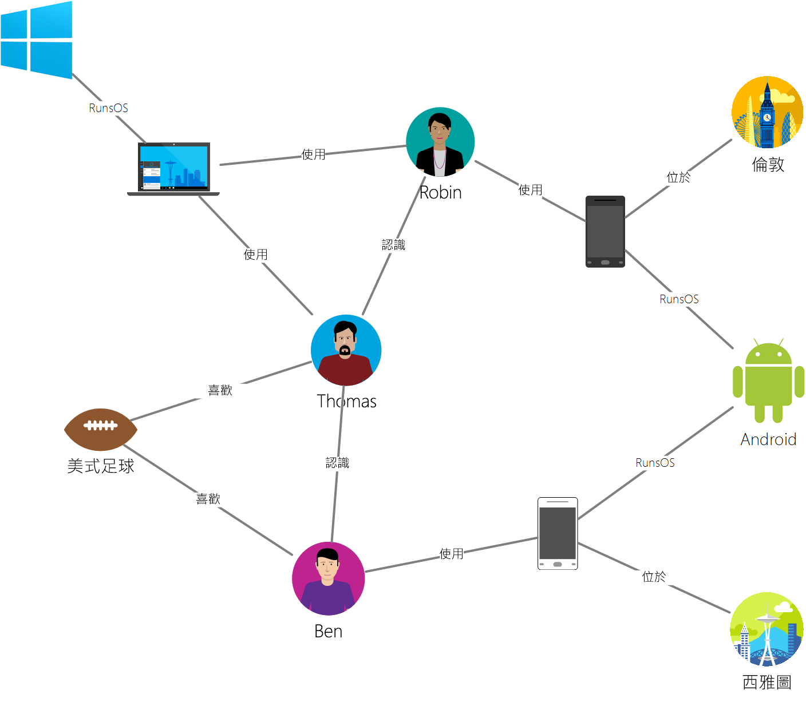

# <a name="introduction-to-azure-cosmos-db-gremlin-api"></a>Azure Cosmos DB 簡介：Gremlin API

[Azure Cosmos DB](introduction.md)  是 Microsoft 推出的全域散發多模型資料庫服務，適用於任務關鍵性應用程式。 它是多重模型資料庫，可支援文件、索引鍵/值、圖表和單欄式資料模型。 Azure Cosmos DB Gremlin API 用來在任何規模的完全受控資料庫環境上儲存及操作圖形資料。  


本文提供 Azure Cosmos DB Gremlin API 的概觀，並說明如何使用它來儲存包含數十億個頂點和邊緣的巨大圖表。 您可以在幾毫秒延遲的情況下查詢圖形，並輕鬆地發展圖形結構。 Azure Cosmos DB 的 Gremlin API 會遵循 [Apache TinkerPop](https://tinkerpop.apache.org)  圖形資料庫標準，並使用 Gremlin 查詢語言。 

Azure Cosmos DB 的 Gremlin API 結合了圖形資料庫演算法的強大功能，其具有調整性高的受控基礎結構，可針對因缺乏彈性和關聯式方法而產生的常見資料問題，提供唯一且有彈性的解決方案。 

## <a name="features-of-azure-cosmos-db-graph-database"></a>Azure Cosmos DB 圖表資料庫的功能
 
Azure Cosmos DB 是一種完全受控的圖表資料庫，提供全域散發、彈性調整的儲存體和輸送量、自動編製索引和查詢、可調整的一致性等級，而且支援 TinkerPop 標準。 

以下是 Azure Cosmos DB Gremlin API 所提供的差異化功能：

* **可彈性調整的輸送量和儲存體**

  實務上的圖表需要調整超過單一伺服器的產能。 Azure Cosmos DB 支援水平調整圖形資料庫，在已佈建的輸送量方面幾乎沒有大小限制。 當圖形資料庫的規模擴增時，資料就會自動透過[圖形分割](https://docs.microsoft.com/azure/cosmos-db/graph-partitioning)來散發。

* **多重區域複寫**

  Azure Cosmos DB 可以自動將圖形資料複寫至任何 Azure 區域。 複寫可簡化需要全域資料存取權的應用程式開發。 除了將讀取延遲降至最低以外，Azure Cosmos DB 還提供了區域性容錯移轉機制，如果應用程式罕見地在區域中發生服務中斷時，這可確保應用程式的持續性。 

* **使用最廣為採用的圖形查詢標準進行快速查詢和周遊**

  儲存異質頂點和邊緣，並透過熟悉的 Gremlin 語法查詢這些文件。 Gremlin 是命令式的功能性查詢語言，其提供豐富的介面來實作常用圖形演算法。 
  
  這樣一來，不需要指定結構描述提示、次要索引或檢視，Azure Cosmos DB 就能進行大量且即時的查詢和周遊。 深入了解[使用 Gremlin 查詢圖形](gremlin-support.md)。

* **完全受控的圖形資料庫**

  Azure Cosmos DB 能消除資料庫和電腦資源的管理需求。 大部分的現有圖形資料庫平台都受制於其基礎結構限制，而且往往需要較高程度的維護，以確保其作業正常運作。 
  
  作為完全受控的 Microsoft Azure 服務，您不需要管理虛擬機器、更新執行階段軟體、管理分區化或複寫，或處理複雜的資料層升級。 每個圖表都會自動備份，以防區域性失敗。 這些保證可讓開發人員專注在開發應用程式值，而不是操作和管理資料庫。 

* **自動編製索引**

  根據預設，Azure Cosmos DB 會自動為圖表中節點和邊緣內的屬性編製索引，而不要求或需要任何結構描述或建立次要索引。 深入了解 [Azure Cosmos DB 的索引編製](https://docs.microsoft.com/azure/cosmos-db/index-overview)。 

* **Apache TinkerPop 相容性**

  Azure Cosmos DB 支援[開放原始碼的 Apache TinkerPop 標準](http://tinkerpop.apache.org/)。 Tinkerpop 標準有豐富的應用程式和程式庫生態系統，可以與 Azure Cosmos DB 的 Gremlin API 輕鬆整合。 

* **可調式一致性層級**

  提供五個定義完善的一致性層級可選擇，讓您能在一致性與效能之間做出最好的取捨。 針對查詢和讀取作業，Azure Cosmos DB 提供五個不同的一致性等級：強式、限定過期、工作階段、一致的前置和最終。 這些細微且定義完善的一致性等級，可讓您在一致性、可用性與延遲三者間做出合理取捨。 深入了解 [Azure Cosmos DB 中的 Tunable 資料一致性層級](consistency-levels.md)。

## <a name="scenarios-that-can-use-gremlin-api"></a>可以使用 Gremlin API 的案例
以下是某些可以使用 Azure Cosmos DB 圖表支援的案例︰

* 社交網路

  藉由結合客戶相關資料和他們與其他人的互動，您可以開發個人化體驗、預測客戶行為，或將興趣雷同的人們聯繫在一起。 Azure Cosmos DB 可用來管理社交網路並追蹤客戶的喜好設定和資料。

* 推薦引擎

  這是零售業常用的案例。 藉由結合產品、使用者和使用者互動的相關資訊，例如購物、瀏覽或商品評價，您可以建立自訂的推薦。 Azure Cosmos DB 憑藉其低延遲、彈性調整及原生的圖表支援，很適合將這些互動建立模型。

* 地理空間

  電信、物流和旅遊規劃方面的許多應用程式需要在區域內尋找有興趣的地點，或在兩個地點之間找出最短/最佳路線。 Azure Cosmos DB 很自然地可以解決這些問題。

* 物聯網

  以圖形模擬 IoT 裝置之間的網路和連線，可讓您更了解裝置和資產的狀態。 您也可以了解網路的某個部分變動時可能對其他部分造成什麼影響。

## <a name="introduction-to-graph-databases"></a>圖形資料庫的簡介
實務上的資料會自然連線。 傳統的資料模型化著重於個別定義實體，以及計算這些實體在執行階段上的關聯性。 雖然此模型有其優點，但要在其限制下管理高度連結的資料並不容易。  

圖形資料庫方法則是依賴儲存層中持續的關聯性，以達到高效率的圖形擷取作業。 Azure Cosmos DB 的 Gremlin API 支援[屬性圖形模型](https://tinkerpop.apache.org/docs/current/reference/#intro)。

### <a name="property-graph-objects"></a>屬性圖形物件

[圖形](http://mathworld.wolfram.com/Graph.html)屬性是由[頂點](http://mathworld.wolfram.com/GraphVertex.html)和[邊緣](http://mathworld.wolfram.com/GraphEdge.html)組成的結構。 這兩個物件能夠以任意數目的索引鍵值組作為屬性。 

* **頂點** - 頂點代表特定的實體，例如人員、地點或事件。

* **邊緣** - 邊緣代表頂點之間的關聯性。 比方說，某個人可能會知道其他人、參與某個事件，以及在最近前往某個位置。 

* **屬性** - 屬性表達頂點和邊緣的相關資訊。 頂點或邊緣中可以有任意數目的屬性，並且可用來說明及篩選查詢中的物件。 屬性範例包括具有名稱和年齡的頂點，或是具有時間戳記和/或加權的邊緣。 

圖形資料庫通常內含在 NoSQL 或非關聯式的資料庫類別中，因為沒有結構描述或受限資料模型的相依性。 缺乏結構描述可讓連接的結構自然又有效率地模型化和儲存。 

### <a name="gremlin-by-example"></a>Gremlin 範例
讓我們利用一個範例圖表了解如何以 Gremlin 表達查詢。 下圖顯示的商務應用程式以圖表形式管理使用者、興趣和裝置的相關資料。  

 

此圖表有下列頂點類型 (在 Gremlin 中稱為「標籤」)︰

- 人員：圖表中有三個人：Robin、Thomas 和 Ben
- 興趣：在此範例中他們的興趣是足球比賽
- 裝置：人員使用的裝置
- 作業系統：執行裝置的作業系統

我們透過下列邊緣類型/標籤，表達這些實體之間的關聯性︰

- 認識：例如，「Thomas 認識 Robin」
- 有興趣：在圖表中表示人員的興趣，例如「Ben 對足球有興趣」
- 執行 OS︰膝上型電腦執行 Windows OS
- 使用：代表某個人使用的裝置。 例如，Robin 使用序號 77 的 Motorola 手機

讓我們使用 [Gremlin 主控台](https://tinkerpop.apache.org/docs/3.3.2/reference/#gremlin-console) (英文) 對此圖表執行一些作業。 也可以在您選擇的平台 (Java、Node.js、Python 或 .NET) 使用 Gremlin 驅動程式執行這些作業。  在了解 Azure Cosmos DB 中支援什麼功能之前，讓我們先看看幾個範例，以熟悉語法。

首先，讓我們看看 CRUD。 下列 Gremlin 陳述式會將 "Thomas" 頂點插入圖表中︰

```java
:> g.addV('person').property('id', 'thomas.1').property('firstName', 'Thomas').property('lastName', 'Andersen').property('age', 44)
```

接著，下列 Gremlin 陳述式會在 Thomas 和 Robin 之間插入 "knows" 邊緣。

```java
:> g.V('thomas.1').addE('knows').to(g.V('robin.1'))
```

下列查詢會依名字的遞減順序傳回 "person" 頂點：
```java
:> g.V().hasLabel('person').order().by('firstName', decr)
```

圖表的威力在於當您需要回答「Thomas 的朋友使用什麼作業系統？」這種問題時。 您可以執行這個 Gremlin 周遊，從圖表中取得這項資訊︰

```java
:> g.V('thomas.1').out('knows').out('uses').out('runsos').group().by('name').by(count())
```
現在，讓我們看看 Azure Cosmos DB 為 Gremlin 開發人員提供什麼功能。

## <a name="next-steps"></a>後續步驟
若要深入了解 Azure Cosmos DB 中的圖表支援，請參閱︰

* 開始使用 [Azure Cosmos DB 圖表教學課程](create-graph-dotnet.md)。
* 了解如何[使用 Gremlin 在 Azure Cosmos DB 中查詢圖表](gremlin-support.md)。
