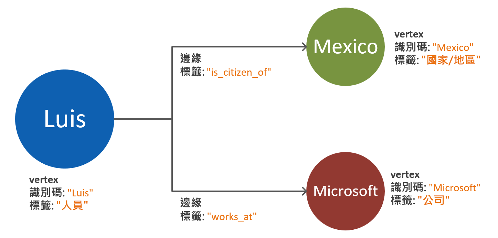
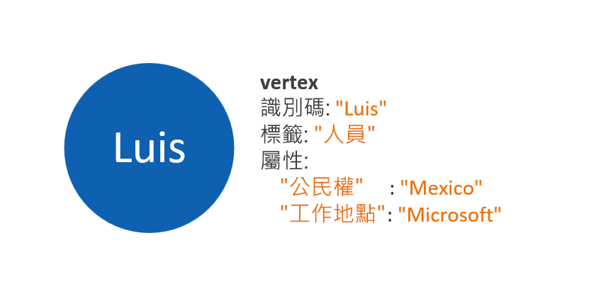
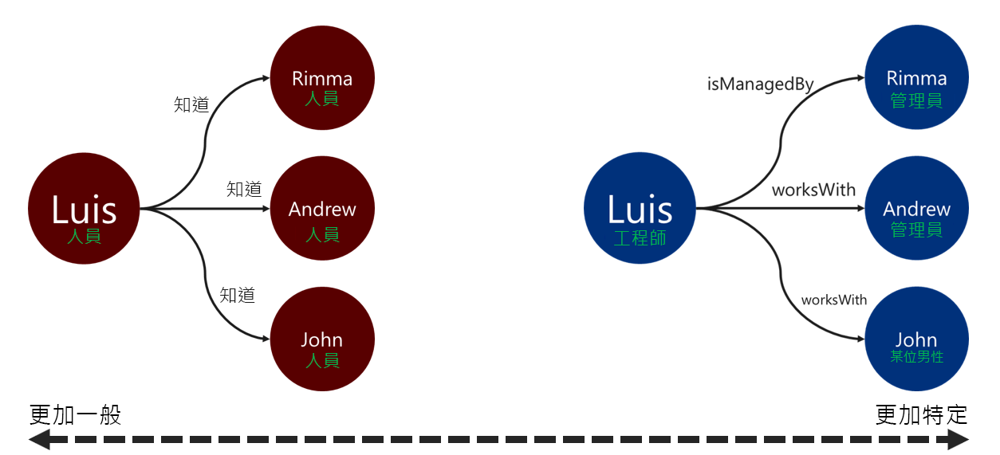

# Azure Cosmos DB Gremlin API 的圖表資料模型

以下文件旨在提供圖表資料模型建議。 這個步驟非常重要，因為它可以在資料不斷成長及演進時，確保圖形資料庫系統的效能與延展性。 對於大規模的圖形來說，有效率的資料模型特別重要。

## 需求

本指南中所述的程序是以下列假設為依據：
 * 已識別問題空間中的**實體**。 這些實體是要讓每個要求_以不可分割方式_方式使用。 換句話說，也就是資料庫系統的設計目的，並不是為了使用多個問題要求來擷取單一實體的資料。
 * 我們都已經了解資料庫系統有**讀取和寫入需求**。 這些需求會主導如何對圖形資料模型進行必要的最佳化作業。
 * 我們已經充分瞭解 [Apache Tinkerpop 屬性圖形標準](http://tinkerpop.apache.org/docs/current/reference/#graph-computing) \(英文)\ 的原則。

## 需要圖形資料庫時機為何？

如果資料網域中的實體和關聯性有下列任一特性，就非常適合採用圖形資料庫解決方案： 

* 實體是透過敘述性的關聯性**緊密連結的**。 此情況的事實和優點是關聯性會保存在儲存體中。
* 這具有**循環關聯性**或是**自我參考的實體**。 使用關聯式或文件資料庫時，此模式通常是一個挑戰。
* 實體之間具有**動態發展的關聯性**。 此模式特別適用於具有許多層級的階層式或樹狀結構資料。
* 實體之間有**多對多關聯性**。
* 其中有**對實體與關聯性雙方的寫入和讀取需求**。 

如果符合上述準則，圖形資料庫方法就很有可能可提供**查詢複雜度**、**資料模型延展性**和**查詢效能**等優點。

下一個步驟是決定圖形將要用於分析或交易用途。 如果圖形要用於大量計算和資料處理工作負載，就值得探索 [Cosmos DB Spark 連接器](https://docs.microsoft.com/azure/cosmos-db/spark-connector)及使用 [GraphX 程式庫](https://spark.apache.org/graphx/)。 

## 如何使用圖形物件

[Apache Tinkerpop 屬性圖形標準](http://tinkerpop.apache.org/docs/current/reference/#graph-computing) \(原文\) 定義了兩種類型的物件，也就是**頂點**和**邊緣**。 

以下是圖表物件中各屬性的最佳做法︰

| Object | 屬性 | 類型 | 注意 |
| --- | --- | --- |  --- |
| 頂點 | ID | 字串 | 每個分割區唯一強制執行。 如果沒有在插入時提供值，將會儲存自動產生的 GUID。 |
| 頂點 | 標籤 | 字串 | 這個屬性是用來定義頂點所代表的實體類型。 如果未提供值，將會使用預設值「頂點」。 |
| 頂點 | properties | 字串、布林值、數值 | 個別屬性的清單會以索引鍵/值組的方式儲存在每個頂點中。 |
| 頂點 | 分割區索引鍵 | 字串、布林值、數值 | 這個屬性會定義頂點和其傳出邊緣的儲存位置。 深入了解[資料分割](graph-partitioning.md)。 |
| Edge | ID | 字串 | 每個分割區唯一強制執行。 預設會自動產生。 邊緣通常不需要透過識別碼進行唯一擷取。 |
| Edge | 標籤 | 字串 | 這個屬性是用來定義兩個頂點之間的關聯性類型。 |
| Edge | properties | 字串、布林值、數值 | 個別屬性的清單會以索引鍵/值組的方式儲存在每個邊緣中。 |

> [!NOTE]
> 邊緣不需要資料分割區索引鍵值，因為系統會依據其來源頂點自動指派值。 請參閱[圖表分割](graph-partitioning.md)文章以進一步瞭解相關資訊。

## 實體和關聯性模型指導方針

以下是 Azure Cosmos DB Gremlin API 圖形資料庫資料模型建立方法適用的一組指導方針。 這些指導方針會假設已有現有的資料網域定義和對資料庫的查詢。

> [!NOTE]
> 下面所述的步驟會以建議的方式提供。 最終的模型應先經過評估與測試，才能考慮是否應將它用於生產環境。 此外，下列建議專屬於 Azure Cosmos DB 的 Gremlin API 實作。 

### 建立頂點和屬性模型 

圖形資料模型的第一個步驟是將每個已識別的實體對應至**頂點物件**。 頂點實體的一對一對應應為初始步驟，因此很可能會有所變更。

一個常見的陷阱是將單一實體的多個屬性作為個別的頂點來對應。 請考量下方的範例，範例中將同一個實體以兩種不同的方式表示：

* **以頂點為基礎的屬性**：在這個方法中，實體使用了三個個別的頂點和兩個邊緣來描述其屬性。 雖然這種方法可能會減少冗餘，但會增加模型複雜度。 模型複雜度增加可能會導致增加延遲增加、提升查詢複雜度，以及增加計算成本。 此模型也代表在進行資料分割時將面臨挑戰。

* **屬性內嵌頂點**：這個方法會利用索引鍵/值組清單來代表頂點內部實體的所有屬性。 此方法可降低模型的複雜度，但將會導致只能執行較簡單的查詢和更符合成本效益的周遊。

> [!NOTE]
> 上述範例顯示了簡化的圖形模型，以只顯示分割實體屬性的兩種方法之間的比較。

**屬性內嵌頂點**模式通常能提供更好的效能和可延展的方法。 新圖形資料模型的預設方法應該傾向採用此模式。

不過也有一些參考屬性時可能會提供更多優點的案例。 例如，如果參考的屬性會經常更新。 使用個別頂點來代表不斷變更的屬性會將寫入作業的量降到最低，但這卻是更新時所需要的。

### 以邊緣方向建立關聯性模型

建立頂點的模型之後，可以新增邊緣來表示它們之間的關聯性。 需要評估的第一個層面是**關聯性方向**。 

使用 `out()` 或 `outE()` 函式時，邊緣物件具有後面接著周遊的預設方向。 使用這個原生方向可產生有效率的作業，因為所有頂點在儲存時都會包含它們的傳出邊緣。 

但是使用 `in()` 函式向邊緣中相反的方向進行周遊一律會導致跨分割區查詢。 深入了解[圖表分割](graph-partitioning.md)。 如果需要使用 `in()` 函式不斷地進行周遊，建議您新增兩個方向的邊緣。

您可以使用 `.to()` 或 `.from()` 述詞決定邊緣方向以 `.addE()`Gremlin 步驟。 或使用[適用於 Gremlin API 的大量執行程式文件庫](bulk-executor-graph-dotnet.md)。

> [!NOTE]
> 邊緣物件都有預設的方向。

### 關聯性標籤

使用描述性的關聯性標籤可以提升邊緣解析作業的效率。 此模式可透過以下方式套用：
* 使用非泛型詞彙來標記關聯性。
* 利用關聯性名稱建立來源頂點的標籤與目標頂點的標籤之間的關聯。

請盡可能讓周遊以越特定的方式使用標籤來篩選邊緣。 這項決策也會對查詢成本產生重大的影響。 您隨時可以[使用 executionProfile 步驟](graph-execution-profile.md)評估查詢成本。

## 後續步驟： 
* 查看支援的 [Gremlin 步驟](gremlin-support.md)的清單。
* 深入了解[圖形資料庫資料分割](graph-partitioning.md)以處理大規模圖形。
* 使用[執行設定檔步驟](graph-execution-profile.md)來評估您的 Gremlin 查詢。
