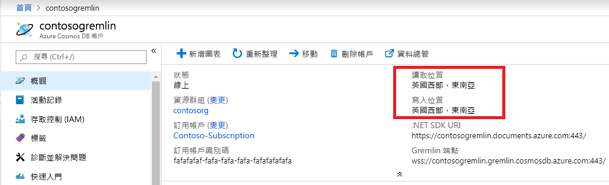

# <a name="regional-endpoints-for-azure-cosmos-db-graph-account"></a>Azure Cosmos DB 圖形帳戶的區域端點
Azure Cosmos DB 圖形資料庫是[全域散發的](distribute-data-globally.md)，因此應用程式可以使用多個讀取端點。 需要在多個位置具有寫入存取權的應用程式應該啟用[多重主機](how-to-multi-master.md)功能。

選擇多個區域的原因：
1. **水平讀取延展性** - 隨著應用程式負載增加，將讀取流量路由傳送至不同的 Azure 區域是較明智的做法。
2. **延遲較低** - 您可以將讀取和寫入流量路由傳送至最接近的 Azure 區域，以減少每個周遊的網路延遲負荷。

藉由設定 Cosmos DB 帳戶的 Azure Resource Manager 原則來達成**資料落地**需求。 客戶可以限制 Cosmos DB 要將資料複寫到哪些區域。

## <a name="traffic-routing"></a>流量路由

Cosmos DB 圖形資料庫引擎是在多個區域中執行，其中每個都包含多個叢集。 每個叢集都有數百部機器。 Cosmos DB 圖形帳戶 DNS CNAME *accountname.gremlin.cosmos.azure.com* 會解析為叢集的 DNS A 記錄。 負載平衡器的單一 IP 位址會隱藏內部叢集拓撲。

系統會為 Cosmos DB 圖形帳戶的每個區域都建立區域 DNS CNAME 記錄。 區域端點的格式為 *accountname-region.gremlin.cosmos.azure.com*。 區域端點的區域區段是藉由移除 [Azure 區域](https://azure.microsoft.com/global-infrastructure/regions)名稱中的所有空格來取得。 例如，`"contoso"` 全域資料庫帳戶的 `"East US 2"` 區域會有 DNS CNAME *contoso-eastus2.gremlin.cosmos.azure.com*

TinkerPop Gremlin 用戶端是設計來與單一伺服器搭配使用。 應用程式可以將全域可寫入 DNS CNAME 用於讀取和寫入流量。 區域感知應用程式應該將區域端點用於讀取流量。 只有在特定區域已設定為接受寫入時，才將區域端點用於寫入流量。 

> [!NOTE]
> Cosmos DB 圖形引擎可以將流量 Proxy 處理至寫入區域，以在讀取區域中接受寫入作業。 不建議將寫入傳送到唯讀區域，因為它會增加周遊延遲，而且未來會受到限制。

全域資料庫帳戶 CNAME 一律會指向有效的寫入區域。 在寫入區域的伺服器端容錯移轉期間，Cosmos DB 會將全域資料庫帳戶 CNAME 更新為指向新區域。 如果應用程式無法在容錯移轉之後處理流量重新路由傳送，就應該使用全域資料庫帳戶 DNS CNAME。

> [!NOTE]
> Cosmos DB 不會根據呼叫者的地理鄰近性來路由傳送流量。 每個應用程式都可以根據獨特需求，選取正確的區域。

## <a name="portal-endpoint-discovery"></a>入口網站端點探索

若要取得 Azure Cosmos DB 圖形帳戶的區域清單，最簡單的方式是從 Azure 入口網站中的 [概觀] 刀鋒視窗取得。 這適用於不經常變更區域的應用程式，或是可以透過應用程式設定來更新清單的應用程式。



以下範例示範存取區域 Gremlin 端點的一般準則。 應用程式應考慮要傳送流量至該區域的區域數目，以及要具現化的相對應 Gremlin 用戶端數目。

```csharp
// Example value: Central US, West US and UK West. This can be found in the overview blade of you Azure Cosmos DB Gremlin Account. 
// Look for Write Locations in the overview blade. You can click to copy and paste.
string[] gremlinAccountRegions = new string[] {"Central US", "West US" ,"UK West"};
string gremlinAccountName = "PUT-COSMOSDB-ACCOUNT-NAME-HERE";
string gremlinAccountKey = "PUT-ACCOUNT-KEY-HERE";
string databaseName = "PUT-DATABASE-NAME-HERE";
string graphName = "PUT-GRAPH-NAME-HERE";

foreach (string gremlinAccountRegion in gremlinAccountRegions)
{
  // Convert preferred read location to the form "[acountname]-[region].gremlin.cosmos.azure.com".
  string regionalGremlinEndPoint = $"{gremlinAccountName}-{gremlinAccountRegion.ToLowerInvariant().Replace(" ", string.Empty)}.gremlin.cosmos.azure.com";

  GremlinServer regionalGremlinServer = new GremlinServer(
    hostname: regionalGremlinEndPoint, 
    port: 443,
    enableSsl: true,
    username: "/dbs/" + databaseName + "/colls/" + graphName,
    password: gremlinAccountKey);

  GremlinClient regionalGremlinClient = new GremlinClient(
    gremlinServer: regionalGremlinServer,
    graphSONReader: new GraphSON2Reader(),
    graphSONWriter: new GraphSON2Writer(),
    mimeType: GremlinClient.GraphSON2MimeType);
}
```

## <a name="sdk-endpoint-discovery"></a>SDK 端點探索

應用程式可以使用 [Azure Cosmos DB SDK](sql-api-sdk-dotnet.md) 來探索圖形帳戶的讀取和寫入位置。 這些位置隨時都可能透過在伺服器端手動重新設定或自動容錯移轉來變更。

TinkerPop Gremlin SDK 沒有探索 Cosmos DB 圖形資料庫帳戶區域的 API。 需要執行階段端點探索的應用程式必須在處理序空間中裝載 2 個不同的 SDK。

```csharp
// Depending on the version and the language of the SDK (.NET vs Java vs Python)
// the API to get readLocations and writeLocations may vary.
IDocumentClient documentClient = new DocumentClient(
    new Uri(cosmosUrl),
    cosmosPrimaryKey,
    connectionPolicy,
    consistencyLevel);

DatabaseAccount databaseAccount = await cosmosClient.GetDatabaseAccountAsync();

IEnumerable<DatabaseAccountLocation> writeLocations = databaseAccount.WritableLocations;
IEnumerable<DatabaseAccountLocation> readLocations = databaseAccount.ReadableLocations;

// Pick write or read locations to construct regional endpoints for.
foreach (string location in readLocations)
{
  // Convert preferred read location to the form "[acountname]-[region].gremlin.cosmos.azure.com".
  string regionalGremlinEndPoint = location
    .Replace("http:\/\/", string.Empty)
    .Replace("documents.azure.com:443/", "gremlin.cosmos.azure.com");
  
  // Use code from the previous sample to instantiate Gremlin client.
}
```

## <a name="next-steps"></a>後續步驟
* [如何在 Azure Cosmos DB 中管理資料庫帳戶控管](how-to-manage-database-account.md)
* Azure Cosmos DB 中的[高可用性](high-availability.md)
* [透過 Azure Cosmos DB 全域散發 - 運作原理](global-dist-under-the-hood.md)
* 適用於 Azure Cosmos DB 的 [Azure CLI 範例](cli-samples.md)
