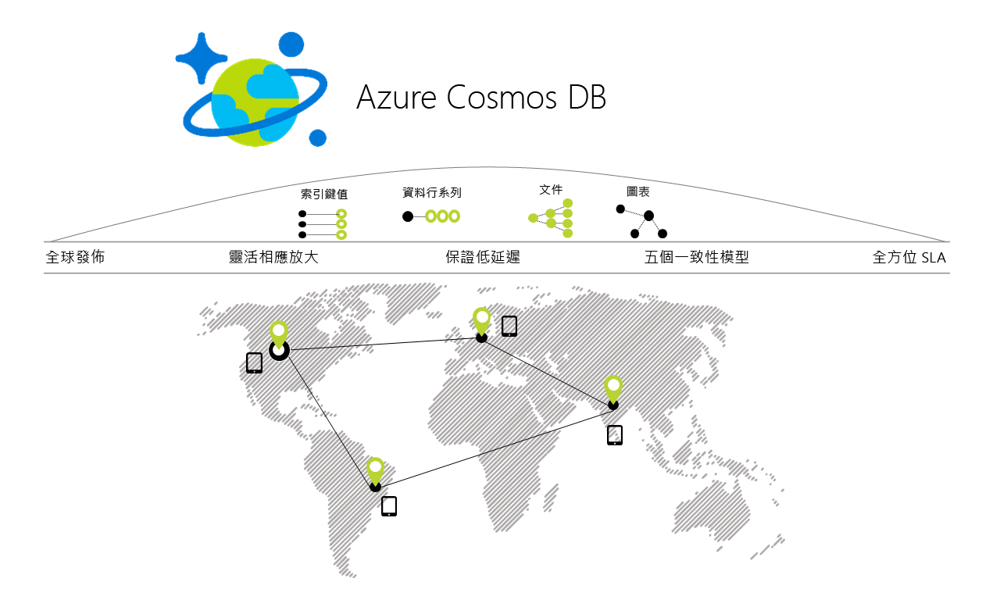

# 歡迎使用 Azure Cosmos DB

Azure Cosmos DB 是 Microsoft 的全球散發多模型資料庫。 透過按鈕點選，Azure Cosmos DB 可讓您有彈性且獨立地跨任意數目的 Azure 地理區域調整輸送量和儲存體。 它利用完整的[服務等級協定](https://aka.ms/acdbsla) (SLA) 提供了輸送量、延遲、可用性和一致性的保證，這是其他資料庫服務無法提供的。 您可以[免費試用 Azure Cosmos DB](https://azure.microsoft.com/try/cosmosdb/)，無須 Azure 訂用帳戶，也無須任何費用和約定付款。

> [!div class="nextstepaction"]
> [免費試用 Azure Cosmos DB](https://azure.microsoft.com/try/cosmosdb/)

## 主要功能
Azure Cosmos DB 是一個全球分散式多模型資料庫服務，可讓您輕鬆地在全球各地建置可調整且回應速度快的應用程式：

* **周全且立即可用的全域分散式資料庫**
    * 只要[按一下按鈕](tutorial-global-distribution-sql-api.md)，就可以[將資料分散](distribute-data-globally.md)至多個 [Azure 區域](https://azure.microsoft.com/regions/)。 這可讓您將資料放在使用者所在的區域，確保客戶的可能延遲最低。 
    * 使用 Azure Cosmos DB 的多路連接 API，應用程式一律知道最接近的區域為何，並將要求傳送至最接近的資料中心。 不必變更組態就可以實現上述目的。 您可設定寫入區域和所需數量的讀取區域，系統會為您處理其餘部分。
    * 由於有多路連接 API 功能，因此當您在 Azure Cosmos DB 資料庫中新增及移除區域時，應用程式不需要重新部署，就可繼續保有高可用性。

* **存取和查詢資料的多重資料模型與常用 API**
    * 建置 Azure Cosmos DB 所依據的 Atom-記錄-序列 (ARS) 型資料模型，原本支援多個資料模型，包括但不是限於文件、圖形、索引鍵-值、資料表和資料行系列資料模型。
    * 透過以多種語言提供的 SDK，支援下列資料模型的 API：
        * [SQL API](sql-api-introduction.md)：具有豐富 SQL 查詢功能的無結構描述 JSON 資料庫引擎。
        * [MongoDB API](mongodb-introduction.md)：由 Azure Cosmos DB 平台所提供、可大幅調整的 *MongoDB 即服務*。 與現有 MongoDB 程式庫、驅動程式、工具和應用程式相容。
        * [Cassandra API](cassandra-introduction.md)：由 Azure Cosmos DB 平台所提供的全球分散式 Cassandra 即服務。 與現有 [Apache Cassandra](https://cassandra.apache.org/) 程式庫、驅動程式、工具和應用程式相容。
        * [Gremlin API](graph-introduction.md)：完全受控、可水平調整的圖表資料庫服務，可讓您輕鬆地組建並執行應用程式，以便使用可支援 Open Gremlin API 且緊密連接的資料集 (以 [Apache TinkerPop 規格](http://tinkerpop.apache.org/) (英文) Apache Gremlin 為基礎)。
        * [資料表 API](table-introduction.md)：為了在不必進行任何應用程式變更的情況下，就能對現有的 Azure 資料表儲存體應用程式提供進階功能 (例如，自動編製索引、保證低延遲、全球分散)，而建置的索引鍵-值資料庫服務。
        * 其他資料模型和 API 即將登場！

* **彈性且獨立地依需求進行全球性的輸送量和儲存體調整**
    * 輕鬆地以[每秒](request-units.md)的細微度調整資料庫輸送量，並隨時依需求變更。 
    * [在背景自動](partition-data.md)調整儲存體大小，不限次數處理您對於儲存體大小的需求。

* **建置回應速度快和關鍵任務應用程式**
    * Azure Cosmos DB 保證其客戶的端對端低延遲 (99 個百分位數)。 
    * 針對典型的 1 KB 項目，Cosmos DB 保證在相同的 Azure 區域內讀取低於 10 毫秒以及索引化寫入低於 15 毫秒的端對端延遲 (99 個百分位數)。 中間的延遲性就可大幅降低 (低於 5 毫秒)。

* **確保「永遠可用」可用性**
    * 所有單一區域的資料庫帳戶可享有 99.99% 可用性的 SLA，所有多重區域的資料庫帳戶則享有 99.999% 的讀取可用性。
    * 可部署至任意數目的 [Azure 區域](https://azure.microsoft.com/regions)，以提升可用性和效能。
    * 可動態設定區域的優先順序，並以保證不會遺失任何資料的方式對一或多個區域[進行失敗模擬](regional-failover.md)，以便測試整個應用程式 (而非只是資料庫) 的端對端可用性。 

* **以正確方式撰寫全球散發應用程式**
    * 五個定義完善、實用且直覺的[一致性模型](consistency-levels.md)，可提供強式的 SQL 型一致性、寬鬆的 NoSQL 型最終一致性，以及介於兩者之間的各種一致性。 
  
* **退款保證**
    * 領先業界、以財務為後盾的完整[服務等級協定](https://aka.ms/acdbsla) (SLA)，可為您的任務關鍵性資料保證可用性、延遲、輸送量和一致性。 

* **無資料庫結構描述/索引管理**
    * 快速地逐一查看應用程式的結構描述，而不必擔心資料庫結構描述和/或索引的管理。
    * Azure Cosmos DB 的資料庫引擎完全不需要結構描述 – 它會自動建立所內嵌之資料的索引，且不需要任何結構描述或索引，還能提供超級快速的查詢。 

* **降低擁有權成本**
    * 更符合成本效益，效果是非受控解決方案或內部部署 NoSQL 解決方案的五到十倍。
    * 比 AWS DynamoDB 或 Google Spanner 便宜三倍。

## 功能比較

Azure Cosmos DB 會提供傳統關聯式與非關聯式資料庫的最佳功能。

| 功能 | 關聯式資料庫   | 非關聯式 (NoSQL) 資料庫 |    Azure Cosmos DB |
| --- | --- | --- | --- |
| 全球發佈 | 否 | 否 | 是，在 30 個以上的區域中周全且立即可用的散發，具有多路連接的 API|
| 水平調整 | 否 | 是 | 是，您可以獨立調整儲存體和輸送量 | 
| 延遲保證 | 否 | 是 | 是，99% 的讀取 <10 毫秒和寫入 <15 毫秒 | 
| 高可用性 | 否 | 是 | 是，Azure Cosmos DB 永遠可用、具有定義完善的 PACELC 折衷辦法，並提供自動和手動的容錯移轉選項|
| 資料模型 + API | 關聯式 + SQL | 多模型 + OSS API | 多模型 + SQL + OSS API (更多即將推出) |
| SLA | 是 | 否 | 是，延遲、輸送量、一致性、可用性的完整 SLA |

## 受益於 Azure Cosmos DB 的解決方案

任何需要處理[全球](distribute-data-globally.md)各地大量資料、讀取和寫入 (各種資料的回應時間都近乎即時) 的 [Web、行動裝置、遊戲和 IoT 應用程式](use-cases.md)，都將受益於 Azure Cosmos DB 所[保證](https://azure.microsoft.com/support/legal/sla/cosmos-db/)的高可用性、高輸送量、低延遲度及可微調的一致性。 了解 Azure CosmosDB 如何套用至 [IoT 和遠距通訊](use-cases.md#iot-and-telematics)、[零售和行銷](use-cases.md#retail-and-marketing)、[遊戲](use-cases.md#gaming)和 [Web 與行動應用程式](use-cases.md#web-and-mobile-applications)。

## 後續步驟
透過下列其中一個快速入門開始使用 Azure Cosmos DB：

* [開始使用 Azure Cosmos DB SQL API](create-sql-api-dotnet.md)
* [開始使用 Azure Cosmos DB MongoDB API](create-mongodb-nodejs.md)
* [開始使用 Azure Cosmos DB Cassandra API](create-cassandra-dotnet.md)
* [開始使用 Azure Cosmos DB Gremlin API](create-graph-dotnet.md)
* [開始使用 Azure Cosmos DB 資料表 API](create-table-dotnet.md)

> [!div class="nextstepaction"]
> [免費試用 Azure Cosmos DB](https://azure.microsoft.com/try/cosmosdb/)
