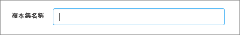

# 使用 Compass 連線至您的 Cosmos DB 帳戶

本教學課程示範在 Cosmos DB 中儲存和 (或) 管理資料時如何使用 [MongoDB Compass](https://www.mongodb.com/products/compass)。 我們使用 Azure Cosmos DB 的 MongoDB 版 API 進行此逐步解說。 簡單介紹一下，Compass 是 MongoDB 的 GUI。 它通常用來將資料視覺化、執行特定查詢，以及管理您的資料。 

Cosmos DB 是 Microsoft 的全域分散式多模型資料庫服務。 您可以快速建立及查詢文件、索引鍵/值及圖形資料庫，所有這些都受惠於位於 Cosmos DB 核心的全域散發和水平調整功能。

## 先決條件 
若要使用 Robo 3T 連線至 Cosmos DB 帳戶，您必須：

* 下載並安裝 [Compass](https://www.mongodb.com/download-center/compass?jmp=hero)
* 取得您的 Cosmos DB [連接字串](connect-mongodb-account.md)資訊

## 連線至 Cosmos DB 的 MongoDB 版 API 
若要將 Cosmos DB 帳戶連線至 Compass，您可以依照下列步驟操作：

1. 使用[這裡](connect-mongodb-account.md)的指示，擷取由 Azure Cosmos DB API MongoDB 為您的 Cosmos 帳戶設定的連線資訊。

    ![[連接字串] 刀鋒視窗的螢幕擷取畫面](./media/mongodb-compass/mongodb-compass-connection.png)

2. 在 Cosmos DB 中的 [主要/次要連接字串]  旁，按一下顯示為 [複製到剪貼簿]  的按鈕。 按一下此按鈕，會將您的整個連接字串複製到剪貼簿。 

    ![[複製到剪貼簿] 按鈕的螢幕擷取畫面](./media/mongodb-compass/mongodb-connection-copy.png)

3. 在您的桌面/電腦上開啟 Compass，並按一下 [連線]  ，然後按一下 [連線至...]  。 

4. Compass 會自動偵測剪貼簿中的連接字串，並出現提示詢問您是否要使用該連接字串來連線。 按一下 [是]  ，如下列螢幕擷取畫面所示。

    

5. 在上述步驟中按一下 [是]  後，將會自動填入連接字串中的詳細資料。 請移除在 [複本集名稱]  欄位中自動填入的值，以確定該欄位保留為空白。 

    

6. 按一下頁面底部的 [連線]  。 您的 Cosmos DB 帳戶和資料庫現在應該會顯示在 MongoDB Compass 內。

## 後續步驟

- 了解如何[使用 Studio 3T](mongodb-mongochef.md) 搭配 Azure Cosmos DB 適用於 MongoDB 的 API。
- 使用 Azure Cosmos DB 適用於 MongoDB 的 API 瀏覽 Cosmos DB [範例](mongodb-samples.md)。