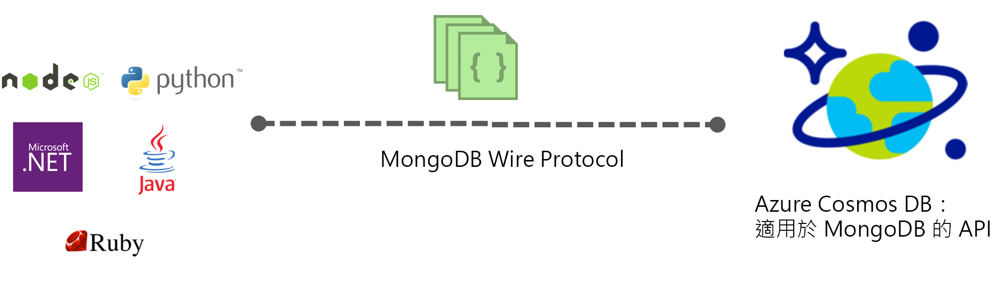

# Azure Cosmos DB：MongoDB API 簡介

[Azure Cosmos DB](../cosmos-db/introduction.md) 是 Microsoft 全域發佈的多模型資料庫服務，適用於任務關鍵性應用程式。 Azure Cosmos DB 提供[一站式全域散發](distribute-data-globally.md)、全球[彈性調整的輸送量和儲存體](partition-data.md)、達到第 99 個百分位數的個位數毫秒延遲，以及保證的高可用性，全部都由[領先業界的 SLA](https://azure.microsoft.com/support/legal/sla/cosmos-db/) \(英文\) 所支援。 Azure Cosmos DB 會[自動編製資料的索引](http://www.vldb.org/pvldb/vol8/p1668-shukla.pdf)，您不需要處理結構描述和索引管理。 它是多重模型，支援文件、索引鍵/值、圖表和單欄式資料模型。 

 

Azure Cosmos DB 資料庫可作為針對 [MongoDB](https://docs.mongodb.com/manual/introduction/) 所撰寫之應用程式的資料存放區。 此功能表示透過使用現有的[驅動程式](https://docs.mongodb.org/ecosystem/drivers/)，現在針對 MongoDB 所撰寫的應用程式已可與 Azure Cosmos DB 通訊，並使用 Azure Cosmos DB 資料庫而非 MongoDB 資料庫。 在許多情況下，您只要變更連接字串，就可以從使用 MongoDB 切換到 Azure Cosmos DB。 透過這項功能，您可以使用 Azure Cosmos DB 和[領先業界的完整 SLA](https://azure.microsoft.com/support/legal/sla/cosmos-db)，輕鬆地在 Azure 雲端建置及執行 MongoDB 全域發佈資料庫應用程式，同時繼續使用 MongoDB 的熟悉技能和工具。

**MongoDB 相容性**：您可以使用現有的 MongoDB 專業知識、應用程式程式碼和 Azure Cosmos DB 等工具來實作 MongoDB 有線通訊協定。 您可以開發使用 MongoDB 的應用程式，並使用完全受控且全域分散式 Azure Cosmos DB 服務來部署這些應用程式。 如需支援版本的詳細資訊，請參閱 [MongoDB 通訊協定支援](mongodb-feature-support.md#mongodb-protocol-support)。

## 於 MongoDB 應用程式使用 Azure Cosmos DB 有何好處？

**可彈性調整的輸送量和儲存體：** 透過輕鬆相應增加或相應減少 MongoDB 資料庫，來符合您應用程式的需求。 您的資料會儲存在固態硬碟 (SSD) 中以便獲得可預測的低延遲。 Azure Cosmos DB 支援的 MongoDB 集合可調整為幾乎不受限制的儲存體大小和佈建輸送量。 隨著應用程式的成長，您可以依據可預測的效能彈性且順暢地調整 Azure Cosmos DB。 

**多重區域複寫**︰Azure Cosmos DB 會自動將您的資料複寫至與您 MongoDB 帳戶相關聯的所有區域，讓您開發需要全域存取資料的應用程式，也能在一致性、可用性與效能之間做出取捨，而且全都有相對應的保證。 Azure Cosmos DB 利用多重定址 API 提供自動的區域性容錯移轉，還能夠彈性調整世界各地的輸送量和儲存體。 請參閱[將資料分散到全球](distribute-data-globally.md)以深入了解。

**不需要任何伺服器管理工作**︰您不需要管理和調整 MongoDB 資料庫。 Azure Cosmos DB 是完全受控的服務，這表示您不需要自己管理任何基礎結構或虛擬機器。 Azure Cosmos DB 可在 30 個以上的 [Azure 區域](https://azure.microsoft.com/regions/services/)中使用。

**可調式一致性層級：** 因為 Azure Cosmos DB 支援多模型 API，所以一致性設定適用於帳戶層級，而強制執行一致性則由各個 API 控制。 MongoDB 3.6 問世之前，並沒有工作階段一致性的概念，如果您將 MongoDB API 帳戶設定為使用工作階段一致性，使用 MongoDB API 時都會降級為最終一致性。 如果您需要 MongoDB API 帳戶的讀取自己的寫入保證，該帳戶的預設一致性層級應設定為強式或限定過期。 深入了解[使用一致性層級將可用性和效能最大化](consistency-levels.md)。

| Azure Cosmos DB 預設一致性層級 |   Mongo API (3.4) |
|---|---|
|最終| 最終 |
|一致前置詞| 最終有一致的順序 |
|工作階段| 最終有一致的順序 |
|限定過期| 強式 |
| 強式 | 強式 |

**自動編製索引**：根據預設，Azure Cosmos DB 會自動為 MongoDB 資料庫中文件內的所有屬性編製索引，且不預期或需要任何結構描述或建立次要索引。 此外，唯一索引功能可讓任何已在 Azure Cosmos DB 中自動編制索引的文件欄位具有唯一性的限制。

**企業級**：Azure Cosmos DB 支援多個本機複本，在面對本機和區域故障時可提供 99.99% 的可用性和資料保護。 Azure Cosmos DB 有企業級的[合規性認證 (英文)](https://www.microsoft.com/trustcenter) 和安全性功能。 

## 如何開始使用

請遵循 MongoDB 快速入門建立 Azure Cosmos DB 帳戶，然後移轉您現有的 Mongo DB 應用程式以使用 Azure Cosmos DB，或建置一個新的應用程式：

* [移轉現有的 Node.js MongoDB Web 應用程式](create-mongodb-nodejs.md)。
* [使用 .NET 和 Azure 入口網站建置 MongoDB API Web 應用程式](create-mongodb-dotnet.md)
* [使用 Java 和 Azure 入口網站建置 MongoDB API 主控台應用程式](create-mongodb-java.md)

## 後續步驟

Azure Cosmos DB 的 MongoDB API 相關資訊已整合至整體 Azure Cosmos DB 文件，但以下有幾個線索可讓您開始使用︰

* 依照下列[連線到 MongoDB 帳戶](connect-mongodb-account.md)教學課程，了解如何取得您的帳戶連接字串資訊。
* 依照[使用 Studio 3T (MongoChef) 搭配 Azure Cosmos DB](mongodb-mongochef.md) 教學課程，了解如何在 Studio 3T 中建立 Azure Cosmos DB 資料庫和 MongoDB 應用程式之間的連線。
* 依照[將資料移轉至具有 MongoDB 通訊協定支援的 Azure Cosmos DB](mongodb-migrate.md) 教學課程，將資料匯入適用於 MongoDB 的 API資料庫。
* 使用 [Robomongo](mongodb-robomongo.md) 連線至 API for MongoDB 帳戶。
* 使用 [GetLastRequestStatistics 命令和 Azure 入口網站計量](set-throughput.md#GetLastRequestStatistics)，了解您的作業使用多少 RU。
* 了解如何[設定全球分散式應用程式的讀取喜好設定](../cosmos-db/tutorial-global-distribution-mongodb.md)。
