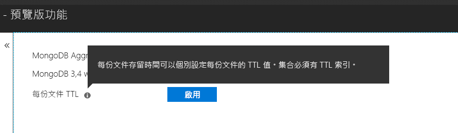

# <a name="expire-data-in-azure-cosmos-db-mongodb-api"></a>讓 Azure Cosmos DB MongoDB API 中的資料到期

存留時間 (TTL) 功能可讓資料庫的資料自動到期。 MongoDB API 會使用 Azure Cosmos DB 的 TTL 功能。 支援的模式有兩種：設定整個集合的預設 TTL 值，以及為每份文件設定個別的 TTL 值。 在 MongoDB API 中控管 TTL 索引和個別文件 TTL 值的邏輯[與 Azure Cosmos DB 相同](../cosmos-db/mongodb-indexing.md)。

## <a name="ttl-indexes"></a>TTL 索引
若要對整個集合啟用 TTL，必須建立[「TTL 索引」(存留時間索引)](../cosmos-db/mongodb-indexing.md)。 TTL 索引是 _ts 欄位上具有 "expireAfterSeconds" 值的索引。

範例：
```JavaScript
globaldb:PRIMARY> db.coll.createIndex({"_ts":1}, {expireAfterSeconds: 10})
{
        "_t" : "CreateIndexesResponse",
        "ok" : 1,
        "createdCollectionAutomatically" : true,
        "numIndexesBefore" : 1,
        "numIndexesAfter" : 4
}
```

上述範例中的命令會使用 TTL 功能建立索引。 在索引鍵立後，資料庫將會自動刪除該集合中在最近 10 秒內未經修改的任何文件。 

> [!NOTE]
> **_ts** 是 Cosmos DB 特有欄位，且無法從 MongoDB 用戶端存取。 這是保留 (系統) 屬性，其中包含上次修改文件的時間戳記。
>
    
此外，C# 範例會： 
```C# 
var options = new CreateIndexOptions {ExpireAfter = TimeSpan.FromSeconds(10)}; 
var field = new StringFieldDefinition<BsonDocument>("_ts"); 
var indexDefinition = new IndexKeysDefinitionBuilder<BsonDocument>().Ascending(field); 
await collection.Indexes.CreateOneAsync(indexDefinition, options); 
``` 

## <a name="set-time-to-live-value-for-a-document"></a>設定文件的存留時間值 
此外也支援個別文件 TTL 值。 文件必須包含根層級的屬性 "ttl" (小寫)，且必須已為該集合建立上述 TTL 索引。 對文件設定的 TTL 值會覆寫集合的 TTL 值。

TTL 值必須是 int32。 或者，必須是可配適於 int32 的 int64，或沒有小數部分並且可配適於 int32 的雙精準數。 不符合這些規格的 TTL 屬性值雖然可以使用，但不會被視為有意義的文件 TTL 值。

文件的 TTL 值是選擇性的；不含 TTL 值的文件可以插入集合中。  在此情況下，將會接受集合的 TTL 值。 

下列文件具有有效的 TTL 值。 在文件插入後，文件 TTL 值將會覆寫集合的 TTL 值。 因此，文件將在 20 秒後移除。  

```JavaScript 
globaldb:PRIMARY> db.coll.insert({id:1, location: "Paris", ttl: 20.0}) 
globaldb:PRIMARY> db.coll.insert({id:1, location: "Paris", ttl: NumberInt(20)}) 
globaldb:PRIMARY> db.coll.insert({id:1, location: "Paris", ttl: NumberLong(20)}) 
```

下列文件具有無效的 TTL 值。 文件將會插入，但文件的 TTL 值不會生效。 因此，文件將因為集合的 TTL 值而在 10 秒後移除。 

```JavaScript 
globaldb:PRIMARY> db.coll.insert({id:1, location: "Paris", ttl: 20.5}) //TTL value contains non-zero decimal part. 
globaldb:PRIMARY> db.coll.insert({id:1, location: "Paris", ttl: NumberLong(2147483649)}) //TTL value is greater than Int32.MaxValue (2,147,483,648). 
``` 

## <a name="how-to-activate-the-per-document-ttl-feature"></a>如何啟動個別文件 TTL 功能
個別文件 TTL 功能可在 Azure 入口網站中透過 MongoDB API 帳戶的 [預覽功能] 索引標籤來啟動。

 

## <a name="next-steps"></a>後續步驟
* [利用存留時間讓 Azure Cosmos DB 集合中的資料自動過期](../cosmos-db/time-to-live.md)
* [Azure Cosmos DB MongoDB API 中的索引功能](../cosmos-db/mongodb-indexing.md)
