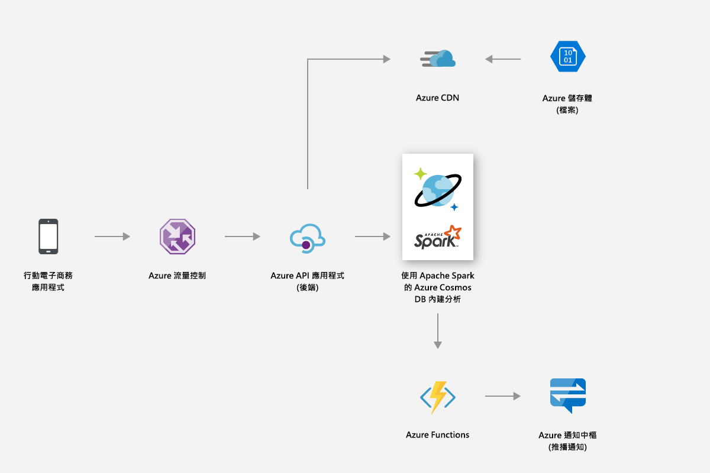
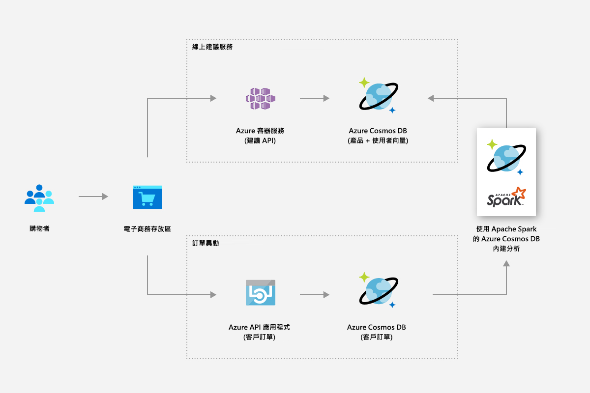
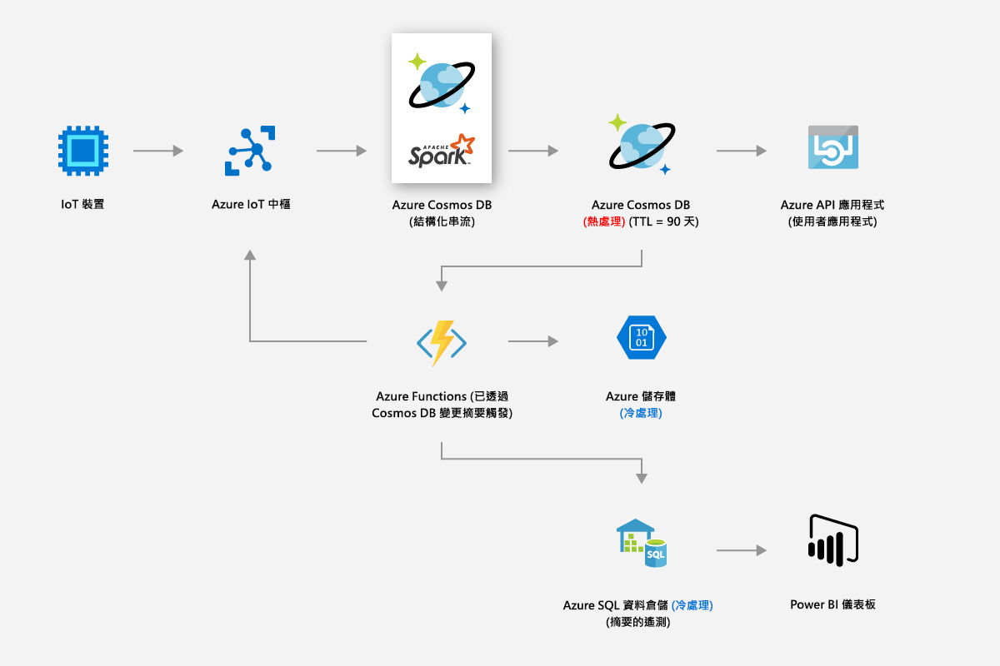
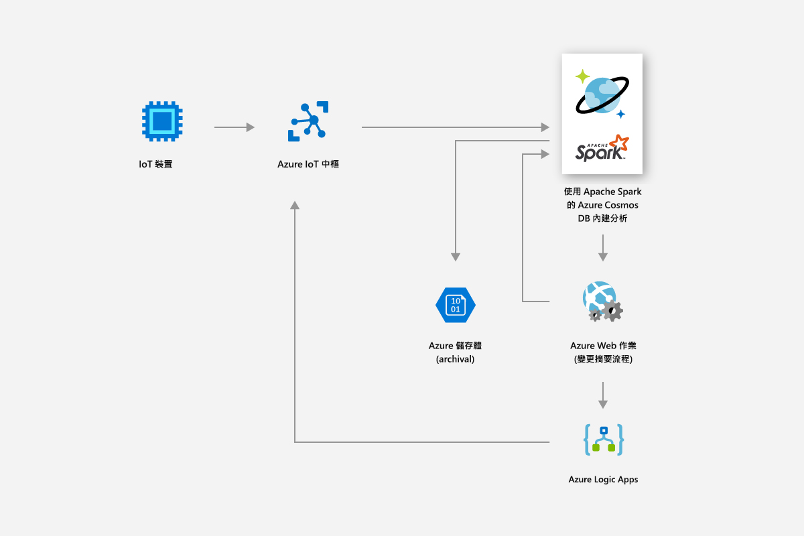
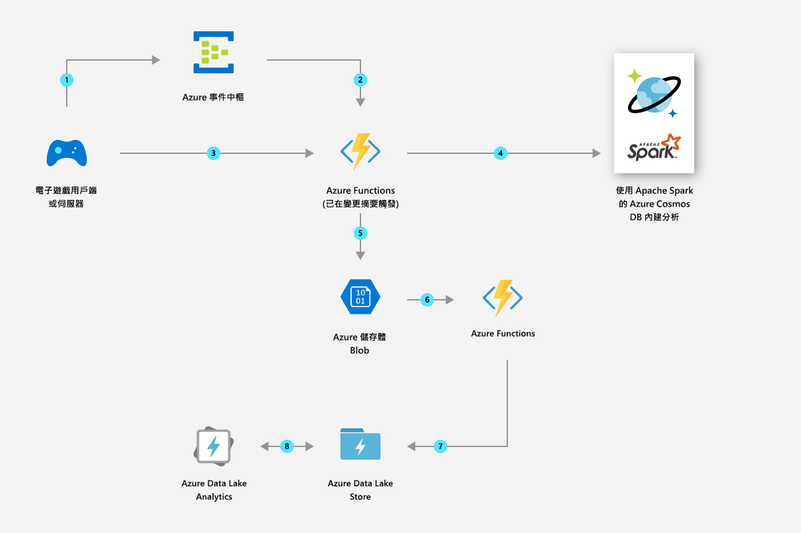

# Azure Cosmos DB 中使用 Apache Spark (預覽) 的內建作業分析 

Azure Cosmos DB 中的 Apache Spark 內建支援可讓您從 Apache Spark 對 Azure Cosmos 帳戶中儲存的資料執行分析。 它會提供 Apache Spark 作業的原生支援，以直接在散佈全球的 Cosmos 資料庫上執行。 有了這些功能，開發人員、資料工程師和資料科學家可以使用 Azure Cosmos DB 作為有彈性、可擴充和高效能的資料平台，以執行 **OLTP 和 OLAP/HTAP** 工作負載。 

與 Azure Cosmos 帳戶相關聯的所有 Azure 區域中都會自動提供 Spark 計算功能。 Spark 作業會使用 Azure Cosmos DB 的多重主機功能，而且它們可以在每個區域中寫入或查詢本機複本。 

> [!NOTE]
> Azure Cosmos DB 中的 Apache Spark 內建支援目前以有限預覽形式提供。 若要註冊預覽版，請巡覽至[註冊預覽版頁面](https://portal.azure.com/?feature.customportal=false#create/Microsoft.DocumentDB)。 

Azure Cosmos DB 中的 Apache Spark 支援提供下列優點：

* 您可以最快的速度深入了解分散各地的使用者和資料。

* 您可以簡化解決方案架構及降低[擁有權總成本](total-cost-ownership.md) (TCO)。 系統會有最少量的資料處理元件，並且避免其間有任何不必要的資料移動。

* 建立[安全性](secure-access-to-data.md)、[合規性](compliance.md)和稽核界限，其中包含所有受管理的資料。

* 提供由嚴苛 SLA 所支援的「持續上線」或[高可用性](high-availability.md)使用者分析。

 
您可以使用 Azure Cosmos DB 中的 Apache Spark 支援建置及部署解決方案，例如 AI 和深度學習模型、預測性分析、建議、IoT、Customer 360、詐騙偵測、文字情感、點擊流分析。 這些解決方案直接對您的 Azure Cosmos DB 資料運作。

您可以在 Azure Cosmos DB 中設定批次和串流 ETL 作業，而不需離開資料庫服務，或新增其他計算服務。 當您需要執行 ETL 作業時，您可以彈性擴充計算環境，並在作業完成時將計算環境相應縮小。

Azure Cosmos DB 中的 Apache Spark 支援在 Apache Spark 執行階段提供內建 Machine Learning 支援。 執行階段包括 Spark MLLib、適用於 Spark 的 Microsoft Machine Learning、Azure Machine Learning 和認知服務。 透過這些功能，資料科學家、資料工程師和資料分析師可以直接在 Azure Cosmos DB 內建置和實作機器學習模型，而此花費更少時間和更低成本。

## 主要權益

### 散佈全球、低延遲的作業分析和 AI

在散佈全球的 Azure Cosmos 資料庫上使用 Apache Spark，您現在可以快速洞察全世界。 Azure Cosmos DB 能夠利用三個關鍵技巧進行**散佈全球、低延遲的作業分析** (彈性規模)：

* 由於您的 Azure Cosmos 資料庫散佈全球，因此所有資料會都在資料生產者 (例如使用者) 所在位置的當地擷取。 不論資料的生產者和取用者位於世界何處，都會針對最接近他們的本機複本提供查詢服務。 

* 您所有的分析查詢都會直接在資料分割區內儲存的已編制索引資料上執行，而不需要進行任何不必要的資料移動。 

* Spark 與 Azure Cosmos DB 共置，因此發生較少的中繼轉譯和資料移動，以致效能和延展性更佳。

### 統一的 Apache Spark 無伺服器體驗

Azure Cosmos DB 為多模型資料庫，現在透過索引鍵值、文件、圖形、資料行系列資料模型提供**統一的 Apache Spark 無伺服器體驗**，進而擴充其 OSS API 支援。 使用 MongoDB、Cassandra、Gremlin、Etcd 和 SQL API 支援不同的資料模型 - 全都在相同的基礎資料上運作。 

使用 Azure Cosmos DB 中的 Apache Spark 支援時，您可以原生方式支援以 Scala、Python、Java 撰寫的應用程式，以及使用數個適用於 SQL 且緊密整合的程式庫。 這些程式庫包括 ([Spark SQL](https://spark.apache.org/sql/))、機器學習 (Spark [MLlib](https://spark.apache.org/mllib/))、串流處理 ([Spark 結構化串流](https://spark.apache.org/streaming/))，以及圖形處理 (Spark [GraphFrames]( https://docs.databricks.com/spark/latest/graph-analysis/graphframes/user-guide-python.html))。 這些工具可讓您更輕鬆地將 Apache Spark 用於各種使用案例。 您不必處理 Spark 或 Spark 叢集的管理。 您可以使用熟悉的 Apache Spark API 和 **Jupyter Notebook** 進行分析，以及使用 SQL API 或任何 OSS NoSQL API (如 Cassandra ) 同時對相同的基礎資料進行交易處理。

### 不需要任何結構描述或索引管理

不同於傳統分析資料庫，使用 Azure Cosmos DB 時，資料工程師和資料科學家不再需要處理麻煩的結構描述和索引管理。 Azure Cosmos DB 中的資料庫引擎不需要任何明確的結構描述或索引管理，而且能夠為其擷取的所有資料自動編製索引，以便快速處理 Apache Spark 查詢。 

### 一致性選擇

由於 Apache Spark 作業是在 Azure Cosmos 資料庫的資料分割區中執行，所以查詢會取得[五個定義完善的一致性選項](consistency-levels.md)。 這些一致性模型讓您有選擇嚴格一致性的彈性，以提供最精確的機器學習演算法結果，而不會危害延遲和高可用性。 

### 完整 SLA

Apache Spark 作業會有 Azure Cosmos DB 優點，例如領先業界的全方位 [SLA](https://azure.microsoft.com/support/legal/sla/documentdb/v1_1/) (99.999)，不會有管理個別 Apache Spark 叢集的額外負荷。 這些 SLA 涵蓋輸送量、第 99 百分位的延遲、一致性和高可用性。 

### 混合的工作負載

將 Apache Spark 整合到 Azure Cosmos DB 中，可跨越交易與分析區隔，當客戶建置全球規模的雲端原生應用程式時，此種區隔已成為主要的痛苦點之一。 

## Azure Cosmos DB Spark 支援案例

### 零售與消費性商品

您可以使用 Azure Cosmos DB 中的 Spark 支援來提供即時建議和供應項目。 您可以協助客戶透過即時個人化和產品建議探索他們所需的專案。

* 您可以使用 Apache Spark 執行階段所提供的內建 Machine Learning 支援，產生各個產品目錄的即時建議。

* 您可以採擷點選流資料、購買資料和客戶資料，以提供可推動存留期價值的目標建議。

* 使用 Azure Cosmos DB 的全域散發功能時，分散於不同區域的大量產品資料將可在數毫秒內完成分析。

* 您可以快速深入了解分散各地的使用者和資料。 您可以在適當時機將適當的廣告提供給對的使用者，以提升促銷轉換率。

* 您可以利用內建的 Spark 串流功能，藉由將即時資料與靜態客戶資料結合來擴充資料。 如此，您就可以即時提供更加個人化、目標更明確的廣告，並且與客戶的行為緊密呼應。

下圖顯示如何使用 Azure Cosmos DB Spark 支援來最佳化定價和促銷：

下圖顯示如何在即時建議引擎中使用 Azure Cosmos DB Spark 支援：

### 製造和 IoT

Azure Cosmos DB 的內建分析平台可讓您從全球各地的數百萬個裝置啟用 IoT 資料的即時分析。 您可以進行現代化的創新，例如預測天氣模式、預測性分析和能源最佳化。

* 藉由使用 Azure Cosmos DB，您可以採擷即時資產計量和天氣因素之類的資料，然後套用智慧電網分析，以最佳化現場連線裝置的效能。 智慧電網分析是控制營運成本、提升電網可靠性，以及為消費者提供個人化能源服務的重要關鍵。

下圖顯示如何使用 Azure Cosmos DB 的 Spark 支援讀取來自 IoT 裝置的計量，並套用智慧電網分析：

### 預測性維護

* 維護深水平台的小型鑽探設備所使用的資產 (例如壓縮機)，是一項複雜的工作。 這些資產分佈於全球各地，並產生數以 PB 計的資料。 藉由使用 Azure Cosmos DB，您可以建置端對端預測性資料管線，以使用 Spark 串流來處理大量的感應器遙測資料、儲存資產組件和感應器對應資料。

* 您可以建置並部署機器學習模型，以在資產故障發生之前先行預測，並發出維護工單。

下圖顯示如何使用 Azure Cosmos DB Spark 支援來建置預測性維護系統：

下圖顯示如何使用 Azure Cosmos DB Spark 支援來建置即時車輛診斷系統：

### 玩遊戲

* 透過內建 Spark 支援，Azure Cosmos DB 可讓您在短短幾分鐘內輕鬆建立、調整及部署進階分析和機器學習模型，以產生最理想的遊戲體驗。

* 您可以分析玩家、購買和行為資料以建立相關的個人化供應項目，進而達到高轉換率。

* 使用 Spark 機器學習，可以分析並深入了解遊戲的遙測資料。 您可以診斷及防止載入時間緩慢和遊戲中的問題。

下圖顯示如何在遊戲分析中使用 Azure Cosmos DB Spark 支援：

## 內建 Jupyter Notebook 支援

Azure Cosmos DB 支援所有 API 的內建 Jupyter Notebook，例如 SQL、MongoDB、Cassandra、Gremlin 和資料表。 Jupyter Notebook 會在 Azure Cosmos 帳戶內執行，而且它們可強化開發人員的經驗。 所有 Azure Cosmos DB API 和資料模型內建的 Notebook 支援可讓您以互動方式執行查詢。 您也可以執行機器學習模型，並分析您的 Azure Cosmos 資料庫中儲存的資料。 藉由使用 Jupyter Notebook 的體驗，您可以分析儲存的資料、建置及定型機器學習模型，以及在 Azure 入口網站中的資料上執行推斷，如下圖所示：

## 後續步驟

* 若要深入了解 Azure Cosmos DB 的優點，請參閱[概觀](introduction.md)一文。
* [開始使用適用於 MongoDB 的 Azure Cosmos DB API](mongodb-introduction.md)
* [開始使用 Azure Cosmos DB Cassandra API](cassandra-introduction.md)
* [開始使用 Azure Cosmos DB Gremlin API](graph-introduction.md)
* [開始使用 Azure Cosmos DB 資料表 API](table-introduction.md)

