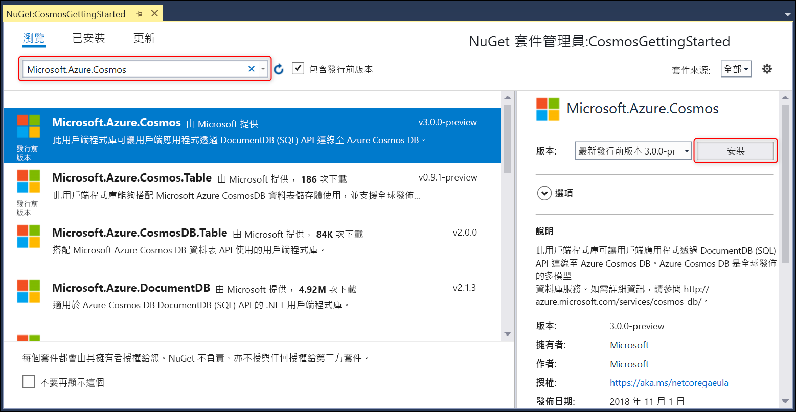

# <a name="build-a-net-core-console-app-to-manage-data-in-azure-cosmos-db-sql-api-account-sdk-version-3-preview"></a>建置 .NET Core 主控台應用程式來管理 Azure Cosmos DB SQL API 帳戶 (SDK 第 3 版預覽) 中的資料

> [!div class="op_single_selector"]
>
> - [.NET Core (預覽)](sql-api-dotnet-core-get-started-preview.md)
> - [.NET Core](sql-api-dotnetcore-get-started.md)
> - [.NET (預覽)](sql-api-dotnet-get-started-preview.md)
> - [.NET](sql-api-get-started.md)
> - [Java](sql-api-java-get-started.md)
> - [非同步 Java](sql-api-async-java-get-started.md)
> - [Node.js](sql-api-nodejs-get-started.md)

歡迎使用 Azure Cosmos DB SQL API 開始使用 .NET Core 教學課程！ 完成本教學課程之後，您將會有一個 .NET Core 主控台應用程式，可用來建立和查詢 Azure Cosmos DB 資源。 本教學課程使用 [3.0+ 版](https://www.nuget.org/packages/Microsoft.Azure.Cosmos)的 Azure Cosmos DB .NET SDK，其以 [.NET Standard 2.0](https://docs.microsoft.com/dotnet/standard/net-standard) 作為目標。

本教學課程涵蓋下列項目：

> [!div class="checklist"]
>
> - 建立及連線至 Azure Cosmos 帳戶
> - 在 Visual Studio 中設定專案
> - 建立資料庫和容器
> - 將項目新增至容器
> - 查詢容器
> - 在項目上進行 CRUD 作業
> - 刪除資料庫

沒有時間建立應用程式嗎？ 別擔心！ 您可以在 [GitHub](https://github.com/Azure-Samples/cosmos-dotnet-core-getting-started)上找到完整的方案。 請跳至 [取得完整的解決方案](#GetSolution) 一節，以取得簡要指示。

想要使用 SQL API 和 .NET Core SDK 建置 Xamarin iOS、Android 或 Forms 應用程式嗎？ 請參閱[使用 Xamarin 和 Azure Cosmos DB 建置行動應用程式](mobile-apps-with-xamarin.md)。

## <a name="prerequisites"></a>必要條件

- 使用中的 Azure 帳戶。 如果您沒有帳戶，您可以註冊 [免費帳戶](https://azure.microsoft.com/free/)。

  [!INCLUDE [cosmos-db-emulator-docdb-api](../../includes/cosmos-db-emulator-docdb-api.md)]

- 如果尚未安裝 Visual Studio 2017，您可以下載並使用免費的 [Visual Studio 2017 Community Edition](https://www.visualstudio.com/downloads/)。 如果您正在開發通用 Windows 平台 (UWP) 應用程式，則應該使用 **15.4 版或更高版本的 Visual Studio 2017**。 請確定您在 Visual Studio 設定期間啟用了 **Azure 開發**工作負載。

  - 如果您正在操作 MacOS 或 Linux，可以針對選定平台安裝 [.NET Core SDK](https://www.microsoft.com/net/core#macos)，以從命令列開發 .NET Core 應用程式。

  - 如果您正在操作 Windows，可以安裝 [.NET Core SDK](https://www.microsoft.com/net/core#windows) 以從命令列開發 .NET Core 應用程式。

  - 您可以使用自己的編輯器，也可以下載適用於 Windows、Linux 和 MacOS 的免費 [Visual Studio Code](https://code.visualstudio.com/)。

## <a name="step-1-create-an-azure-cosmos-db-account"></a>步驟 1：建立 Azure Cosmos DB 帳戶

讓我們來建立 Azure Cosmos DB 帳戶。 如果您已經擁有想要使用的帳戶，就可以跳到 [設定您的 Visual Studio 方案](#SetupVS)。 如果您是使用「Azure Cosmos DB 模擬器」，請依照 [Azure Cosmos DB 模擬器](local-emulator.md)的步驟來設定模擬器，然後直接跳到[設定您的 Visual Studio 專案](#SetupVS)。

[!INCLUDE [create-dbaccount](../../includes/cosmos-db-create-dbaccount.md)]

## <a id="SetupVS"></a>步驟 2：設定 Visual Studio 專案

1. 在電腦上開啟 **Visual Studio 2017**。
1. 從 [檔案] 功能表中，選取 [新增]，然後選擇 [專案]。
1. 在 [新增專案]  對話方塊中，選取 [Visual C#] / [主控台應用程式 (.NET Core)]**、為專案命名，然後按一下 [確定]**。
   ![[新增專案] 視窗的螢幕擷取畫面](./media/sql-api-dotnetcore-get-started/dotnetcore-tutorial-visual-studio-new-project.png)
1. 在 [方案總管] 中，以滑鼠右鍵按一下 Visual Studio 方案底下的新主控台應用程式，然後按一下 [管理 NuGet 套件...]

   

1. 在 [NuGet] 索引標籤中按一下 [瀏覽]，然後在搜尋方塊中輸入 **Microsoft.Azure.Cosmos**。
1. 在結果中尋找 **Microsoft.Azure.Cosmos**，然後按一下 [安裝]。
   「Azure Cosmos DB SQL API 用戶端程式庫」的套件識別碼是 [Microsoft Azure Cosmos DB 用戶端程式庫](https://www.nuget.org/packages/Microsoft.Azure.Cosmos/) \(英文\)。
   

   如果您收到關於檢閱方案變更的訊息，請按一下 [確定]。 如果您收到關於接受授權的訊息，請按一下 [我接受]。

太棒了！ 現在已完成安裝程式，讓我們開始撰寫一些程式碼。 您可以在 [GitHub](https://github.com/Azure-Samples/cosmos-dotnet-core-getting-started/)找到本教學課程的完整程式碼專案。

## <a id="Connect"></a>步驟 3：連線至 Azure Cosmos DB 帳戶

1. 首先，在 **Program.cs** 檔案中，將 C# 應用程式開頭的參考，替換為下列參考：

   ```csharp
   using System;
   using System.Threading.Tasks;
   using Microsoft.Azure.Cosmos;
   using System.Collections.Generic;
   using System.Net;
   ```

1. 現在，將下列常數和變數新增至公用類別 `Program`。

   ```csharp
   public class Program
   {
       // ADD THIS PART TO YOUR CODE

       // The Azure Cosmos DB endpoint for running this sample.
       private static readonly string EndpointUri = "<your endpoint here>";
       // The primary key for the Azure Cosmos account.
       private static readonly string PrimaryKey = "<your primary key>";

       // The Cosmos client instance
       private CosmosClient cosmosClient;

       // The database we will create
       private CosmosDatabase database;

       // The container we will create.
       private CosmosContainer container;

       // The name of the database and container we will create
       private string databaseId = "FamilyDatabase";
       private string containerId = "FamilyContainer";
   }
   ```

   請注意，如果您熟悉舊版 .NET SDK，則可能已習慣看到「集合」和「文件」等詞彙。 Azure Cosmos DB 支援多個 API 模型，因此 3.0+ 版的 .NET SDK 會使用「容器」和「項目」這些泛用詞彙。 容器可以是集合、圖形或資料表。 項目可以是文件、邊緣/頂點或資料列，並且是容器內的內容。 [深入了解資料庫、容器和項目。](databases-containers-items.md)

1. 從 [Azure 入口網站](https://portal.azure.com)擷取端點 URL 和主要金鑰。

   在 Azure 入口網站中，瀏覽至 Azure Cosmos DB 帳戶，然後按一下 [金鑰]。

   從入口網站複製 URI，並將它貼到 `Program.cs` 檔案的 `<your endpoint URL>` 中。 從入口網站複製主要金鑰，並將它貼到 `<your primary key>` 中。

   

1. 接下來，我們會建立 `CosmosClient` 的新執行個體，並為我們的計劃設定一些 Scaffolding。

   在 **Main** 方法底下，新增名為 **GetStartedDemoAsync** 的新非同步工作，以將新的 `CosmosClient` 具現化。 我們會使用 **GetStartedDemoAsync** 作為進入點，來呼叫方法以操作 Azure Cosmos DB 資源。

   ```csharp
   public static async Task Main(string[] args)
   {
   }

   // ADD THIS PART TO YOUR CODE
   /*
       Entry point to call methods that operate on Azure Cosmos DB resources in this sample
   */
   public async Task GetStartedDemoAsync()
   {
       // Create a new instance of the Cosmos Client
       this.cosmosClient = new CosmosClient(EndpointUri, PrimaryKey);
   }
   ```

1. 新增下列程式碼，以從 **Main** 方法執行 **GetStartedDemoAsync** 非同步工作。 **Main** 方法會攔截例外狀況並將它們寫入主控台。

   ```csharp
   public static async Task Main(string[] args)
   {
       // ADD THIS PART TO YOUR CODE
       try
       {
           Console.WriteLine("Beginning operations...\n");
           Program p = new Program();
           await p.GetStartedDemoAsync();
       }
       catch (CosmosException de)
       {
           Exception baseException = de.GetBaseException();
           Console.WriteLine("{0} error occurred: {1}\n", de.StatusCode, de);
       }
       catch (Exception e)
       {
           Console.WriteLine("Error: {0}\n", e);
       }
       finally
       {
           Console.WriteLine("End of demo, press any key to exit.");
           Console.ReadKey();
       }
   }
   ```

1. 選取 **F5** 鍵執行您的應用程式。 主控台視窗輸出會顯示 `End of demo, press any key to exit.` 訊息，確認已連線至 Azure Cosmos DB。 您可以接著關閉主控台視窗。

恭喜！ 您已成功連線至 Azure Cosmos DB 帳戶。

## <a name="step-4-create-a-database"></a>步驟 4：建立資料庫

您可以使用 **CosmosDatabases** 類別的 [**CreateDatabaseIfNotExistsAsync**](https://aka.ms/CosmosDotnetAPIDocs) 或 [**CreateDatabaseAsync**](https://aka.ms/CosmosDotnetAPIDocs) 函式來建立資料庫。 資料庫是分割於多個容器之項目的邏輯容器。

1. 將 **CreateDatabase** 方法複製並貼到 **GetStartedDemoAsync** 方法底下。 **CreateDatabase** 會以識別碼 `FamilyDatabase` 建立新的資料庫 (如果該資料庫不存在)，此識別碼會指定於 `databaseId` 欄位中。

   ```csharp
   /*
       Create the database if it does not exist
   */
   private async Task CreateDatabase()
   {
       // Create a new database
       this.database = await this.cosmosClient.Databases.CreateDatabaseIfNotExistsAsync(databaseId);
       Console.WriteLine("Created Database: {0}\n", this.database.Id);
   }
   ```

1. 將程式碼複製並貼到 CosmosClient 具現化時的所在處底下，以呼叫您剛才新增的 **CreateDatabase** 方法。

   ```csharp
   public async Task GetStartedDemoAsync()
   {
       // Create a new instance of the Cosmos Client
       this.cosmosClient = new CosmosClient(EndpointUri, PrimaryKey);

       //ADD THIS PART TO YOUR CODE
       await this.CreateDatabase();
   }
   ```

   此時，您的程式碼應該會有如下樣貌，且其中已填入您的端點和主要金鑰。 請注意，您的命名空間會根據專案名稱而有所不同。

   ```csharp
   using System;
   using System.Threading.Tasks;
   using Microsoft.Azure.Cosmos;
   using System.Collections.Generic;
   using System.Net;

   namespace CosmosGettingStartedDotnetCoreTutorial
   {
       class Program
       {
           // The Azure Cosmos DB endpoint for running this sample.
           private static readonly string EndpointUri = "<your endpoint here>";
           // The primary key for the Azure Cosmos account.
           private static readonly string PrimaryKey = "<your primary key>";

           // The Cosmos client instance
           private CosmosClient cosmosClient;

           // The database we will create
           private CosmosDatabase database;

           // The container we will create.
           private CosmosContainer container;

           // The name of the database and container we will create
           private string databaseId = "FamilyDatabase";
           private string containerId = "FamilyContainer";

           public static async Task Main(string[] args)
           {
               try
               {
                   Console.WriteLine("Beginning operations...");
                   Program p = new Program();
                   await p.GetStartedDemoAsync();
               }
               catch (CosmosException de)
               {
                   Exception baseException = de.GetBaseException();
                   Console.WriteLine("{0} error occurred: {1}\n", de.StatusCode, de);
               }
               catch (Exception e)
               {
                   Console.WriteLine("Error: {0}\n", e);
               }
               finally
               {
                   Console.WriteLine("End of demo, press any key to exit.");
                   Console.ReadKey();
               }
           }

           /*
               Entry point to call methods that operate on Azure Cosmos DB resources in this sample
           */
           public async Task GetStartedDemoAsync()
           {
               // Create a new instance of the Cosmos Client
               this.cosmosClient = new CosmosClient(EndpointUri, PrimaryKey);
               await this.CreateDatabase();
           }

           /*
               Create the database if it does not exist
           */
           private async Task CreateDatabase()
           {
               // Create a new database
               this.database = await this.cosmosClient.Databases.CreateDatabaseIfNotExistsAsync(databaseId);
               Console.WriteLine("Created Database: {0}\n", this.database.Id);
           }
       }
   }
   ```

選取 **F5** 鍵執行您的應用程式。

恭喜！ 您已成功建立 Azure Cosmos DB 資料庫。

## <a id="CreateColl"></a>步驟 5：建立容器

> [!WARNING]
> 呼叫 **CreateContainerIfNotExistsAsync** 方法會建立具有定價含意的新容器。 如需詳細資訊，請造訪 [定價頁面](https://azure.microsoft.com/pricing/details/cosmos-db/)。

容器可使用 **CosmosContainers** 類別的 [**CreateContainerIfNotExistsAsync**](https://aka.ms/CosmosDotnetAPIDocs) 或 [**CreateContainerAsync**](https://aka.ms/CosmosDotnetAPIDocs) 函式來建立。 容器中包含項目 (在 SQL API 的案例中為 JSON 文件) 和相關聯的 JavaScript 伺服器端應用程式邏輯，例如預存程序、使用者定義的函式和觸發程序。

1. 將 **CreateContainer** 方法複製並貼到 **CreateDatabase** 方法底下。 **CreateContainer** 會以識別碼 `FamilyContainer` 建立新的容器 (如果該容器不存在)，此識別碼會指定於 `containerId` 欄位中。

   ```csharp
   /*
       Create the container if it does not exist.
       Specify "/LastName" as the partition key since we're storing family information, to ensure good distribution of requests and storage.
   */
   private async Task CreateContainer()
   {
       // Create a new container
       this.container = await this.database.Containers.CreateContainerIfNotExistsAsync(containerId, "/LastName");
       Console.WriteLine("Created Container: {0}\n", this.container.Id);
   }
   ```

1. 將程式碼複製並貼到 CosmosClient 具現化時的所在處底下，以呼叫您剛才新增的 **CreateContainer** 方法。

   ```csharp
   public async Task GetStartedDemoAsync()
   {
       // Create a new instance of the Cosmos Client
       this.cosmosClient = new CosmosClient(EndpointUri, PrimaryKey);
       await this.CreateDatabase();

       //ADD THIS PART TO YOUR CODE
       await this.CreateContainer();
   }
   ```

選取 **F5** 鍵執行您的應用程式。

恭喜！ 您已成功建立 Azure Cosmos DB 容器。

## <a id="CreateDoc"></a>步驟 6：將項目新增至容器

項目可以使用 **CosmosItems** 類別的 [**CreateItemAsync**](https://aka.ms/CosmosDotnetAPIDocs) 函式來建立。 使用 SQL API 時，預期的項目會是文件，這是使用者定義的 (任意) JSON 內容。 您現在可以將項目插入 Azure Cosmos DB 容器中。

首先，我們需要建立 **Family** 類別，以代表此範例中儲存在 Azure Cosmos DB 內的物件。 我們也會建立 **Family** 內使用的 **Parent**、**Child**、**Pet**、**Address** 子類別。 請注意，文件必須將 **Id** 屬性序列化為 JSON 中的**識別碼**。

1.  選取 [Ctrl+Shift+A] 以開啟 [新增項目] 對話方塊。 將新的類別 **Family.cs** 新增至您的專案。

    

1.  將 **Family**、**Parent**、**Child**、**Pet** 和 **Address** 類別複製並貼到 **Family.cs** 中。 請注意，您的命名空間會根據專案名稱而有所不同。

    ```csharp
    using Newtonsoft.Json;

    namespace CosmosGettingStartedDotnetCoreTutorial
    {
        public class Family
        {
            [JsonProperty(PropertyName = "id")]
            public string Id { get; set; }
            public string LastName { get; set; }
            public Parent[] Parents { get; set; }
            public Child[] Children { get; set; }
            public Address Address { get; set; }
            public bool IsRegistered { get; set; }
            public override string ToString()
            {
                return JsonConvert.SerializeObject(this);
            }
        }

        public class Parent
        {
            public string FamilyName { get; set; }
            public string FirstName { get; set; }
        }

        public class Child
        {
            public string FamilyName { get; set; }
            public string FirstName { get; set; }
            public string Gender { get; set; }
            public int Grade { get; set; }
            public Pet[] Pets { get; set; }
        }

        public class Pet
        {
            public string GivenName { get; set; }
        }

        public class Address
        {
            public string State { get; set; }
            public string County { get; set; }
            public string City { get; set; }
        }
    }
    ```

1.  瀏覽回到 **Program.cs**，然後將 **AddItemsToContainer** 方法新增至 **CreateContainer** 方法底下。
    程式碼會先檢查，確認沒有使用相同識別碼的項目存在後，再建立該項目。 我們會插入兩個項目，一個給 Andersen 家族，另一個給 Wakefield 家族。

    ```csharp
     /*
         Add Family items to the container
     */
     private async Task AddItemsToContainer()
     {
         // Create a family object for the Andersen family
         Family andersenFamily = new Family
         {
             Id = "Andersen.1",
             LastName = "Andersen",
             Parents = new Parent[]
             {
                 new Parent { FirstName = "Thomas" },
                 new Parent { FirstName = "Mary Kay" }
             },
             Children = new Child[]
             {
                 new Child
                 {
                     FirstName = "Henriette Thaulow",
                     Gender = "female",
                     Grade = 5,
                     Pets = new Pet[]
                     {
                         new Pet { GivenName = "Fluffy" }
                     }
                 }
             },
             Address = new Address { State = "WA", County = "King", City = "Seattle" },
             IsRegistered = true
         };

         // Read the item to see if it exists. Note ReadItemAsync will not throw an exception if an item does not exist. Instead, we check the StatusCode property off the response object.
         CosmosItemResponse<Family> andersenFamilyResponse = await this.container.Items.ReadItemAsync<Family>(andersenFamily.LastName, andersenFamily.Id);

         if (andersenFamilyResponse.StatusCode == HttpStatusCode.NotFound)
         {
             // Create an item in the container representing the Andersen family. Note we provide the value of the partition key for this item, which is "Andersen"
             andersenFamilyResponse = await this.container.Items.CreateItemAsync<Family>(andersenFamily.LastName, andersenFamily);

             // Note that after creating the item, we can access the body of the item with the Resource property off the CosmosItemResponse.
             //We can also access the RequestCharge property to see the amount of RUs consumed on this request.
             Console.WriteLine("Created item in database with id: {0} Operation consumed {1} RUs.\n", andersenFamilyResponse.Resource.Id, andersenFamilyResponse.RequestCharge);
         }
         else
         {
             Console.WriteLine("Item in database with id: {0} already exists\n", andersenFamilyResponse.Resource.Id);
         }

         // Create a family object for the Wakefield family
         Family wakefieldFamily = new Family
         {
             Id = "Wakefield.7",
             LastName = "Wakefield",
             Parents = new Parent[]
             {
                 new Parent { FamilyName = "Wakefield", FirstName = "Robin" },
                 new Parent { FamilyName = "Miller", FirstName = "Ben" }
             },
             Children = new Child[]
             {
                 new Child
                 {
                     FamilyName = "Merriam",
                     FirstName = "Jesse",
                     Gender = "female",
                     Grade = 8,
                     Pets = new Pet[]
                     {
                         new Pet { GivenName = "Goofy" },
                         new Pet { GivenName = "Shadow" }
                     }
                 },
                 new Child
                 {
                     FamilyName = "Miller",
                     FirstName = "Lisa",
                     Gender = "female",
                     Grade = 1
                 }
             },
             Address = new Address { State = "NY", County = "Manhattan", City = "NY" },
             IsRegistered = false
         };

         // Read the item to see if it exists
         CosmosItemResponse<Family> wakefieldFamilyResponse = await this.container.Items.ReadItemAsync<Family>(wakefieldFamily.LastName, wakefieldFamily.Id);

         if (wakefieldFamilyResponse.StatusCode == HttpStatusCode.NotFound)
         {
             // Create an item in the container representing the Wakefield family. Note we provide the value of the partition key for this item, which is "Wakefield"
             wakefieldFamilyResponse = await this.container.Items.CreateItemAsync<Family>(wakefieldFamily.LastName, wakefieldFamily);

             // Note that after creating the item, we can access the body of the item with the Resource property off the CosmosItemResponse.
             //We can also access the RequestCharge property to see the amount of RUs consumed on this request.
             Console.WriteLine("Created item in database with id: {0} Operation consumed {1} RUs.\n", wakefieldFamilyResponse.Resource.Id, wakefieldFamilyResponse.RequestCharge);
         }
         else
         {
             Console.WriteLine("Item in database with id: {0} already exists\n", wakefieldFamilyResponse.Resource.Id);
         }
     }
    
    ```

1.  在 `GetStartedDemoAsync` 方法中新增對 `AddItemsToContainer` 的呼叫。

    ```csharp
    public async Task GetStartedDemoAsync()
    {
        // Create a new instance of the Cosmos Client
        this.cosmosClient = new CosmosClient(EndpointUri, PrimaryKey);
        await this.CreateDatabase();
        await this.CreateContainer();

        //ADD THIS PART TO YOUR CODE
        await this.AddItemsToContainer();
    }
    ```

選取 **F5** 鍵執行您的應用程式。

恭喜！ 您已成功建立兩個 Azure Cosmos DB 項目。

## <a id="Query"></a>步驟 7：查詢 Azure Cosmos DB 資源

Azure Cosmos DB 支援針對儲存於每個集合的 JSON 文件進行豐富[查詢](sql-api-sql-query.md)。 下列範例程式碼示範如何對上一個步驟中插入的項目執行查詢。

1. 將 **RunQuery** 方法複製並貼到 **AddItemsToContainer** 方法底下。

   ```csharp
   /*
       Run a query (using Azure Cosmos DB SQL syntax) against the container
   */
   private async Task RunQuery()
   {
       var sqlQueryText = "SELECT * FROM c WHERE c.LastName = 'Andersen'";
       var partitionKeyValue = "Andersen";

       Console.WriteLine("Running query: {0}\n", sqlQueryText);

       CosmosSqlQueryDefinition queryDefinition = new CosmosSqlQueryDefinition(sqlQueryText);
       CosmosResultSetIterator<Family> queryResultSetIterator = this.container.Items.CreateItemQuery<Family>(queryDefinition, partitionKeyValue);

       List<Family> families = new List<Family>();

       while (queryResultSetIterator.HasMoreResults)
       {
           CosmosQueryResponse<Family> currentResultSet = await queryResultSetIterator.FetchNextSetAsync();
           foreach (Family family in currentResultSet)
           {
               families.Add(family);
               Console.WriteLine("\tRead {0}\n", family);
           }
       }
   }
   ```

1. 在 `GetStartedDemoAsync` 方法中新增對 `RunQuery` 的呼叫。

   ```csharp
   public async Task GetStartedDemoAsync()
   {
       // Create a new instance of the Cosmos Client
       this.cosmosClient = new CosmosClient(EndpointUri, PrimaryKey);
       await this.CreateDatabase();
       await this.CreateContainer();
       await this.AddItemsToContainer();

       //ADD THIS PART TO YOUR CODE
       await this.RunQuery();
   }
   ```

選取 **F5** 鍵執行您的應用程式。

恭喜！ 您已成功查詢 Azure Cosmos DB 容器。

## <a id="ReplaceItem"></a>步驟 8：取代 JSON 項目

現在，我們會更新 Azure Cosmos DB 中的項目。

1. 將 **ReplaceFamilyItem** 方法複製並貼到 **RunQuery** 方法底下。 請注意，我們會變更 Family 的 `IsRegistered` 屬性，以及其中一個子系的 `Grade`。

   ```csharp
   /*
   Update an item in the container
   */
   private async Task ReplaceFamilyItem()
   {
       CosmosItemResponse<Family> wakefieldFamilyResponse = await this.container.Items.ReadItemAsync<Family>("Wakefield", "Wakefield.7");
       var itemBody = wakefieldFamilyResponse.Resource;

       // update registration status from false to true
       itemBody.IsRegistered = true;
       // update grade of child
       itemBody.Children[0].Grade = 6;

       // replace the item with the updated content
       wakefieldFamilyResponse = await this.container.Items.ReplaceItemAsync<Family>(itemBody.LastName, itemBody.Id, itemBody);
       Console.WriteLine("Updated Family [{0},{1}]\n. Body is now: {2}\n", itemBody.LastName, itemBody.Id, wakefieldFamilyResponse.Resource);
   }
   ```

1. 在 `GetStartedDemo` 方法中新增對 `ReplaceFamilyItem` 的呼叫。

   ```csharp
   public async Task GetStartedDemoAsync()
   {
       // Create a new instance of the Cosmos Client
       this.cosmosClient = new CosmosClient(EndpointUri, PrimaryKey);
       await this.CreateDatabase();
       await this.CreateContainer();
       await this.AddItemsToContainer();
       await this.RunQuery();

       //ADD THIS PART TO YOUR CODE
       await this.ReplaceFamilyItem();
   }
   ```

選取 **F5** 鍵執行您的應用程式。

恭喜！ 您已成功取代 Azure Cosmos DB 項目。

## <a id="DeleteDocument"></a>步驟 9：刪除項目

現在，我們將刪除 Azure Cosmos DB 中的項目。

1. 將 **DeleteFamilyItem** 方法複製並貼到 **ReplaceFamilyItem** 方法下方。

   ```csharp
   /*
   Delete an item in the container
   */
   private async Task DeleteFamilyItem()
   {
       var partitionKeyValue = "Wakefield";
       var familyId = "Wakefield.7";

       // Delete an item. Note we must provide the partition key value and id of the item to delete
       CosmosItemResponse<Family> wakefieldFamilyResponse = await this.container.Items.DeleteItemAsync<Family>(partitionKeyValue, familyId);
       Console.WriteLine("Deleted Family [{0},{1}]\n", partitionKeyValue, familyId);
   }
   ```

1. 在 `GetStartedDemo` 方法中新增對 `DeleteFamilyItem` 的呼叫。

   ```csharp
   public async Task GetStartedDemoAsync()
   {
       // Create a new instance of the Cosmos Client
       this.cosmosClient = new CosmosClient(EndpointUri, PrimaryKey);
       await this.CreateDatabase();
       await this.CreateContainer();
       await this.AddItemsToContainer();
       await this.RunQuery();
       await this.ReplaceFamilyItem();

       //ADD THIS PART TO YOUR CODE
       await this.DeleteFamilyItem();
   }
   ```

選取 **F5** 鍵執行您的應用程式。

恭喜！ 您已成功刪除 Azure Cosmos DB 項目。

## <a id="DeleteDatabase"></a>步驟 10：刪除資料庫

現在我們會刪除資料庫。 刪除已建立的資料庫將會移除資料庫和所有子系資源 (容器、項目，以及任何預存程序、使用者定義的函式和觸發程序)。 我們也會處置 **CosmosClient** 執行個體。

1. 將 **DeleteDatabaseAndCleanup** 方法複製並貼到 **DeleteFamilyItem** 方法底下。

   ```csharp
   /*
   Delete the database and dispose of the Cosmos Client instance
   */
   private async Task DeleteDatabaseAndCleanup()
   {
       CosmosDatabaseResponse databaseResourceResponse = await this.database.DeleteAsync();
       // Also valid: await this.cosmosClient.Databases["FamilyDatabase"].DeleteAsync();

       Console.WriteLine("Deleted Database: {0}\n", this.databaseId);

       //Dispose of CosmosClient
       this.cosmosClient.Dispose();
   }
   ```

1. 在 `GetStartedDemo` 方法中新增對 `DeleteDatabaseAndCleanup` 的呼叫。

   ```csharp
   public async Task GetStartedDemoAsync()
   {
       // Create a new instance of the Cosmos Client
       this.cosmosClient = new CosmosClient(EndpointUri, PrimaryKey);
       await this.CreateDatabase();
       await this.CreateContainer();
       await this.AddItemsToContainer();
       await this.RunQuery();
       await this.ReplaceFamilyItem();
       await this.DeleteFamilyItem();

       //ADD THIS PART TO YOUR CODE
       await this.DeleteDatabaseAndCleanup();
   }
   ```

選取 **F5** 鍵執行您的應用程式。

恭喜！ 您已成功刪除 Azure Cosmos DB 資料庫。

## <a id="Run"></a>步驟 11：一起執行您的 C# 主控台應用程式！

在 Visual Studio 中選取 **F5**，即可在偵錯模式下建置應用程式。

您應該會在主控台視窗中看到整個入門應用程式的輸出。 輸出將會顯示新增的查詢結果，而且應該符合以下的範例文字。

```
Beginning operations...

Created Database: FamilyDatabase

Created Container: FamilyContainer

Created item in database with id: Andersen.1 Operation consumed 11.43 RUs.

Created item in database with id: Wakefield.7 Operation consumed 14.29 RUs.

Running query: SELECT * FROM c WHERE c.LastName = 'Andersen'

        Read {"id":"Andersen.1","LastName":"Andersen","Parents":[{"FamilyName":null,"FirstName":"Thomas"},{"FamilyName":null,"FirstName":"Mary Kay"}],"Children":[{"FamilyName":null,"FirstName":"Henriette Thaulow","Gender":"female","Grade":5,"Pets":[{"GivenName":"Fluffy"}]}],"Address":{"State":"WA","County":"King","City":"Seattle"},"IsRegistered":false}

Updated Family [Wakefield,Wakefield.7].
        Body is now: {"id":"Wakefield.7","LastName":"Wakefield","Parents":[{"FamilyName":"Wakefield","FirstName":"Robin"},{"FamilyName":"Miller","FirstName":"Ben"}],"Children":[{"FamilyName":"Merriam","FirstName":"Jesse","Gender":"female","Grade":6,"Pets":[{"GivenName":"Goofy"},{"GivenName":"Shadow"}]},{"FamilyName":"Miller","FirstName":"Lisa","Gender":"female","Grade":1,"Pets":null}],"Address":{"State":"NY","County":"Manhattan","City":"NY"},"IsRegistered":true}

Deleted Family [Wakefield,Wakefield.7]

Deleted Database: FamilyDatabase

End of demo, press any key to exit.
```

恭喜！ 您已經完成本教學課程，並擁有運作中的 C# 主控台應用程式！

## <a id="GetSolution"></a>取得完整的教學課程解決方案

若要建置包含本文中所有範例的 GetStarted 方案，您將需要下列項目：

- 使用中的 Azure 帳戶。 如果您沒有帳戶，您可以註冊 [免費帳戶](https://azure.microsoft.com/free/)。
- [Azure Cosmos DB 帳戶][cosmos-db-create-account]。
- 您可以在 GitHub 上找到 [GetStarted](https://github.com/Azure-Samples/cosmos-dotnet-core-getting-started) 方案。

若要在 Visual Studio 中還原適用於 Azure Cosmos DB .NET Core SDK 之 SQL API 的參考，請在 [方案總管] 的 **GetStarted** 方案上按一下滑鼠右鍵，然後選取 [還原 NuGet 套件]。 接下來，在 **Program.cs** 檔案中更新 `EndpointUri` 和 `PrimaryKey` 值，如[連線至 Azure Cosmos DB 帳戶](#Connect)所述。

## <a name="next-steps"></a>後續步驟

在本教學課程中，您已了解如何建置 .NET Core 應用程式來管理 Azure Cosmos DB SQL API 資料。 您現在可以將其他資料匯入到 Cosmos DB 帳戶。

> [!div class="nextstepaction"]
> [將資料匯入到 Azure Cosmos DB](import-data.md)

[cosmos-db-create-account]: create-sql-api-dotnet-preview.md#create-account
