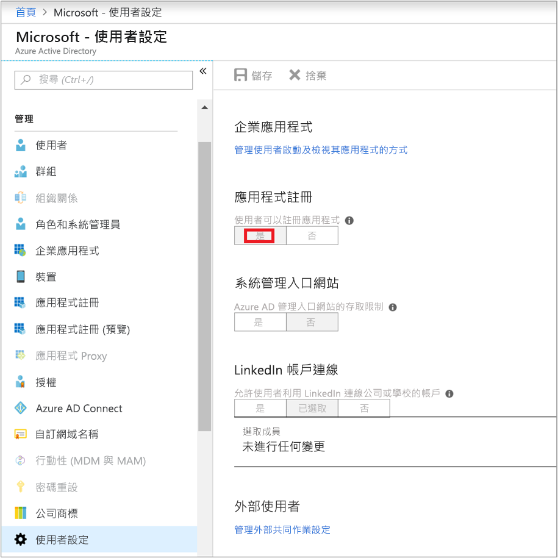
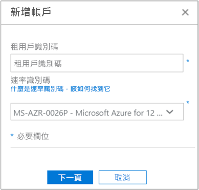
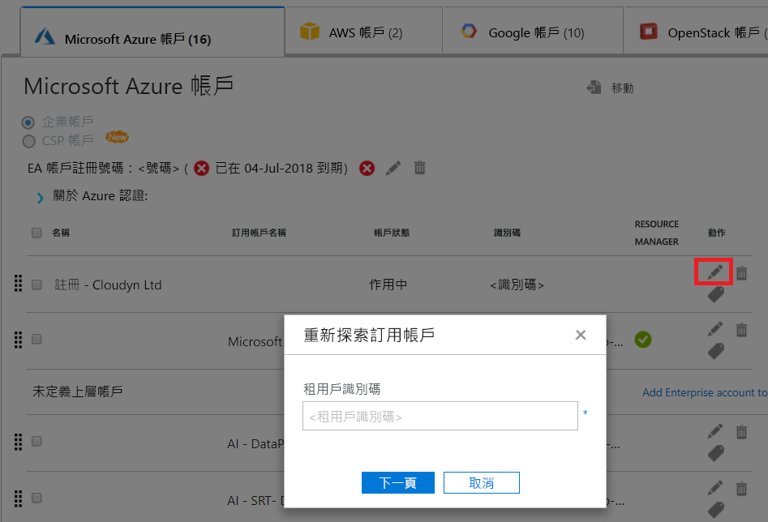

# <a name="activate-azure-subscriptions-and-accounts-with-cloudyn"></a>使用 Cloudyn 啟動 Azure 訂用帳戶與帳戶

新增或更新您的 Azure Resource Manager 認證，可讓 Cloudyn 探索 Azure 租用戶中的所有帳戶和訂用帳戶。 如果您也在虛擬機器上啟用 Azure 診斷擴充功能，則 Cloudyn 可以收集擴充計量，例如 CPU 和記憶體。 本文說明如何使用新的和現有帳戶的 Azure Resource Manager API 來啟用存取。 它也說明了如何解決常見的帳戶問題。

訂用帳戶若「未啟動」，Cloudyn 便無法存取大部分的 Azure 訂用帳戶資料。 您必須編輯「未啟動」的帳戶，Cloudyn 才能存取它們。

## <a name="required-azure-permissions"></a>必要的 Azure 權限

完成本文中的程序需要擁有特定權限。 您或您的租用戶管理員必須具有下列兩個權限：

- 向 Azure AD 租用戶註冊 CloudynCollector 應用程式的權限。
- 將應用程式指派給 Azure 訂用帳戶中角色的能力。

在您的 Azure 訂用帳戶中，您的帳戶必須具有 `Microsoft.Authorization/*/Write` 存取權，才能指派 CloudynCollector 應用程式。 此動作是[擁有者](../role-based-access-control/built-in-roles.md#owner)角色或[使用者存取系統管理員](../role-based-access-control/built-in-roles.md#user-access-administrator)角色來授與。

如果您的帳戶被指派**參與者**角色，您並沒有足夠的權限可指派應用程式。 嘗試將 CloudynCollector 應用程式指派到您的 Azure 訂用帳戶時，您會收到錯誤。

### <a name="check-azure-active-directory-permissions"></a>檢查 Azure Active Directory 權限

1. 登入 [Azure 入口網站](https://portal.azure.com)。
2. 在 Azure 入口網站中，選取 [Azure Active Directory]。
3. 在 Azure Active Directory 中，選取 [使用者設定]。
4. 檢查 [應用程式註冊] 選項。
    - 如果設定為 [是]，則非系統管理使用者可以註冊 AD 應用程式。 這個設定表示 Azure AD 租用戶中的任何使用者都可以註冊應用程式。  
    
    - 若將 [應用程式註冊] 選項設定為 [否]，則只有租用戶系統管理使用者可以註冊 Azure Active Directory 的應用程式。 您的租用戶系統管理員必須註冊 CloudynCollector 應用程式。


## <a name="add-an-account-or-update-a-subscription"></a>新增帳戶或更新訂用帳戶

當您新增帳戶或更新訂用帳戶時，您會將 Azure 資料的存取權授與 Cloudyn。

### <a name="add-a-new-account-subscription"></a>新增帳戶 (訂用帳戶)

1. 在 Cloudyn 入口網站中，按一下右上角的齒輪符號並選取 [雲端帳戶]。
2. 按一下 [新增帳戶]，[新增帳戶] 方塊隨即出現。 輸入必要資訊。  
    

### <a name="update-a-subscription"></a>更新訂用帳戶

1. 如果您想要在 [帳戶管理] 中更新 Cloudyn 中已存在的_未啟動_訂用帳戶，請按一下父代 [租用戶 GUID] 右側的編輯鉛筆符號。 訂用帳戶會分組歸類在一個父代租用戶之下，因此請避免個別啟用訂用帳戶。
    
2. 如有必要，請輸入租用戶識別碼。 如果您不知道您的租用戶識別碼，請使用下列步驟來尋找它：
    1. 登入 [Azure 入口網站](https://portal.azure.com)。
    2. 在 Azure 入口網站中，選取 [Azure Active Directory]。
    3. 若要取得租用戶識別碼，請選取 Azure AD 租用戶的 [屬性]。
    4. 複製目錄識別碼 GUID。 這個值是您的租用戶識別碼。
    如需詳細資訊，請參閱 [取得租用戶識別碼](../azure-resource-manager/resource-group-create-service-principal-portal.md#get-tenant-id)。
3. 如有必要，請選取您的費率識別碼。 如果您不知道您的費率識別碼，請使用下列步驟來尋找它。
    1. 在 Azure 入口網站的右上方，按一下使用者資訊，然後按一下 [檢視我的帳單]。
    2. 在 [計費帳戶] 下，按一下 [訂用帳戶]。
    3. 在 [我的訂用帳戶] 下，選取訂用帳戶。
    4. 費率識別碼會顯示在 [供應項目識別碼] 下方。 複製訂用帳戶的供應項目識別碼。
4. 在 [新增帳戶] (或[編輯訂用帳戶]) 方塊中，按一下 [儲存] (或 [下一步])。 您會被重新導向至 Azure 入口網站。
5. 登入入口網站。 按一下 [接受]，授權給 Cloudyn 收集器存取您的 Azure 帳戶。

    系統會將您重新導向至 Cloudyn Accounts 管理頁面，而且您的訂用帳戶會更新為**作用中**帳戶狀態。 它應會在 [Resource Manager] 資料行下顯示綠色核取記號符號。

    如果您沒有看到一個或多個訂用帳戶的綠色核取記號符號，這表示您沒有為訂用帳戶建立讀取器應用程式 (CloudynCollector) 的權限。 具有較高訂用帳戶權限的使用者必須重複此程序。

請觀看引導整個程序的[使用 Cloudyn 連線至 Azure Resource Manager](https://youtu.be/oCIwvfBB6kk) 影片。

>[!VIDEO https://www.youtube.com/embed/oCIwvfBB6kk?ecver=1]

## <a name="resolve-common-indirect-enterprise-set-up-problems"></a>解決常見的間接企業設定問題

當您第一次使用 Cloudyn 入口網站時，如果您是 Enterprise 合約或雲端解決方案提供者 (CSP) 使用者，您可能會看到下列訊息：

- 在 [設定 Cloudyn] 精靈中顯示*指定的 API 金鑰不是最上層的註冊金鑰*。
- 在 Enterprise 合約入口網站中顯示的「直接註冊 – 否」。
- 在 Cloudyn 入口網站中顯示的*找不到過去 30 天的使用方式資料。請連絡您的散發者以確定您的 Azure 帳戶已啟用標記*。

前面的訊息指出您透過轉銷商或雲端解決方案提供者購買了 Azure Enterprise 合約。 您的轉銷商或雲端解決方案提供者必須為您的 Azure 帳戶啟用「標記」，您才能在 Cloudyn 中檢視資料。

以下是修正問題的方法：

1. 您的轉銷商必須為您的帳戶啟用「標記」。 如需指示，請參閱[間接客戶上線指南](https://ea.azure.com/api/v3Help/v2IndirectCustomerOnboardingGuide)。
2. 您要產生用於 Cloudyn 的 Azure Enterprise 合約金鑰。 如需相關指示，請參閱[註冊 Azure Enterprise 合約並檢視成本資料](https://docs.microsoft.com/azure/cost-management/quick-register-ea)。

在您可以產生 Azure Enterprise 合約 API 金鑰以設定 Cloudyn 之前，您必須啟用 Azure 帳單 API，方法是遵循下列文章中的指示：

- [適用於企業客戶的報告 API 概觀](../billing/billing-enterprise-api.md)
- **啟用對 API 的資料存取**下的 [Microsoft Azure 企業版入口網站報告 API](https://ea.azure.com/helpdocs/reportingAPI)

您可能也需要提供部門管理員、帳戶擁有者，以及企業管理員等權限，才能使用帳單 API「檢視費用」。

只有 Azure 服務系統管理員可以啟用 Cloudyn。 共同管理員的權限不足。 不過，您可以因應系統管理員需求。 您可以要求 Azure Active Directory 系統管理員授與透過 PowerShell 指令碼授權 **CloudynAzureCollector** 的權限。 下列指令碼授與註冊 Azure Active Directory 服務主體 **CloudynAzureCollector** 的權限。


```
#THE SOFTWARE IS PROVIDED "AS IS", WITHOUT WARRANTY OF ANY KIND, EXPRESS OR IMPLIED, INCLUDING BUT NOT LIMITED TO THE WARRANTIES OF MERCHANTABILITY, FITNESS FOR A PARTICULAR PURPOSE AND NONINFRINGEMENT. IN NO EVENT SHALL THE AUTHORS OR COPYRIGHT HOLDERS BE LIABLE FOR ANY CLAIM, DAMAGES OR OTHER LIABILITY, WHETHER IN AN ACTION OF CONTRACT, TORT OR OTHERWISE, ARISING FROM, OUT OF OR IN CONNECTION WITH THE SOFTWARE OR THE USE OR OTHER DEALINGS IN THE SOFTWARE.

#Tenant - enter your tenant ID or Name
$tenant = "<ReplaceWithYourTenantID>"

#Cloudyn Collector application ID
$appId = "83e638ef-7885-479f-bbe8-9150acccdb3d"

#URL to activate the consent screen
$url = "https://login.windows.net/"+$tenant+"/oauth2/authorize?api-version=1&response_type=code&client_id="+$appId+"&redirect_uri=http%3A%2F%2Flocalhost%3A8080%2FCloudynJava&prompt=consent"

#Choose your browser, the default is Internet Explorer

#Chrome
#[System.Diagnostics.Process]::Start("chrome.exe", "--incognito $url")

#Firefox
#[System.Diagnostics.Process]::Start("firefox.exe","-private-window $url" )

#IExplorer
[System.Diagnostics.Process]::Start("iexplore.exe","$url -private" )

```

## <a name="next-steps"></a>後續步驟

- 如果您尚未完成 Cloudyn 的第一個教學課程，請閱讀[檢閱使用量和成本](tutorial-review-usage.md)。
