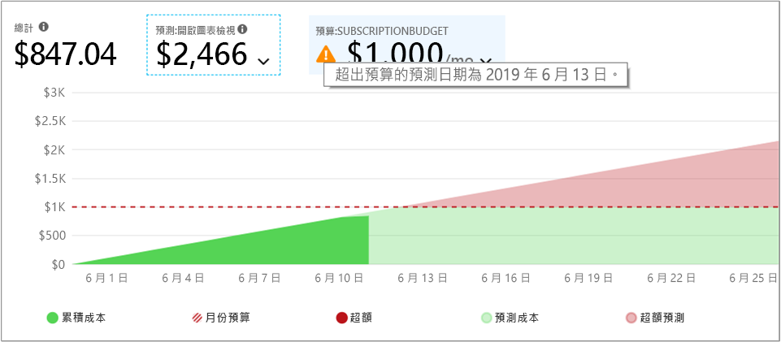
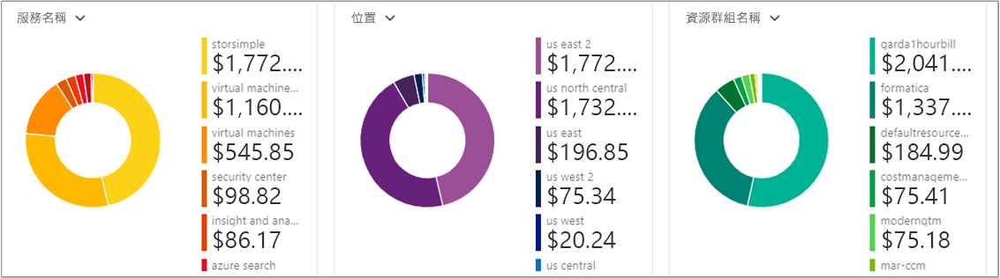

# <a name="quickstart-explore-and-analyze-costs-with-cost-analysis"></a>快速入門：使用成本分析探索及分析成本

您必須先了解成本源自組織內的何處，才能正確地控制 Azure 成本並進行最佳化。 了解您服務成本的價值，以及支援哪些環境和系統也很實用。 使各個層面的成本透明化，對於精確地了解組織費用模式而言至關重要。 費用模式可用於強制執行成本控制機制 (例如預算)。

在本快速入門中，您可以使用成本分析來探索及分析組織成本。 您可依組織檢視彙總的成本，以了解經過一段時間所產生的成本，並找出費用趨勢。 您可以檢視經過一段時間累積的成本，對照預算來預估每月、每季，或甚至每年的成本趨勢。 預算有助於遵守財務限制。 預算同時也能用於檢視每天或每月的成本，以找出費用的異常情況。 此外，您可以下載目前報表的資料以供進一步分析，或在外部系統中使用。

在此快速入門中，您可了解如何：

- 在成本分析中檢閱成本
- 自訂成本檢視
- 下載成本分析資料


## <a name="prerequisites"></a>必要條件

成本分析支援不同的 Azure 帳戶類型。 若要檢視所支援帳戶類型的完整清單，請參閱[了解成本管理資料](understand-cost-mgt-data.md)。 若要檢視成本資料，您至少需要 Azure 帳戶的讀取存取。

針對 [Enterprise 合約 (EA)](https://azure.microsoft.com/pricing/enterprise-agreement/) 客戶，您必須至少具備一或多個下列範圍的讀取存取，才能檢視成本資料。

- 計費帳戶
- department
- 註冊帳戶
- 管理群組
- 訂用帳戶
- 資源群組

如需成本管理資料的存取權指派詳細資訊，請參閱[指派資料的存取權](assign-access-acm-data.md)。

## <a name="sign-in-to-azure"></a>登入 Azure

- 在 https://portal.azure.com 登入 Azure 入口網站。

## <a name="review-costs-in-cost-analysis"></a>在成本分析中檢閱成本

若要在成本分析中檢閱您的成本，請在 Azure 入口網站中開啟範圍，然後選取功能表中的 [成本分析]  。 例如，瀏覽至 [訂用帳戶]  、從清單中選取訂用帳戶，然後在功能表中選取 [成本分析]  。 使用 [範圍]  框，以切換至成本分析中的不同範圍。 如需有關範圍的詳細資訊，請參閱[了解並使用範圍](understand-work-scopes.md)。

您選取的範圍會在成本管理過程中全程使用，以提供資料彙總，並控制成本資訊的存取權。 當您使用範圍時，您不會多重選取。 而是會選取一個其他人所積存的較大範圍，然後篩選出需要的巢狀範圍。 了解這個方法很重要，因為某些人並沒有單一父項範圍 (包含多個巢狀範圍) 的存取權。

最初的成本分析檢視包含下列區域：

**累積成本檢視** – 代表預先定義的成本分析檢視組態。 每個檢視都包含日期範圍、資料粒度、分組依據和篩選條件設定。 預設檢視會顯示目前計費週期的累積成本，但您也可以將其變更為顯示其他內建檢視。 如需詳細資訊，請參閱[自訂成本檢視](#customize-cost-views)。

**實際成本** – 顯示當月所產生的實際使用量和購買成本，這些資料也會在您的帳單上顯示。

**預測** – 顯示所選期間的總預測成本 (預測功能目前為預覽版)。

**預算**：顯示已針對所選取範圍規劃的費用限制 (如果有的話)。

**累積資料粒度**：顯示從計費週期起始日開始的每日成本累積總額。 在為計費帳戶或訂用帳戶[建立預算](tutorial-acm-create-budgets.md)之後，即可對照預算，快速查看費用趨勢。 將滑鼠停留在一個日期上方，即可檢視累積到當天的費用。

**樞紐分析圖 (環圈圖)** – 提供動態樞紐分析，將總成本依一組常用的標準屬性進行細分。 它們會以從最高成本排到最低成本的順序，顯示當月成本記錄。 您隨時都可選取不同的樞紐分析表來變更樞紐分析圖。 成本分類依據：服務 (計量類別)、位置 (區域)，以及子範圍 (預設)。 例如，計費帳戶下的註冊帳戶、訂用帳戶下的資源群組，以及資源群組下的資源。


## <a name="customize-cost-views"></a>自訂成本檢視

成本分析具備四個內建的檢視，並已針對最常見的目標最佳化：

檢視 | 回答類似以下所列的問題...
--- | ---
累積成本 | 我這個月到目前為止支出了多少費用？ 我將維持在預算範圍內嗎？
每日成本 | 過去 30 天每天的成本是否增加？
依服務區分的成本 | 為什麼過去 3 張發票列出的每月使用量落差很大？
依資源區分的成本 | 這個月到目前為止，哪一項資源最花錢？


不過，在許多情況下，您需要更深入的分析。 自訂會從選取頁面上方的日期開始。

成本分析預設會顯示當月的資料。 請使用日期選取器快速切換至一般的日期範圍。 幾個範例包括過去七天、過去一個月、今年，或自訂日期範圍。 隨用隨付訂用帳戶也會包含以您的計費週期 (例如目前或上一張發票的計費週期) 為依據的資料範圍，且計費週期不受日曆月份限制。 可使用功能表頂端的 [< 上一個]  和 [下一個 >]  連結，分別跳至上一個或下一個週期。 例如，[< 上一個]  會從過去七天切換至之前 8 到 14 天，然後再切換到之前 15 至 21 天。


此外，成本分析預設會顯示**累積**的成本。 累積的成本會包含每一天和之前天數的所有成本，以提供每日累積成本的持續成長檢視。 此檢視已經過最佳化，可顯示對照於所選時間範圍，您的預算趨勢為何。

當您使用預測圖表檢視時，您可以找出潛在的預算缺口。 若有潛在的預算缺口，便會以紅色字體顯示預計的超額支出。 圖表中也會顯示指標符號。 將滑鼠停留在該符號上，便會顯示估計會產生預算缺口的日期。



另外，還有**每日**檢視，可顯示每一天的成本。 每日檢視並不會顯示成長趨勢。 因為成本尖峰或下降每日各有不同，所以該檢視設計為可顯示異常。 若您選取了預算，則每日檢視也會顯示每日預算的估計值。 若您的每日成本持續高於估計的每日預算，則您可預期將會超過每月預算。 估計的每日預算只是協助您在較低層級將預算視覺化的一種方法。 當您的每日成本出現波動時，則相較於您的每月預算，估計的每日預算較不精準。

以下是開啟了費用預測的最新費用每日檢視。


若關閉費用預測，就不會看到未來日期的預計花費。 此外，當您查看過去時段的成本時，成本預測也不會顯示成本。

一般而言，您可以預期會在 8 到 12 小時內看到已耗用資源的資料或通知。


可使用 [分組方式]  依適用屬性分組，以細分成本並識別成本最高的參與者。 例如，若要依資源標記分組，請選取要作為分組方式的標記索引鍵。 系統就會依每個標記值細分成本，並提供一個額外區段以顯示未套用該標記的資源。

大部分的 [Azure 資源可支援標記](../azure-resource-manager/tag-support.md)，但某些標記無法在成本管理和計費中使用。 此外，也不支援資源群組標記。 只有在資源標記直接套用到資源的那天起，成本管理才會支援資源標記。 觀看[如何使用 Azure 成本管理檢閱標記原則](https://www.youtube.com/watch?v=nHQYcYGKuyw)影片，了解如何運用 Azure 標記原則提升成本資料可見性。

以下是當月 Azure 服務成本的檢視。


根據預設，成本分析會顯示所有產生的使用量和購買成本，且這些資料也會顯示在您的發票上，而這也稱為**實際成本**。 檢視實際成本適合用來進行發票對帳；不過，如果您留意費用異常之處和其他成本變化，購買成本激增可能會讓您感到擔憂。 若要讓因為購買保留容量而造成成本激增的情形消失，請切換為 [分攤成本]  。 


分攤成本會將購買的保留容量細分成每日區塊，並將其分散到保留容量期間的整個時段。 例如，您不會看到 1 月 1 日購買了 365 美元，而是會看到 1 月 1 日到 12 月 31 日每天購買 1 美元。 除了基本分攤，這些成本也會重新配置，並與使用該保留容量的特定資源相關聯。 例如，如果該筆 1 美元的每日費用由兩部虛擬機器分攤，您會看到當天有兩筆 0.50 美元的費用。 如果當天並未使用部分保留容量，您會看到一筆與適用虛擬機器相關聯的 0.50 美元費用，以及一筆收費類型為 `UnusedReservation` 的 0.50 美元費用。 請注意，只有在檢視分攤成本時，才會看到未使用的保留容量成本。

由於成本的呈現方式會改變，請務必注意實際成本和分攤成本檢視所顯示的總額會不同。 一般情況下，在檢視分攤成本時，有購買保留容量的月份，其總成本會減少，而在購買保留容量後的月份，則會增加。 分攤功能僅適用於購買的保留容量，目前並不適用於 Marketplace 的購買項目。

下圖顯示資源群組名稱。 您可以依標籤分組以檢視每個標籤的總成本，也可以使用**依資源的成本**檢視以查看特定資源的所有標籤。


依特定屬性將成本分組時，會以最高至最低的順序，顯示前 10 名成本參與者。 如果參與者超過 10 個，前 9 個成本參與者會以一個 [其他]  群組的方式顯示，裡面涵蓋了所有剩餘的群組。 依標記分組時，您可能也會看到 [未標記]  群組，表示未套用標記索引鍵的成本。 **未標記**一律放在最後，即使未標記的成本高於已標記的成本也一樣。 如果有 10 個以上的標記值存在，未標記的成本會包含在 [其他]  中。

「傳統」  虛擬機器、網路和儲存體資源不會共用詳細的計費資料。 這些資源會在成本分組時合併成 [傳統服務]  。

主要圖表下的樞紐分析圖會顯示不同的群組，可讓您用更廣泛的視角來檢視所選期間和篩選條件下的整體成本。 選取屬性或標記來檢視以任何維度彙總的成本。



您可以檢視任何檢視的完整資料集。 您所套用的任何選取項目或篩選條件都會影響所顯示的資料。 若要查看完整的資料集，請按一下 [圖表類型]  清單，然後按一下 [資料表]  檢視。


## <a name="understanding-grouping-and-filtering-options"></a>了解群組和篩選選項

下表列出一些最常見的群組和篩選選項，以及其使用時機。

| 屬性 | 使用時機 |
| --- | --- |
| **計費週期** | 依發票月份細分成本。 適用於隨用隨付和開發/測試訂用帳戶的重要屬性，不會繫結至行事曆月份。 EA/MCA 帳戶可以在日期選擇器和/或每月資料粒度中使用行事曆月份，來達到相同目標。 |
| **收費類型** | 細分使用量、購買金額、退款和未使用的保留容量成本。 只有在使用動作成本且不是位於分攤成本時，才可使用購買的保留容量和退款。 只有在查看分攤成本時，才可使用未使用的保留容量成本。 |
| **雲端** | 依 AWS 和 Azure 細分成本。 只有從管理群組、外部計費帳戶和外部訂用帳戶，才可使用 AWS 成本。 |
| **部門** / **發票區段** | 依 EA 部門或 MCA 發票區段細分成本。 僅適用於 EA/MCA 計費帳戶和 MCA 帳單設定檔。 |
| **註冊帳戶** | 依照 EA 帳戶擁有者細分成本。 僅適用於 EA 計費帳戶和部門。 |
| **頻率** | 細分以使用量為基礎、一次性和週期性的成本。 |
| **計量** | 依 Azure 使用量計量細分成本。 僅適用於 Azure 使用量。 所有的購買項目和 Marketplace 使用量會顯示「未指定」或「未指派」。 |
| **發行者類型** | 細分 AWS、Azure 和 Marketplace 成本。 |
| **保留容量** | 依保留容量細分成本。 未包含保留容量的任何使用量都會顯示為「未指定」。 |
| **Resource** | 依資源細分成本。 所有購買項目都會顯示為「未指定」，因為其套用在 EA/PAYG 計費帳戶或 MCA 帳單設定檔層級。  |
| **資源群組** | 依資源群組細分成本。 僅適用於非傳統使用量。 傳統的資源使用量會顯示「其他」，購買項目則會顯示「未指定」。 |
| **資源類型** | 依資源類型細分成本。 僅適用於非傳統使用量。 傳統的資源使用量會顯示「其他」，購買項目則會顯示「未指定」。 |
| **服務名稱**或**計量類別** | 依 Azure 服務細分成本。 僅適用於 Azure 使用量。 所有的購買項目和 Marketplace 使用量會顯示「未指定」或「未指派」。 |
| **服務層**或**計量子類別** | 依 Azure 使用量計量子類別細分成本。 僅適用於 Azure 使用量。 所有的購買項目和 Marketplace 使用量會顯示「未指定」或「未指派」。 |
| **訂用帳戶** | 依訂用帳戶細分成本。 所有購買項目都會顯示「未指定」。 |
| **Tag** | 依特定標籤金鑰的標籤值細分成本。 |

如需術語的詳細資訊，請參閱[了解 Azure 使用量和費用檔案中所使用的術語](../billing/billing-understand-your-usage.md)。


## <a name="saving-and-sharing-customized-views"></a>儲存和共用自訂檢視

若要儲存自訂檢視並與其他人共用，請將成本分析釘選到 Azure 入口網站儀表板，或是複製成本分析的連結。 

若要釘選成本分析，請按一下右上角的釘選圖示。 釘選成本分析只會儲存主要的圖表或資料表檢視 (若已選取該檢視)。 請共用儀表板來讓其他人可以存取圖格。 請注意，這只會共用儀表板設定，而不會授與其他人存取基礎資料的權利。 如果有人沒有成本存取權，卻可以存取共用儀表板，該名人員會看到拒絕存取的訊息。

若要共用成本分析的連結，請按一下刀鋒視窗頂端的 [共用]  命令。 此時會顯示自訂 URL，並開啟此特定範圍的此特定檢視。 如果沒有成本存取權的人員取得此 URL，該名人員便會看到拒絕存取訊息。 

若要深入了解如何為每個支援範圍授與其成本的存取權，請檢閱[了解和使用範圍](understand-work-scopes.md)。

## <a name="automation-and-offline-analysis"></a>自動化和離線分析

有時候當您需要下載資料以便進一步分析時，請將其合併到您的自有資料中，或將其整合到您的自有系統。 成本管理功能可在這方面提供一些選項。 作為起點，如果您需要特定高階摘要 (例如您在成本分析內所獲得的內容)，請建置您需要的檢視再加以下載，方法是按一下 [匯出]  ，然後選取 [將資料下載到 CSV]  或 [將資料下載到 Excel]  。 下載到 Excel 可針對您用來產生所下載資料的檢視提供額外的內容，例如範圍、查詢設定、總計和產生日期。

如果您需要完整的未彙總資料集，請從計費帳戶下載。 從入口網站左側導覽中的服務清單，移至 [成本管理 + 計費] > (如果情況適用，請選取您的計費帳戶) > [使用量 + 費用]，然後按一下所需計費週期的 [下載] 圖示。

如果您需要自動取得成本資料，方法很類似：使用[查詢 API](/rest/api/cost-management/query) 以便獲得更豐富的動態篩選、群組和彙總等分析功能，或使用 [UsageDetails API](/rest/api/consumption/usageDetails) 來獲得完整的未彙總資料集。 這些 API 的正式上市版本為 2019-01-01。 若要能夠在這些 API 內存取預覽版的保留容量和 Marketplace 購買項目，請使用 **2019-04-01-preview**。 

例如，我們想要取得依費用類型 (使用量、購買項目或退款)、發行者類型 (Azure 或 Marketplace)、資源群組 (若為購買項目則空白) 和保留容量 (如果不適用則會空白) 細分分攤成本的彙總檢視。

```
POST https://management.azure.com/{scope}/providers/Microsoft.CostManagement/query?api-version=2019-04-01-preview
Content-Type: application/json
 
{
  "type": "AmortizedCost",
  "timeframe": "Custom",
  "timePeriod": { "from": "2019-04-01", "to": "2019-04-30" },
  "dataset": {
    "granularity": "None",
    "aggregation": {
      "totalCost": { "name": "PreTaxCost", "function": "Sum" }
    },
    "grouping": [
      { "type": "dimension", "name": "ChargeType" },
      { "type": "dimension", "name": "PublisherType" },
      { "type": "dimension", "name": "Frequency" },
      { "type": "dimension", "name": "ResourceGroup" },
      { "type": "dimension", "name": "SubscriptionName" },
      { "type": "dimension", "name": "SubscriptionId" },
      { "type": "dimension", "name": "ReservationName" },
      { "type": "dimension", "name": "ReservationId" },
    ]
  },
}
```

而且，如果您不需要彙總的資料而想要完整的原始資料集：

```
GET https://management.azure.com/{scope}/providers/Microsoft.Consumption/usageDetails?metric=AmortizedCost&$filter=properties/usageStart+ge+'2019-04-01'+AND+properties/usageEnd+le+'2019-04-30'&api-version=2019-04-01-preview
```

如果您需要實際成本功能顯示所產生的購買項目，請將 [類型/計量]   變更為 [ActualCost]  。 如需這些 API 的詳細資訊，請參閱[查詢](/rest/api/cost-management/query)和 [UsageDetails](/rest/api/consumption/usageDetails) API 文件。 請注意，所發佈的文件乃適用於正式上市版本，但這兩份文件的內容對於 2019-04-01-preview API 版本來說都一樣，只有新類型/計量屬性和已變更的屬性名稱會有不同。 (下面會有更多關於屬性名稱的說明。)
 
成本管理 API 可在上述資源的所有範圍內運作。 也就是透過 Azure RBAC 存取的資源群組、訂用帳戶和管理群組；EA 計費帳戶 (註冊)；部門；以及透過 EA 入口網站存取的註冊帳戶等等。 請於[了解和使用範圍](understand-work-scopes.md)中深入了解範圍，包括如何確定範圍識別碼和/或管理存取權。

## <a name="next-steps"></a>後續步驟

請前進到第一個教學課程，了解如何建立及管理預算。

> [!div class="nextstepaction"]
> [建立及管理預算](tutorial-acm-create-budgets.md)
