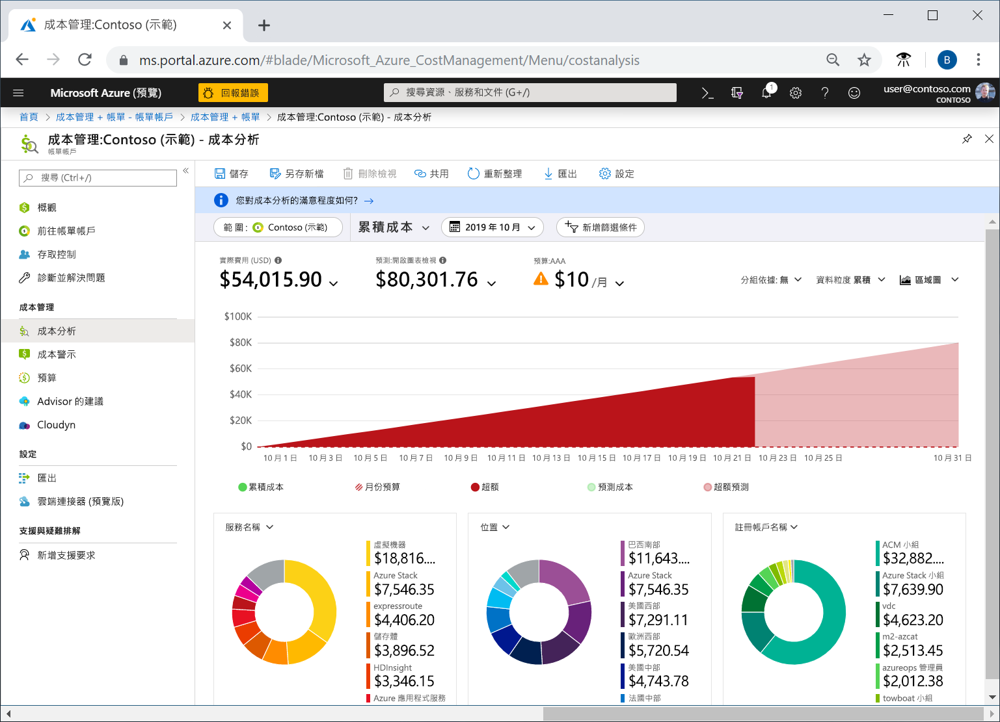
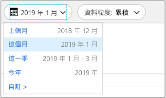
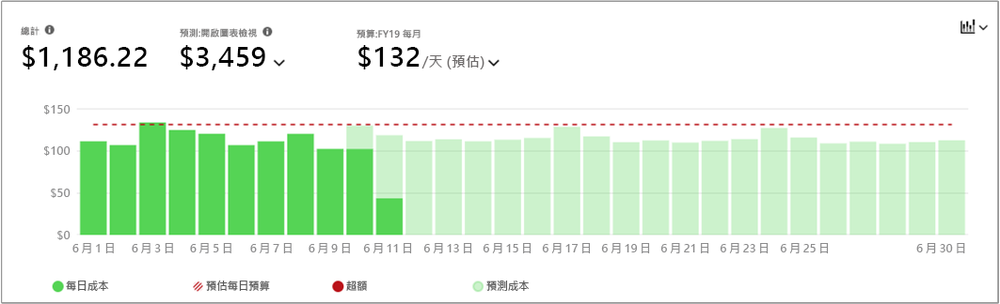
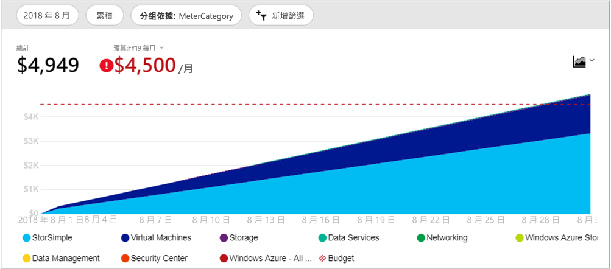
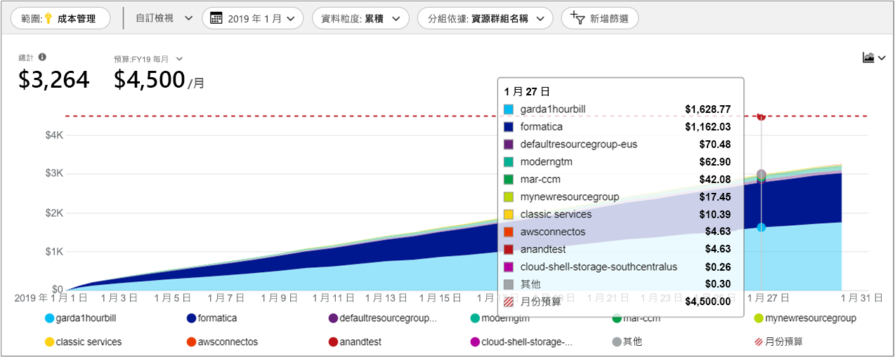

# 快速入門：利用成本分析探索及分析成本

您必須先了解成本源自組織內的何處，才能正確地控制 Azure 成本並進行最佳化。 了解您服務成本的價值，以及支援哪些環境和系統也很實用。 使各個層面的成本透明化，對於精確地了解組織費用模式而言至關重要。 費用模式可用於強制執行成本控制機制 (例如預算)。

在本快速入門中，您可以使用成本分析來探索及分析組織成本。 您可依組織檢視彙總的成本，以了解經過一段時間所產生的成本，並找出費用趨勢。 您可以檢視經過一段時間累積的成本，對照預算來預估每月、每季，或甚至每年的成本趨勢。 預算則有助於提供者能遵循財務的約束。 預算同時也能用於檢視每天或每月的成本，以找出費用的異常情況。 此外，您可以下載目前報表的資料以供進一步分析，或在外部系統中使用。

在此快速入門中，您可了解如何：

- 在成本分析中檢閱成本
- 自訂成本檢視
- 下載成本分析資料

## 必要條件

成本分析適用於所有 [Enterprise 合約 (EA)](https://azure.microsoft.com/pricing/enterprise-agreement/) 客戶。 您必須至少具備一或多個下列範圍的讀取存取，才能檢視成本資料。

- 「計費帳戶」範圍定義於 https://ea.azure.com，而且需要企業系統管理員存取權。 不需要任何事先的 EA 設定。 成本分析中的計費資訊會針對 Enterprise 合約中的所有訂用帳戶合併。 計費帳戶通常稱為「Enterprise 合約」或「註冊」。

- 「部門」範圍定義於 https://ea.azure.com，而且需要部門系統管理員存取權。 EA 入口網站中啟用的 [DA 檢視費用] 設定是必要的設定。 成本分析中的計費資訊會針對屬於部門所連結註冊帳戶的所有訂用帳戶合併。

- 「註冊帳戶」範圍定義於 https://ea.azure.com，而且需要帳戶擁有者存取權。 EA 入口網站中啟用的 [AO 檢視費用] 設定是必要的設定。 成本分析中的計費資訊會針對屬於註冊帳戶的所有訂用帳戶合併。 註冊帳戶通常稱為「帳戶擁有者」。

- 「管理群組」範圍定義於 https://portal.azure.com，而且需要「成本管理讀者」(或「讀者」) 存取權。 EA 入口網站中啟用的 [AO 檢視費用] 設定是必要的設定。 成本分析中的計費資訊會針對管理群組下面的所有訂用帳戶合併。

- 「訂用帳戶」範圍定義於 https://portal.azure.com，而且需要「成本管理讀者」(或「讀者」) 存取權。 EA 入口網站中啟用的 [AO 檢視費用] 設定是必要的設定。 成本分析中的計費資訊會針對訂用帳戶中的所有資源和資源群組合併。

- 「資源群組」範圍定義於 https://portal.azure.com，而且需要「成本管理讀者」(或「讀者」) 存取權。 EA 入口網站中啟用的 [AO 檢視費用] 設定是必要的設定。 成本分析中的計費資訊會針對資源群組中的所有資源合併。

如需設定 [DA 檢視費用] 和 [AO 檢視費用] 設定的詳細資訊，請參閱[啟用成本存取權](../billing/billing-enterprise-mgmt-grp-troubleshoot-cost-view.md#enabling-access-to-costs)。

## 登入 Azure

- 在 http://portal.azure.com 登入 Azure 入口網站。

## 在成本分析中檢閱成本

若要使用成本分析來檢閱成本，請在 Azure 入口網站中瀏覽至 [成本管理 + 計費] &gt; [成本帳戶] &gt; [變更範圍]，選擇範圍，然後按一下 [選取]。

您選取的範圍使用於成本管理，可提供資料彙總，以及控制成本資訊的存取權。 當您使用範圍時，您不會多重選取。 然而，您可以選取其他人所彙總至的較大範圍，然後篩選出您想要的範圍。 請務必了解因為有些人不得存取子範圍所彙總至的父代範圍。

按一下 [開啟成本分析]。

最初的成本分析檢視包含下列區域：

**總計**：顯示當月的總成本。

**預算**：顯示已針對所選取範圍規劃的費用限制 (如果有的話)。

**累積成本**：顯示累算的每日費用總計，從當月月初開始。 在為計費帳戶或訂用帳戶[建立預算](tutorial-acm-create-budgets.md)之後，即可對照預算，快速查看費用趨勢。 將滑鼠停留在一個日期上方，即可檢視累積到當天的費用。

**樞紐分析圖 (環圈圖)** – 提供動態樞紐分析，將總成本依一組常用的標準屬性進行細分。 其會以最高到最低的方式，顯示當月累算的成本。 您隨時都可選取不同的樞紐分析表來變更樞紐分析圖。 成本分類依據：服務 (計量類別)、位置 (區域)，以及子範圍 (預設)。 例如，計費帳戶下的註冊帳戶、訂用帳戶下的資源群組，以及資源群組下的資源。

## 自訂成本檢視

預設檢視會提供常見問題的快速解答，例如：

- 我已經花費了多少？
- 我將維持在預算範圍內嗎？

不過，在許多情況下，您需要更深入的分析。 自訂會從選取頁面上方的日期開始。

成本分析預設會顯示當月的資料。 使用日期選取器可快速切換到：上個月、這個月、這個曆季、這個曆年或您選擇的自訂日期範圍。 選取上個月是分析最新 Azure 發票並輕鬆核對費用的最快速方式。 當季和當年選項有助於針對較長期的預算追蹤成本。 您也可以選取其他日期範圍。 例如，您可選取單一天、過去七天，或是當月之前一年內的任何日期範圍。

此外，成本分析預設會顯示**累積**的成本。 累積的成本包含除了前幾天之外每一天的所有成本，適用於對您每日累算的成本進行持續成長的檢視。 此檢視已經過最佳化，可顯示對照於所選時間範圍，您的預算趨勢為何。

另外，還有**每日**檢視，可顯示每一天的成本。 每日檢視並不會顯示成長趨勢。 因為成本尖峰或下降每日各有不同，所以該檢視設計為可顯示異常。 若您選取了預算，則每日檢視也會顯示每日預算的估計值。 若您的每日成本持續高於估計的每日預算，則您可預期將會超過每月預算。 估計的每日預算只是協助您在較低層級將預算視覺化的一種方法。 當您的每日成本出現波動時，則相較於您的每月預算，估計的每日預算較不精準。

您可以**分組**，以選取群組類別來變更顯示於最上方總計區域圖表中的資料。 分組可讓您快速查看如何依資源類型來將費用分類。 以下是上個月檢視的 Azure 服務成本檢視。

最上層的總計檢視下之樞紐分析圖，所顯示的檢視會有不同的分組與篩選類別。 當您選取任何群組類別時，檢視底部會有一組適用於總計檢視的完整資料。 以下是資源群組的範例。

上圖顯示資源群組名稱。 任何成本分析檢視、篩選或分組，都不提供資源的檢視標記。

依照特定屬性進行成本分組時，會顯示排名前十個成本參與者 (最高至最低)。 如果有超過 10 個群組，則會顯示排名前九個成本參與者，以及 [其他] 群組，其中涵蓋了所有剩餘的群組。

「傳統」 (Azure 服務管理或 ASM) 虛擬機器、網路和儲存體資源不會共用詳細的計費資料。 這些資源會在成本分組時合併成 [傳統服務]。

## 下載成本分析資料

您可以從成本分析**下載**資訊，為目前顯示於 Azure 入口網站中的所有資料，產生一個 CSV 檔案。 您套用的所有篩選或分組，都會包含在該檔案中。 未主動顯示的最上方總計圖下之資料，會納入該 CSV 檔案中。

## 後續步驟

請前進到第一個教學課程，了解如何建立及管理預算。

> [!div class="nextstepaction"]
> [建立及管理預算](tutorial-acm-create-budgets.md)
