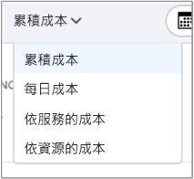

# 快速入門：使用成本分析探索及分析成本

您必須先了解成本源自組織內的何處，才能正確地控制 Azure 成本並進行最佳化。 了解您服務成本的價值，以及支援哪些環境和系統也很實用。 使各個層面的成本透明化，對於精確地了解組織費用模式而言至關重要。 費用模式可用於強制執行成本控制機制 (例如預算)。

在本快速入門中，您可以使用成本分析來探索及分析組織成本。 您可依組織檢視彙總的成本，以了解經過一段時間所產生的成本，並找出費用趨勢。 您可以檢視經過一段時間累積的成本，對照預算來預估每月、每季，或甚至每年的成本趨勢。 預算有助於遵守財務限制。 預算同時也能用於檢視每天或每月的成本，以找出費用的異常情況。 此外，您可以下載目前報表的資料以供進一步分析，或在外部系統中使用。

在此快速入門中，您可了解如何：

- 在成本分析中檢閱成本
- 自訂成本檢視
- 下載成本分析資料

## 必要條件

成本分析支援不同的 Azure 帳戶類型。 若要檢視所支援帳戶類型的完整清單，請參閱[了解成本管理資料](understand-cost-mgt-data.md)。 若要檢視成本資料，您至少需要 Azure 帳戶的讀取存取。

針對 [Enterprise 合約 (EA)](https://azure.microsoft.com/pricing/enterprise-agreement/) 客戶，您必須至少具備一或多個下列範圍的讀取存取，才能檢視成本資料。

- 計費帳戶
- department
- 註冊帳戶
- 管理群組
- 訂用帳戶
- 資源群組

如需成本管理資料的存取權指派詳細資訊，請參閱[指派資料的存取權](assign-access-acm-data.md)。

## 登入 Azure

- 在 https://portal.azure.com 登入 Azure 入口網站。

## 在成本分析中檢閱成本

若要在成本分析中檢閱您的成本，請在 Azure 入口網站中開啟範圍，然後選取功能表中的 [成本分析]  。 例如，瀏覽至 [訂用帳戶]  、從清單中選取訂用帳戶，然後在功能表中選取 [成本分析]  。 使用 [範圍]  框，以切換至成本分析中的不同範圍。 如需有關範圍的詳細資訊，請參閱[了解並使用範圍](understand-work-scopes.md)。

您選取的範圍會在成本管理過程中全程使用，以提供資料彙總，並控制成本資訊的存取權。 當您使用範圍時，您不會多重選取。 而是會選取一個其他人所積存的較大範圍，然後篩選出需要的巢狀範圍。 了解這個方法很重要，因為某些人並沒有單一父項範圍 (包含多個巢狀範圍) 的存取權。

最初的成本分析檢視包含下列區域：

**總計**：顯示當月的總成本。

**預算**：顯示已針對所選取範圍規劃的費用限制 (如果有的話)。

**累積成本**：顯示從當月月初開始記錄的每日費用累積總計。 在為計費帳戶或訂用帳戶[建立預算](tutorial-acm-create-budgets.md)之後，即可對照預算，快速查看費用趨勢。 將滑鼠停留在一個日期上方，即可檢視累積到當天的費用。

**樞紐分析圖 (環圈圖)** – 提供動態樞紐分析，將總成本依一組常用的標準屬性進行細分。 它們會以從最高成本排到最低成本的順序，顯示當月成本記錄。 您隨時都可選取不同的樞紐分析表來變更樞紐分析圖。 成本分類依據：服務 (計量類別)、位置 (區域)，以及子範圍 (預設)。 例如，計費帳戶下的註冊帳戶、訂用帳戶下的資源群組，以及資源群組下的資源。

## 自訂成本檢視

成本分析具備四個內建的檢視，並已針對最常見的目標最佳化：

檢視 | 回答類似以下所列的問題...
--- | ---
累積成本 | 我這個月到目前為止支出了多少費用？ 我將維持在預算範圍內嗎？
每日成本 | 過去 30 天每天的成本是否增加？
依服務區分的成本 | 為什麼過去 3 張發票列出的每月使用量落差很大？
依資源區分的成本 | 這個月到目前為止，哪一項資源最花錢？

不過，在許多情況下，您需要更深入的分析。 自訂會從選取頁面上方的日期開始。

成本分析預設會顯示當月的資料。 請使用日期選取器快速切換至一般的日期範圍。 幾個範例包括過去七天、過去一個月、今年，或自訂日期範圍。 隨用隨付訂用帳戶也會包含以您的計費週期 (例如目前或上一張發票的計費週期) 為依據的資料範圍，且計費週期不受日曆月份限制。 可使用功能表頂端的 [< 上一個]  和 [下一個 >]  連結，分別跳至上一個或下一個週期。 例如，[< 上一個]  會從過去七天切換至之前 8 到 14 天，然後再切換到之前 15 至 21 天。

此外，成本分析預設會顯示**累積**的成本。 累積的成本會包含每一天和之前天數的所有成本，以提供每日累積成本的持續成長檢視。 此檢視已經過最佳化，可顯示對照於所選時間範圍，您的預算趨勢為何。

另外，還有**每日**檢視，可顯示每一天的成本。 每日檢視並不會顯示成長趨勢。 因為成本尖峰或下降每日各有不同，所以該檢視設計為可顯示異常。 若您選取了預算，則每日檢視也會顯示每日預算的估計值。 若您的每日成本持續高於估計的每日預算，則您可預期將會超過每月預算。 估計的每日預算只是協助您在較低層級將預算視覺化的一種方法。 當您的每日成本出現波動時，則相較於您的每月預算，估計的每日預算較不精準。

一般而言，您可以預期會在 8 到 12 小時內看到已耗用資源的資料或通知。

可使用 [分組方式]  依適用屬性分組，以細分成本並識別成本最高的參與者。 例如，若要依資源標記分組，請選取要作為分組方式的標記索引鍵。 系統就會依每個標記值細分成本，並提供一個額外區段以顯示未套用該標記的資源。

大部分的 [Azure 資源可支援標記](../azure-resource-manager/tag-support.md)，但某些標記無法在成本管理和計費中使用。 此外，也不支援資源群組標記。 只有在資源標記直接套用到資源的那天起，成本管理才會支援資源標記。 觀看[如何使用 Azure 成本管理檢閱標記原則](https://www.youtube.com/watch?v=nHQYcYGKuyw)影片，了解如何運用 Azure 標記原則提升成本資料可見性。

以下是上個月檢視的 Azure 服務成本檢視。

主要圖表下的樞紐分析圖會顯示不同的群組，可讓您用更廣泛的視角來檢視所選期間和篩選條件下的整體成本。 選取屬性或標記來檢視以任何維度彙總的成本。

上圖顯示資源群組名稱。 雖然您可以依標記分組來檢視每個標記的總成本，但您無法在任何成本分析檢視中檢視每個資源或資源群組的所有標記。

依特定屬性將成本分組時，會以最高至最低的順序，顯示前 10 名成本參與者。 如果參與者超過 10 個，前 9 個成本參與者會以一個 [其他]  群組的方式顯示，裡面涵蓋了所有剩餘的群組。 依標記分組時，您可能也會看到 [未標記]  群組，表示未套用標記索引鍵的成本。 **未標記**一律放在最後，即使未標記的成本高於已標記的成本也一樣。 如果有 10 個以上的標記值存在，未標記的成本會包含在 [其他]  中。

「傳統」  虛擬機器、網路和儲存體資源不會共用詳細的計費資料。 這些資源會在成本分組時合併成 [傳統服務]  。

您可以檢視任何檢視的完整資料集。 您所套用的任何選取項目或篩選條件都會影響所顯示的資料。 若要查看完整的資料集，請按一下 [圖表類型]  清單，然後按一下 [資料表]  檢視。

## 下載成本分析資料

您可以從成本分析**下載**資訊，為目前顯示於 Azure 入口網站中的所有資料，產生一個 CSV 檔案。 您套用的所有篩選或分組，都會包含在該檔案中。 未主動顯示的最上方總計圖下之資料，會納入該 CSV 檔案中。

## 後續步驟

請前進到第一個教學課程，了解如何建立及管理預算。

> [!div class="nextstepaction"]
> [建立及管理預算](tutorial-acm-create-budgets.md)
