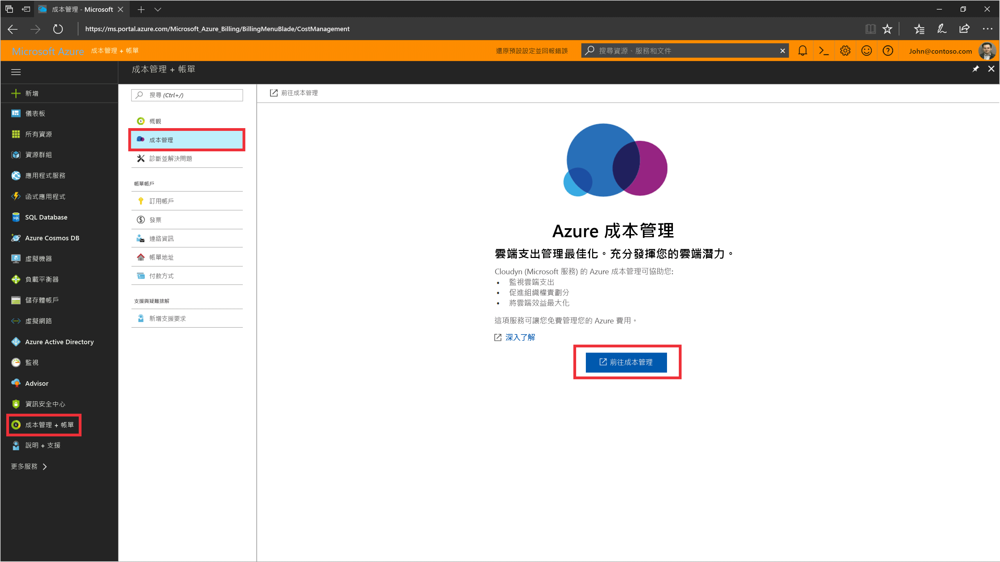
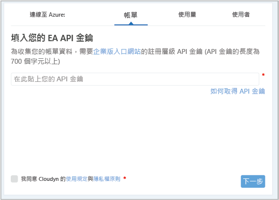
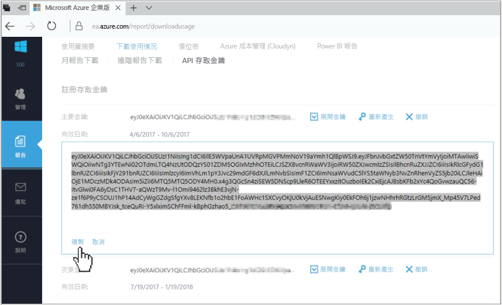
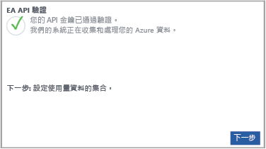

# 註冊 Azure Enterprise 合約並檢視成本資料

您可使用您的 Azure Enterprise 合約註冊 Cloudyn。 註冊將可提供 Cloudyn 入口網站的存取權。 本快速入門詳細說明建立 Cloudyn 試用訂用帳戶並登入 Cloudyn 入口網站所需的註冊程序。 它也會示範如何立即開始檢視成本資料。

Azure 成本管理可提供與 Cloudyn 類似的功能。 Azure 成本管理是原生的 Azure 成本管理解決方案。 它可協助您分析成本、建立及管理預算、匯出資料，以及檢閱並針對最佳化建議採取動作以節省成本。 如需詳細資訊，請參閱 [Azure 成本管理](overview-cost-mgt.md)。

## 登入 Azure

- 在 http://portal.azure.com 登入 Azure 入口網站。

## 註冊 Cloudyn

1. 在 Azure 入口網站中，按一下服務清單中的 [成本管理與帳單]。
2. 在 [概觀] 底下，按一下 [Cloudyn]  
    
3. 在 [Cloudyn] 頁面上，按一下 [移至 Cloudyn] 以在新視窗開啟 Cloudyn 註冊頁面。
4. 在 Cloudyn 入口網站試用版註冊頁面上，輸入您的公司名稱，然後選取 [Azure 企業註冊系統管理員]。  
    
5. 輸入您的企業版入口網站註冊 API 金鑰。 如果您手邊沒有金鑰，請按一下[企業版入口網站](https://ea.azure.com)連結，並執行下列步驟：
  1. 登入 Azure 企業版網站，然後依序按一下 [報告]和 [API 存取金鑰]，然後複製您的主索引鍵。  
    
  3. 返回註冊頁面，並貼上您的 API 金鑰。
6. 同意「使用條款」，然後驗證您的金鑰。 按一下 [下一步] 以授權 Cloudyn 收集 Azure 資源資料。 收集的資料包括您訂用帳戶的使用量、效能、計費和標籤資料。  
    
7. 在 [邀請其他專案關係人] 下，您可以輸入他們的電子郵件地址以新增使用者。 完成時，按一下 [下一步]。 視您的 Azure 註冊大小而定，所有計費資料可能需要 24 小時才會新增至 Cloudyn。
8. 按一下 [移至 Cloudyn] 開啟 Cloudyn 入口網站，然後您應該會在 [雲端帳戶管理] 頁面上看見您已註冊的 EA 帳戶資訊。

若要觀看註冊 Enterprise 合約的教學課程影片，請參閱[如何尋找您的 EA 註冊識別碼和 API 金鑰以用於 Cloudyn](https://youtu.be/u_phLs_udig)。

[!INCLUDE [cost-management-create-account-view-data](../../includes/cost-management-create-account-view-data.md)]

## 後續步驟

在此快速入門中，您使用您的 Azure Enterprise 合約資訊來註冊 Cloudyn。 您也登入了 Cloudyn 入口網站，並開始檢視成本資料。 若要深入了解 Cloudyn，請繼續 Cloudyn 的教學課程。

> [!div class="nextstepaction"]
> [檢閱使用量和成本](./tutorial-review-usage.md)
