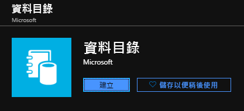
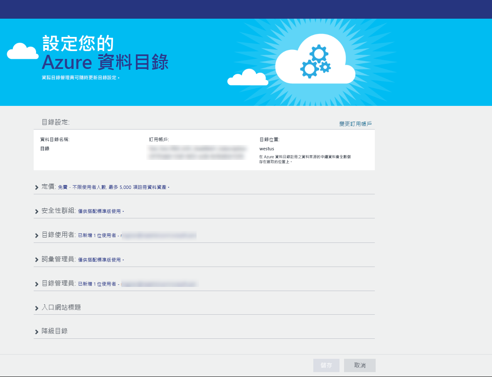
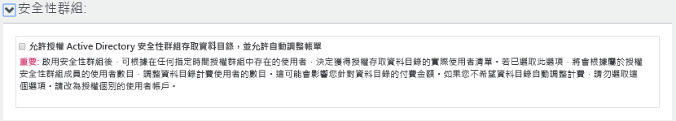
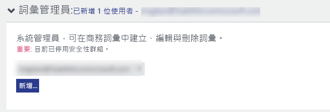
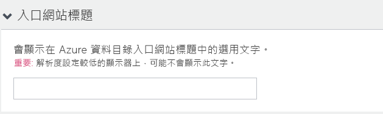
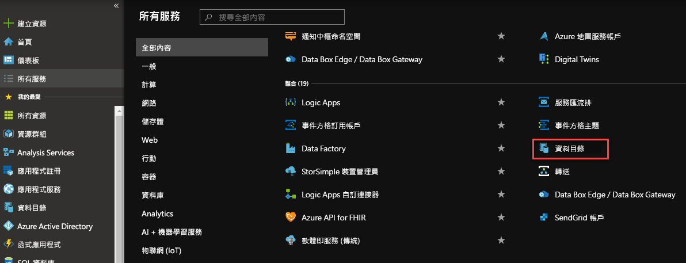
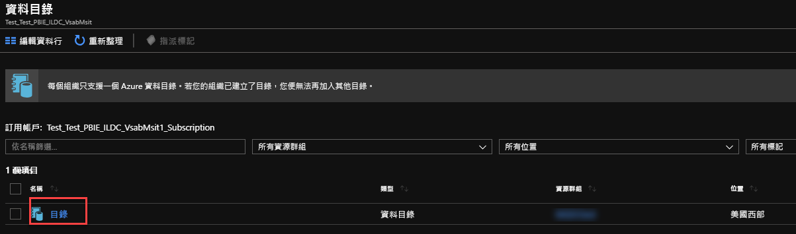
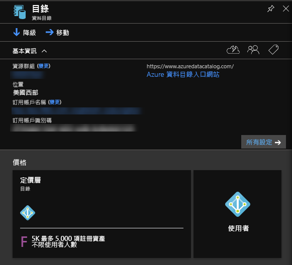
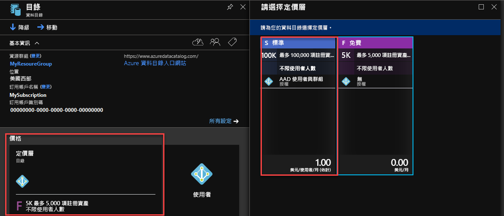

# 快速入門：建立 Azure 資料目錄

Azure 資料目錄是完全受控的雲端服務，可作為企業資料資產的註冊系統和探索系統。 如需詳細的概觀，請參閱 [什麼是 Azure 資料目錄](overview.md)。

本快速入門將協助您開始建立 Azure 資料目錄。

如果您沒有 Azure 訂用帳戶，請在開始前建立[免費帳戶](https://azure.microsoft.com/free/?WT.mc_id=A261C142F) 。

## 必要條件

若要開始，您需要：

* [Microsoft Azure](https://azure.microsoft.com/) 訂用帳戶。
* 您需要有自己的 [Azure Active Directory 租用戶](../active-directory/fundamentals/active-directory-access-create-new-tenant.md)。

若要設定資料目錄，您必須是 Azure 訂用帳戶的擁有者或共同擁有者。

## 建立資料目錄

每個組織只能佈建一個資料目錄 (Azure Active Directory 網域)。 因此，如果隸屬於這個 Azure Active Directory 網域的 Azure 訂用帳戶擁有者或共同擁有者已建立目錄，即使您有多個 Azure 訂用帳戶，仍無法再次建立目錄。 若要測試 Azure Active Directory 網域中的使用者是否已建立資料目錄，請移至 [Azure 資料目錄首頁](http://azuredatacatalog.com) 並確認您是否看到目錄。 如果您的目錄已建立，請略過下列程序並前往下一節。

1. 移至 [Azure 入口網站](https://portal.azure.com) > [建立資源]  ，然後選取 [資料目錄]  。

    

2. 指定資料目錄的 [名稱]  、想要使用的 [訂用帳戶]  、目錄的 [位置]  和 [定價層]  。 然後選取 [建立]  。

3. 移至 [Azure 資料目錄首頁](http://azuredatacatalog.com)，然後按一下 [發佈資料]  。

   

   您也可以在[資料目錄服務頁面](https://azure.microsoft.com/services/data-catalog)上選取 [開始]  ，來取得資料目錄首頁。

   

4. 移至 [設定]  頁面。

    

5. 展開 [價格]  ，並確認 Azure 資料目錄的**版本** (免費或標準)。

    

6. 如果您選擇「標準」  版作為定價層，您可以展開 [安全性群組]  ，讓 Active Directory 安全性群組有權存取資料目錄，並且能夠自動調整帳單。

    

7. 展開 [目錄使用者]  ，然後按一下 [新增]  以新增資料目錄的使用者。 系統會自動將您新增至此群組。

    

8. 如果您選擇「標準」  版作為定價層，您可以展開 [字彙系統管理員]  ，然後按一下 [新增]  來加入字彙系統管理員使用者。 系統會自動將您新增至此群組。

    

9. 展開 [目錄管理員]  ，然後按一下 [新增]  以新增資料目錄的其他管理員。 系統會自動將您新增至此群組。

    

10. 展開 [入口網站標題]  ，並加入其他要顯示在入口網站標題上的文字。

    

11. 完成 [設定]  頁面後，接著瀏覽至 [發佈]  頁面。

    

## 在 Azure 入口網站中尋找資料目錄

1. 在網頁瀏覽器的另一個索引標籤中或在不同的網頁瀏覽器視窗中，移至 [Azure 入口網站](https://portal.azure.com) ，然後使用您在上一個步驟中用來建立資料目錄的相同帳戶進行登入。

2. 選取 [所有服務]  ，然後按一下 [資料目錄]  。

    

    您會看到您所建立的資料目錄。

    

3. 按一下您建立的目錄。 您會在入口網站中看到 [資料目錄]  刀鋒視窗。

   

4. 您可以檢視資料目錄的屬性並加以更新。 例如，按一下 [定價層]  並變更版本。

    

## 後續步驟

在本快速入門中，您已了解如何為組織建立 Azure 資料目錄。 現在，您可以在 Azure 資料目錄中註冊資料來源。

> [!div class="nextstepaction"]
> [在 Azure 資料目錄中註冊資料來源](data-catalog-how-to-register.md)
