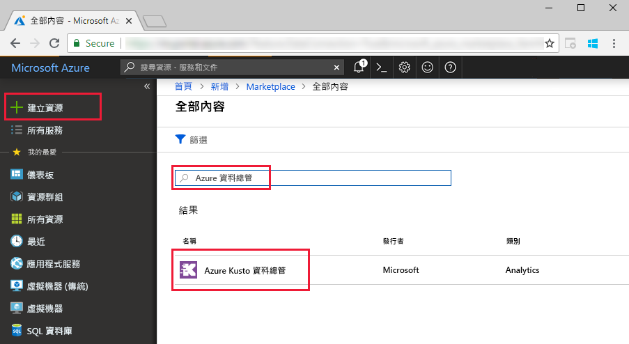
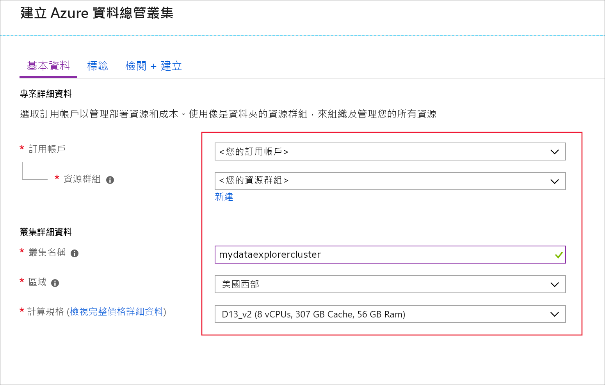
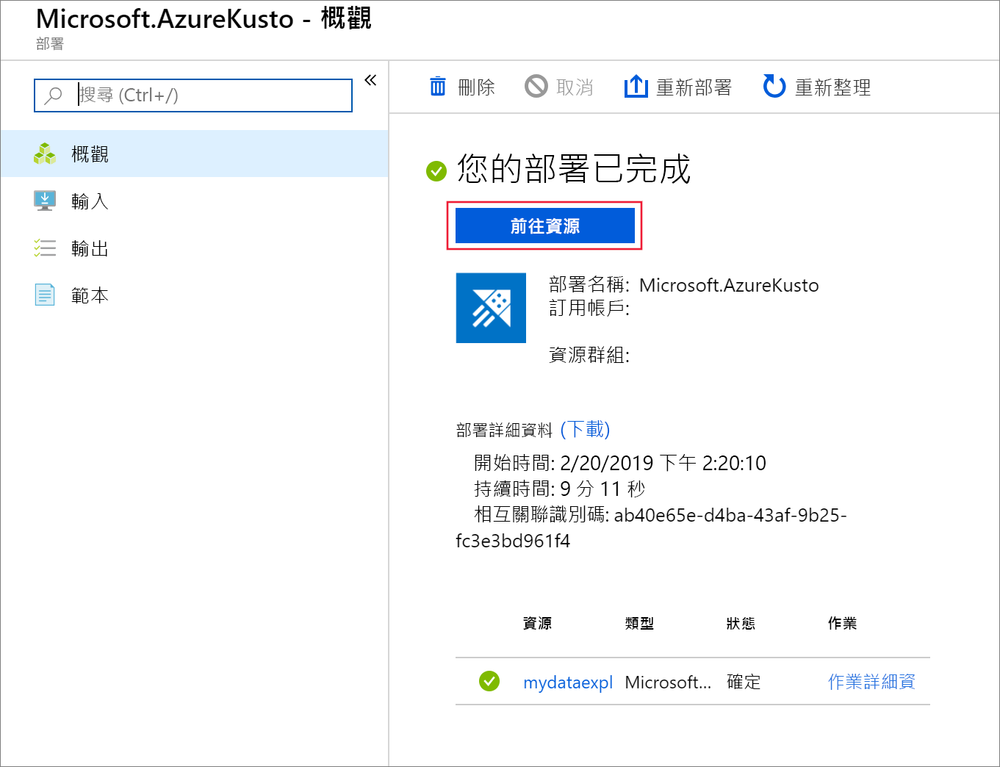
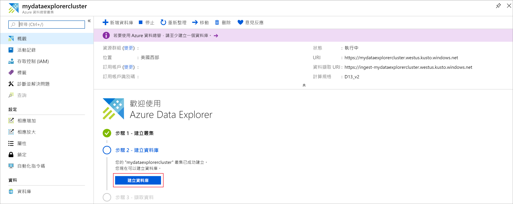
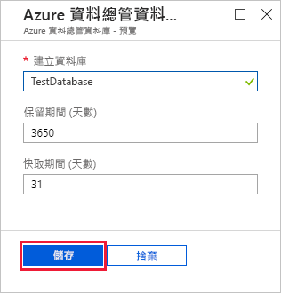
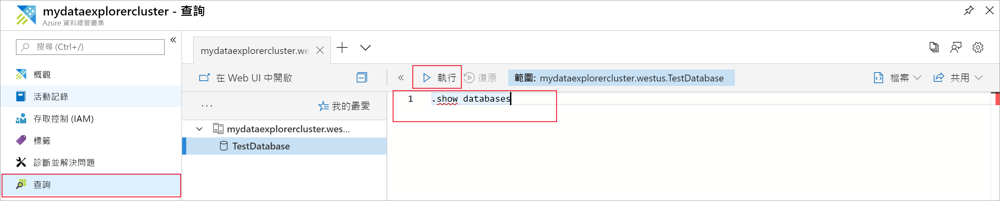

# 快速入門：建立 Azure 資料總管叢集與資料庫

> [!div class="op_single_selector"]
> * [入口網站](create-cluster-database-portal.md)
> * [CLI](create-cluster-database-cli.md)
> * [PowerShell](create-cluster-database-powershell.md)
> * [C#](create-cluster-database-csharp.md)
> * [Python](create-cluster-database-python.md)
>  

Azure 資料總管是一項快速又可高度調整的資料探索服務，可用於處理記錄和遙測資料。 若要使用 Azure 資料總管，請先建立叢集，然後在該叢集中建立一或多個資料庫。 然後將資料內嵌 (載入) 至資料庫，讓您可以對資料執行查詢。 在本快速入門中，您會建立叢集與資料庫。

如果您沒有 Azure 訂用帳戶，請在開始前建立[免費 Azure 帳戶](https://azure.microsoft.com/free/)。

## 登入 Azure 入口網站

登入 [Azure 入口網站](https://portal.azure.com/)。

## 建立叢集

在 Azure 資源群組中建立 Azure 資料總管叢集，其中包含一組已定義的計算和儲存體資源。

1. 選取入口網站左上角的 [建立資源] 按鈕 (+)。

1. 搜尋 *Azure 資料總管*。

   

1. 在 **Azure 資料總管**下方，從畫面底部選取 [建立]。

1. 填寫含有下列資訊的基本叢集詳細資料。

   

    **設定** | **建議的值** | **欄位描述**
    |---|---|---|
    | 訂用帳戶 | 您的訂用帳戶 | 選取您要用於叢集的 Azure 訂用帳戶。|
    | 資源群組 | *test-resource-group* | 使用現有資源群組，或建立新的資源群組。 |
    | 叢集名稱 | 唯一叢集名稱 | 選擇可識別您叢集的唯一名稱。 例如 *mydataexplorercluster*。 網域名稱 *[region].kusto.windows.net* 已附加至您提供的叢集名稱。 名稱只能包含小寫字母和數字。 必須包含 3 到 22 個字元。
    | 位置 | 美國西部 | 在本快速入門中，請選取 [美國西部]。 至於生產系統，請選取最符合您需求的區域。
    | 計算規格 | *D13_v2* | 在此本快速入門中，請選取最低價格規格。 至於生產系統，請選取最符合您需求的規格。
    | | |

1. 選取 [檢閱 + 建立] 以檢閱您的叢集詳細資料，然後選取 [建立] 以佈建叢集。 佈建通常會花費大約 10 分鐘。

1. 部署完成後，請選取 [移至資源]。

    

## 建立資料庫

現已準備好進行程序的第二個步驟：建立資料庫。

1. 在 [概觀] 索引標籤上，選取 [建立資料庫]。

    

1. 在表單中填寫以下資訊。

    

    **設定** | **建議的值** | **欄位描述**
    |---|---|---|
    | 資料庫名稱 | *TestDatabase* | 資料庫名稱在叢集內必須是唯一而不重複。
    | 保留期限 | *3650* | 保證資料持續可供查詢的時間範圍 (天)。 系統會從內嵌資料的時間開始測量時間範圍。
    | 快取期 | *31* | 在 SSD 儲存裝置或 RAM 中 (而非長期儲存裝置)，讓受到頻繁查詢的資料維持可用狀態的時間範圍 (天)。
    | | | |

1. 選取 [建立] 以建立資料庫。 建立時間通常不到一分鐘。 程序完成時，您會返回叢集 [概觀] 索引標籤。

## 在資料庫中執行基本命令

現在已有叢集和資料庫，您可以執行查詢和命令。 資料庫中尚未有任何資料，但仍可看到工具如何運作。

1. 在您的叢集下，選取 [查詢]。 將命令 `.show databases` 貼到查詢視窗中，然後選取 [執行]。

    

    結果集會顯示 **TestDatabase**，這是叢集中唯一的資料庫。

1. 將命令 `.show tables` 貼到查詢視窗中，然後選取 [執行]。

    因為您目前沒有任何資料表，此命令會傳回空白結果集。 在本系列的下一篇文章中會新增資料庫。

## 停止和重新啟動叢集

您可以視業務需求停止和重新啟動叢集。

1. 若要停止叢集，請在 [概觀] 索引標籤頂端選取 [停止]。

    叢集停止時，資料無法供查詢之用，且無法內嵌新的資料。

1. 若要重新啟動叢集，請在 [概觀] 索引標籤頂端選取 [啟動]。

    叢集重新啟動後，約需要 10 分鐘才可供使用 (與最初佈建時相同)。 此外還需要額外的時間將資料載入到經常性快取中。  

## 清除資源

如果您打算按照其他快速入門和教學課程繼續進行，請保留您建立的資源。 否則，請清除您的資源群組，以避免產生費用。

1. 在 Azure 入口網站中選取靠左側的 [資源群組]，然後選取包含資料總管叢集的資源群組。  

1. 選取 [刪除資源群組] 以刪除整個資源群組。 如果使用現有的資源群組，則可以選擇僅刪除資料總管叢集。

## 後續步驟

> [!div class="nextstepaction"]
> [快速入門：將資料從事件中樞內嵌至 Azure 資料總管](ingest-data-event-hub.md)

