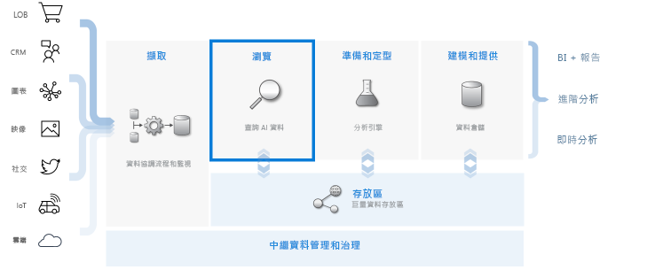
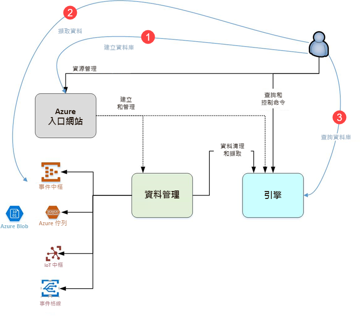

# 什麼是 Azure 資料總管？

Azure 資料總管是一項快速又可高度調整的資料探索服務，可用於處理記錄和遙測資料。 可協助您處理新式軟體所發出的許多資料流，以便您收集、儲存及分析資料。 Azure 資料總管很適合用於分析來自任何資料來源 (例如網站、應用程式、IoT 裝置等等) 的大量多樣資料。 這份資料會用於診斷、監視、報告、機器學習及其他分析功能。 Azure 資料總管可輕鬆內嵌這份資料，並可讓您在幾秒鐘內對資料執行複雜的臨機操作查詢。

## 是什麼讓 Azure 資料總管與眾不同？

- 在幾分鐘內即可快速擴充到數 TB 的資料，讓資料探索能夠快速反覆執行，以發掘相關見解。

- 提供創新的查詢語言，最適合用於高效能的資料分析。

- 支援大量的異質資料分析 (結構化和非結構化)。

- 透過與其他服務結合來提供建置和部署所需的能力，並提供全面性、功能強大以及互動式的資料分析解決方案。

## 資料倉儲工作流程

Azure 資料總管與其他重要服務整合以提供全端解決方案，包括資料收集、擷取、儲存、編製索引、查詢和視覺化。 這項服務可對數 TB 相異的未經處理資料執行流程的**探索**步驟，因而在資料倉儲流程中發揮關鍵作用。

Azure 資料總管支援多種擷取方法，包括常用服務的連接器 (如事件中樞)、使用 SDK 的程式設計擷取 (如 .NET 和 Python)，以及直接存取引擎以進行探索。 Azure 資料總管與分析和模型服務整合，可進行額外的資料分析和視覺效果。

## Azure 資料總管流程

下圖顯示使用 Azure 資料總管的不同層面。

Azure 資料總管中的工作通常會遵循此模式：

1. **建立資料庫：** 建立「叢集」，然後在該叢集中建立一或多個「資料庫」。 [快速入門：建立 Azure 資料總管叢集與資料庫](create-cluster-database-portal.md)

1. **內嵌資料：** 將資料載入資料庫資料表中，讓您可以對資料執行查詢。 [快速入門：將資料從事件中樞內嵌至 Azure 資料總管](ingest-data-event-hub.md)

1. **查詢資料庫：** 使用我們的 Web 應用程式來執行、檢閱及共用查詢和結果。 這可在 Azure 入口網站中取得，也以獨立應用程式的形式提供。 此外，您可以以程式設計方式 (使用 SDK) 或 REST API 端點傳送查詢。 [快速入門：在 Azure 資料總管中查詢資料](web-query-data.md)

## 查詢體驗

在 Azure 資料總管中的查詢是唯讀要求，用於處理資料並傳回處理結果，而不需修改資料或中繼資料。 您可以繼續縮小查詢範圍，直到完成分析為止。 Azure 資料總管的臨機查詢體驗極為迅速，因此讓這個流程變得很輕鬆。

Azure 資料總管同樣可以處理大量的結構化、半結構化 (類似 JSON 的巢狀型別) 和非結構化 (自然語言) 資料。 這項服務可讓您搜尋特定的文字字詞、找出特定事件，以及對結構化資料執行計量樣式的計算。 Azure 資料總管透過從自由格式文字欄位中擷取執行階段中的值，來橋接非結構化文字記錄和結構化數字與維度。 結合快速的文字索引編製、資料行存放區和時間序列作業，讓資料探索變得簡單。

其他服務建基於 Azure 資料總管強大的查詢語言，進一步延伸了其功能，這些服務包括 [Log Analytics](/azure/log-analytics/)、[Application Insights](/azure/application-insights/)、[時間序列深入解析](/azure/time-series-insights/)和 [Windows Defender 進階威脅防護](/windows/security/threat-protection/windows-defender-atp/windows-defender-advanced-threat-protection/)。

## 意見反應

我們期待聽到您對 Azure 資料總管及其查詢語言的意見反應：

- [在 MSDN 論壇上提問](https://social.msdn.microsoft.com/Forums/en-US/home?forum=AzureKusto)

- [在 User Voice 中提出產品建議](http://aka.ms/AzureDataExplorer.UserVoice)

## 後續步驟

[快速入門：建立 Azure 資料總管叢集與資料庫](create-cluster-database-portal.md)

[快速入門：將資料從事件中樞內嵌至 Azure 資料總管](ingest-data-event-hub.md)

[快速入門：在 Azure 資料總管中查詢資料](web-query-data.md)
