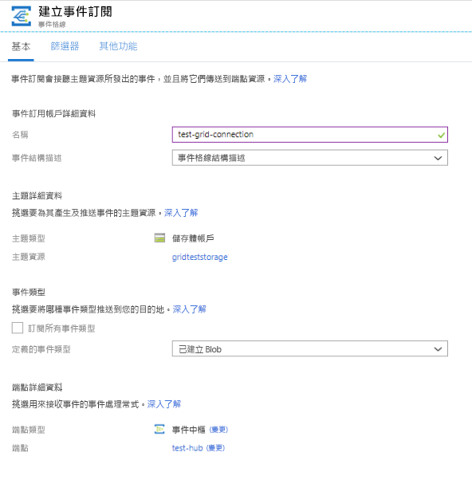
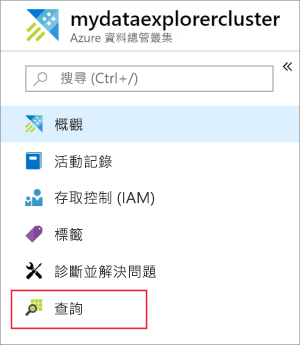
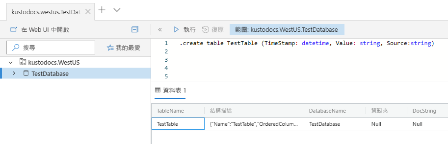
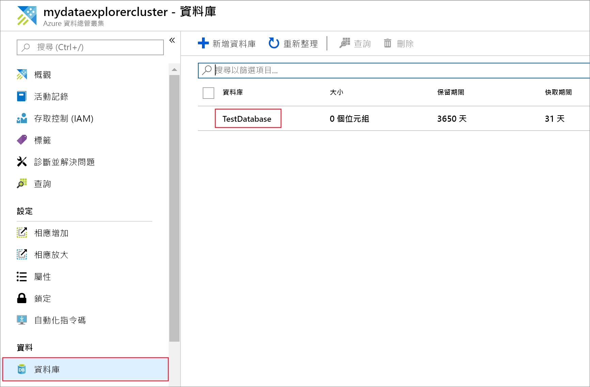
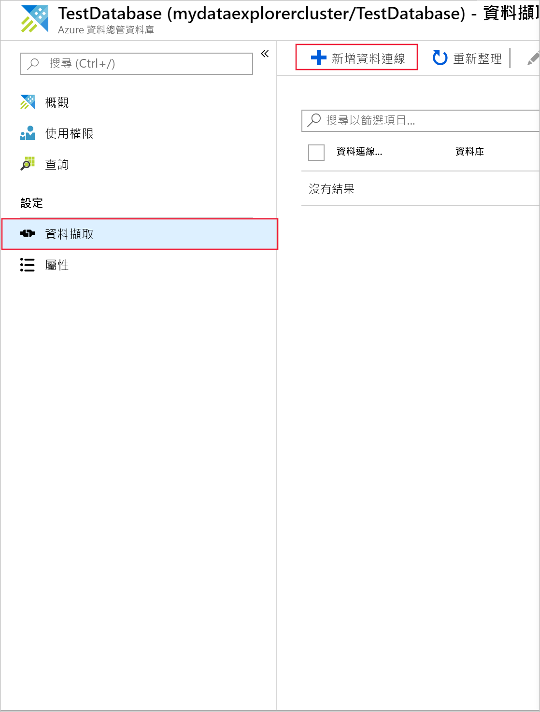
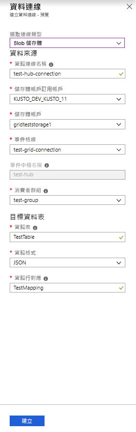
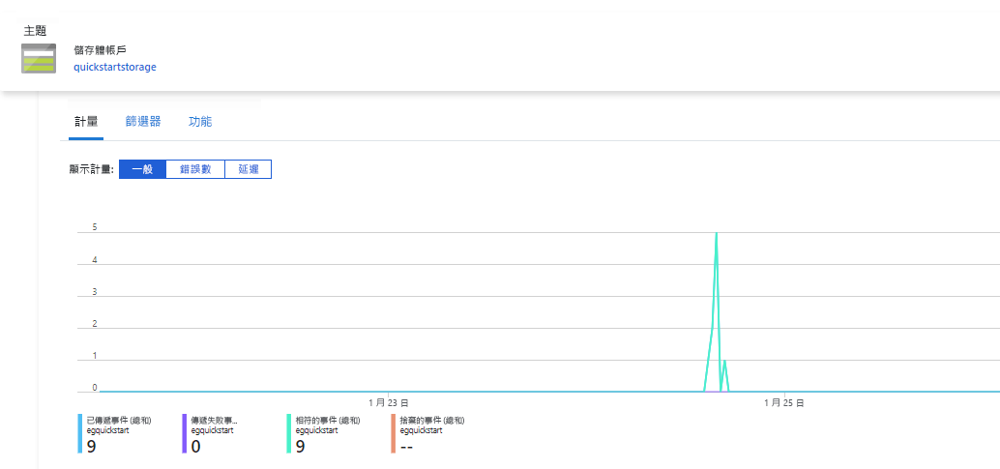
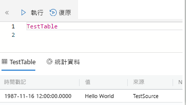
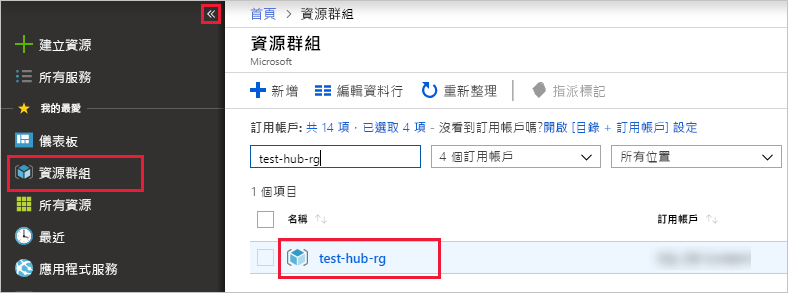

# <a name="ingest-blobs-into-azure-data-explorer-by-subscribing-to-event-grid-notifications"></a>訂閱 Event Grid 通知，以便將 Blob 擷取至 Azure 資料總管

Azure 資料總管是一項快速又可調整的資料探索服務，可用於處理記錄和遙測資料。 它會從寫入至 Blob 容器的 Blob 提供連續擷取 (資料載入)。 

在本文中，您了解如何設定[Azure Event Grid](/azure/event-grid/overview)訂用帳戶，並將事件路由至 Azure 資料總管透過事件中樞。 首先，您應該具備含有事件格線訂用帳戶的儲存體帳戶，此帳戶會將通知傳送到 Azure 事件中樞。 然後，您可以建立 Event Grid 資料連線，並查看整個系統的資料流程。

## <a name="prerequisites"></a>必要條件

* Azure 訂用帳戶。 建立 [Azure 免費帳戶](https://azure.microsoft.com/free/)。
* [叢集和資料庫](create-cluster-database-portal.md)。
* [儲存體帳戶](https://docs.microsoft.com/azure/storage/common/storage-quickstart-create-account?tabs=azure-portal)。
* [事件中樞](https://docs.microsoft.com/azure/event-hubs/event-hubs-create)。

## <a name="create-an-event-grid-subscription-in-your-storage-account"></a>在儲存體帳戶中建立 Event Grid 訂用帳戶

1. 在 Azure 入口網站中，尋找您的儲存體帳戶。
1. 選取 [事件]   >  [事件訂用帳戶]  。

    

1. 在 [建立事件訂用帳戶]  視窗的 [基本]  索引標籤內，提供下列值：

    **設定** | **建議的值** | **欄位描述**
    |---|---|---|
    | Name | *test-grid-connection* | 您想要建立之事件格線的名稱。|
    | 事件結構描述 | *事件格線結構描述* | 應該用於事件格線的結構描述。 |
    | 主題類型 | *儲存體帳戶* | 事件格線主題的類型。 |
    | 主題資源 | *gridteststorage* | 儲存體帳戶的名稱。 |
    | 訂閱所有事件類型 | *清除* | 不取得所有事件的通知。 |
    | 定義的事件類型 | *已建立 Blob* | 要取得通知的特定事件。 |
    | 端點類型 | *事件中樞* | 要接收事件之端點的類型。 |
    | 端點 | *test-hub* | 您建立的事件中樞。 |
    | | |

1. 如果您想要追蹤特定容器中的檔案，選取 [其他功能]  索引標籤。 設定通知的篩選條件，如下所示：
    * [主旨開頭為]  欄位是 Blob 容器的*常值*前置詞。 由於套用的模式是 *startswith*，因此它可以跨越多個容器。 不允許使用萬用字元。
     它*必須*設定如下： *`/blobServices/default/containers/`* [容器前置詞]
    * [主旨結尾為]  欄位是 Blob 的*常值*後置詞。 不允許使用萬用字元。

## <a name="create-a-target-table-in-azure-data-explorer"></a>在 Azure 資料總管中建立目標資料表

在 Azure 資料總管中建立一個資料表，供事件中樞將資料傳送至此。 在必要條件中準備的叢集與資料庫內建立該資料表。

1. 在 Azure 入口網站中，您的叢集下方，選取 [查詢]  。

    

1. 將下列命令複製到視窗，然後選取 [執行]  以建立資料表 (TestTable)，該資料表會接收內嵌的資料。

    ```Kusto
    .create table TestTable (TimeStamp: datetime, Value: string, Source:string)
    ```

    

1. 將下列命令複製到視窗中，然後選取 [執行]  以將傳入的 JSON 資料對應至資料表 (TestTable) 的資料行名稱與資料類型。

    ```Kusto
    .create table TestTable ingestion json mapping 'TestMapping' '[{"column":"TimeStamp","path":"$.TimeStamp"},{"column":"Value","path":"$.Value"},{"column":"Source","path":"$.Source"}]'
    ```

## <a name="create-an-event-grid-data-connection-in-azure-data-explorer"></a>在 Azure 資料總管中建立 Event Grid 資料連線

現在，從 Azure 資料總管連線到事件格線，讓流入 Blob 容器的資料串流到測試資料表。

1. 選取工具列上的 [通知]  ，以確認事件中樞部署已成功。

1. 在您建立的叢集下方，選取 [資料庫]   >  [TestDatabase]  。

    

1. 選取 [資料擷取]   >  [新增資料連線]  。

    

1.  選取連線類型：**Blob 儲存體**。

1. 在表單中填寫下列資訊，並選取 [建立]  。

    

     資料來源：

    **設定** | **建議的值** | **欄位描述**
    |---|---|---|
    | 資料連線名稱 | *test-hub-connection* | 您想要在 Azure 資料總管中建立的連線名稱。|
    | 儲存體帳戶訂用帳戶 | 訂用帳戶識別碼 | 您儲存體帳戶所在的訂用帳戶識別碼。|
    | 儲存體帳戶 | *gridteststorage* | 您先前建立之儲存體帳戶的名稱。|
    | Event Grid | *test-grid-connection* | 您建立之事件格線的名稱。 |
    | 事件中樞名稱 | *test-hub* | 您建立的事件中樞。 此欄位會在您挑選事件格線時自動填入。 |
    | 取用者群組 | *test-group* | 在您所建立事件中樞中定義的取用者群組。 |
    | | |

    目標資料表：

     **設定** | **建議的值** | **欄位描述**
    |---|---|---|
    | 資料表 | *TestTable* | 您在 **TestDatabase** 中建立的資料表。 |
    | 資料格式 | *JSON* | 支援的格式為 Avro、CSV、JSON、MULTILINE JSON、PSV、SOH、SCSV、TSV 和 TXT。 |
    | 資料行對應 | *TestMapping* | 您在 **TestDatabase** 中建立的對應，會將傳入的 JSON 資料對應至 **TestTable** 的資料行名稱與資料類型。|
    | | |

## <a name="generate-sample-data"></a>產生範例資料

既然 Azure 資料檔案總管及儲存體帳戶已經連線，您可以建立範例資料並上傳至 Blob 儲存體。

我們將使用可發出一些基本 Azure CLI 命令的小型殼層指令碼，來與 Azure 儲存體資源互動。 此指令碼會在儲存體帳戶中建立新的容器，將現有的檔案 (以 Blob 形式) 上傳至該容器，然後列出容器中的 Blob。 您可以使用 [Azure Cloud Shell](https://docs.microsoft.com/azure/cloud-shell/overview)，直接在入口網站中執行指令碼。

使用這個指令碼將資料儲存到檔案並上傳：

```Json
{"TimeStamp": "1987-11-16 12:00","Value": "Hello World","Source": "TestSource"}
```

```bash
#!/bin/bash
### A simple Azure Storage example script

    export AZURE_STORAGE_ACCOUNT=<storage_account_name>
    export AZURE_STORAGE_KEY=<storage_account_key>

    export container_name=<container_name>
    export blob_name=<blob_name>
    export file_to_upload=<file_to_upload>
    export destination_file=<destination_file>

    echo "Creating the container..."
    az storage container create --name $container_name

    echo "Uploading the file..."
    az storage blob upload --container-name $container_name --file $file_to_upload --name $blob_name

    echo "Listing the blobs..."
    az storage blob list --container-name $container_name --output table

    echo "Done"
```

## <a name="review-the-data-flow"></a>檢閱資料流程

> [!NOTE]
> Azure 資料總管具有資料擷取的彙總 (批次處理) 原則，可將擷取程序最佳化。
根據預設，此原則設定為 5 分鐘。
您可以視需要在稍後變更此原則。 在這篇文章中，您可以預期的延遲幾分鐘的時間。

1. 當應用程式正在執行時，在 Azure 入口網站內事件格線的下方，您會看見活動爆增。

    

1. 若要檢查目前為止已有多少則訊息成功進入資料庫，請在測試資料庫中執行下列查詢。

    ```Kusto
    TestTable
    | count
    ```

1. 若要查看訊息的內容，請在測試資料庫中執行下列查詢。

    ```Kusto
    TestTable
    ```

    結果集應會如下所示。

    

## <a name="clean-up-resources"></a>清除資源

如果您不打算再次使用您的事件格線，請清除 **test-hub-rg** 以避免產生成本。

1. 在 Azure 入口網站中選取靠左側的 [資源群組]  ，然後選取您所建立的群組。  

    如果左側功能表已摺疊，請選取 ![[展開] 按鈕](media/ingest-data-event-grid/expand.png) 加以展開。

   

1. 在 [test-resource-group]  下方，選取 [刪除資源群組]  。

1. 在新視窗中，輸入要刪除的資源群組名稱 (*test-hub-rg*)，然後選取 [刪除]  。

## <a name="next-steps"></a>後續步驟

* [在 Azure 資料總管中查詢資料](web-query-data.md)
