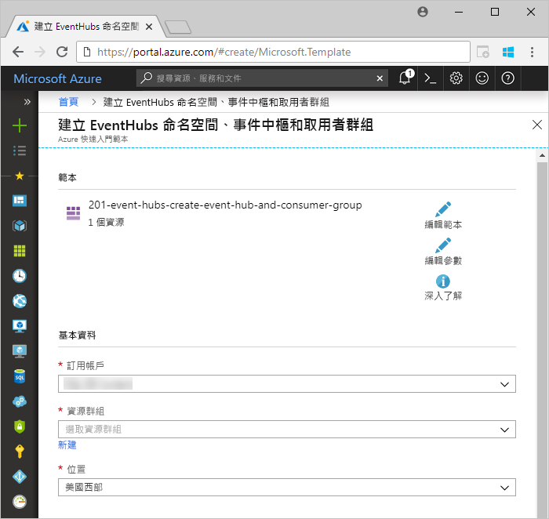
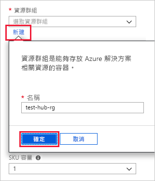
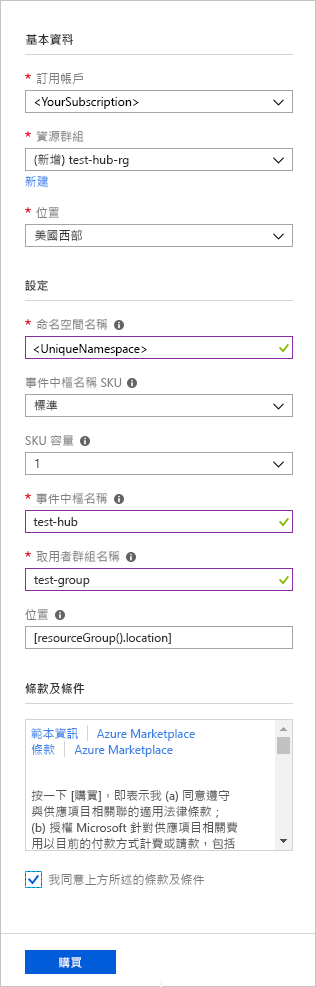
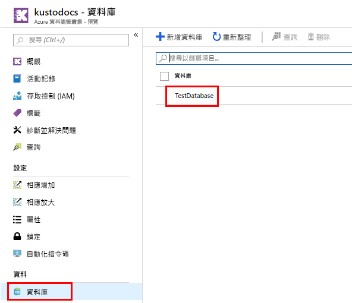
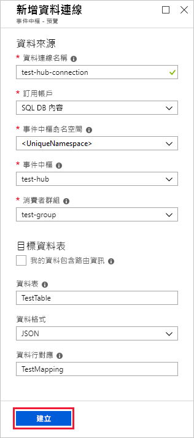
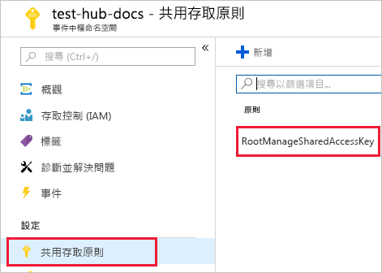
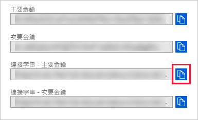
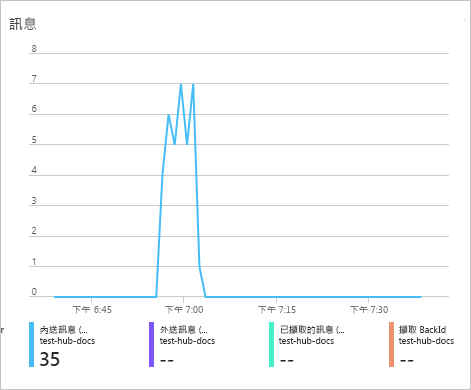
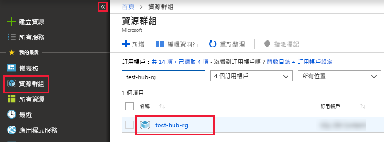

# <a name="quickstart-ingest-data-from-event-hub-into-azure-data-explorer"></a>快速入門：將資料從事件中樞內嵌至 Azure 資料總管

Azure 資料總管是一項快速又可高度調整的資料探索服務，可用於處理記錄和遙測資料。 Azure 資料總管可從事件中樞、巨量資料串流平台及事件內嵌服務進行內嵌 (載入資料)。 [事件中樞](/azure/event-hubs/event-hubs-about)可以近乎即時地每秒鐘處理數百萬個事件。 在本快速入門中，您會建立事件中樞、從 Azure 資料總管連線至事件中樞，以及透過系統檢視資料流程。

## <a name="prerequisites"></a>必要條件

* 如果您沒有 Azure 訂用帳戶，請在開始前建立[免費 Azure 帳戶](https://azure.microsoft.com/free/)。

* [測試叢集和資料庫](create-cluster-database-portal.md)

* 產生資料並將其傳送至事件中樞的[範例應用程式](https://github.com/Azure-Samples/event-hubs-dotnet-ingest)。 將範例應用程式下載到您的系統。

* [Visual studio 2017 15.3.2 版或更新版本](https://www.visualstudio.com/vs/)，以執行範例應用程式

## <a name="sign-in-to-the-azure-portal"></a>登入 Azure 入口網站

登入 [Azure 入口網站](https://portal.azure.com/)。

## <a name="create-an-event-hub"></a>建立事件中樞

在本快速入門中，您會產生範例資料，並將之傳送到事件中樞。 第一個步驟是建立事件中樞。 其做法是使用 Azure 入口網站中的 Azure Resource Manager 範本。

1. 若要建立事件中樞，請使用下列按鈕開始部署。 按一下滑鼠右鍵並選取 [在新視窗中開啟]，以便依照本文中的其餘步驟操作。

    [](https://portal.azure.com/#create/Microsoft.Template/uri/https%3A%2F%2Fraw.githubusercontent.com%2FAzure%2Fazure-quickstart-templates%2Fmaster%2F201-event-hubs-create-event-hub-and-consumer-group%2Fazuredeploy.json)

    [部署至 Azure] 按鈕可將您帶往 Azure 入口網站，填寫部署表單。

    

1. 選取用於建立事件中樞的訂用帳戶，然後建立一個名為 *test-hub-rg* 的資源群組。

    

1. 在表單中填寫以下資訊。

    

    對於下表中未列出的任何設定，請使用預設值。

    **設定** | **建議的值** | **欄位描述**
    |---|---|---|
    | 訂用帳戶 | 您的訂用帳戶 | 選取您要用於事件中樞的 Azure 訂用帳戶。|
    | 資源群組 | *test-hub-rg* | 建立新的資源群組。 |
    | 位置 | *美國西部* | 在本快速入門中，請選取 [美國西部]。 至於生產系統，請選取最符合您需求的區域。 將事件中樞命名空間建立在與 Kusto 相同的 [位置] 可獲得最佳效能 (對於高輸送量的事件中樞命名空間格外重要)。
    | 命名空間名稱 | 唯一命名空間名稱 | 選擇可識別您命名空間的唯一名稱。 例如，*mytestnamespace*。 網域名稱 *servicebus.windows.net* 已附加至您提供的名稱。 名稱只能包含字母、數字和連字號。 名稱必須以字母開頭，且必須以字母或數字結尾。 此值長度必須介於 6 至 50 個字元之間。
    | 事件中樞名稱 | *test-hub* | 事件中樞位於命名空間之下，其會提供專屬的唯一範圍容器。 事件中樞名稱在命名空間內不可重複。 |
    | 取用者群組名稱 | *test-group* | 取用者群組能讓多個取用應用程式各自擁有獨立的事件串流檢視。 |
    | | |

1. 選取 [採購]，這會確認您正在您的訂用帳戶中建立資源。

1. 在工具列上選取 [通知] 以監視佈建程序。 可能需要幾分鐘的時間，部署才會成功，但您現在可以移至下一個步驟。

    

## <a name="create-a-target-table-in-azure-data-explorer"></a>在 Azure 資料總管中建立目標資料表

現在要在 Azure 資料總管中建立一個資料表，供事件中樞將資料傳送至此。 您會在於**必要條件**中佈建的叢集與資料庫中建立該資料表。

1. 在 Azure 入口網站中瀏覽至您的叢集，然後選取 [查詢]。

    

1. 將下列命令複製到視窗，然後選取 [執行] 以建立資料表 (TestTable)，該資料表會接收內嵌的資料。

    ```Kusto
    .create table TestTable (TimeStamp: datetime, Name: string, Metric: int, Source:string)
    ```

    

1. 將下列命令複製到視窗中，然後選取 [執行] 以將傳入的 JSON 資料對應至資料表 (TestTable) 的資料行名稱與資料類型。

    ```Kusto
    .create table TestTable ingestion json mapping 'TestMapping' '[{"column":"TimeStamp","path":"$.timeStamp","datatype":"datetime"},{"column":"Name","path":"$.name","datatype":"string"},{"column":"Metric","path":"$.metric","datatype":"int"},{"column":"Source","path":"$.source","datatype":"string"}]'
    ```

## <a name="connect-to-the-event-hub"></a>連線至事件中樞

現在您應從 Azure 資料總管連線至事件中樞。 此連線建立後，流入事件中樞資料的資料即會串流至您先前在本文中建立的測試資料表。

1. 選取工具列上的 [通知]，以確認事件中樞部署已成功。

1. 在您建立的叢集下方，選取 [資料庫]，然後選取 [TestDatabase]。

    

1. 選取 [資料擷取]，然後選取 [新增資料連線]。 然後，在表單中填寫以下資訊。 完成後，選取 [建立]。

    

    資料來源：

    **設定** | **建議的值** | **欄位描述**
    |---|---|---|
    | 資料連線名稱 | *test-hub-connection* | 您想要在 Azure 資料總管中建立的連線名稱。|
    | 事件中樞命名空間 | 唯一命名空間名稱 | 您先前選擇用來辨識命名空間的名稱。 |
    | 事件中樞 | *test-hub* | 您建立的事件中樞。 |
    | 取用者群組 | *test-group* | 在您所建立事件中樞中定義的取用者群組。 |
    | | |

    目標資料表：

    路由有兩個選項：*靜態*和*動態*。 在本快速入門中，您將使用靜態路由 (預設值)，而指定資料表名稱、檔案格式和對應。 因此，將 [我的資料包含路由資訊] 保留為未選取。
    您也可以使用動態路由，此時您的資料會包含必要的路由資訊。

     **設定** | **建議的值** | **欄位描述**
    |---|---|---|
    | 資料表 | *TestTable* | 您在 **TestDatabase** 中建立的資料表。 |
    | 資料格式 | *JSON* | 支援的格式為 Avro、CSV、JSON、MULTILINE JSON、PSV、SOH、SCSV、TSV 和 TXT。 |
    | 資料行對應 | *TestMapping* | 您在 **TestDatabase** 中建立的對應，會將傳入的 JSON 資料對應至 **TestTable** 的資料行名稱與資料類型。|
    | | |

## <a name="copy-the-connection-string"></a>複製連接字串

當您執行「必要條件」中所列的[範例應用程式](https://github.com/Azure-Samples/event-hubs-dotnet-ingest)時，您需要事件中樞命名空間的連接字串。

1. 在您建立的事件中樞命名空間下方，選取 [共用存取原則]，然後選取 [RootManageSharedAccessKey]。

    

1. 複製 [連接字串 - 主索引鍵]。 您在下一節中貼上這項資料。

    

## <a name="generate-sample-data"></a>產生範例資料

使用下載的[範例應用程式](https://github.com/Azure-Samples/event-hubs-dotnet-ingest)來產生資料。

1. 請在 Visual Studio 中開啟範例應用程式解決方案。

1. 在 [program.cs] 檔案中，將 `connectionString` 常數更新為您從事件中樞命名空間複製的連接字串。

    ```csharp
    const string eventHubName = "test-hub";
    // Copy the connection string ("Connection string-primary key") from your Event Hub namespace.
    const string connectionString = @"<YourConnectionString>";
    ```

1. 建置並執行應用程式。 應用程式會將訊息傳送至事件中樞，會每隔 10 秒列印出狀態。

1. 在應用程式傳送一些訊息後，請移至下一步：檢閱流入您事件中樞與測試資料表的資料流程。

## <a name="review-the-data-flow"></a>檢閱資料流程

在應用程式產生資料後，您現在可以檢視該資料從事件中樞傳至叢集中資料表的流程。

1. 當應用程式正在執行時，在 Azure 入口網站內事件中樞的下方，您會看見活動爆增。

    

1. 若要檢查目前為止已有多少則訊息成功進入資料庫，請在測試資料庫中執行下列查詢。

    ```Kusto
    TestTable
    | count
    ```

1. 若要查看訊息的內容，請執行下列查詢：

    ```Kusto
    TestTable
    ```

    結果集應會如下所示：

    

    > [!NOTE]
    > Azure 資料總管具有資料擷取的彙總 (批次處理) 原則，可將擷取程序最佳化。 此原則已設定為 5 分鐘，因此您可能會遇到延遲。

## <a name="clean-up-resources"></a>清除資源

如果您不打算再次使用您的事件中樞，請清除 **test-hub-rg** 以避免產生成本。

1. 在 Azure 入口網站中選取靠左側的 [資源群組]，然後選取您所建立的群組。  

    如果左側功能表已摺疊，請選取 ![[展開] 按鈕](media/ingest-data-event-hub/expand.png) 加以展開。

   

1. 在 [test-resource-group] 下方，選取 [刪除資源群組]。

1. 在新視窗中，輸入要刪除的資源群組名稱 (*test-hub-rg*)，然後選取 [刪除]。

## <a name="next-steps"></a>後續步驟

> [!div class="nextstepaction"]
> [快速入門：在 Azure 資料總管中查詢資料](web-query-data.md)
