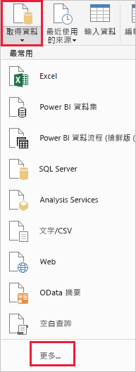
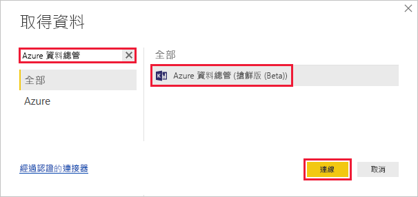
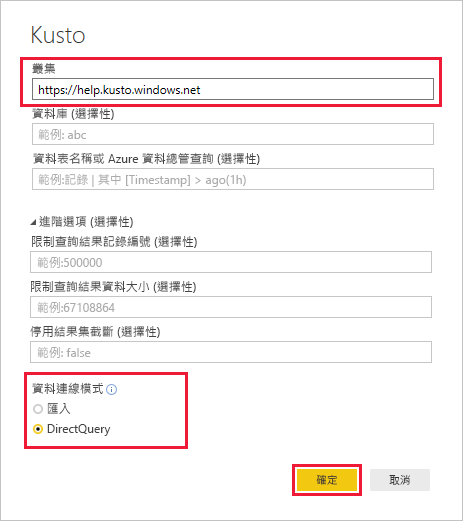
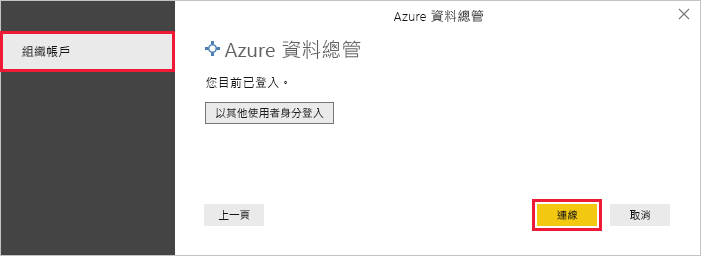
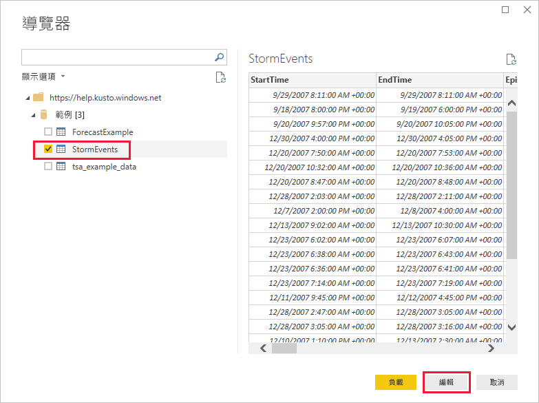
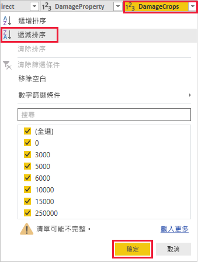
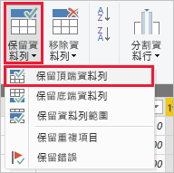
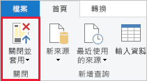

# 快速入門：使用適用於 Power BI 的 Azure 資料總管連接器將資料視覺化

Azure 資料總管是一項快速又可高度調整的資料探索服務，可用於處理記錄和遙測資料。 Power BI 是一個商務分析解決方案，可讓您將資料視覺化並在整個組織共用結果。

Azure 資料總管提供三個選項以便連線到 Power BI 中的資料：使用內建連接器，從 Azure 資料總管匯入查詢，或使用 SQL 查詢。 本快速入門示範如何使用內建連接器來取得資料，並且在 Power BI 報告中將其視覺化。

如果您沒有 Azure 訂用帳戶，請在開始前建立[免費 Azure 帳戶](https://azure.microsoft.com/free/)。

## 必要條件

您需要下列項目，才能完成本快速入門：

* 屬於 Azure Active Directory 成員的組織電子郵件帳戶，以便您連線到 [Azure 資料總管說明叢集](https://dataexplorer.azure.com/clusters/help/databases/samples)。

* [Power BI Desktop](https://powerbi.microsoft.com/get-started/) (選取 [免費下載])

## 從 Azure 資料總管取得資料

首先，連線到 Azure 資料總管說明叢集，然後從 *StormEvents* 資料表帶入資料子集。 [!INCLUDE [data-explorer-storm-events](../../includes/data-explorer-storm-events.md)]

1. 在 Power BI Desktop 的 [首頁] 索引標籤上，選取 [取得資料]，然後選取 [更多]。

    

1. 搜尋 [Azure 資料總管]，選取 [Azure 資料總管 (Beta)]，然後選取 [連線]。

    

1. 在 [預覽版連接器] 畫面上，選取 [繼續]。

1. 在下一個畫面的表單中，填寫以下資訊。

    

    **設定** | **值** | **欄位描述**
    |---|---|---|
    | 叢集 | *https://help.kusto.windows.net* | 說明叢集的 URL。 對於其他叢集，URL 的格式為 *https://\<ClusterName\>.\<Region\>.kusto.windows.net*。 |
    | 資料庫 | 保留空白 | 裝載於所要連線叢集上的資料庫。 我們會在稍後步驟中選取此項目。 |
    | 資料表名稱 | 保留空白 | 資料庫的其中一個資料表，或是 <code>StormEvents \| take 1000</code>之類的查詢。 我們會在稍後步驟中選取此項目。 |
    | 進階選項 | 保留空白 | 您查詢的選項，例如結果集大小。 |
    | 資料連線模式 | *DirectQuery* | 決定 Power BI 是否匯入資料或直接連線到資料來源。 您可以使用任一選項搭配此連接器。 |
    | | | |

1. 如果您還沒有說明叢集的連線，請登入。 使用組織帳戶登入，然後選取 [連線]。

    

1. 在 [導覽器] 畫面上，展開 **Samples** 資料庫，選取 **StormEvents**，然後 [編輯]。

    

    資料表會在「Power Query 編輯器」中開啟，您可以先在此編輯器中編輯資料列和資料行，然後再匯入資料。

1. 在 Power Query 編輯器中，選取 **DamageCrops** 資料行旁邊的箭號，然後選取 [遞減排序]。

    

1. 在 [首頁] 索引標籤上，選取 [保留資料列]，然後 [保留頂端資料列]。 輸入值 *1000* 可帶入排序資料表的前 1000 個資料列。

    

1. 在 [首頁] 索引標籤上，選取 [關閉並套用]。

    

## 在報告中將資料視覺化

[!INCLUDE [data-explorer-power-bi-visualize-basic](../../includes/data-explorer-power-bi-visualize-basic.md)]

## 清除資源

如果您不再需要您為本快速入門建立的報告，請刪除 Power BI Desktop (.pbix) 檔案。

## 後續步驟

> [!div class="nextstepaction"]
> [快速入門：在 Power BI 中使用匯入的查詢將資料視覺化](power-bi-imported-query.md)
