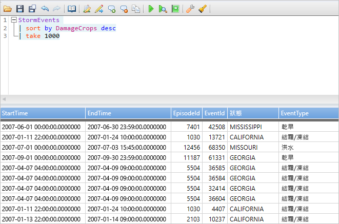
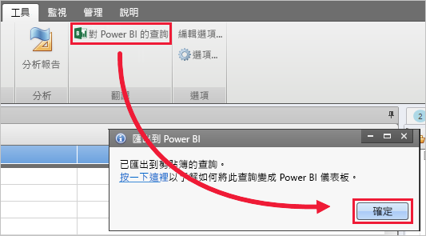
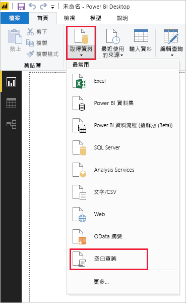
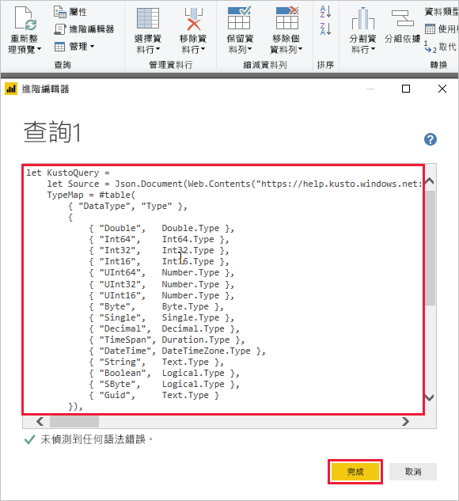
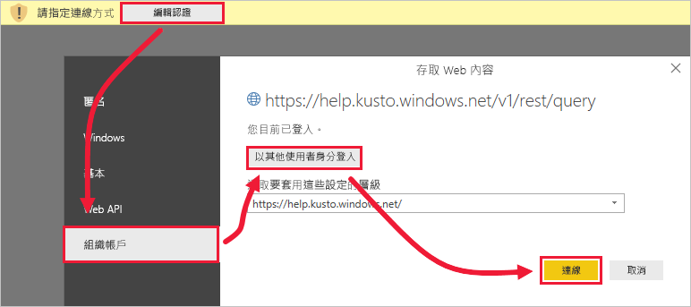

# <a name="visualize-data-using-a-query-imported-into-power-bi"></a>在 Power BI 中使用匯入的查詢將資料視覺化

Azure 資料總管是一項快速又可高度調整的資料探索服務，可用於處理記錄和遙測資料。 Power BI 是一個商務分析解決方案，可讓您將資料視覺化並在整個組織共用結果。

Azure 資料總管提供三個選項以便連線到 Power BI 中的資料：使用內建連接器，從 Azure 資料總管匯入查詢，或使用 SQL 查詢。 這篇文章會示範如何匯入查詢，以便您可以取得資料，並將其視覺化 Power BI 報表中。

如果您沒有 Azure 訂用帳戶，請在開始前建立[免費 Azure 帳戶](https://azure.microsoft.com/free/)。

## <a name="prerequisites"></a>必要條件

您需要下列項目完成這篇文章：

* 屬於 Azure Active Directory 成員的組織電子郵件帳戶，以便您連線到 [Azure 資料總管說明叢集](https://dataexplorer.azure.com/clusters/help/databases/samples)。

* [Power BI Desktop](https://powerbi.microsoft.com/get-started/) (選取 [免費下載]  )

* [Azure 資料總管傳統型應用程式](/azure/kusto/tools/kusto-explorer)

## <a name="get-data-from-azure-data-explorer"></a>從 Azure 資料總管取得資料

首先，您會在 Azure 資料總管傳統型應用程式中建立查詢，並將它匯出以便在 Power BI 中使用。 然後，連線到 Azure 資料總管說明叢集，並從 *StormEvents* 資料表帶入資料子集。 [!INCLUDE [data-explorer-storm-events](../../includes/data-explorer-storm-events.md)]

1. 在瀏覽器中，移至 [https://help.kusto.windows.net/ ](https://help.kusto.windows.net/) 以啟動 Azure 資料總管傳統型應用程式。

1. 在傳統型應用程式中，將下列查詢複製到右上方查詢視窗，然後加以執行。

    ```Kusto
    StormEvents
    | sort by DamageCrops desc
    | take 1000
    ```

    結果集的前幾列看起來應該類似下列影像。

    

1. 在 [工具]  索引標籤上，選取 [對 Power BI 的查詢]  ，然後選取 [確定]  。

    

1. 在 Power BI Desktop 的 [首頁]  索引標籤上，選取 [取得資料]  ，然後選取 [空白查詢]  。

    

1. 在 Power Query 編輯器的 [首頁]  索引標籤上，選取 [進階編輯器]  。

1. 在 [進階編輯器]  視窗中，貼上您匯出的查詢，然後選取 [完成]  。

    

1. 在主要 Power Query 編輯器視窗中，選取 [編輯認證]  。 選取 [組織帳戶]  、登入，然後選取 [連線]  。

    

1. 在 [首頁]  索引標籤上，選取 [關閉並套用]  。

    

## <a name="visualize-data-in-a-report"></a>在報告中將資料視覺化

[!INCLUDE [data-explorer-power-bi-visualize-basic](../../includes/data-explorer-power-bi-visualize-basic.md)]

## <a name="clean-up-resources"></a>清除資源

如果您不再需要您所建立的報表，如這篇文章，請刪除 Power BI Desktop (.pbix) 檔案。

## <a name="next-steps"></a>後續步驟

[在 Power BI 中使用匯入的查詢將資料視覺化](power-bi-sql-query.md)