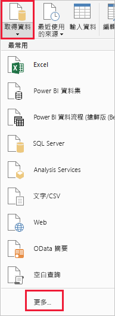
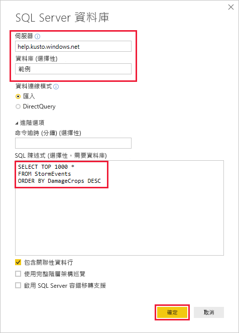
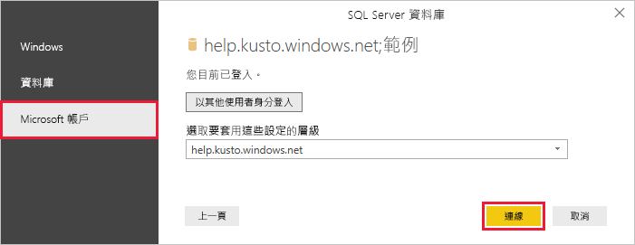
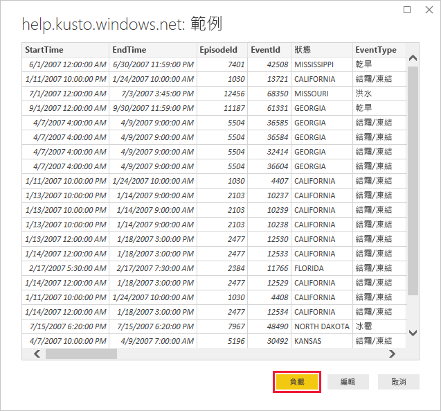

# <a name="quickstart-visualize-data-using-the-azure-data-explorer-connector-for-power-bi"></a>快速入門：使用適用於 Power BI 的 Azure 資料總管連接器將資料視覺化

Azure 資料總管是一項快速又可高度調整的資料探索服務，可用於處理記錄和遙測資料。 Power BI 是一個商務分析解決方案，可讓您將資料視覺化並在整個組織共用結果。

Azure 資料總管提供三個選項以便連線到 Power BI 中的資料：使用內建連接器，從 Azure 資料總管匯入查詢，或使用 SQL 查詢。 本快速入門示範如何使用 SQL 查詢來取得資料，並且在 Power BI 報告中將其視覺化。

如果您沒有 Azure 訂用帳戶，請在開始前建立[免費 Azure 帳戶](https://azure.microsoft.com/free/)。

## <a name="prerequisites"></a>必要條件

您需要下列項目，才能完成本快速入門：

* 屬於 Azure Active Directory 成員的組織電子郵件帳戶，以便您連線到 [Azure 資料總管說明叢集](https://dataexplorer.azure.com/clusters/help/databases/samples)。

* [Power BI Desktop](https://powerbi.microsoft.com/get-started/) (選取 [免費下載])

## <a name="get-data-from-azure-data-explorer"></a>從 Azure 資料總管取得資料

首先，連線到 Azure 資料總管說明叢集，然後從 *StormEvents* 資料表帶入資料子集。 [!INCLUDE [data-explorer-storm-events](../../includes/data-explorer-storm-events.md)]

您通常會使用原生查詢語言搭配 Azure 資料總管，但也支援您將在此使用的 SQL 查詢。 Azure 資料總管會為您將 SQL 查詢轉譯成原生查詢。

1. 在 Power BI Desktop 的 [首頁] 索引標籤上，選取 [取得資料]，然後選取 [更多]。

    

1. 搜尋 *Azure SQL Database*，選取 [Azure SQL Database]，然後 [連線]。

    

1. 在 [SQL Server 資料庫] 畫面的表單中，填寫以下資訊。

    

    **設定** | **值** | **欄位描述**
    |---|---|---|
    | 伺服器 | *help.kusto.windows.net* | 說明叢集的 URL (不含 *https://*)。 對於其他叢集，URL 的格式為 *\<ClusterName\>.\<Region\>.kusto.windows.net*。 |
    | 資料庫 | *範例* | 裝載於所要連線叢集上的範例資料庫。 |
    | 資料連線模式 | *匯入* | 決定 Power BI 是否匯入資料或直接連線到資料來源。 您可以使用任一選項搭配此連接器。 |
    | 命令逾時 | 保留空白 | 查詢執行多久才會擲回逾時錯誤。 |
    | SQL 陳述式 | 複製此資料表下方的查詢 | Azure 資料總管轉譯成原生查詢的 SQL 陳述式。 |
    | 其他選項 | 保留為預設值 | 選項不適用於 Azure 資料總管叢集。 |
    | | | |

    ```SQL
    SELECT TOP 1000 *
    FROM StormEvents
    ORDER BY DamageCrops DESC
    ```

1. 如果您還沒有說明叢集的連線，請登入。 使用 Microsoft 帳戶登入，然後選取 [連線]。

    

1. 在 [help.kusto.windows.net: 範例] 畫面上，選取 [載入]。

    

    資料表會在主要 Power BI 視窗中開啟，在報告檢視中，您可以根據範例資料建立報告。

## <a name="visualize-data-in-a-report"></a>在報告中將資料視覺化

[!INCLUDE [data-explorer-power-bi-visualize-basic](../../includes/data-explorer-power-bi-visualize-basic.md)]

## <a name="clean-up-resources"></a>清除資源

如果您不再需要您為本快速入門建立的報告，請刪除 Power BI Desktop (.pbix) 檔案。

## <a name="next-steps"></a>後續步驟

> [!div class="nextstepaction"]
> [快速入門：在 Power BI 中使用匯入的查詢將資料視覺化](power-bi-connector.md)