# <a name="quickstart-query-data-in-azure-data-explorer"></a>快速入門：在 Azure 資料總管中查詢資料

Azure 資料總管是一項快速又可高度調整的資料探索服務，可用於處理記錄和遙測資料。 Azure 資料總管提供一個讓您執行和共用查詢的 Web 應用程式。 它可在 Azure 入口網站中取得，也以獨立的 Web 應用程式的形式提供。 在本文中，您將在獨立的版本中進行作業，它能讓您連接到多個叢集以及共用深層連結到查詢。

如果您沒有 Azure 訂用帳戶，請在開始前建立[免費 Azure 帳戶](https://azure.microsoft.com/free/)。

## <a name="prerequisites"></a>必要條件

除了 Azure 訂用帳戶之外，您還需要[一個測試叢集和資料庫](create-cluster-database-portal.md)，才能完成此快速入門。

## <a name="sign-in-to-the-application"></a>登入應用程式

登入[應用程式](https://dataexplorer.azure.com/)。

## <a name="add-clusters"></a>新增叢集

當您第一次開啟應用程式時，沒有任何連線。


您必須將連線新增到至少一個叢集，才能開始執行查詢。 在此節中，您將連線新增至 Azure 資料總管中我們已設置要輔助學習的*說明叢集*，也要將連線新增到在先前快速入門中建立的測試叢集。

1. 在應用程式的左上方中，選取 [新增叢集]。

1. 在 [新增叢集] 對話方塊中，輸入 `https://help.kusto.windows.net`，然後選取 [新增]。

1. 在左窗格中，您現在應該會看到 [說明] 叢集。 展開 [範例] 資料庫，以便看到您可以存取的範例資料表。

    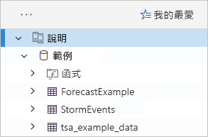

    我們在此快速入門與 Azure 資料總管文章中稍後會使用 **StormEvents** 資料表。

現在加入之前建立的測試叢集。

1. 選取 [新增叢集]。

1. 在 [新增叢集] 對話方塊中，以 `https://<ClusterName>.<Region>.kusto.windows.net/` 格式輸入您的測試叢集 URL，然後選取 [新增]。

    在下面的範例中，您會看到 [說明] 叢集和一個新的叢集 **docscluster.westus** (完整的 URL 是 `https://docscluster.westus.kusto.windows.net/`)。

    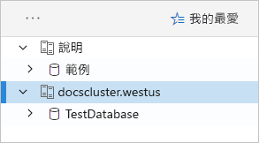

## <a name="run-queries"></a>執行查詢

您現在可以對連線的叢集執行查詢 (假設測試叢集中已經有資料)。 我們將著重 [i說明] 叢集。

1. 在左窗格中，在 [說明]叢集下面選取 [範例] 資料庫。

1. 複製下列查詢並貼到查詢視窗中。 在視窗頂端，選取 [執行] 。

    ```Kusto
    StormEvents
    | sort by StartTime desc
    | take 10
    ```
    此查詢會傳回 **StormEvents** 資料表中最新的十筆記錄。 結果的左邊結果應該會類似於下面的表格。

    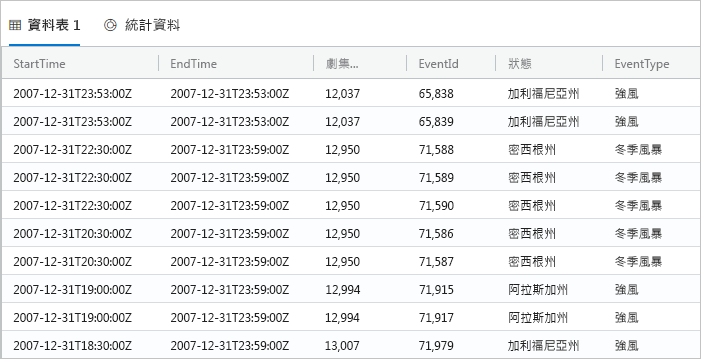

    下圖顯示應用程式現在的狀態，包含已新增的叢集以及包含結果的查詢。

    

1. 在第一個查詢下面，複製下列查詢並貼到查詢視窗中。 請注意，它有好幾行且尚未格式化，不像第一個查詢。

    ```Kusto
    StormEvents | sort by StartTime desc | project StartTime, EndTime, State, EventType, DamageProperty, EpisodeNarrative | take 10
    ```

1. 按一下視窗中的新查詢以選取該查詢。 按 Shift + Alt + F 來格式化查詢，讓它看起來如下所示。

    

1. 按 Shift + Enter，也就是執行查詢的快速鍵。

   此查詢會傳回與第一個查詢相同的記錄，但是只包含 `project` 陳述式中指定的資料行。 結果應該會類似於下列表格。

    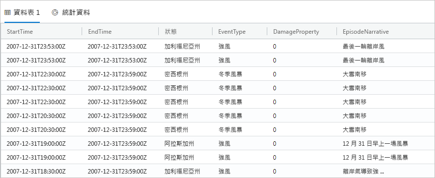

1. 在查詢視窗頂端，選取 [召回] 。

    查詢視窗現在會顯示第一個查詢的結果，無需重新執行查詢。 通常在分析期間，您可以執行多個查詢，而 [召回] 可讓您重新瀏覽上一個查詢的結果。

1. 讓我們再執行一個查詢來查看不同的輸出類型。

    ```Kusto
    StormEvents
    | summarize event_count=count(), mid = avg(BeginLat) by State
    | sort by mid
    | where event_count > 1800
    | project State, event_count
    | render columnchart
    ```
    結果應會類似於下列圖表。

    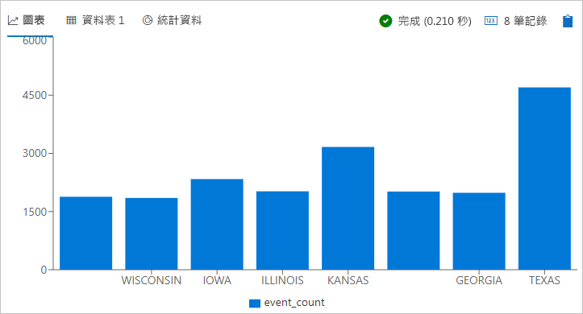

## <a name="work-with-the-table-grid"></a>使用資料表格線

現在您已了解基本查詢的運作方式，讓我們看看如何使用資料表格線來自訂結果和執行進一步分析。

1. 重新執行第一個查詢。 讓滑鼠停留在 **State** 資料行上，選取功能表，然後選取 **Group by State**。

    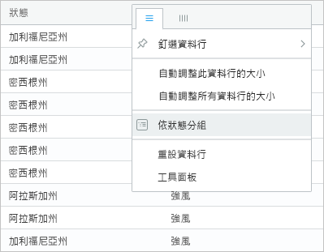

1. 在方格中，展開 **California** 以查看該狀態的記錄。

    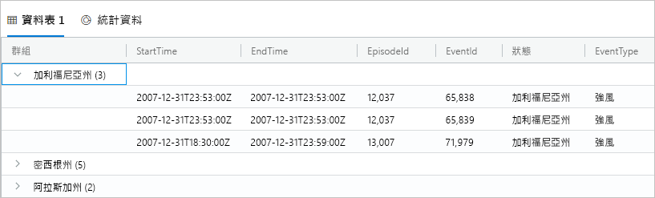

    執行探勘分析時，這種分組類型很有幫助。

1. 將滑鼠停留在 **Group** 資料行上，然後選取 **Reset columns**。

    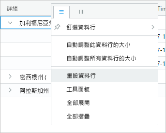

    這會讓格線回到其原始狀態。

1. 執行下列查詢。

    ```Kutso
    StormEvents
    | sort by StartTime desc
    | where DamageProperty > 5000
    | project StartTime, State, EventType, DamageProperty, Source
    | take 10
    ```

1. 在方格的右側，選取 **Columns** 以查看工具面板。

    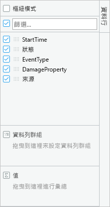

    此面板的功能類似於 Excel 中的樞紐資料表的欄位清單，能讓您在格線本身執行更多分析。

1. 選取 [樞紐分析表模式]，然後拖曳資料行，如下所示：[狀態] 到 [資料列群組]；[DamageProperty] 到 [值]；[EventType] 到 [資料行標籤]。  

    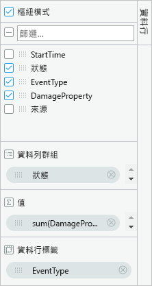

    結果應該會類似於下列樞紐分析表。

    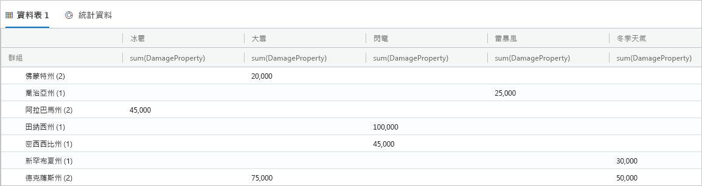

    請注意 Vermont 和 Alabama 在相同的類別中各有兩個事件，而 Texas 在不同的類別下則有兩個事件。 樞紐分析表可讓您快速找出這類事情，它們是進行快速分析的絕佳工具。

## <a name="share-queries"></a>共用查詢

許多時候，您會想要共用所建立的查詢。 您可以提供深層連結，讓其他能夠存取叢集的使用者也能執行查詢。

1. 在查詢視窗中，選取您所複製的第一個查詢。

1. 在查詢視窗頂端，選取 [共用] 。

1. 選取 [Link, query to clipboard]。

1. 複製連結和查詢到文字檔。

1. 將連結貼到新的瀏覽器視窗。 查詢執行之後，結果應該會看起來如下所示。

    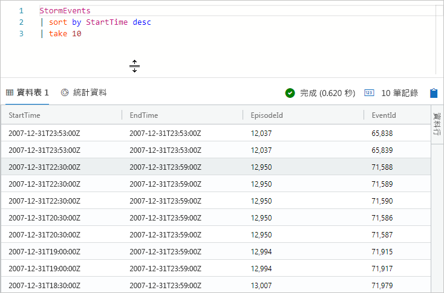

## <a name="provide-feedback"></a>提供意見反應

資料總管目前為預覽狀態，我們歡迎您針對使用提出意見反應。 您可以立即執行此作業，或等到您有更多時間可以執行。

1. 在應用程式右上角，選取意見反應圖示： .

1. 輸入您的意見反應，然後選取 [提交]。

## <a name="clean-up-resources"></a>清除資源

您並未在此快速入門中建立任何資源，但若您要從應用程式移除一或兩個叢集，請以滑鼠右鍵按一下叢集，然後選取 [移除連線]。

## <a name="next-steps"></a>後續步驟

> [!div class="nextstepaction"]
> [撰寫 Azure 資料總管的查詢](write-queries.md)