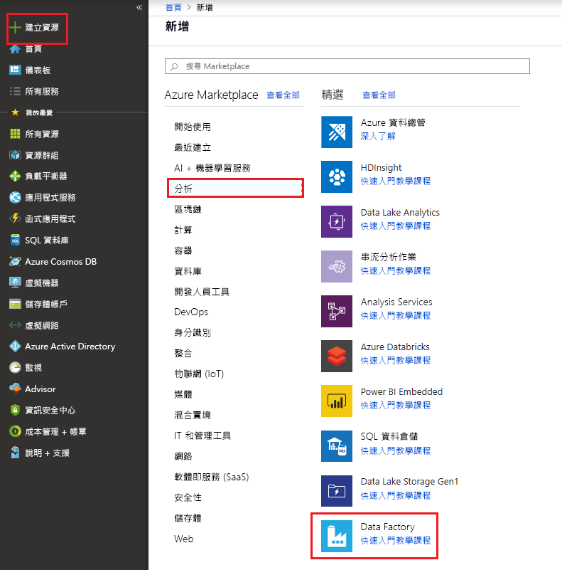

# 使用 Azure Data Factory 將資料從 Azure Data Lake Storage Gen1 複製到 Gen2

Azure Data Lake Storage Gen2 是[Azure Blob 儲存體](../storage/blobs/storage-blobs-introduction.md)內建的大量資料分析專用的一組功能。 您可以使用檔案系統和物件儲存範例，將它與您的資料互動。

如果您目前使用 Azure Data Lake Storage Gen1，您可以使用 Azure Data Factory 將資料從 Data Lake Storage Gen1 複製到 Gen2，以評估 Azure Data Lake Storage Gen2。

Azure Data Factory 是完全受控的雲端式資料整合服務。 您可以使用此服務，從一組豐富的內部部署和雲端式資料存放區填入 lake，並在您建立分析解決方案時節省時間。 如需支援的連接器清單，請參閱支援的[資料存放區](copy-activity-overview.md#supported-data-stores-and-formats)表格。

Azure Data Factory 提供可向外延展的受控資料移動解決方案。 由於 Data Factory 的相應放大架構，因此可以在高輸送量的情況下內嵌資料。 如需詳細資訊，請參閱[複製活動效能](copy-activity-performance.md)。

本文說明如何使用 Data Factory 複製資料工具，將資料從 Azure Data Lake Storage Gen1 複製到 Azure Data Lake Storage Gen2。 您可以依照類似的步驟，從其他類型的資料存放區複製資料。

## 必要條件

* Azure 訂用帳戶。 如果您沒有 Azure 訂用帳戶，請在開始前建立[免費帳戶](https://azure.microsoft.com/free/)。
* 內有資料的 Azure Data Lake Storage Gen1 帳戶。
* 已啟用 Data Lake Storage Gen2 的 Azure 儲存體帳戶。 如果您沒有儲存體帳戶，請[建立帳戶](https://ms.portal.azure.com/#create/Microsoft.StorageAccount-ARM)。

## 建立 Data Factory

1. 在左側功能表上，選取 [**建立資源**] > [**資料 + 分析**] [ > **Data Factory**]。
   
   

2. 在 [**新增資料**處理站] 頁面上，提供下圖所示欄位的值： 
      
   ![[新增資料處理站] 頁面](./media/load-azure-data-lake-storage-gen2-from-gen1/new-azure-data-factory.png)
 
    * **名稱**：輸入 Azure 資料處理站的全域唯一名稱。 如果您收到「資料處理站名稱 \"LoadADLSDemo\" 無法使用」的錯誤，請為資料處理站輸入其他名稱。 例如，使用**您的名稱** **ADFTutorialDataFactory**。 再次建立資料處理站。 如需 Data Factory 成品的命名規則，請參閱 [Data Factory 命名規則](naming-rules.md)。
    * **訂用帳戶**：選取用來在其中建立資料處理站的 Azure 訂用帳戶。 
    * **資源群組**：從下拉式清單中選取現有的資源群組。 您也可以選取 [**建立新**的] 選項，並輸入資源群組的名稱。 若要了解資源群組，請參閱[使用資源群組管理您的 Azure 資源](../azure-resource-manager/resource-group-overview.md)。 
    * **版本**：選取 [V2]。
    * **位置**：選取資料處理站的位置。 只有受到支援的位置會顯示在下拉式清單中。 資料處理站所使用的資料存放區可位於其他位置和區域。 

3. 選取 [建立]。
4. 建立完成後，請移至您的 data factory。 您會看到如下圖所示的 [Data Factory] 首頁： 
   
   

5. 選取 [**作者 & 監視器**] 圖格，以在另一個索引標籤中啟動資料整合應用程式。

## 將資料載入 Azure Data Lake Storage Gen2 中

1. 在 [**開始**使用] 頁面上，選取 [**資料複製**] 圖格以啟動 [複製資料] 工具。 

   
2. 在 [**屬性**] 頁面上，針對 [工作**名稱**] 欄位指定**CopyFromADLSGen1ToGen2** 。 選取 [下一步]。

    
3. 在 [**來源資料存放區**] 頁面上，選取 [ **+ 建立新連接**]。

    
    
4. 從連接器資源庫選取 [Azure Data Lake Storage Gen1]，然後選取 [繼續]。
    
    
    
5. 在 [**指定 Azure Data Lake Storage Gen1 連接**] 頁面上，依照下列步驟執行：

   a. 選取 [Data Lake Storage Gen1] 作為帳戶名稱，並指定或驗證 [租用戶]。
  
   b.這是另一個 C# 主控台應用程式。 選取 [**測試連接**] 來驗證設定。 然後選取 [完成]。
  
   c. 您會看到已建立新的連接。 選取 [下一步]。
   
   > [!IMPORTANT]
   > 在此逐步解說中，您會使用適用于 Azure 資源的受控識別來驗證您的 Azure Data Lake Storage Gen1。 若要將 Azure Data Lake Storage Gen1 中的適當許可權授與受控識別，請遵循[這些指示](connector-azure-data-lake-store.md#managed-identity)。
   
   
      
6. 在 [**選擇輸入檔案或資料夾**] 頁面上，流覽至您想要複製的資料夾和檔案。 選取資料夾或檔案，然後選取 **[選擇**]。

    

7. 選取 [**以遞迴方式複製**檔案] 和 [**二進位複製**] 選項，以指定複製行為。 選取 [下一步]。

    
    
8. 在 **目的地資料存放區** 頁面上，選取  **+ 建立新**連線 > **Azure Data Lake Storage Gen2** > **繼續**。

    

9. 在 [**指定 Azure Data Lake Storage Gen2 連接**] 頁面上，依照下列步驟執行：

   a. 從 [**儲存體帳戶名稱**] 下拉式清單中選取您的 Data Lake Storage Gen2 支援的帳戶。
   
   b.這是另一個 C# 主控台應用程式。 選取 [完成] 以建立連線。 然後，選取 [下一步]。
   
   

10. 在 [**選擇輸出檔案或資料夾**] 頁面上，輸入**copyfromadlsgen1**作為輸出檔案夾名稱，然後選取 **[下一步]** 。 Data Factory 會在複製期間建立對應的 Azure Data Lake Storage Gen2 檔案系統和子資料夾（如果不存在的話）。

    

11. 在 [設定] 頁面上，選取 [下一步] 來使用預設設定。

12. 在 [**摘要**] 頁面上，檢查設定，然後選取 **[下一步]** 。

    
13. 在 [**部署] 頁面**上，選取 [**監視**] 來監視管線。

    
14. 請注意，系統會自動選取左側的 [監視] 索引標籤。 [動作] 資料行中會有連結可供檢視活動執行詳細資料，以及重新執行管線。

    

15. 若要檢視與此管線執行相關聯的活動執行，請選取 [動作] 資料行中的 [檢視活動執行] 連結。 管線中只有一個活動 (複製活動)，所以您只會看到一個項目。 若要切換回 [管線執行] 檢視，請選取頂端的 [管線] 連結。 選取 [重新整理] 即可重新整理清單。 

    

16. 若要監視每個複製活動的執行詳細資料，請選取活動監控檢視中 [動作] 底下的 [詳細資料] 連結 (眼鏡圖示)。 您可以監視詳細資料，例如從來源複製到接收的資料量、資料輸送量、具有對應期間的執行步驟，以及使用的設定。

    

17. 確認資料已複製到您的 Azure Data Lake Storage Gen2 帳戶。

## 最佳做法

若要評估從 Azure Data Lake Storage Gen1 升級為一般 Azure Data Lake Storage Gen2，請參閱將[您的 big Data analytics 解決方案從 Azure Data Lake Storage Gen1 升級至 Azure Data Lake Storage Gen2](../storage/blobs/data-lake-storage-upgrade.md)。 下列各節介紹使用 Data Factory 將資料從 Data Lake Storage Gen1 升級為 Data Lake Storage Gen2 的最佳做法。

### 記錄資料複製的資料分割

- 如果 Data Lake Storage Gen1 中的資料大小總計小於 30 TB，而且檔案數目小於1000000，則您可以在單一複製活動執行中複製所有資料。
- 如果您要複製的資料量較大，或您想要以批次方式管理資料移轉的彈性，並使其在特定時間範圍內完成，請將資料分割。 分割也會降低任何非預期問題的風險。

使用概念證明來驗證端對端解決方案，並在您的環境中測試複製輸送量。 主要的概念證明步驟： 

1. 使用單一複製活動建立一個 Data Factory 管線，將數 Tb 的資料從 Data Lake Storage Gen1 複製到 Data Lake Storage Gen2，以取得複製效能基準。 開始使用[資料整合單位（diu）](copy-activity-performance.md#data-integration-units)作為128。 
2. 根據您在步驟1中取得的複製輸送量，計算整個資料移轉所需的預估時間。 
3. 選擇性建立控制資料表並定義檔案篩選，以分割要遷移的檔案。 分割檔案的方式是： 

    - 依資料夾名稱或具有萬用字元篩選的資料夾名稱進行分割。 建議採用此方法。
    - 依檔案的上次修改時間分割。

### 網路頻寬和儲存體 i/o 

您可以控制從 Data Lake Storage Gen1 讀取資料並將資料寫入 Data Lake Storage Gen2 的 Data Factory 複製工作的並行。 如此一來，您就可以管理該儲存體 i/o 上的使用方式，以避免在遷移期間影響 Data Lake Storage Gen1 的一般商務工作。

### 使用權限 

在 Data Factory 中， [Data Lake Storage Gen1 連接器](connector-azure-data-lake-store.md)支援 Azure 資源驗證的服務主體和受控識別。 [Data Lake Storage Gen2 連接器](connector-azure-data-lake-storage.md)支援 Azure 資源驗證的帳戶金鑰、服務主體和受控識別。 若要讓 Data Factory 能夠導覽並複製您所需的所有檔案或存取控制清單（Acl），請授與您提供給存取、讀取或寫入所有檔案之帳戶的足夠許可權，並在選擇時設定 Acl。 在遷移期間，為其授與超級使用者或擁有者角色。 

### 保留 Data Lake Storage Gen1 的 Acl

如果您想要在從 Data Lake Storage Gen1 升級至 Data Lake Storage Gen2 時，將 Acl 和資料檔案進行複寫，請參閱[從 Data Lake Storage Gen1 保留 acl](connector-azure-data-lake-storage.md#preserve-acls-from-data-lake-storage-gen1)。 

### 增量複製 

您可以使用數種方法，只從 Data Lake Storage Gen1 載入新的或更新的檔案：

- 依時間分割的資料夾或檔案名，載入新的或更新的檔案。 例如/2019/05/13/*。
- 藉由 LastModifiedDate 載入新的或更新的檔案。
- 藉由任何協力廠商工具或解決方案來識別新的或更新的檔案。 然後透過參數或資料表或檔案，將檔案或資料夾名稱傳遞至 Data Factory 管線。 

執行累加式載入的適當頻率取決於 Azure Data Lake Storage Gen1 中的檔案總數，以及每次要載入的新檔案或已更新的檔案數量。 

## 後續步驟

> [!div class="nextstepaction"]
> [複製活動總覽](copy-activity-overview.md)
> [Azure Data Lake Storage Gen1 連接器](connector-azure-data-lake-store.md)
> [Azure Data Lake Storage Gen2 連接器](connector-azure-data-lake-storage.md)