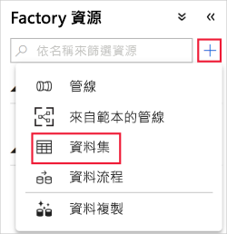
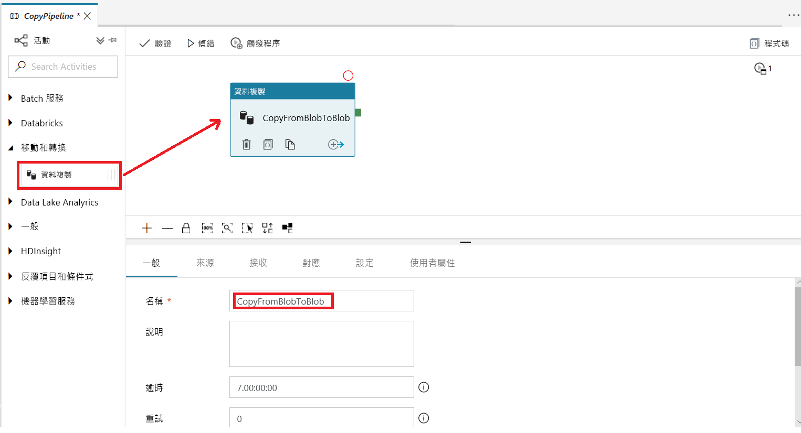
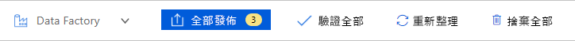
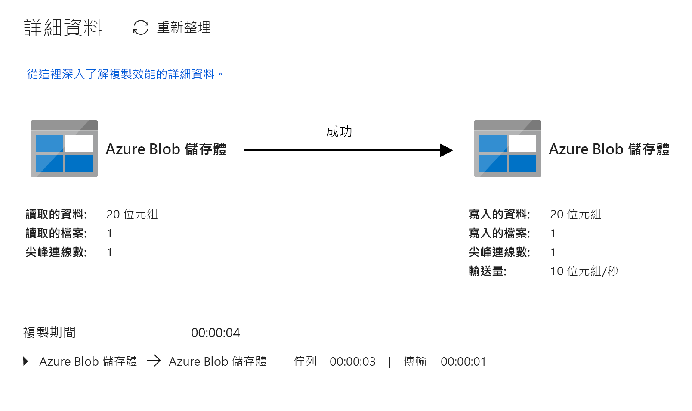
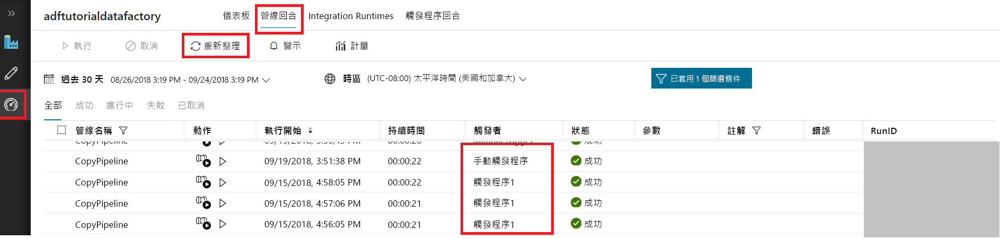

# 使用 Azure Data Factory UI 建立資料處理站
> [!div class="op_single_selector" title1="Select the version of Data Factory service that you are using:"]
> * [第 1 版](v1/data-factory-copy-data-from-azure-blob-storage-to-sql-database.md)
> * [目前的版本](quickstart-create-data-factory-portal.md)

本快速入門說明如何使用 Azure Data Factory UI 建立及監視資料處理站。 在此資料處理站中建立的管線會將資料從 Azure Blob 儲存體中的一個資料夾「複製」到其他資料夾。 如需如何使用 Azure Data Factory「轉換」資料的教學課程，請參閱[教學課程︰使用 Spark 轉換資料](tutorial-transform-data-spark-portal.md)。

> [!NOTE]
> 如果您不熟悉 Azure Data Factory，在執行此快速入門之前，請先參閱 [Azure Data Factory 簡介](data-factory-introduction.md)。 

[!INCLUDE [data-factory-quickstart-prerequisites](../../includes/data-factory-quickstart-prerequisites.md)] 

### 影片 
觀賞這段影片，可協助您瞭解 Data Factory UI： 
>[!VIDEO https://channel9.msdn.com/Shows/Azure-Friday/Visually-build-pipelines-for-Azure-Data-Factory-v2/Player]

## 建立 Data Factory

1. 啟動 **Microsoft Edge** 或 **Google Chrome** 網頁瀏覽器。 目前，只有 Microsoft Edge 和 Google Chrome 網頁瀏覽器支援 Data Factory UI。
1. 移至 [Azure 入口網站](https://portal.azure.com)。 
1. 選取左側功能表上的 [建立資源]、選取 [分析]，然後選取 [資料處理站]。 
   
   ![在 [新增] 窗格中選取資料處理站](./media/quickstart-create-data-factory-portal/new-azure-data-factory-menu.png)
1. 在 [新增資料處理站] 頁面上，輸入 **ADFTutorialDataFactory** 作為 [名稱]。 
      
   ![[新增資料處理站] 頁面](./media/quickstart-create-data-factory-portal/new-azure-data-factory.png)
 
   Azure Data Factory 的名稱必須是 *全域唯一的*。 如果您看到下列錯誤，請變更資料處理站的名稱 (例如 **&lt;yourname&gt;ADFTutorialDataFactory**)，然後試著重新建立。 如需 Data Factory 成品的命名規則，請參閱 [Data Factory - 命名規則](naming-rules.md)一文。
  
   
1. 針對 [訂用帳戶]，選取您要用來建立資料處理站的 Azure 訂用帳戶。 
1. 針對 [資源群組]，使用下列其中一個步驟︰
     
   - 選取 [使用現有的]，然後從清單中選取現有的資源群組。 
   - 選取 [建立新的] ，然後輸入資源群組的名稱。   
         
   若要了解資源群組，請參閱 [使用資源群組管理您的 Azure 資源](../azure-resource-manager/resource-group-overview.md)。  
1. 針對 [版本]，選取 [V2]。
1. 針對 [位置]，選取資料處理站的位置。

   清單只會顯示 Data Factory 支援的位置，以及儲存您 Azure Data Factory 中繼資料的位置。 請注意，Data Factory 所使用的相關聯資料存放區 (如 Azure 儲存體和 Azure SQL Database) 和計算 (如 Azure HDInsight) 可在其他區域中執行。

1. 選取 [建立] 。

1. 建立完成之後，您會看到 [Data Factory] 頁面。 選取 [編寫與監視] 圖格，以在個別的索引標籤上啟動 Azure Data Factory 使用者介面 (UI) 應用程式。
   
   ![資料處理站的首頁，具有 [編寫與監視] 圖格](./media/quickstart-create-data-factory-portal/data-factory-home-page.png)
1. 在 [現在就開始吧] 頁面上，切換至左面板中的 [編寫] 索引標籤。 

    ![[現在就開始吧] 頁面](./media/quickstart-create-data-factory-portal/get-started-page.png)

## 建立連結的服務
在此程序中，您會建立連結服務，將 Azure 儲存體帳戶連結到資料處理站。 連結的服務具有連線資訊，可供 Data Factory 服務在執行階段中用來連線。

1. 選取 [連線]，然後選取工具列上的 [新增] 按鈕。 

       
1. 在 [新增連結服務] 頁面上，選取 [Azure Blob 儲存體]，然後選取 [繼續]。 

   ![選取 [Azure Blob 儲存體] 圖格](./media/quickstart-create-data-factory-portal/select-azure-blob-linked-service.png)
1. 完成下列步驟： 

   a. 針對 [名稱]，輸入 **AzureStorageLinkedService**。

   b. 針對 [儲存體帳戶名稱] ，選取您 Azure 儲存體帳戶的名稱。

   c. 選取 [測試連線]，以確認 Data Factory 服務可連線至儲存體帳戶。 

   d. 選取 [完成] 以儲存連結服務。 

    

## 建立資料集
在此程序中，您會建立兩個資料集：**InputDataset** 和 **OutputDataset**。 這些資料集的類型為 **AzureBlob**。 其會參考您在前一節中建立的 Azure 儲存體連結服務。 

輸入資料集代表輸入資料夾中的來源資料。 在輸入資料集定義中，您可以指定 Blob 容器 (**adftutorial**)、資料夾 (**input**) 以及包含來源資料的檔案 (**emp.txt**)。 

此輸出資料集代表已複製到目的地的資料。 在輸出資料集定義中，您可以指定要將資料複製過去的 Blob 容器 (**adftutorial**)、資料夾 (**output**) 和檔案。 每個管線執行都有其相關聯的唯一識別碼。 您可以使用系統變數 **RunId** 來存取此識別碼。 輸出檔案的名稱會根據管線的執行識別碼進行動態評估。   

在連結服務設定中，您已指定包含來源資料的 Azure 儲存體帳戶。 在來源資料集設定中，您可以指定來源資料確切的所在位置 (Blob 容器、資料夾和檔案)。 在接收資料集設定中，您可以指定要將資料複製過去的位置 (Blob 容器、資料夾和檔案)。 
 
1. 選取 **+** (加號) 按鈕，然後選取 [資料集]。

   
1. 在 [新增資料集] 頁面上，選取 [Azure Blob 儲存體]，然後選取 [完成]。 

   ![選取 [Azure Blob 儲存體]](./media/quickstart-create-data-factory-portal/select-azure-blob-dataset.png)
1. 在資料集的 [一般] 索引標籤中，輸入 **InputDataset** 作為 [名稱]。 

1. 切換至 [連線] 索引標籤並完成下列步驟： 

    a. 針對 [連結服務]，選取 [AzureStorageLinkedService]。

    b. 針對 [檔案路徑]，選取 [瀏覽] 按鈕。

    ![[連線] 索引標籤和 [瀏覽] 按鈕](./media/quickstart-create-data-factory-portal/file-path-browse-button.png) c. 在 [選擇檔案或資料夾] 視窗中，瀏覽至 **adftutorial** 容器中的 **input** 資料夾，選取 **emp.txt** 檔案，然後選取 [完成]。

    
    
   d. (選擇性) 選取 [預覽資料]，以預覽 emp.txt 檔案中的資料。     
1. 重複前述步驟，以建立輸出資料集：  

   a. 選取 **+** (加號) 按鈕，然後選取 [資料集]。

   b. 在 [新增資料集] 頁面上，選取 [Azure Blob 儲存體]，然後選取 [完成]。

   c. 在 [一般] 資料表中，指定 **OutputDataset** 作為名稱。

   d. 在 [連線] 索引標籤上，選取 **AzureStorageLinkedService** 作為連結服務，並且在目錄欄位中輸入 **adftutorial/output** 作為資料夾。 如果 **output** 資料夾不存在，則複製活動會在執行階段進行建立。

## 建立管線 
在此程序中，您會建立並驗證管線，其中含有使用輸入和輸出資料集的複製活動。 複製活動會將資料從您在輸入資料集設定中指定的檔案，複製到您在輸出資料集設定中指定的檔案。 如果輸入資料集僅指定資料夾 (而不是檔案名稱)，則複製活動會將來源資料夾中的所有檔案複製到目的地。 

1. 選取 **+** (加號) 按鈕，然後選取 [管線]。 

   
1. 在 [一般] 索引標籤上，指定 **CopyPipeline** 作為 [名稱]。 

1. 在 [活動] 工具箱中，展開 [移動和轉換]。 將 [活動] 工具箱中的 [複製] 活動拖到管線設計工具介面。 您也可以在 [活動] 工具箱中搜尋活動。 指定 **CopyFromBlobToBlob** 作為 [名稱]。

   
1. 在複製活動設定中切換至 [來源] 索引標籤，然後選取 **InputDataset** 作為 [來源資料集]。

1. 在複製活動設定中切換至 [接收] 索引標籤，然後選取 **OutputDataset** 作為 [接收資料集]。

1. 在畫布上方的管線設定上按一下 [驗證]，以驗證管線設定。 確認管線已驗證成功。 若要關閉驗證輸出，請選取 **>>** (向右箭號) 按鈕。 

## 偵錯管線
在此步驟中，您將在管線部署至 Data Factory 之前對其進行偵測。 

1. 在畫布上方的 [管線] 工具列上，按一下 [偵錯] 以觸發的測試回合。 
    
1. 確認您在底部管線設定的 [輸出] 索引標籤上，可檢視管線執行的狀態。 

1. 確認您在 **adftutorial** 容器的 **output** 資料夾中看到輸出檔案。 如果 output 資料夾不存在，Data Factory 服務會自動加以建立。 

## 手動觸發管線
在此程序中，您會將實體 (連結服務、資料集和管線) 部署至 Azure Data Factory。 然後，您會手動觸發管線執行。 

1. 觸發管線之前，您必須將實體發佈至 Data Factory。 若要發佈，請選取頂端的 [全部發佈]。 

   
1. 若要手動觸發管線，請選取管線工具列上的 [觸發程序]，然後選取 [立即觸發]。 

## 監視管線

1. 切換至左側的 [監視] 索引標籤。 使用 [重新整理] 按鈕可重新整理清單。

   ![用來監視管線執行的索引標籤，具有 [重新整理] 按鈕](./media/quickstart-create-data-factory-portal/monitor-trigger-now-pipeline.png)
1. 選取 [動作] 下方的 [檢視活動執行] 連結。 在此頁面上，您會看到複製活動執行的狀態。 

   
1. 若要檢視關於複製作業的詳細資訊，請選取 [動作] 資料行中的 [詳細資料] (眼鏡圖片) 連結。 如需屬性的詳細資訊，請參閱[複製活動概觀](copy-activity-overview.md)。 

   
1. 確認您在 **output** 資料夾中看到新的檔案。 
1. 您可以選取 [管線] 連結，從 [活動執行] 檢視切換回 [管線執行] 檢視。 

## 觸發排程上的管線
此程序是本教學課程的選擇性程序。 您可以建立*排程器觸發程序*，將管線排定為定期執行 (每小時、每天等)。 在此程序中，您會建立一個觸發程序，在您指定的結束日期和日期以前，該觸發程序會每分鐘執行一次。 

1. 切換至 [編寫] 索引標籤。 

1. 移至您的管線，選取管線工具列上的 [觸發程序]，然後選取 [新增/編輯]。 

1. 在 [新增觸發程序] 頁面上，選取 [選擇觸發程序]，然後選取 [新增]。 

1. 在 [新增觸發程序] 頁面上，在 [結束] 之下選取 [日期]，將結束時間指定為目前時間之後的幾分鐘，然後選取 [套用]。 

   每次執行管線都會產生相關成本，因此，請將結束時間指定為開始時間的數分鐘之後。 請確定兩者是在同一天。 不過，請確定發佈時間與結束時間之間有足夠的時間可供管線執行。 在您將方案發佈至 Data Factory 之後，觸發程序才會生效，而不是在您將觸發程序儲存在 UI 時生效。 

   
1. 在 [新增觸發程序] 頁面上，選取 [已啟動] 核取方塊，然後選取 [下一步]。 

   ![[已啟動] 核取方塊和 [下一步] 按鈕](./media/quickstart-create-data-factory-portal/trigger-settings-next.png)
1. 檢閱警告訊息，然後選取 [完成]。

   ![警告和 [完成] 按鈕](./media/quickstart-create-data-factory-portal/new-trigger-finish.png)
1. 選取 [全部發佈]，將變更發佈至 Data Factory。 

1. 切換至左側的 [監視] 索引標籤。 選取 [重新整理] 即可重新整理清單。 在發佈時間到結束時間之間，您會看到管線每隔一分鐘執行一次。 

   請留意 [觸發方式] 資料行中的值。 手動觸發程序執行來自於您先前完成的步驟 (**立即觸發**)。 

   
1. 切換至 [觸發程序執行] 檢視。 

   ![切換至 [觸發程序執行] 檢視](./media/quickstart-create-data-factory-portal/monitor-trigger-runs.png)    
1. 確認在指定的結束日期和時間之前，每次執行管線時都會在 **output** 資料夾中建立一個輸出檔案。 

## 後續步驟
此範例中的管線會將資料從 Azure Blob 儲存體中的一個位置複製到其他位置。 若想了解使用 Data Factory 的更多案例，請瀏覽[教學課程](tutorial-copy-data-portal.md)。 