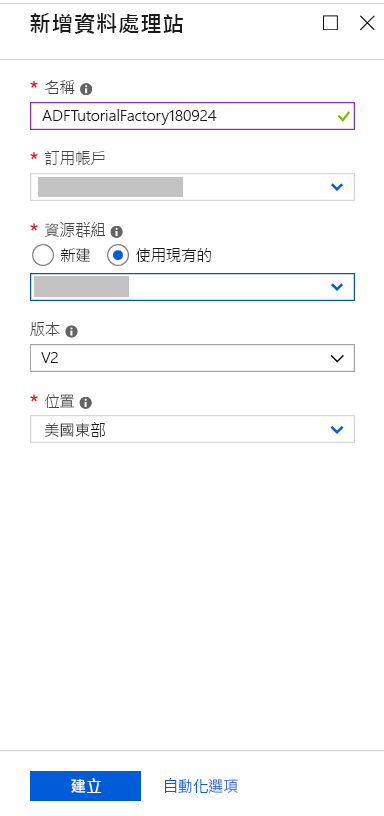
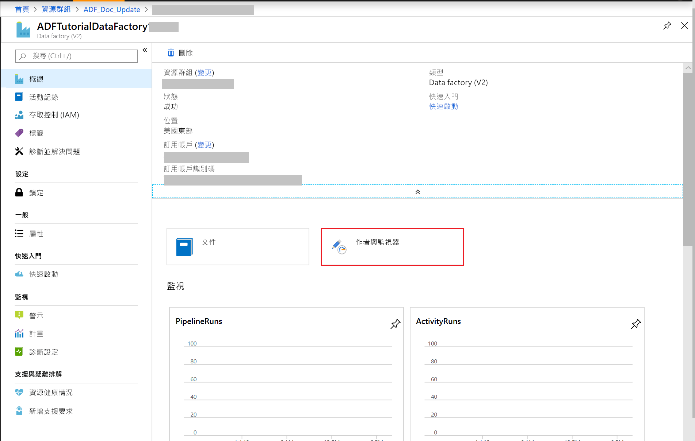
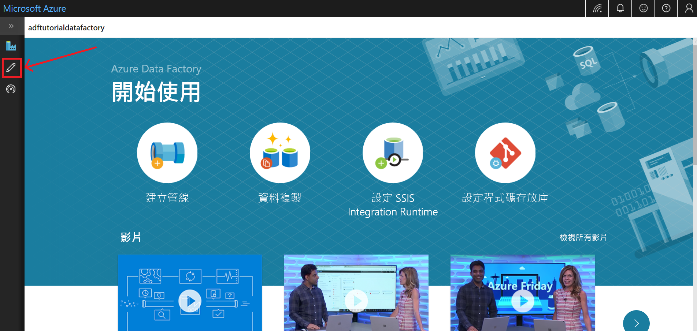
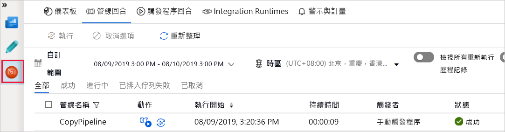
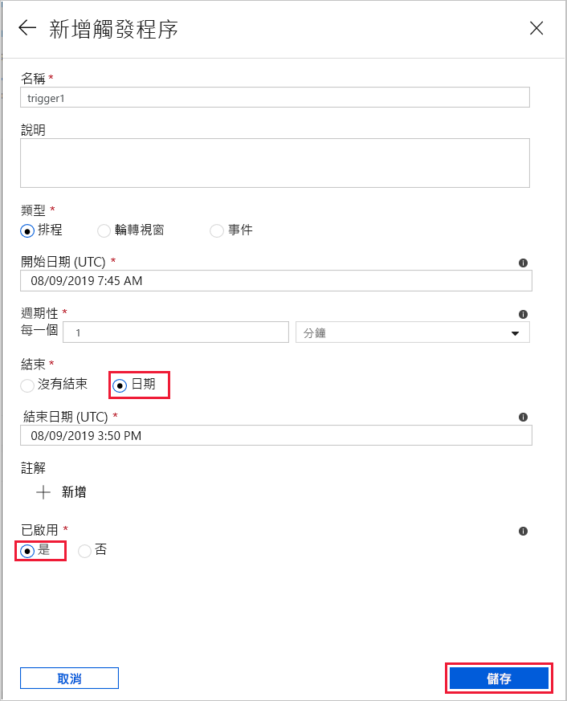
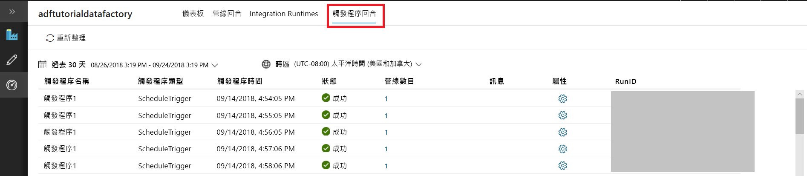

# 使用 Azure Data Factory UI 建立資料處理站
> [!div class="op_single_selector" title1="Select the version of Data Factory service you are using:"]
> * [第 1 版 - 正式推出](v1/data-factory-copy-data-from-azure-blob-storage-to-sql-database.md)
> * [第 2 版 - 預覽](quickstart-create-data-factory-portal.md)

本快速入門說明如何使用 Azure Data Factory UI 建立及監視資料處理站。 在此資料處理站中建立的管線會將資料從 Azure Blob 儲存體中的一個資料夾**複製**到其他資料夾。 如需如何使用 Azure Data Factory **轉換**資料的教學課程，請參閱[教學課程︰使用 Spark 轉換資料](tutorial-transform-data-spark-portal.md)。 

> [!NOTE]
> 如果您不熟悉 Azure Data Factory，在執行此快速入門之前，請先參閱 [Azure Data Factory 簡介](data-factory-introduction.md)。 
>
> 本文適用於第 2 版的 Data Fatory (目前為預覽版)。 如果您使用 Data Factory 的第 1 版 (正式推出版本 (GA))，請參閱 [Data Factory 第 1 版 - 教學課程](v1/data-factory-copy-data-from-azure-blob-storage-to-sql-database.md)。

[!INCLUDE [data-factory-quickstart-prerequisites](../../includes/data-factory-quickstart-prerequisites.md)] 

### 影片 
觀賞這段影片，可協助您瞭解 Data Factory UI： 
>[!VIDEO https://channel9.msdn.com/Shows/Azure-Friday/Visually-build-pipelines-for-Azure-Data-Factory-v2/Player]

## 建立 Data Factory

1. 瀏覽至 [Azure 入口網站](https://portal.azure.com)。 
2. 按一下左邊功能表上的 [新增]、[資料 + 分析]，再按一下 [Data Factory]。 
   
   
2. 在 [新增資料處理站] 頁面中，輸入 **ADFTutorialDataFactory** 作為 [名稱]。 
      
     
 
   Azure Data Factory 的名稱必須是 **全域唯一的**。 如果您在名稱欄位看到下列錯誤，請變更資料處理站的名稱 (例如 yournameADFTutorialDataFactory)。 請參閱 [Data Factory - 命名規則](naming-rules.md)一文，以了解 Data Factory 成品的命名規則。
  
     
3. 選取您要在其中建立資料處理站的 Azure **訂用帳戶**。 
4. 針對 [資源群組]，請執行下列其中一個步驟︰
     
      - 選取 [使用現有的] ，然後從下拉式清單選取現有的資源群組。 
      - 選取 [建立新的] ，然後輸入資源群組的名稱。   
         
    若要了解資源群組，請參閱 [使用資源群組管理您的 Azure 資源](../azure-resource-manager/resource-group-overview.md)。  
4. 對 [版本] 選取 [V2 (預覽)]。
5. 選取 Data Factory 的 [位置]  。 只有受到 Data Factory 支援的位置才會顯示在下拉式清單中。 資料處理站所使用的資料存放區 (Azure 儲存體、Azure SQL Database 等) 和計算 (HDInsight 等) 可位於其他位置。
6. 選取 [釘選到儀表板]。     
7. 按一下頁面底部的 [新增] 。
8. 在儀表板上，您會看到狀態如下的下列圖格︰**正在部署資料處理站**。 

    
9. 建立完成之後，您會看到如圖中所示的 [Data Factory] 頁面。
   
    
10. 按一下 [編寫與監視] 圖格，以在另一個索引標籤中啟動 Azure Data Factory 使用者介面 (UI) 應用程式。 
11. 在 [開始使用] 頁面中，切換至左面板中的 [編輯] 索引標籤，如下圖所示： 

    

## 建立 Azure 儲存體連結服務
在此步驟中，您會建立連結服務，將 Azure 儲存體帳戶連結到資料處理站。 連結的服務具有連線資訊，可供 Data Factory 服務在執行階段中用來連線。

2. 按一下 [連線]，然後按一下工具列上的 [新增] 按鈕。 

        
3. 在 [新增連結服務] 頁面中，選取 [Azure Blob 儲存體]，然後按一下 [繼續]。 

    ![選取 [Azure 儲存體]](./media/quickstart-create-data-factory-portal/select-azure-storage.png)
4. 在 [新增連結服務] 頁面中，執行下列步驟： 

    1. 輸入 **AzureStorageLinkedService** 作為 [名稱]。
    2. 在 [儲存體帳戶名稱] 中，選取您 Azure 儲存體帳戶的名稱。
    3. 按一下 [測試連線]，以確認 Data Factory 服務可連線至儲存體帳戶。 
    4. 按一下 [儲存] 以儲存連結服務。 

         
5. 確認您在連結服務清單中看到 **AzureStorageLinkedService**。 

    

## 建立資料集
在此步驟中，您會建立兩個資料集：**InputDataset** 和 **OutputDataset**。 這些資料集的類型為 **AzureBlob**。 其會參考您在前一個步驟中建立的 **Azure 儲存體連結服務**。 

輸入資料集代表輸入資料夾中的來源資料。 在輸入資料集定義中，您可以指定 Blob 容器 (**adftutorial**)、資料夾 (**input**) 和包含來源資料的檔案 (**emp.txt**)。 

此輸出資料集代表已複製到目的地的資料。 在輸出資料集定義中，您可以指定要將資料複製過去的 Blob 容器 (**adftutorial**)、資料夾 (**output**) 和檔案。 管線的每次執行都有其相關聯的唯一識別碼，而此識別碼可用系統變數 **RunId** 來存取。 輸出檔案的名稱會根據管線的執行識別碼進行動態評估。   

在連結服務設定中，您已指定包含來源資料的 Azure 儲存體帳戶。 在來源資料集設定中，您可以指定來源資料確切的所在位置 (Blob 容器、資料夾和檔案)。 在接收資料集設定中，您可以指定要將資料複製過去的位置 (Blob 容器、資料夾和檔案)。 
 
1. 按一下 [+ (加號)] 按鈕，然後選取 [資料集]。

    
2. 在 [新增資料集] 頁面中選取 [Azure Blob 儲存體]，然後按一下 [完成]。 

    
3. 在資料集的 [屬性] 視窗中輸入 **InputDataset**，作為 [名稱]。 

    
4. 切換至 [連線] 索引標籤，並執行下列步驟： 

    1. 針對連結服務，選取 **AzureStorageLinkedService**。 
    2. 按一下 [瀏覽] 按鈕，以尋找 [檔案路徑]。 
        
    3. 在 [選擇檔案或資料夾] 視窗中，瀏覽至 **adftutorial** 容器中的 **input** 資料夾，選取 **emp.txt** 檔案，然後按一下 [完成]。

        
    4. (選擇性) 按一下 [預覽資料]，以預覽 emp.txt 檔案中的資料。     
5. 重複前述步驟，以建立輸出資料集。  

    1. 按一下左窗格中的 [+ (加號)] 按鈕，然後選取 [資料集]。
    2. 在 [新增資料集] 頁面中選取 [Azure Blob 儲存體]，然後按一下 [完成]。
    3. 指定 **OutputDataset** 作為名稱。
    4. 輸入 **adftutorial/output** 作為資料夾。 「複製」活動會建立輸出資料夾 (如果不存在)。 
    5. 輸入 `@CONCAT(pipeline().RunId, '.txt')` 作為檔案名稱。 每當您執行管線時，管線執行都有其相關聯的唯一識別碼。 運算式會串連管線的執行識別碼與 **.txt**，以評估輸出檔案名稱。 如需支援的系統變數和運算式清單，請參閱[系統變數](control-flow-system-variables.md)和[運算式語言](control-flow-expression-language-functions.md)。

        

## 建立管線 
在此步驟中您會建立並驗證管線，其中含有使用輸入和輸出資料集的 [複製] 活動。 「複製」活動會將資料從輸入資料集設定中指定的檔案，複製到輸出資料集設定中指定的檔案。 如果輸入資料集僅指定資料夾 (而不是檔案名稱)，則「複製」活動會將來源資料夾中的所有檔案複製到目的地。 

1. 按一下 [+ (加號)] 按鈕，然後選取 [管線]。 

    
2. 在 [屬性] 視窗中，指定 **CopyPipeline** 作為 [名稱]。 

    
3. 在 [活動] 工具箱中展開 [資料流程]，並將 [複製] 活動從 [活動] 工具箱拖放至管線設計工具介面。 您也可以在 [活動] 工具箱中搜尋活動。 指定 **CopyFromBlobToBlob** 作為 [名稱]。

    
4. 在複製活動設定中切換至 [來源] 索引標籤，然後選取 **InputDataset** 作為 [來源資料集]。

        
5. 在複製活動設定中切換至 [接收] 索引標籤，然後選取 **OutputDataset** 作為 [接收資料集]。

        
7. 按一下 [驗證] 以驗證管線設定。 確認管線已驗證成功。 若要關閉驗證輸出，請按一下 [向右箭號 (>>)] 按鈕。 

    

## 對管線執行測試
在此步驟中，您將在管線部署至 Data Factory 之前對其執行測試。 

1. 在管線的工具列上，按一下 [測試執行]。 
    
    
2. 確認您在管線設定的 [輸出] 索引標籤中，可檢視管線執行的狀態。 

        
3. 確認您在 **adftutorial** 容器的 **output** 資料夾中看到輸出檔案。 如果 output 資料夾不存在，Data Factory 服務會自動加以建立。 
    
    

## 手動觸發管線
在此步驟中，您會將實體 (連結服務、資料集和管線) 部署至 Azure Data Factory。 然後，您會手動觸發管線執行。 您也可以發佈您自己 VSTS GIT 存放庫中的實體，相關說明請見[另一個教學課程](tutorial-copy-data-portal.md?#configure-code-repository)。

1. 觸發管線之前，您必須將實體發佈至 Data Factory。 若要發佈，請按一下左窗格中的 [發佈]。 

    
2. 若要手動觸發管線，請按一下工具列上的 [觸發程序]，然後選取 [立即觸發]。 
    
    

## 監視管線

1. 切換至左側的 [監視] 索引標籤。 使用 [重新整理] 按鈕可重新整理清單。

    
2. 按一下 [動作] 下方的 [檢視活動執行] 連結。 在此頁面中，您會看到複製活動執行的狀態。 

    
3. 若要檢視關於複製作業的詳細資訊，請按一下 [動作] 資料行中的 [詳細資料] (眼鏡圖片) 連結。 如需屬性的詳細資訊，請參閱[複製活動概觀](copy-activity-overview.md)。 

    
4. 確認您在 **output** 資料夾中看到新的檔案。 
5. 您可以按一下 [管線] 連結，從 [活動執行] 檢視切換回 [管線執行] 檢視。 

## 觸發排程上的管線
這是本教學課程的選擇性步驟。 您可以建立**排程器觸發程序**，將管線排定為定期執行 (每小時、每天等)。 在此步驟中，您會建立每分鐘執行一次的觸發程序，並讓其在您指定為結束日期的日期時間停止。 

1. 切換至 [編輯] 索引標籤。 

    ![切換至 [編輯] 索引標籤](./media/quickstart-create-data-factory-portal/switch-edit-tab.png)
1. 按一下功能表上的 [觸發程序]，然後按一下 [新增/編輯]。 

    
2. 在 [新增觸發程序] 頁面上按一下 [選擇觸發程序...]，然後按一下 [新增]。 

    
3. 在 [新增觸發程序] 頁面中，針對 [結束] 欄位選取 [日期]，將結束時間為指定現行時間之後的幾分鐘，然後按一下 [套用]。 每次執行管線都會產生相關成本，因此，請將結束時間指定為開始時間的數分鐘之後。 請確定兩者是在同一天。 不過，請確定發佈時間與結束時間之間有足夠的時間可供管線執行。 在您將方案發佈至 Data Factory 之後，觸發程序才會生效，而不是在您將觸發程序儲存在 UI 時生效。 

    
4. 在 [新增觸發程序] 頁面中核取 [已啟動] 選項，然後按 [下一步] 

    
5. 在 [新增觸發程序] 頁面中檢閱警告訊息，然後按一下 [完成]。

    
6. 按一下 [發佈]，將變更發佈至 Data Factory。 

    
8. 切換至左側的 [監視] 索引標籤。 按一下 [重新整理] 可重新整理清單。 在發佈時間到結束時間之間，您會看到管線每隔一分鐘執行一次。 請留意 [觸發方式] 資料行中的值。 手動觸發程序執行來自於您先前完成的步驟 (**立即觸發**)。 

    
9. 按一下 [管線執行] 旁的向下箭號，切換至 [觸發程序執行] 檢視。 

        
10. 確認在指定的結束日期時間之前，每次執行管線時都會在 **output** 資料夾中建立一個**輸出檔案**。 

## 後續步驟
在此範例中的管線會將資料從 Azure Blob 儲存體中的一個位置複製到其他位置。 瀏覽[教學課程](tutorial-copy-data-portal.md)以了解使用 Data Factory 的更多案例。 