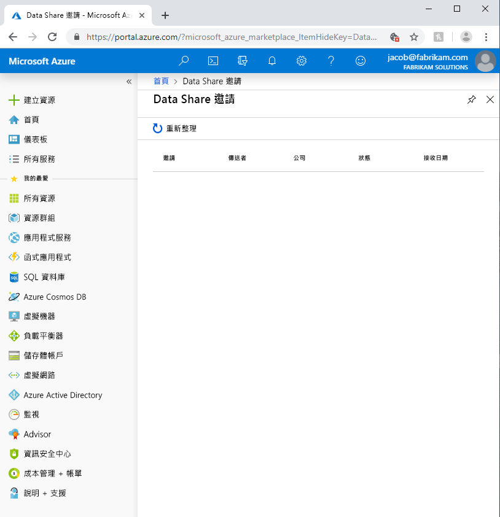

# <a name="troubleshoot-common-issues-in-azure-data-share"></a>針對 Azure 資料共用中的常見問題進行疑難排解 

本文說明如何針對 Azure 資料共用的常見問題進行疑難排解。 

## <a name="azure-data-share-invitations"></a>Azure Data Share 邀請 

在某些情況下，當新的使用者從已傳送的電子郵件邀請中按一下 [接受邀請] 時，他們可能會看到空白的邀請清單。 



上述錯誤是此服務的已知問題，目前正在處理。 解決方法是遵循下列步驟。 

1. 在 Azure 入口網站中，瀏覽到 [訂用帳戶]。
1. 選取您用於 Azure Data Share 的訂用帳戶
1. 按一下 [資源提供者]
1. 搜尋 Microsoft.DataShare
1. 按一下 [註冊]

您必須擁有 [Azure 參與者 RBAC 角色](https://docs.microsoft.com/azure/role-based-access-control/built-in-roles#contributor)才能完成這些步驟。 

如果您仍然無法看見資料共用邀請，請連絡您的資料提供者，並確保他們是將邀請傳送到您的 Azure 登入電子郵件地址，而「不是」您的電子郵件別名。 

> [!IMPORTANT]
> 如果您已接受 Azure Data Share 邀請並結束服務才設定儲存體，請遵循[設定資料集對應](how-to-configure-mapping.md)操作指南所述的指示，來了解如何完成所接收資料共用的設定，並開始接收資料。 

## <a name="error-when-creating-or-receiving-a-new-data-share"></a>建立或接收新的 Data Share 時發生錯誤

「錯誤：作業傳回不正確狀態碼 ' BadRequest '」

「錯誤： AuthorizationFailed」

「錯誤：儲存體帳戶的角色指派」


如果您在建立新的資料共用或接收新的資料共用時收到任何上述錯誤，原因會是沒有足夠的儲存體帳戶權限。 所需權限為 *Microsoft.Authorization/role assignments/write*，其存在於儲存體擁有者角色，或者也可以指派給自訂角色。 即使您建立了儲存體帳戶，但不代表您就會自動成為儲存體帳戶的擁有者。 請遵循下列步驟來對自己授與儲存體帳戶的擁有者角色。 或者，您也可以建立有此權限的自訂角色，再將自己新增至該角色。  

1. 在 Azure 入口網站中瀏覽至儲存體帳戶
1. 選取 [存取控制 (IAM)]
1. 按一下 [新增]
1. 將您自己新增為擁有者。

## <a name="troubleshooting-sql-based-sharing"></a>疑難排解以 SQL 為基礎的共用

「錯誤：未新增 x 資料集，因為您沒有共用所需的許可權。」

如果您從以 SQL 為基礎的來源新增資料集時收到此錯誤，可能是因為您未在 SQL Server 上建立 Azure 資料共用 MSI 的使用者。  若要解決此問題，請執行下列腳本：

```sql
    create user <share_acct_name> from external provider;     
    exec sp_addrolemember db_owner, <share_acct_name>; 
```      
請注意， *< share_acc_name >* 是您的資料共用帳戶的名稱。 如果您尚未建立資料共用帳戶，您可以稍後再回到此必要條件。         

請確定您已遵循[共用資料](share-your-data.md)教學課程中所列的所有必要條件。

## <a name="next-steps"></a>後續步驟

若要了解如何開始共用資料，請繼續進行[共用資料](share-your-data.md)教學課程。

