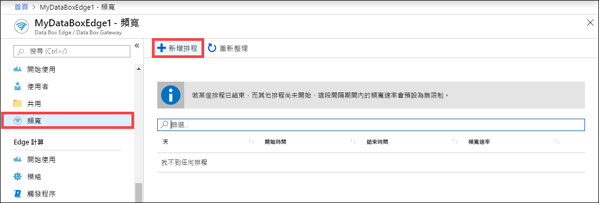
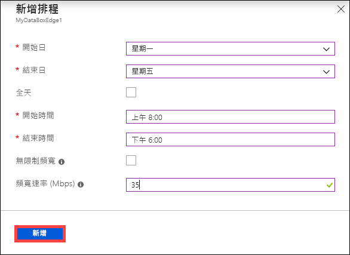
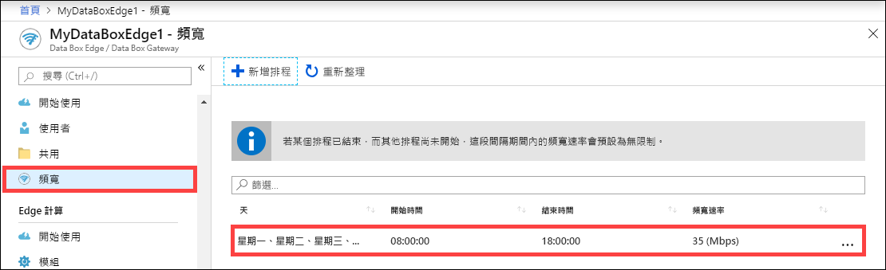
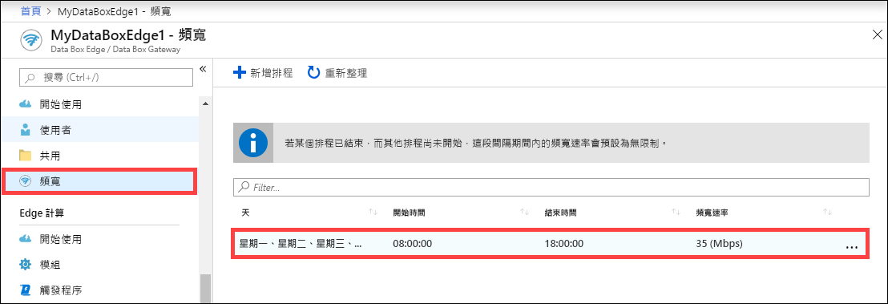
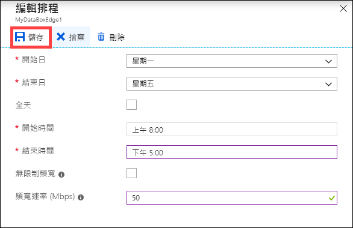
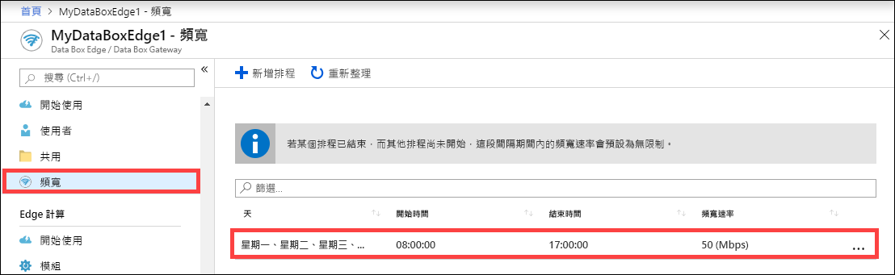
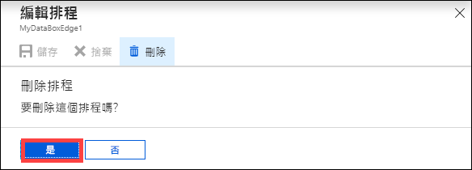

# 使用 Azure 入口網站來管理 Azure Data Box Edge 上的頻寬排程  

本文說明如何管理 Azure Data Box Edge 上的使用者。 頻寬排程可讓您設定多個日期時間排程的網路頻寬使用量。 這些排程可以套用至從您的裝置上傳和下載作業到雲端。

您可以透過 Azure 入口網站，新增、修改或刪除 Data Box Edge 的頻寬排程。

> [!IMPORTANT]
> Data Box Edge 目前處於預覽狀態。 部署訂購並部署此解決方案之前，請檢閱 [Azure 預覽版使用條款](https://azure.microsoft.com/support/legal/preview-supplemental-terms/)。

在本文中，您將了解：

> [!div class="checklist"]
> * 新增排程
> * 修改排程
> * 刪除排程

## 新增排程

在 Azure 入口網站中執行下列步驟，以新增排程。

1. 在 Azure 入口網站中，針對您的 Data Box Edge 資源，移至 [頻寬]。
2. 在右窗格中，選取 [+ 新增排程]。

    

3. 在 [新增排程] 中： 

   1. 提供排程的 [開始日期]、[結束日期]、[開始時間]及[結束時間]。
   2. 如果此排程應該整天執行，請勾選 [全天]。
   3. [頻寬速率] 是以 MB / 秒 (Mbps) 為單位的頻寬，由您的裝置使用於涉及雲端的作業 (上傳與下載)。 提供一個介於 20 到 1,000,000,007 之間的數目給此欄位。
   4. 如果您不想節流處理上傳和下載日期，請勾選 [無限制] 頻寬。
   5. 選取 [新增] 。

      

3. 使用指定的設定建立排程。 此排程即會顯示在入口網站中的頻寬排程清單中。

    

## 編輯排程

執行下列步驟來編輯頻寬排程。

1. 在 Azure 入口網站中，移至您的 Data Box Edge 資源，然後移至 [頻寬]。 
2. 從頻寬排程清單中，選取並選取您想要修改的排程。
    

3. 進行所要的變更並儲存變更。

    

4. 修改排程之後，排程清單就會更新，以反映出修改過的排程。

    

## 刪除排程

執行下列步驟來刪除與 Data Box Edge 裝置相關聯的頻寬排程。

1. 在 Azure 入口網站中，移至您的 Data Box Edge 資源，然後移至 [頻寬]。  

2. 從頻寬排程清單中，選取您想要刪除的排程。 在 [編輯排程] 中，選取 [刪除]。 系統提示您進行確認時，選取 [是] 。

   

3. 刪除排程之後，排程清單就會更新。

## 後續步驟

- 了解如何[管理共用](data-box-edge-manage-shares.md)。
