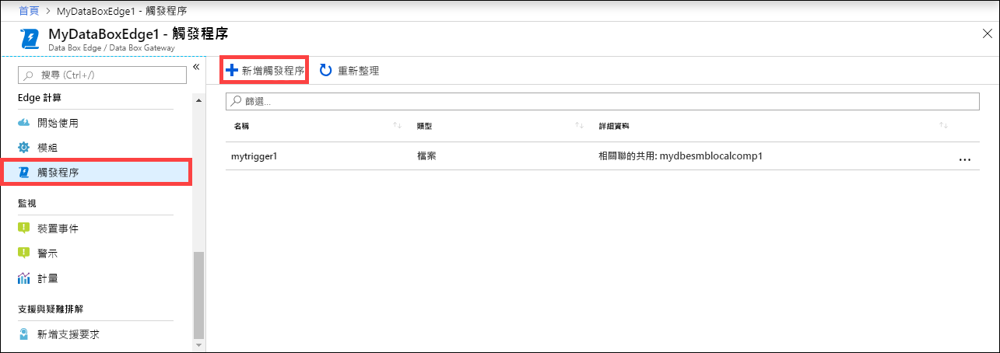
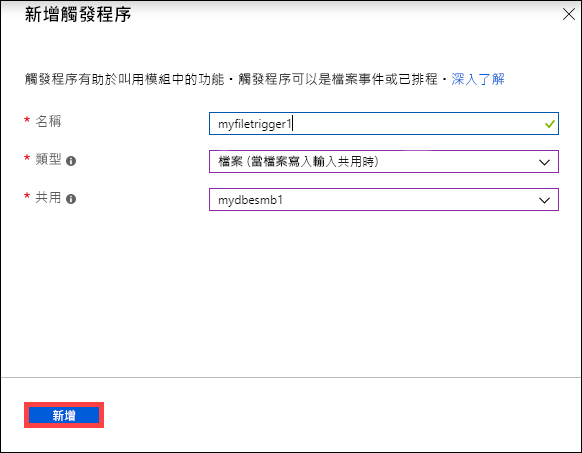
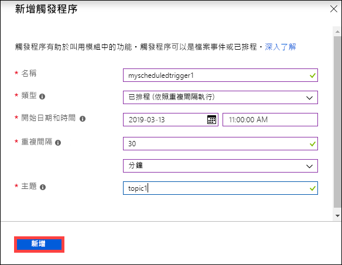
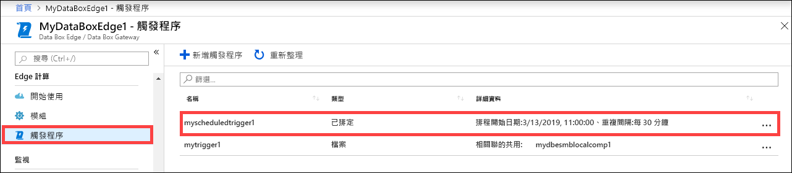
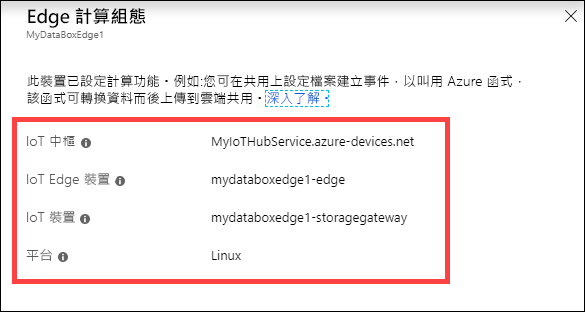
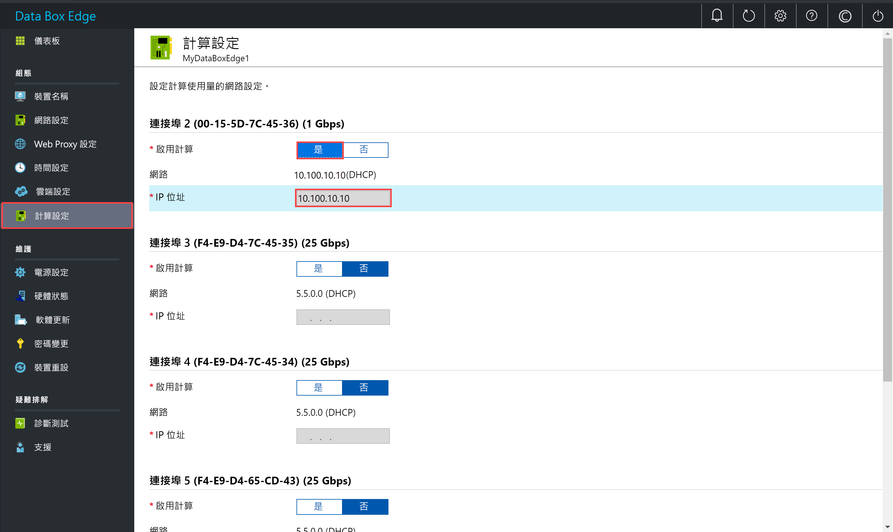

# 管理 Azure Data Box Edge 上的計算

本文說明如何管理 Azure Data Box Edge 上的計算。 您可以透過 Azure 入口網站或本機 Web UI 來管理計算。 使用 Azure 入口網站來管理模組、觸發程序及計算設定，以及使用本機 Web UI 來管理計算設定。

> [!IMPORTANT]
> Data Box Edge 目前處於預覽狀態。 部署訂購並部署此解決方案之前，請檢閱 [Azure 預覽版使用條款](https://azure.microsoft.com/support/legal/preview-supplemental-terms/)。

在本文中，您將了解：

> [!div class="checklist"]
> * 管理觸發程序
> * 管理計算設定

## 管理觸發程序

事件就是在雲端環境內所發生，或您想在裝置上對其採取動作之事。 例如，在共用中建立檔案時，即為事件。 觸發程序會引發事件。 對於 Data Box Edge，觸發程序可以回應檔案事件或排程。

- **檔案**：這些觸發程序可回應檔案事件，例如建立檔案、修改檔案。
- **已排程**：這些觸發程序可回應排程，您能定義其開始日期、開始時間及重複間隔。

### 新增觸發程序

請在 Azure 入口網站中執行下列步驟，以建立觸發程序。

1. 在 Azure 入口網站中，移至您的 Data Box Edge 資源，然後移至 [Edge 計算] > [觸發程序]。 選取命令列上的 [+ 新增觸發程序]。

    

2. 在 [新增觸發程事] 刀鋒視窗中，提供觸發程序的唯一名稱。
    
    <!--Trigger names can only contain numbers, lowercase letters, and hyphens. The share name must be between 3 and 63 characters long and begin with a letter or a number. Each hyphen must be preceded and followed by a non-hyphen character.-->

3. 選取觸發程序的 [類型]。 當觸發程序回應檔案事件時，請選擇 [檔案]。 當您想要觸發程序在定義的時間開始，並以指定的重複間隔執行，請選取 [已排程]。 根據您的選擇，顯示一組不同的選項。

    - **檔案觸發程序** - 從下拉式清單中選擇裝載共用。 在此共用中引發檔案事件時，觸發程序會叫用 Azure 函式。

        

    - **已排程觸發程序** - 指定開始日期/時間，並以小時、分、或秒為單位指定重複間隔。 此外，輸入主題的名稱。 主題可讓您彈性地將觸發程序路由傳送至裝置上部署的模組。

        範例路由字串是：`"route3": "FROM /* WHERE topic = 'topicname' INTO BrokeredEndpoint("modules/modulename/inputs/input1")"`。

        

4. 選取 [新增] 以建立觸發程序。 觸發程序正在建立時，會顯示通知。 建立觸發程序之後，刀鋒視窗會更新以反映新的觸發程序。
 
    

### 刪除觸發程序

請在 Azure 入口網站中執行下列步驟，以刪除觸發程序。

1. 從觸發程序清單中，選取您想要刪除的觸發程序。

    

2. 按一下滑鼠右鍵，然後選取 [刪除]。

    ![選取 [刪除]](media/data-box-edge-manage-compute/add-trigger-1.png)

3. 系統提示您進行確認時，按一下 [是] 。

    

觸發程序清單會更新以反映刪除。

## 管理計算設定

使用 Azure 入口網站檢視計算設定、移除現有計算設定，或重新整理計算設定，以同步 IoT 裝置的存取金鑰與 Data Box Edge 的 IoT Edge 裝置。

### 檢視計算設定

請在 Azure 入口網站中執行下列步驟，以檢視您裝置的計算設定。

1. 在 Azure 入口網站中，移至您的 Data Box Edge 資源，然後移至 [Edge 計算] > [模組]。 選取命令列上的 [檢視計算]。

    ![選取 [檢視計算]](media/data-box-edge-manage-compute/view-compute-1.png)

2. 記下您裝置上的計算設定。 當您完成設定計算時，就會建立 IoT 中樞資源。 該 IoT 中樞資源下的 IoT 裝置和 IoT Edge 裝置均已設定。 只支援 Linux 模組在 IoT Edge 裝置上執行。

    

### 移除計算設定

請在 Azure 入口網站中執行下列步驟，以移除您裝置現有的 Edge 計算設定。

1. 在 Azure 入口網站中，移至您的 Data Box Edge 資源，然後移至 [Edge 計算] > [開始使用]。 選取命令列上的 [移除計算]。

    ![選取 [移除計算]](media/data-box-edge-manage-compute/remove-compute-1.png)

2. 如果您移除計算設定，將必須重新設定裝置，以免您需要再次使用計算。 系統提示您確認時，請選取 [是]。

    ![選取 [移除計算]](media/data-box-edge-manage-compute/remove-compute-2.png)

### 同步 IoT 裝置和 IoT Edge 裝置的存取金鑰

當您在 Data Box Edge 設定計算時，就會建立 IoT 裝置和 IoT Edge 裝置。 對稱存取金鑰會自動指派給這些裝置。 基於安全性最佳做法的考量，這些金鑰會透過 IoT 中樞服務定期輪替。

若要輪替這些金鑰，您可以移至所建立的 IoT 中樞服務，然後選取 IoT 裝置或 IoT Edge 裝置。 每個裝置都有主要存取金鑰和次要存取金鑰。 請將主要存取金鑰指派給次要存取金鑰，然後重新產生主要存取金鑰。

如果 IoT 裝置和 IoT Edge 裝置金鑰已經輪替，您需要重新整理 Data Box Edge 上的設定，才能取得最新的存取金鑰。 同步處理可協助裝置取得 IoT 裝置和 IoT Edge 裝置的最新金鑰。 Data Box Edge 只會使用主要存取金鑰。

請在 Azure 入口網站中執行下列步驟，以同步您裝置的存取金鑰。

1. 在 Azure 入口網站中，移至您的 Data Box Edge 資源，然後移至 [Edge 計算] > [開始使用]。 選取命令列上的 [重新整理設定]。

    ![選取 [重新整理設定]](media/data-box-edge-manage-compute/refresh-configuration-1.png)

2. 系統提示您確認時，請選取 [是]。

     ![系統提示時，選取 [是]](media/data-box-edge-manage-compute/refresh-configuration-2.png)

3. 在同步完成後結束對話方塊。

## 啟用用於計算的網路介面

您可能需要存取在 Data Box Edge 裝置上執行的模組。 若要從外部存取模組，您必須將 IP 位址指派給裝置上的網路介面。 您可以從本機 Web UI 管理這些計算設定。

請在本機 Web UI 上採取下列步驟來設定計算的設定值。

1. 在本機 Web UI 中，移至 [組態] > [計算設定]。  

2. **啟用**您想要用來連線至裝置上計算模組的網路介面。 

    - 如果使用靜態 IP 位址，請輸入網路介面的 IP 位址。
    - 如果使用 DHCP，則系統會自動指派 IP 位址。

3. 選取 [套用] 來套用設定。

    

## 後續步驟

- 了解如何[透過 Azure 入口網站管理使用者](data-box-edge-manage-users.md)。
