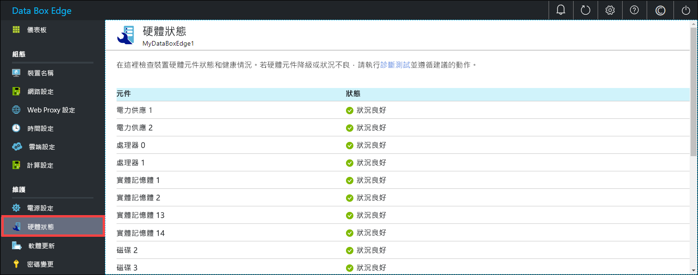

# 監視您的 Azure Data Box Edge

本文說明如何監視您的 Azure Data Box Edge。 若要監視您的裝置，您可以使用 Azure 入口網站或本機 Web UI。 使用 Azure 入口網站來檢視裝置事件、設定及管理警示和檢視計量。 在您的實體裝置上使用本機 Web UI，來檢視各種裝置元件的硬體狀態。

在本文中，您將了解：

> [!div class="checklist"]
> * 檢視裝置事件和對應的警示
> * 檢視裝置元件的硬體狀態
> * 檢視您裝置的容量和交易計量
> * 設定和管理警示

## 檢視裝置事件

[!INCLUDE [Supported OS for clients connected to device](../../includes/data-box-edge-gateway-view-device-events.md)]

## 檢視硬體狀態

在本機 Web UI 中採取下列步驟來檢視您裝置元件的硬體狀態。

1. 連線至您裝置的本機 Web UI 設定。
2. 移至 [維護] > [硬體狀態]。 您可以檢視各種裝置元件的健康情況。

    

## 檢視計量

[!INCLUDE [Supported OS for clients connected to device](../../includes/data-box-edge-gateway-view-metrics.md)]

## 管理警示

[!INCLUDE [Supported OS for clients connected to device](../../includes/data-box-edge-gateway-manage-alerts.md)]

## 後續步驟 

了解如何[管理頻寬](data-box-edge-manage-bandwidth-schedules.md)。