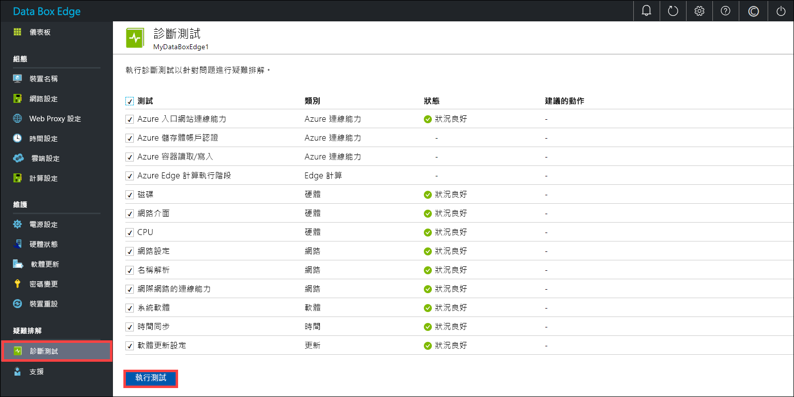
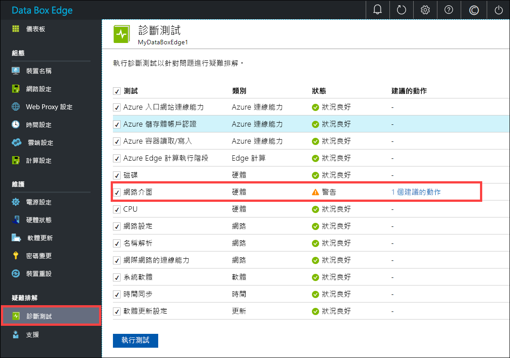
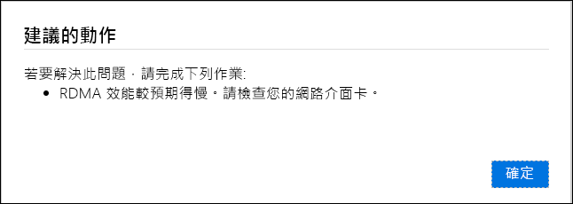
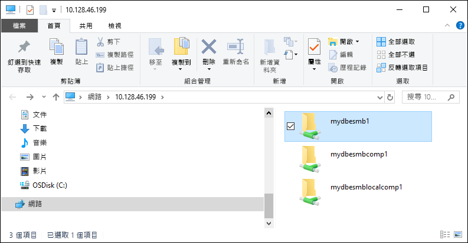

# <a name="troubleshoot-your-azure-data-box-edge-issues"></a>針對 Azure Data Box Edge 問題進行疑難排解 

本文說明如何針對 Azure Data Box Edge 問題進行疑難排解。 

在本文中，您將了解：

> [!div class="checklist"]
> * 執行診斷
> * 收集支援套件
> * 使用記錄進行疑難排解


## <a name="run-diagnostics"></a>執行診斷

若要診斷任何裝置錯誤並進行疑難排解，您可以執行診斷測試。 在您裝置的本機 Web UI 中執行下列步驟，以執行診斷測試。

1. 在本機 Web UI 中，移至 [疑難排解] > [診斷測試]。 選取您想要執行的測試，然後按一下 [執行測試]。 這會執行測試，以診斷您的網路、裝置、Web Proxy、時間或雲端設定的任何可能問題。 您會收到裝置正在執行測試的通知。

    
 
2. 測試完成後會顯示結果。 

    

    如果測試失敗，則會顯示建議動作的 URL。 您可以按一下此 URL，以檢視建議的動作。
 
    


## <a name="collect-support-package"></a>收集支援套件

記錄套件包含有助於 Microsoft 支援小組疑難排解任何裝置問題的所有相關記錄。 您可以透過本機 Web UI 產生記錄套件。

執行下列步驟來收集支援套件。 

1. 在本機 Web UI 中，移至 [疑難排解] > [支援]。 按一下 [建立支援套件]。 系統會開始收集支援套件。 套件收集可能需要幾分鐘的時間。

    ![按一下 [新增使用者]](media/data-box-edge-troubleshoot/collect-logs-1.png)
 
2. 建立支援套件之後，按一下 [下載支援套件]。 壓縮的套件會下載至您所選的路徑。 您可以將此套件解壓縮並檢視系統記錄檔。

    ![按一下 [新增使用者]](media/data-box-edge-troubleshoot/collect-logs-2.png)

## <a name="use-logs-to-troubleshoot"></a>使用記錄進行疑難排解

在上傳和重新整理程序期間發生的所有錯誤都會包含在各自的錯誤檔案中。

1. 若要檢視錯誤檔案，請移至您的共用，並按一下此共用以檢視內容。 

      

2. 按一下 Microsoft Data Box Edge 資料夾。 這個資料夾有兩個子資料夾：

    - 具有上傳錯誤記錄檔的 [上傳] 資料夾。
    - 在重新整理期間發生錯誤的 [重新整理] 資料夾。

    以下是可供重新整理的範例記錄檔。

    ```
    <root container="test1" machine="VM15BS020663" timestamp="03/18/2019 00:11:10" />
    <file item="test.txt" local="False" remote="True" error="16001" />
    <summary runtime="00:00:00.0945320" errors="1" creates="2" deletes="0" insync="3" replaces="0" pending="9" />
    ``` 

3. 當您在此檔案中看到錯誤 (已在此範例中醒目提示) 時，請記下錯誤碼，在此例中是 16001。 針對下列錯誤參考，查閱此錯誤碼的說明。

    [!INCLUDE [data-box-edge-edge-upload-error-reference](../../includes/data-box-edge-gateway-upload-error-reference.md)]


## <a name="next-steps"></a>後續步驟

- 深入了解[此版本中的已知問題](data-box-gateway-release-notes.md)。
