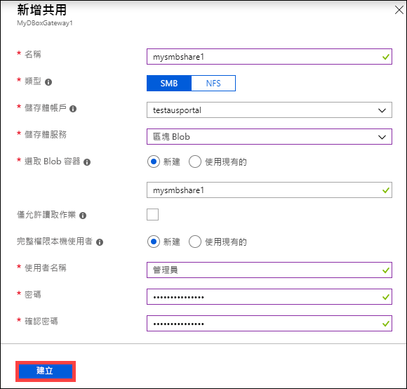
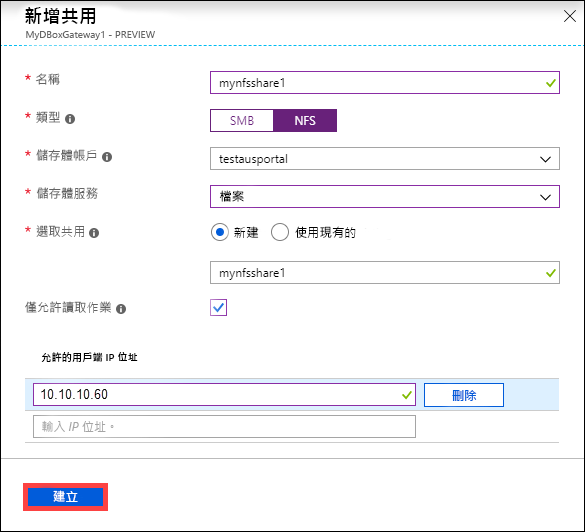
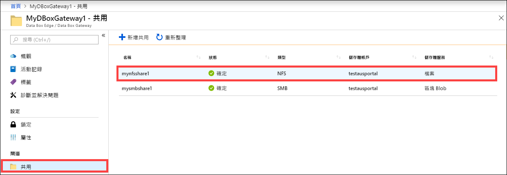
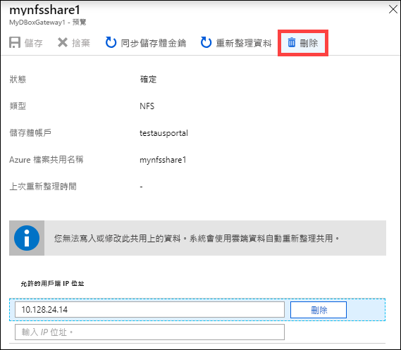
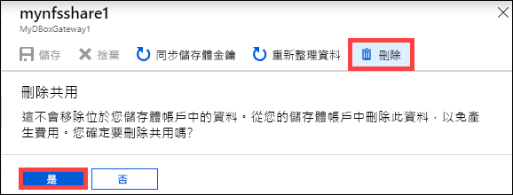
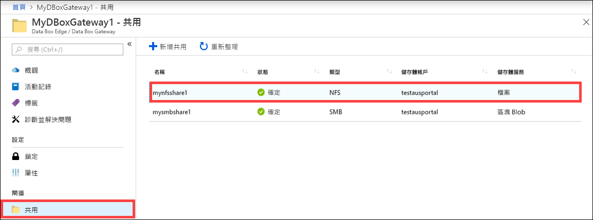
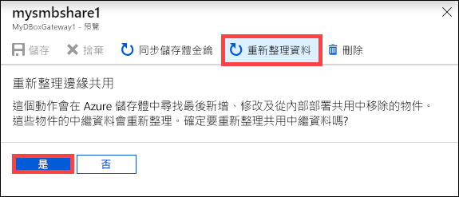
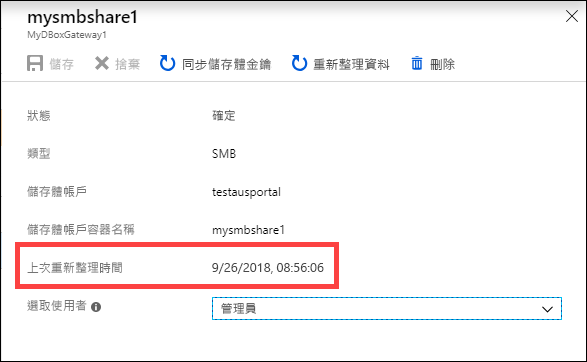
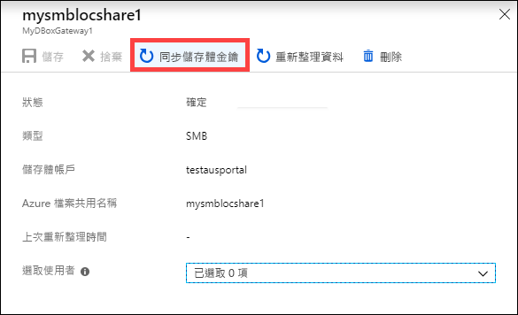
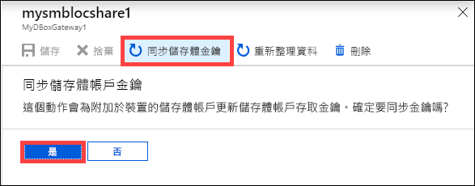

# 使用 Azure 入口網站來管理 Azure 資料箱閘道上的共用 

本文說明如何管理 Azure 資料箱閘道上的共用。 您可以透過 Azure 入口網站或本機 Web UI 來管理 Azure 資料箱閘道。 使用 Azure 入口網站來新增、刪除、重新整理共用，或針對與共用相關聯的儲存體帳戶同步儲存體金鑰。

> [!IMPORTANT]
> - 資料箱閘道處於預覽狀態。 部署訂購並部署此解決方案之前，請檢閱 [Azure 預覽版使用條款](https://azure.microsoft.com/support/legal/preview-supplemental-terms/)。

## 關於共用

若要將資料轉送至 Azure，您需要在 Azure 資料箱閘道上建立共用。 您在資料箱閘道裝置上新增的共用是雲端共用。 這些共用中的資料會自動上傳至雲端。 重新整理和同步儲存體金鑰等所有雲端功能都會套用到這些共用。 若希望裝置資料自動推送到雲端中您的儲存體帳戶，請使用雲端共用。

在本文中，您將了解：

> [!div class="checklist"]
> * 新增共用
> * 刪除共用
> * 重新整理共用
> * 同步儲存體金鑰

## 新增共用

請在 Azure 入口網站中執行下列步驟來建立共用。

1. 在 Azure 入口網站中，移至您的資料箱閘道資源，然後瀏覽至 [概觀]。 按一下命令列上的 [+ 新增共用]。
2. 在 [新增共用] 中，指定共用設定。 為共用提供唯一的名稱。

    ![按一下 [新增共用]](media/data-box-gateway-manage-shares/add-share-1.png)

    共用名稱只能包含數字、小寫字母和連字號。 共用名稱的長度必須介於 3 到 63 個字元之間，且開頭為字母或數字。 每個連字號前後都必須緊接非連字號的字元。

3. 選取共用的 [類型]。 類型可以是 **SMB** 或 **NFS**，並以 SMB 為預設值。 SMB 是 Windows 用戶端的標準，NFS 則用於 Linux 用戶端。 視您選擇 SMB 或 NFS 共用而定，所顯示的選項會有些許不同。

4. 提供共用所在的 [儲存體帳戶]。 如果容器已不存在，則會使用共用名稱在儲存體帳戶中建立容器。 如果容器已存在，則會使用現有的容器。

5. 從區塊 Blob、分頁 Blob 或檔案中選擇 [儲存體服務]。 所選擇的服務類型取決於您想要資料以哪一種格式存在 Azure 中。 例如，在本例中，我們想要資料以區塊 Blob 的方式存在 Azure 中，因此，我們選取 [區塊 Blob]。 如果選擇 [分頁 Blob]，您必須確定資料對齊 512 個位元組。 例如，VHDX 一律是 512 位元組規格。

6. 此步驟取決於您要建立 SMB 還是 NFS 共用。
    - **如果建立 SMB 共用** - 在 [完整權限本機使用者] 欄位中，從 [新建] 或 [使用現有的] 中擇一。 如果建立新的本機使用者，請提供 [使用者名稱]、[密碼]，然後確認密碼。 這會將使用權限指派給本機使用者。 當您在此指派權限之後，就可以使用 [檔案總管] 來修改這些權限。

        

        如果您針對此共用資料勾選 [僅允許讀取作業]，則可指定唯讀使用者。
    - **如果建立 NFS 共用** - 您需要**針對允許存取共用的用戶端提供其 IP 位址**。

        

7. 按一下 [建立] 來建立共用。 正在建立共用時會通知您。 使用指定的設定來建立共用之後，[共用] 刀鋒視窗將會更新，以反映新的共用。
 
## 刪除共用

在 Azure 入口網站中執行下列步驟，以刪除共用。

1. 從共用清單中，選取並按一下您想要刪除的共用。

    

2. 按一下 [刪除] 。 

    

3. 系統提示您進行確認時，按一下 [是] 。

    

共用清單會更新，不會再出現已刪除的項目。

## 重新整理共用

重新整理功能可讓您重新整理內部部署共用的內容。 重新整理共用時，系統會起始搜尋以尋找所有 Azure 物件，包括自從上次重新整理後新增至雲端的 Blob 和檔案。 然後，這些額外檔案用來重新整理裝置上內部部署共用的內容。 

在 Azure 入口網站中執行下列步驟，以重新整理共用。

1.  在 Azure 入口網站中，移至 [共用]。 選取並按一下您想要重新整理的共用。

    

2.  按一下 [重新整理]。 

    ![按一下 [重新整理]](media/data-box-gateway-manage-shares/refresh-2.png)
 
3.  系統提示您進行確認時，按一下 [是] 。 系統會開始一項作業，以重新整理內部部署共用的內容。 

    
 
4.  進行重新整理時，操作功能表中的重新整理選項會呈現灰色。 按一下作業通知來檢視重新整理作業狀態。

5.  重新整理的時間取決於 Azure 容器中的檔案數目，以及裝置上的檔案。 成功完成重新整理之後，共用時間戳記就會更新。 即使重新整理有部分失敗，此作業都會被視為成功，而且時間戳記會更新。 

    
 
如有錯誤，則會引發警示。 警示會詳述原因和修正問題的建議。 警示也會連結到具有完整失敗摘要的檔案，包括無法更新或刪除的檔案。

>[!IMPORTANT]
> 在此預覽版本，請勿一次重新整理一個以上的共用。

## 同步儲存體金鑰

如果已輪替您的儲存體帳戶金鑰，您就必須同步儲存體存取金鑰。 同步處理可協助裝置取得您儲存體帳戶的最新金鑰。

在 Azure 入口網站中執行下列步驟，以同步儲存體存取金鑰。

1. 移至您資源的 [概觀]。 
2. 從共用清單中，選擇並按一下與您需要同步的儲存體帳戶相關聯的共用。按一下 [同步儲存體金鑰]。 

     

3. 在頁面底部按一下 [ **是** ]。 在同步完成後結束對話方塊。

     

>[!NOTE]
> 您只需要針對指定的儲存體帳戶執行此作業一次。 不需要針對與相同儲存體帳戶相關聯的所有共用，重複此動作。

## 後續步驟

- 了解如何[透過 Azure 入口網站管理使用者](data-box-gateway-manage-users.md)。
